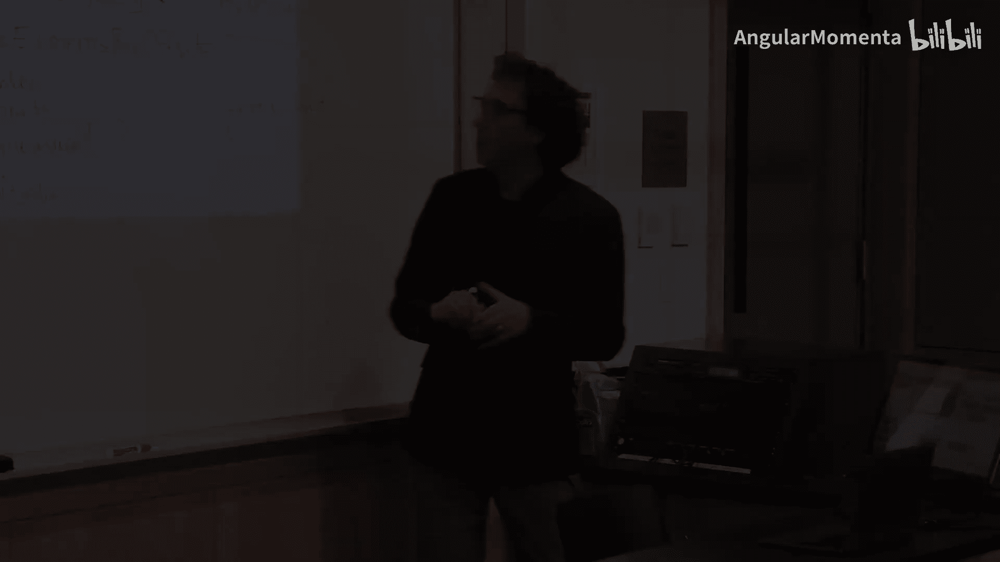
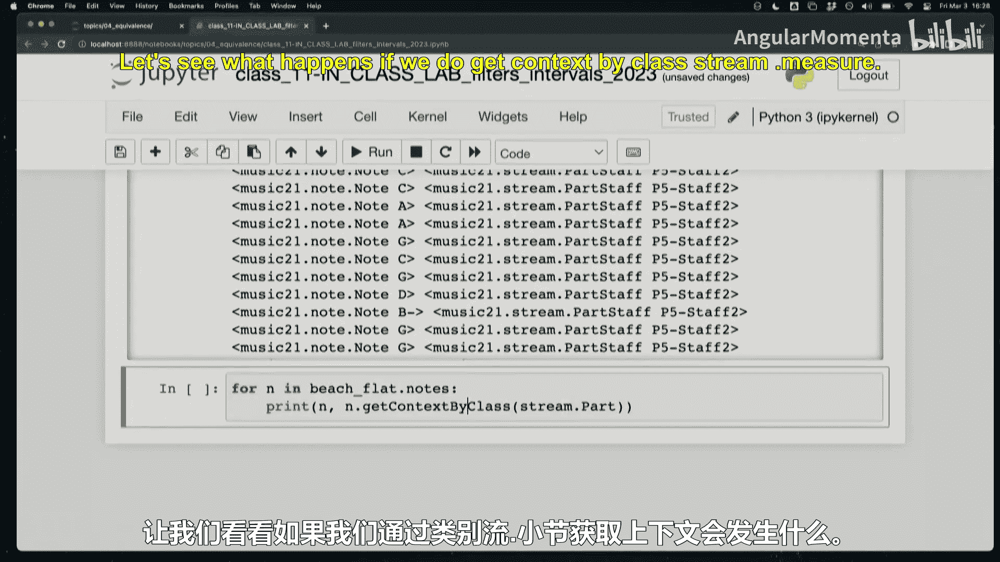

#  025：音乐21中等价与音程（二）及滤波器 🎵




在本节课中，我们将学习如何使用Music21库中的流（Stream）过滤器来提取和分析乐谱中的特定部分，并深入探讨音程（Interval）的概念与计算。

## 概述

上一节我们介绍了Music21的基本结构和数据访问方法。本节中，我们来看看如何使用流过滤器高效地筛选乐谱元素，并复习音程的识别与分类。

## 流过滤器应用

以下是几种从乐谱中提取特定声部的方法。

### 方法一：使用`.parts`属性

`.parts`属性可以过滤出乐谱中所有的声部对象。

```python
for p in beach.parts:
    print(p)
```

### 方法二：通过ID索引

可以通过声部的ID字符串直接获取。

```python
soprano2 = beach.parts[‘Soprano2’]
```

### 方法三：使用`.getElementsByClass()`方法

此方法可以递归地查找特定类的所有元素。

```python
for p in beach.getElementsByClass(stream.Part):
    print(p)
```

### 方法四：使用`.recurse()`与`isinstance()`判断

通过递归遍历并判断元素类型来筛选。

```python
part_num = 0
soprano2 = None
for thing in beach.recurse():
    if isinstance(thing, stream.Part):
        part_num += 1
        if part_num == 2: # 假设第二个声部是Soprano2
            soprano2 = thing
```

## 查找乐谱特征

我们可以利用过滤器快速回答关于乐谱的问题。

### 检查是否有拍号变化

```python
has_time_sig_change = len(beach.flat.getElementsByClass(meter.TimeSignature)) > 1
```

### 检查是否有谱号变化



```python
for p in beach.parts:
    for clef in p.recurse().getElementsByClass(clef.Clef):
        print(p, clef)
```

### 获取特定位置的上下文

使用`.measures()`或`.getElementsByOffset()`可以提取乐谱的特定片段。

```python
# 获取第28至30小节
beach.measures(28, 30).show()

# 获取钢琴左手声部在偏移量100到150之间的元素
piano_lh = beach.parts[-1]
elements = piano_lh.getElementsByOffset(100, 150)
```

## 音程识别复习

现在，我们来复习音程的识别。音程由两个要素描述：**级数**（Generic Interval）和**性质**（Quality，如大、小、纯、增、减）。

### 音程计算的核心概念

给定两个音符 `n1` 和 `n2`：
1.  **级数**：两个音名之间跨越的音级数（如C到E是三级）。
    *   公式：`generic = abs(n2.pitch.step - n1.pitch.step) + 1`
2.  **半音数**：两个音高之间相差的半音总数。
    *   公式：`semitones = n2.pitch.ps - n1.pitch.ps`
3.  **性质**：由级数和半音数共同决定（例如，三级+4个半音 = 大三度）。

### 音程等价类

识别音程时，需注意不同的等价关系：
*   **八度等价**：不区分简单音程与复音程（如纯五度与纯十二度可视为相同）。
*   **等音等价**：忽略拼写，只关注听觉上的半音距离（如增四度与减五度可视为相同）。

## 总结


本节课我们一起学习了Music21中强大的流过滤器，掌握了多种提取和操作乐谱元素的方法。同时，我们复习了音程识别的核心概念，包括级数、半音数和性质的确定，以及不同等价关系对音程分析的影响。这些工具和概念是进行自动化音乐分析的基础。