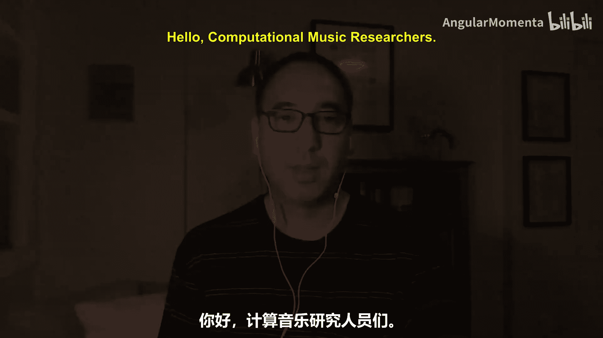
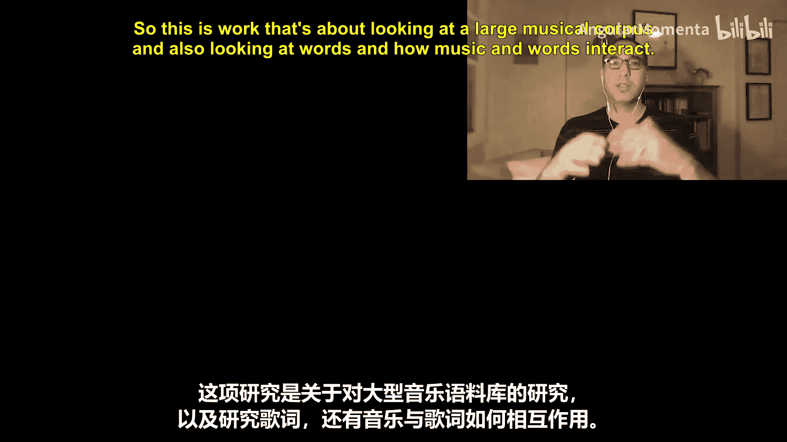
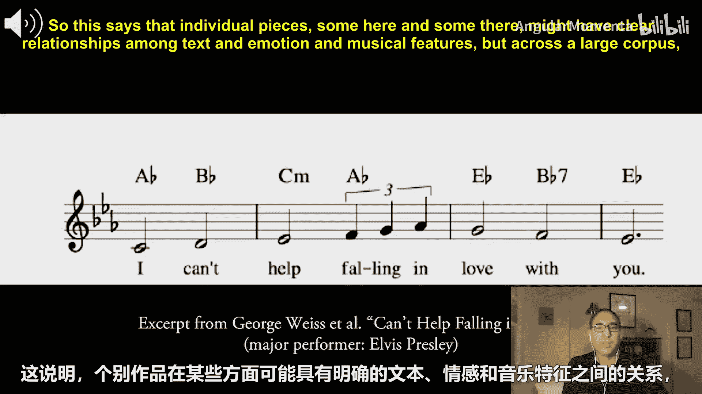
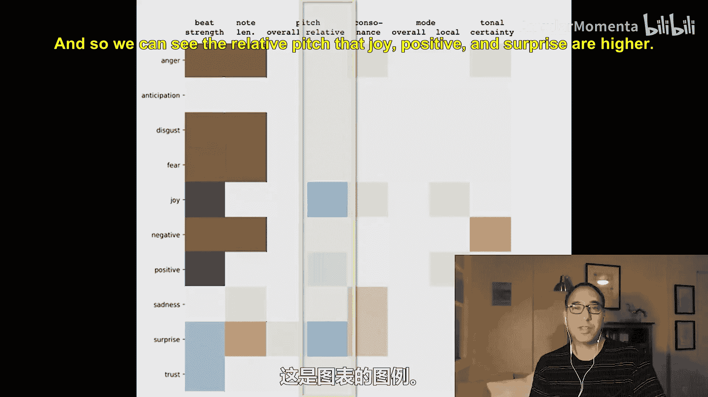
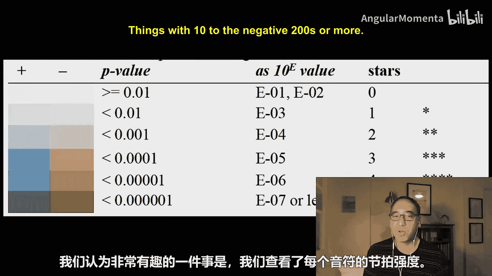
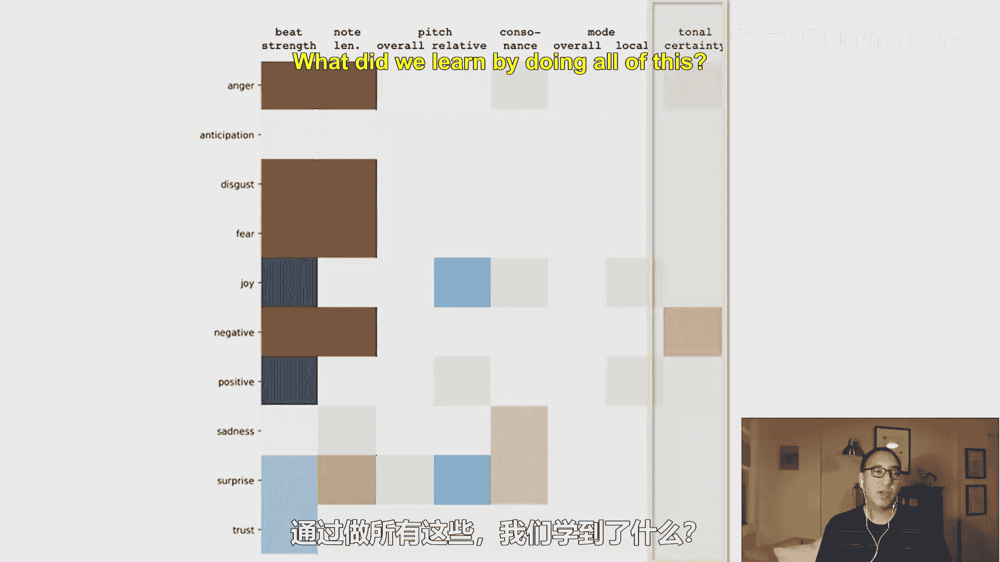
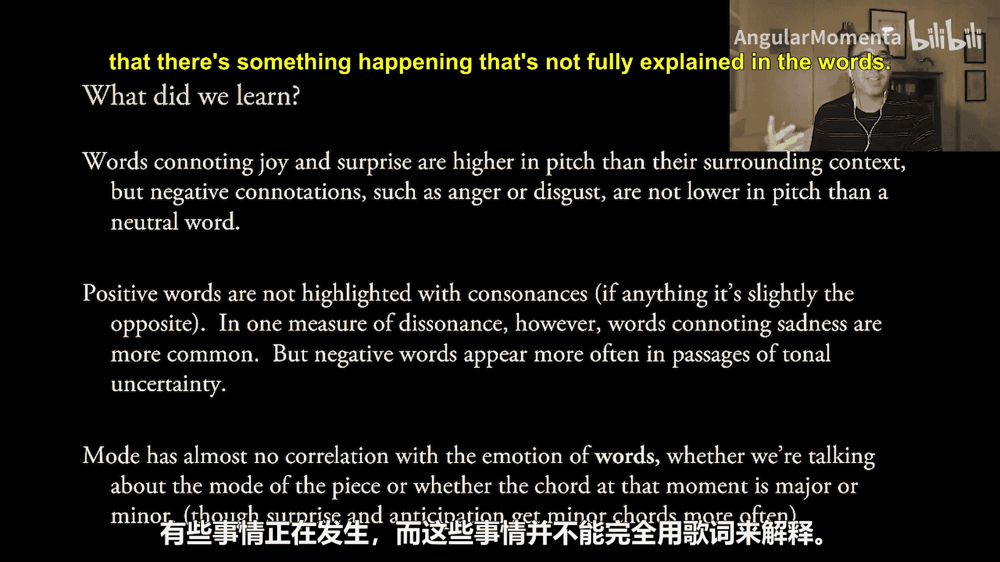
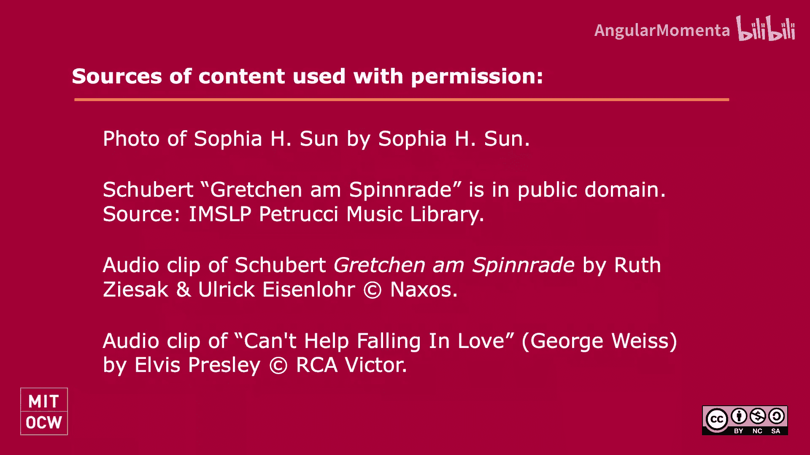

#  026：用音乐与文本描绘情感 🎵📝






在本节课中，我们将学习如何利用大型音乐语料库，结合计算分析方法，研究音乐特征与歌词情感之间的关联。我们将探讨音乐参数（如音高、节奏、和声）是否与特定的情感表达存在系统性联系。

---

## 概述

文字和音乐通常都被认为具有内在的情感。然而，文本的情感很大程度上取决于其语义，即单个词语和句子的含义。相比之下，脱离具体表演或录音的书面乐谱中，单个音乐参数的情感内容则远没有那么明确的定义。

音乐感知或音乐心理学的一个主要问题是：当特定的音乐特征（如协和与不协和、节拍位置、音高）脱离其表演元素时，它们是否仍然承载特定的情感意义，例如快乐或悲伤？

直接回答这个问题可能很困难，但我们可以间接地探讨：是否存在某些音乐特征，它们与文本结合使用，并且与特定的情感或情绪有规律地关联，以至于我们可以相信这些音乐特征本身被用来强化这些情感的效果，或者它们本身就承载着这些情感？

---



## 传统分析与语料库研究

通过传统音乐分析建立这种联系的问题是，任何音乐特征与任何情感状态之间都没有完美的关联。

我们可能会认为，至少在西方共同实践传统中，表达喜悦的词语往往音高较高。例如，在舒伯特的《纺车旁的格蕾琴》中，词语“心”（Hers）、“微笑”（lächeln）或“吻”（Kuss）出现时，音高总是等于或高于前一个音符，并且总是在歌手的较高音区。

**示例代码：** 在乐谱中定位特定情感词汇并分析其音高趋势。
```python
# 伪代码示例：分析歌词“joy”出现时的音高
for note in song:
    if associated_lyric == "joy":
        compare_pitch(note, previous_note)
```

然而，只需一点反例就能推翻这个理论。在猫王演唱的《情不自禁坠入爱河》中，“爱”（love）和“亲爱的”（darling）这些词总是出现在比前一个音符更低的音高上。

这表明，**个别作品**可能在文本、情感和音乐特征之间存在清晰的关系，但**跨越大型语料库**时，聆听共同实践、民间或流行音乐的整体体验则要模糊得多。

为了澄清这一点，我们可以转向语料库研究，特别是对大型音乐编码数据集的计算分析。这些数据集的庞大规模使得人类研究者无法逐一分析所有作品。通过计算方法来抽象音乐、文本和情感之间的联系，我们可以从大型语料库中发现具有统计显著性的趋势，即使趋势本身的幅度可能很小。

---

## 研究数据与方法

Sophia H. Sun 与我所进行的研究使用了一个包含约1900首英文歌曲的“主旋律谱”（Lead Sheets）资料库，这些谱子包含旋律、歌词与和弦符号。总共约有20万个音符、略少的单词以及7万个和弦。这是一个相当大的资料库。

我们还使用了第二个语料库，即加拿大国家研究委员会的Mohammad和Turney创建的开放众包数据库，包含14000个常见英语单词，每个单词都根据其情感进行了编码。例如，具有“期待”情感的词包括“skewed”、“recreational”或“zeal”。

结合一个被称为“停用词”（如“the”、“us”）的小列表，歌曲中大约60%的单词可以根据情感进行分类，或者被归类为无情感或中性。在这个语料库中，每种情感至少有2000个实例，有些甚至超过12000个。

我们使用 **Music21** 工具包来自动标记数据集中每个单词的实例，并同时测量一个我们关注的音乐参数值。

**示例：** 以歌曲《绿袖子》为例，计算机会识别出除了“alas”之外的每个单词，但只有“love”（被识别为“喜悦”和“积极”）和“wrong”（被识别为“消极”）具有特定的情感标签。

然后，我们查看可以测量的特定值。例如，之前讨论过的音高问题：对于每个单词，我们查看其第一个音节出现的音符，计算它比前一个音符高或低了多少个半音。

**公式：** 相对音高变化 = `当前音符音高（半音） - 前一个音符音高（半音）`

通过这样的测量，我们可以检验第一个理论：**积极词汇的音高是否上升，而消极词汇的音高是否下降？**



---

## 研究发现与可视化



以下是针对“相对音高”测量的结果图表。我们比较了十种情感（愤怒、期待、厌恶、恐惧、喜悦、消极、积极、悲伤、惊讶、信任）的词汇与中性词汇。

*   **喜悦**、**积极**和**惊讶**的词汇在音高上显著高于中性词汇。
*   **愤怒**、**厌恶**等消极词汇在音高上与中性词汇相比没有显著降低。
*   与停用词（如“the”）相比，**所有**情感词汇的音高都更高。

**图表解读：** 蓝色表示该情感类别的词汇在测量的音乐参数上值更高（如音高更高、节拍更强），棕色/米色表示值更低。颜色深浅代表统计显著性（p值），颜色越深，该结果偶然发生的概率越低。

---

### 其他音乐参数的发现

上一节我们介绍了音高与情感的关联，本节中我们来看看节奏、音长、和声等其他参数的分析结果。

以下是研究中观察到的其他一些显著趋势：

*   **节拍强度**：表示喜悦和积极情感的词汇更常出现在强拍上。而表示愤怒、厌恶、恐惧或消极情感的词汇则更常出现在弱拍或切分音上。
*   **音符时值**：消极情感（如愤怒、厌恶、恐惧）倾向于与较短时值的音符相关联。
*   **整体音高**：与整首歌曲的平均音高相比，几乎没有发现相关性。我们并不倾向于把快乐的词唱得很高，悲伤的词唱得很低。
*   **协和度**：一些消极情感（尤其是悲伤）更常出现在与不协和和弦相关的音符上。有趣的是，**喜悦**的词汇有时也会出现在略微不协和的音符上，这可能是为了强调。
*   **调式（大调/小调）**：无论是整首歌曲的调式，还是词汇出现时和弦的调式，与词汇情感几乎**没有**相关性。表示悲伤的词汇在大小调作品中出现频率没有区别。一个意外的发现是，在**局部**（词汇前后几小节），喜悦和积极情感反而略微更多地出现在小调片段中。
*   **调性明确度**：愤怒和消极词汇更常出现在调性不明确的乐段中。

---

## 总结与启示



本节课中，我们一起学习了如何通过计算分析大型音乐语料库，来探索音乐特征与歌词情感之间的复杂关系。

我们了解到：
1.  表示**喜悦**和**惊讶**的词汇，其音高倾向于比上下文更高，但表示**愤怒**或**厌恶**的消极词汇音高并不一定更低。
2.  积极词汇并不通过协和音来突出；相反，在某些不协和度的测量中，表示**悲伤**的词汇更常见。
3.  消极词汇更常出现在**调性不确定**的段落中。
4.  **调式**（大调/小调）与词汇情感几乎**没有直接关联**。这表明，我们“听到小调音乐感到悲伤”的关联，可能更多是一种纯粹的音乐性联系，是后天习得的，与歌词内容无关。

这项研究揭示了作曲家或歌曲创作者在实践中如何下意识地运用音乐手段来配合或强化文本情感，也指出了音乐情感表达中一些反直觉的复杂现象。这为音乐创作、分析和心理学研究提供了新的数据视角。





总有更多的研究可以进行。感谢大家跟随我一起回顾了Sophia H. Sun与我的这些发现。