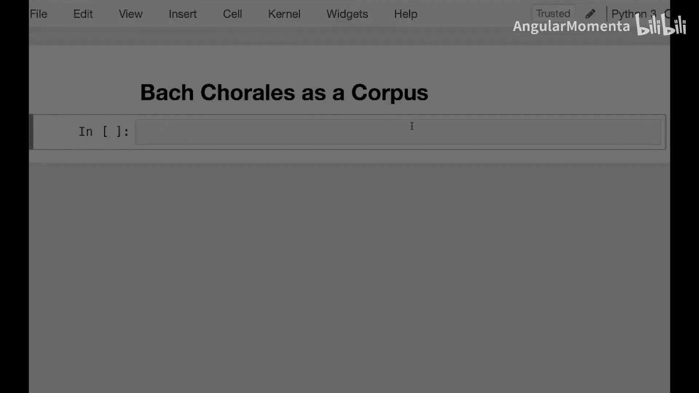
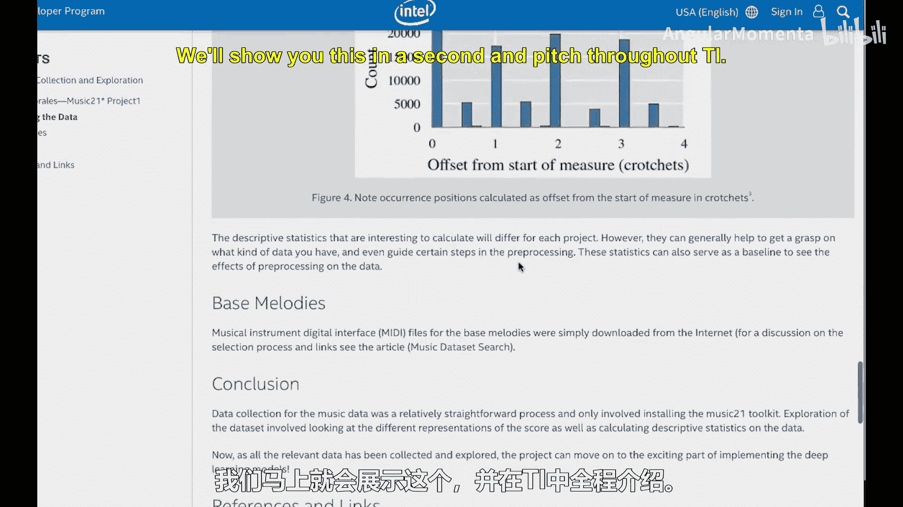

#  027：众赞歌作为语料库 🎵




在本节课中，我们将学习如何使用 Music21 库中的巴赫众赞歌完整语料库。我们将探索如何访问、遍历这个语料库，并从中提取关于音乐作品的基本信息，例如声部数量和音符数量。

---

上一节我们介绍了 Music21 的基本功能，本节中我们来看看一个特定的内置语料库。

在 Music21 的语料库中，包含一个非常有用的子语料库，即 J.S.巴赫的完整众赞歌集。这个语料库由 Margaret Greentree 贡献。我们首先需要导入 `corpus` 模块。

```python
from music21 import corpus
```

语料库中有一个名为 `chorales` 的模块，它提供了一个迭代器，可以遍历所有的众赞歌。

以下是遍历语料库并打印每首作品元数据（如标题）的代码示例：

```python
for chorale in corpus.chorales.Iterator():
    print(chorale.metadata.title)
```

这个过程可能会有些慢，因为它在遍历的同时解析每个文件。你可以随时中断执行。

---

并非每首众赞歌都有四个声部。我们可以添加一个条件，只处理那些恰好有四个声部的作品。

以下是筛选四声部众赞歌并打印各声部音符数量的代码：

```python
for chorale in corpus.chorales.Iterator():
    if len(chorale.parts) != 4:
        continue
    print(chorale.metadata.title, end=‘: ‘)
    for i in range(4):
        p = chorale.parts[i]
        print(len(p.flat.notes), end=‘ ‘)
    print()
```

通过这种方式，我们可以观察不同声部之间音符数量的分布情况，并比较哪些声部的音符更多或更少。

---

利用完整的众赞歌语料库，我们可以进行多种分析。例如：
*   分析音乐中的运动类型。
*   寻找高潮出现的位置。
*   识别作品中的重复段落。
*   统计众赞歌中使用的拍号类型。

这些正是你们在习题集中探索过的内容，展示了利用语料库可以完成的丰富工作。

---

如果你想快速查找特定的众赞歌文件，可以使用 `corpus.chorales` 来获取文件名列表，然后将其传递给解析器。

以下是查找并解析所有文件名中包含 ‘11’ 的众赞歌的代码：

```python
file_list = corpus.chorales.search(‘11’)
for file_name in file_list:
    s = corpus.parse(file_name)
    # 接下来可以对作品 s 进行分析
```

由于数量不多，我们甚至可以逐一查看这些作品。

---

我们的合作伙伴 Intelum 创建了一个教程，指导如何利用众赞歌迭代器、挖掘数据、进行情感识别分析，甚至应用人工智能技术并绘制各种图表。我们稍后会展示相关内容。



---


本节课中我们一起学习了如何访问和遍历 Music21 中的巴赫众赞歌语料库，如何筛选特定声部数量的作品，以及如何提取基本的音乐信息进行分析。这个语料库为计算音乐分析提供了丰富的数据基础。