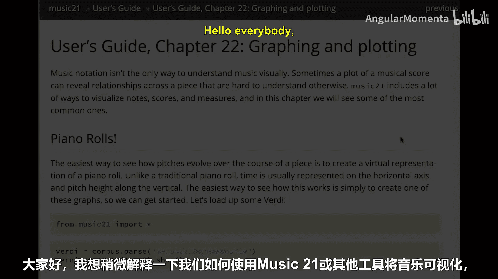
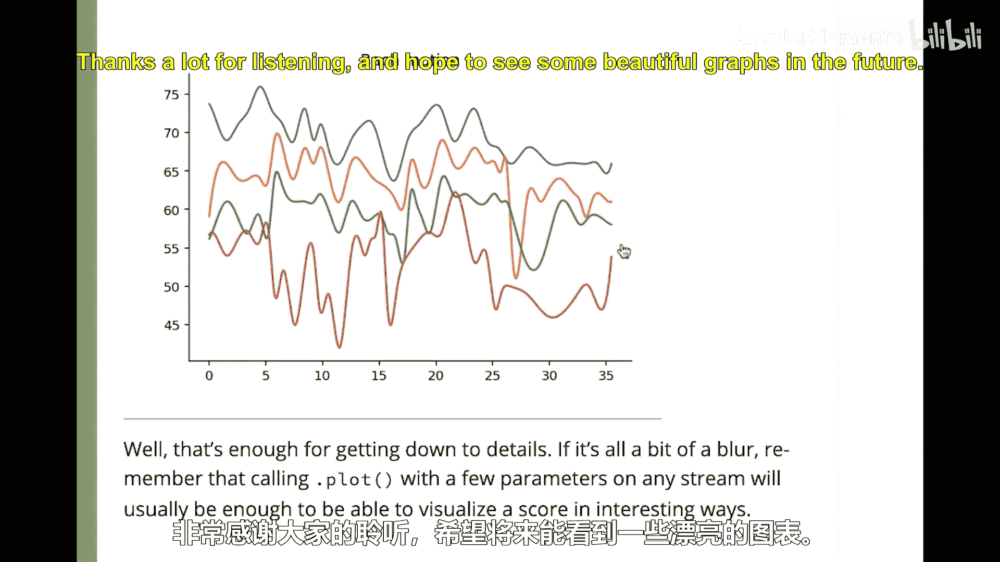

#  028：音乐21中的图表绘制 📊


在本节课中，我们将学习如何使用 Music21 库来可视化音乐数据。图表绘制是理解音乐结构、模式和特征的重要工具，它能让我们直观地“看到”音乐中发生的事情，而不仅仅是聆听。



---

上一节我们介绍了 Music21 的基本功能，本节中我们来看看如何使用它进行图表绘制。我们将从 Music21 用户指南的第22章开始，该章节详细介绍了绘图功能。

首先，我们需要导入必要的模块并加载示例音乐。

```python
from music21 import *
verdi = corpus.parse('verdi/rigoletto_la-donna-e-mobile')
```

我们可以查看作品的前10小节。在 Music21 中，使用 `.measures()` 方法并指定起始和结束小节号（包含两端）可以提取片段。

```python
excerpt = verdi.measures(1, 10)
excerpt.show()
```

提取后，我们可以专注于作品的声乐部分。Music21 的默认绘图功能会生成一个“钢琴卷帘”视图，类似于 MIDI 编辑器中常见的视图。它会自动处理许多细节，例如：
*   正确显示音高和八度标记。
*   根据上下文选择正确的升降号（如 `♭`、`♯` 甚至 `𝄫`）。
*   即使小节长度不一，也能按小节正确排列音符。

---

以下是 Music21 提供的一些基本绘图类型：

我们可以加载另一首作品，例如阿诺德·勋伯格的钢琴曲，并尝试不同的绘图方式。

```python
schoenberg = corpus.parse('schoenberg/opus19', 2)
excerpt_schoenberg = schoenberg.measures(1, 4)
```

**1. 散点图**
将音符的时值（`quarterLength`）映射到音高（`pitch`），可以观察音符时长与音高的分布关系。

```python
excerpt_schoenberg.plot('scatter', 'quarterLength', 'pitch', title='Scatter Plot: Pitch vs. Duration')
```

**2. 直方图**
分析音高或音级的出现频率。例如，可以绘制音高八度的直方图，或特定音级的直方图。

```python
# 音高八度直方图
excerpt_schoenberg.plot('histogram', 'pitch')
# 音级直方图（忽略八度）
excerpt_schoenberg.plot('histogram', 'pitchClass')
```

---

为了在 Jupyter Notebook 中顺利显示图表，需要在开头添加以下魔法命令：

```python
%matplotlib inline
```

Music21 的绘图功能基于 Matplotlib，并提供了许多预设的、适用于音乐数据的图表类型，包括：
*   水平条形图
*   将小节号、时值与音高关联的图表
*   音高与出现次数的分布图
*   作品音域范围图
*   基于卡洛尔·孔波雷罗-舒克勒（Carol Krumhansl-Schmuckler）算法的调性分析图
*   声部进入与力度（如 `mf`, `f`, `fp`）的时序图
*   甚至是一些3D图表（可能有用，也可能只是有趣）

---

我们可以利用这些工具进行简单的比较分析。例如，比较罗伯特·舒曼某弦乐四重奏与肖邦某马祖卡舞曲的音高使用特点。

```python
schumann = corpus.parse('schumann/opus41no1', 1)
chopin = corpus.parse('chopin/mazurka06-2')
# 分别绘制并比较它们的音高直方图
```

但请记住，图表是辅助工具。分析时，**务必回到乐谱本身**，结合听觉和乐理知识进行验证。

---

对于希望深入定制图表的用户，可以参考 Music21 用户指南的第44章（可选）。它涵盖了更多高级主题，例如：
*   添加标题和修改图形尺寸。
*   更改颜色和样式。
*   高亮特定数据点。
*   绘制偏移量与同时发声的音符数量（“基数”）的关系图。
*   创建显示钢琴黑白键与频率关系的图表。
*   平滑处理旋律线等。

绘图领域仍有很大的探索空间。这是一个强大的起点，可以帮助你从数据中发现音乐的美。

最后，推荐阅读爱德华·塔夫特（Edward Tufte）的经典著作《量化信息的视觉展示》（The Visual Display of Quantitative Information）。这本书深刻阐述了优秀图表的设计原则、目的以及如何让数据既突出又美观。

---




**本节课总结**
本节课我们一起学习了如何使用 Music21 进行音乐数据可视化。我们掌握了加载音乐、提取片段、生成默认钢琴卷帘图的方法，并探索了散点图、直方图等多种图表类型，用于分析音高、时值、频率等元素。我们还了解了在 Jupyter Notebook 中显示图表的技巧，并认识到图表是连接数据分析与音乐本体理解的重要桥梁。希望你能运用这些工具，创作出既有洞察力又美观的音乐分析图表。