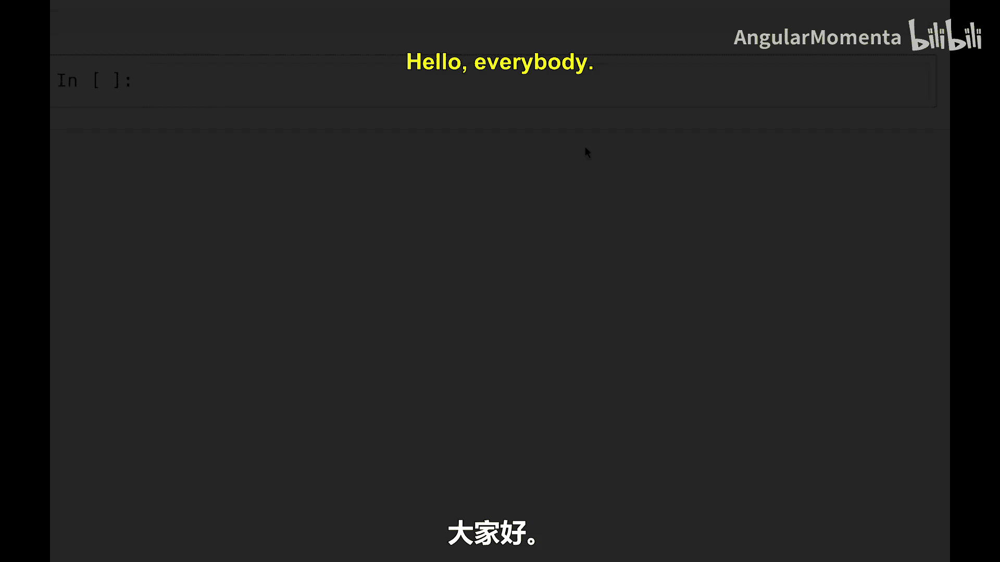
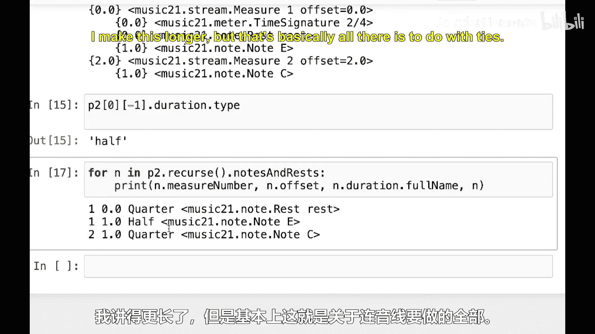

#  029：在 music21 中处理连音线 🎵


在本节课中，我们将学习如何在 music21 库中表示和处理连音线。连音线是连接两个相同音高音符的符号，用于表示一个跨越小节或节拍单位的持续音。我们将通过创建音符、设置连音线属性以及使用 `stripTies` 方法来合并被连音线连接的音符。

## 概述

首先，我们需要导入必要的模块并创建一个包含音符和连音线的音乐流。我们将演示如何创建连音线，以及如何通过 `stripTies` 方法将连音的音符合并成一个更长的音符。



## 导入模块与创建基础结构

首先，我们从 music21 导入 `Note`、`Stream` 和 `tie` 模块。

```python
from music21 import Note, Stream, tie
```

接下来，我们创建一个 `Stream` 对象作为一个小节，并创建两个相同音高的音符。连音线只能连接相同音高的音符。

```python
m = Stream()
note1 = Note('E4')
note2 = Note('E4')
```

## 设置拍号与添加音符

我们创建一个 2/4 拍号，并将其与两个音符一起添加到小节中。

```python
from music21 import meter
ts = meter.TimeSignature('2/4')
m.append([ts, note1, note2])
m.show('text')
```

## 创建并应用连音线

现在，我们为这两个音符创建连音线。第一个音符的连音线类型设为 `'start'`，第二个音符的设为 `'stop'`。

```python
note1.tie = tie.Tie('start')
note2.tie = tie.Tie('stop')
m.show('text')
```

此时，乐谱显示为两个独立的四分音符，但通过连音线连接。在听觉上，它们应被感知为一个持续两拍的二分音符。

## 处理跨小节的连音线

在实际音乐中，连音线常跨越小节。为了演示这一点，我们创建两个小节，并将第一个音符放在第一小节，第二个音符放在第二小节。

```python
m1 = Stream()
m2 = Stream()
m1.append([ts, note1])
m2.append(note2)

p = Stream()
p.append([m1, m2])
p.show('text')
```

## 使用 stripTies 方法合并音符

当我们遍历这个声部中的所有音符时，程序会识别出三个独立的音符对象（包括连音线两端的音符）。为了从音乐角度将其视为一个持续的音符，我们可以使用 `stripTies` 方法。

```python
p2 = p.stripTies()
p2.show('text')
```

`stripTies` 方法会将由连音线连接的两个 `E4` 音符合并成一个二分音符。然而，这可能会产生不符合音乐规则的情况，例如在一个 2/4 拍的小节中出现一个二分音符。因此，`stripTies` 主要用于分析和处理数据，而非直接生成可显示的乐谱。

## 查看处理后的音符信息

我们可以遍历处理后的声部，查看每个音符或休止符的偏移量和小节信息，以验证合并操作。

```python
for n in p2.recurse().notesAndRests:
    print(n.measureNumber, n.offset, n)
```

输出将显示，合并后的 `E4` 音符位于第一小节偏移量 1 的位置（持续半音符），而 `C` 音符位于第二小节。



## 总结


本节课中，我们一起学习了在 music21 中处理连音线的基本方法。我们了解了如何创建连音线，如何将其应用于音符，以及如何使用 `stripTies` 方法从音乐分析的角度合并被连音的音符。掌握这些操作对于进行精确的音乐时长分析和数据预处理至关重要。