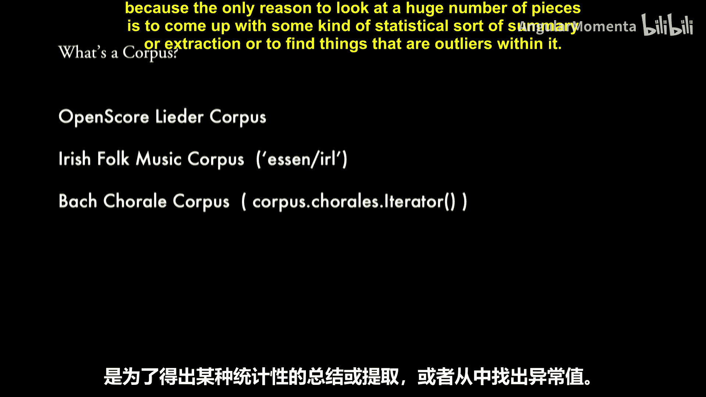
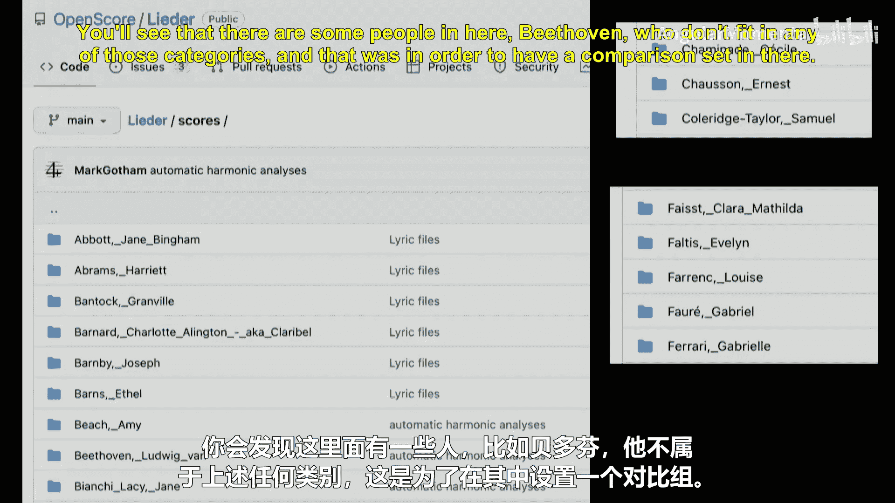
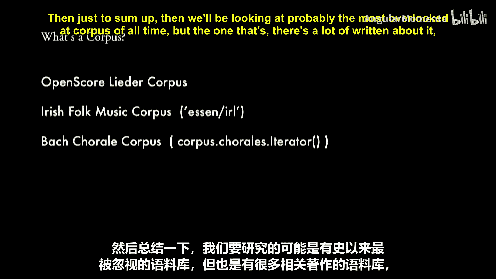
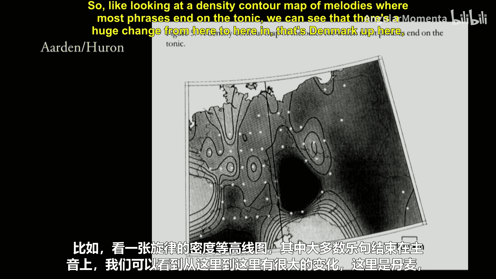
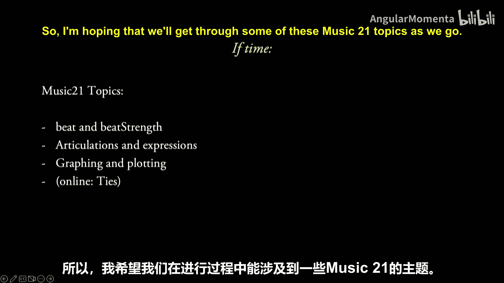
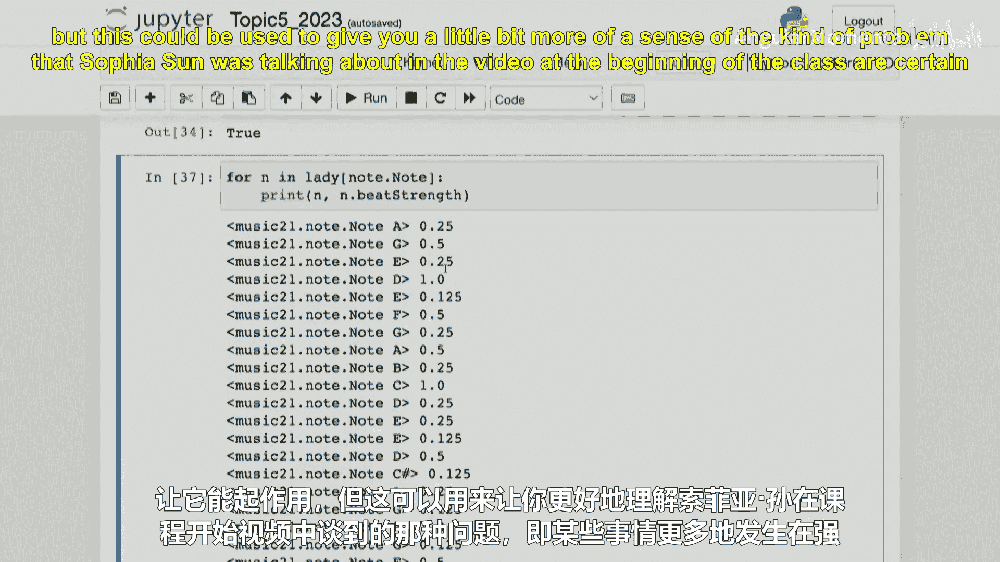

#  030：语料库研究与统计 📊


在本节课中，我们将学习如何使用计算工具对音乐语料库进行统计分析。我们将通过具体的代码示例，探索如何从大量音乐作品中提取和比较音乐特征，例如最常见的节拍类型或临时记号的出现位置。

---

## 概述

本节课的核心是**语料库研究**。我们将使用 `music21` 库加载和分析两个音乐数据集：一个爱尔兰民歌语料库和巴赫作品集。我们将学习如何编写代码来统计这些数据中的音乐特征，并解释其结果。这涉及到数据提取、过滤、计数和基本的统计分析。

---

## 加载与分析语料库

首先，我们需要导入必要的模块并加载一个语料库。我们将从 `music21` 的预置语料库中加载爱尔兰民歌数据集。

```python
from music21 import corpus
from music21 import meter
from collections import Counter



# 加载爱尔兰民歌语料库
irl = corpus.parse('snes/folk/IRL')
```



`irl` 对象是一个包含多个乐谱的集合。我们可以查看其中包含多少首乐曲，并检查第一首。



```python
# 查看语料库中的乐曲数量
num_scores = len(irl.scores)
print(f"语料库中包含 {num_scores} 首乐曲。")



# 获取第一首乐曲
first_song = irl.scores.first()
```



---

## 统计最常见的节拍

上一节我们介绍了如何加载语料库。本节中我们来看看如何从这些乐曲中提取并统计节拍信息。我们的目标是验证一个假设：在爱尔兰民歌中，哪种节拍最为常见？

以下是实现步骤：

```python
# 初始化一个计数器来统计节拍
meter_counter = Counter()

# 遍历语料库中的每一首乐曲
for song in irl.scores:
    # 获取乐曲的第一个节拍记号
    ts = song.recurse().getElementsByClass(meter.TimeSignature).first()
    if ts:
        # 使用节拍的字符串表示（如‘3/4’）作为计数键
        meter_counter[ts.ratioString] += 1

# 查看统计结果
print("节拍统计结果：")
for meter_type, count in meter_counter.most_common():
    print(f"  {meter_type}: {count} 次")
```

运行此代码后，我们可能会发现 `3/4` 拍和 `4/4` 拍是最常见的，而 `6/8` 拍也可能有一定数量。这个结果可以帮助我们理解特定音乐风格中的节拍使用习惯。

---

## 分析临时记号的位置

接下来，我们将进行一个更深入的分析：研究临时记号（如升号、降号、还原号）在乐曲小节中出现的位置规律。它们是更倾向于出现在强拍（如第一拍）上，还是弱拍上？

我们首先需要过滤出那些与调号不一致的临时记号（即真正的“变化音”），然后检查它们所在的节拍位置。

```python
from music21 import note, pitch, key

# 初始化列表记录位置（这里简化为例，仅区分“强拍”和“弱拍”）
accidental_positions = {'downbeat': 0, 'offbeat': 0}
# 创建一个固定的“自然”临时记号对象用于比较
NATURAL = pitch.Accidental('natural')

for song in irl.scores:
    # 获取乐曲的调号（假设乐曲中途不变调）
    ks = song.recurse().getElementsByClass(key.KeySignature).first()
    if not ks:
        continue

    # 遍历乐曲中的每一个音符
    for n in song.recurse().notes:
        # 获取音符的临时记号，如果没有则视为‘natural’
        note_acc = n.pitch.accidental or NATURAL
        # 获取该音符音高在调号中的临时记号，如果没有则视为‘natural’
        key_acc = ks.accidentalByStep(n.pitch.step) or NATURAL

        # 如果音符的临时记号与调号不一致，则它是一个“变化音”
        if note_acc != key_acc:
            # 检查音符是否在强拍上（这里简化判断：偏移量是否为0.0）
            if n.offset == 0.0:
                accidental_positions['downbeat'] += 1
            else:
                accidental_positions['offbeat'] += 1

print("临时记号位置分析：")
print(f"  出现在强拍上: {accidental_positions['downbeat']} 次")
print(f"  出现在弱拍上: {accidental_positions['offbeat']} 次")
```

这个分析可以帮助我们验证关于音乐紧张度解决方式的假设——变化音是更倾向于在节奏的支撑点（强拍）上出现以制造紧张感，还是在弱拍上作为经过音出现。

---

## 使用拍点强度进行更精细的分析

上面的例子使用偏移量简单判断强拍。`music21` 提供了一个更精细的属性 `beatStrength`（拍点强度），它是一个介于 0 到 1 之间的浮点数，用来量化一个音符在其小节内的节奏强弱位置。

我们可以利用这个属性进行更准确的分析：

```python
# 初始化一个列表来记录所有变化音的拍点强度
strengths = []

for song in irl.scores:
    ks = song.recurse().getElementsByClass(key.KeySignature).first()
    if not ks:
        continue

    for n in song.recurse().notes:
        note_acc = n.pitch.accidental or NATURAL
        key_acc = ks.accidentalByStep(n.pitch.step) or NATURAL

        if note_acc != key_acc:
            strengths.append(n.beatStrength)

# 计算平均拍点强度
if strengths:
    avg_strength = sum(strengths) / len(strengths)
    print(f"变化音的平均拍点强度为: {avg_strength:.3f}")
    # 数值越接近1，表示变化音越倾向于出现在强拍位置
```

这种方法类似于课程开始时 Sophia 提到的研究，可以分析歌词情感强度与音符节奏位置之间的关系。

---

## 总结



本节课中我们一起学习了计算音乐学中语料库研究的基本方法。我们掌握了如何：
1.  使用 `music21.corpus` 加载音乐数据集。
2.  遍历语料库，并使用 `Counter` 等工具对音乐特征（如节拍）进行统计分析。
3.  编写逻辑来过滤和识别特定的音乐元素（如与调号不一致的临时记号）。
4.  利用 `offset` 和 `beatStrength` 等属性分析音乐事件在时间线上的分布特征。


这些技能是进行大规模音乐数据分析的基础，无论是为了验证音乐理论假设，还是为更复杂的机器学习模型准备数据。在接下来的课程和问题集中，你将有机会应用这些技术，探索自己感兴趣的音乐语料库。