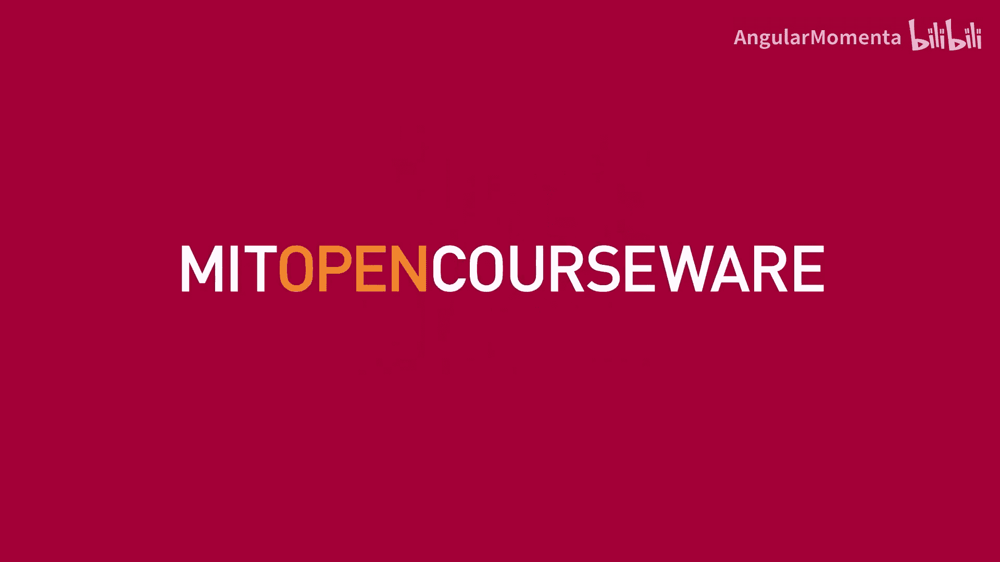
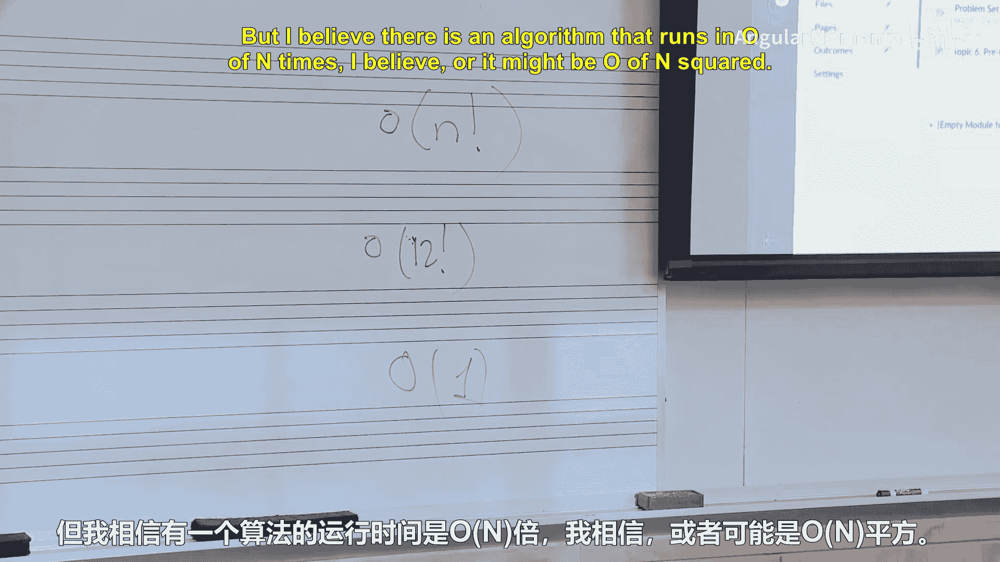
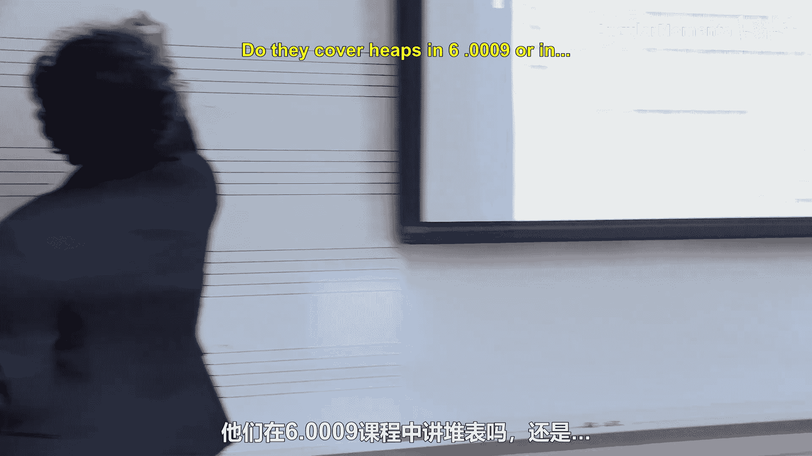
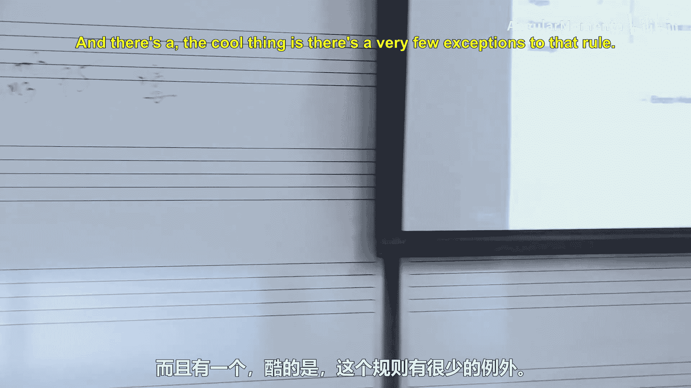
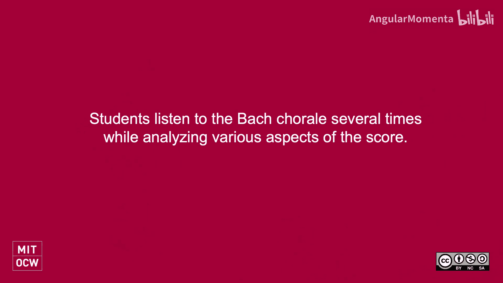
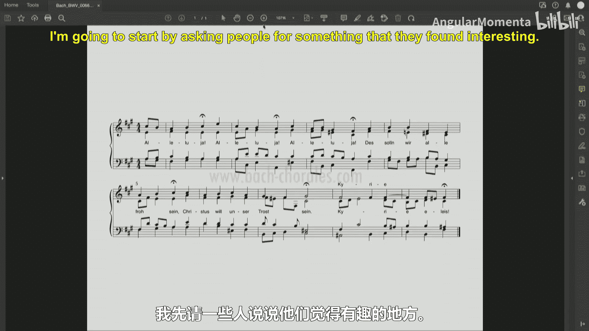
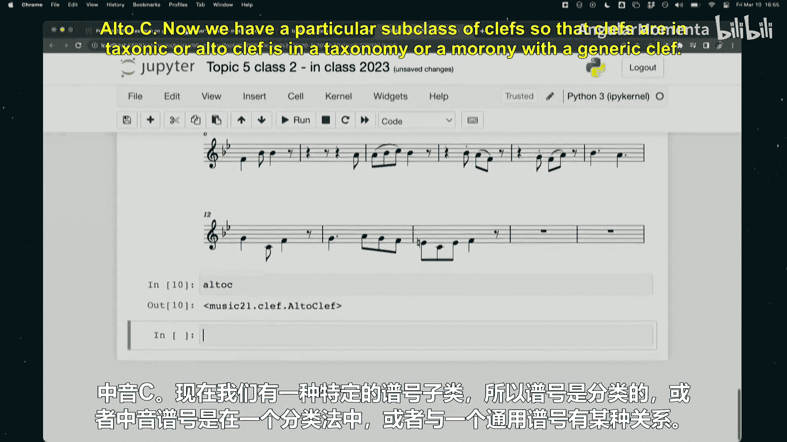
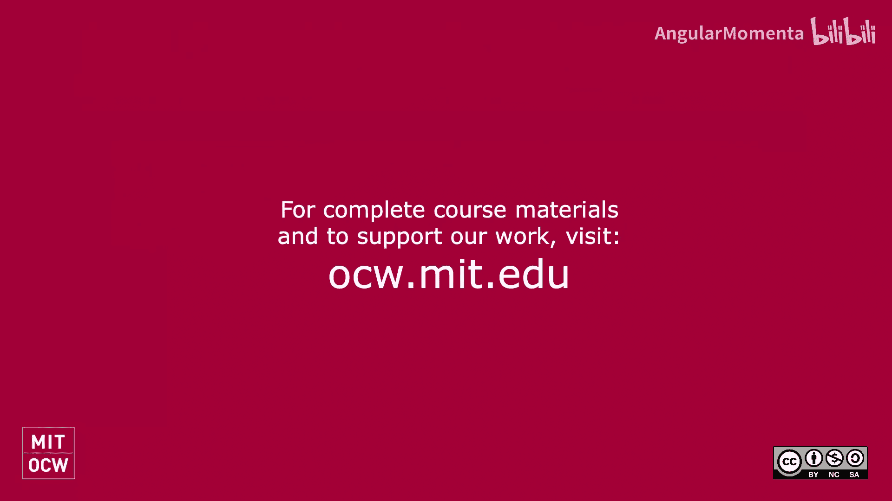

#  031：语料库研究与统计学（下）







在本节课中，我们将继续探讨语料库研究与统计学在音乐分析中的应用。我们将从具体的音乐分析实践出发，理解“细听”与“远听”两种分析方法的区别与联系，并学习如何利用计算工具处理和分析音乐数据。

## 课堂问答与讨论

上一节我们介绍了语料库研究的基本概念，本节中我们来看看在实际分析中可能遇到的问题和思考。



有同学在完成作业时，使用了时间复杂度为 **O(n!)** 的算法来寻找八度等价类和最佳法向量。当处理25个音符时，这个算法的效率会变得很低。实际上，对于音乐分析，尤其是基于12平均律的音高系统，n通常不会超过12。因此，虽然 **O(12!)** 的计算量依然很大，但尚可接受。值得注意的是，存在更优的算法，例如时间复杂度为 **O(n²)** 或 **O(n log n)** 的算法，可以更高效地解决此类问题。

关于音乐中的倒影操作，其用途主要有以下几点：
*   **作曲实践**：许多作曲家，从巴赫到二十世纪的勋伯格、斯托克豪森，都广泛使用倒影对称。
*   **保持音程结构**：互为倒影的两个音组具有相同的音程内涵。这为作曲家重复使用特定音程模式提供了可能。
*   **听觉上的等价类**：在某些情况下，倒影可以被感知为一种变换等价，例如古斯塔夫·霍尔斯特作品中对主题的倒影处理。



一个有趣的数学现象是“全音程四音列”。例如，音级集合 **[0, 1, 4, 6]** 和 **[0, 1, 3, 7]** 拥有完全相同的音程内涵（各音程数量一致），但无法通过倒影或移调相互转换。这类集合被称为“Z关联对”。在16音或30音系统中，会出现更复杂的Z关联组。这体现了音乐理论与组合数学交叉领域中的有趣课题。



## 实践：细听分析

现在，让我们暂时离开计算机和数学，进行纯粹的音乐分析实践。我们将以一首众赞歌为例，进行传统的“细听”分析。

以下是分析步骤：
1.  请用5分钟时间，运用你熟悉的罗马数字或其他分析方法，对乐谱进行分析。
2.  不必所有人都从开头开始，可以关注乐曲的不同部分。
3.  鼓励与周围同学讨论，以减少错误。

（分析过程略……）

通过讨论，我们发现对乐曲的调性变化、特定和弦的解释（如它是V/vi还是新调的V？）以及终止和弦的判断（结束在A大调、升F小调还是升F大调？）可能存在不同见解。这种**歧义性**是传统音乐分析中常见的。分析者需要综合乐谱信息与听觉感受，做出判断。

## 细听与远听：方法论比较

我们刚刚花了相当长的时间分析一首作品，这是典型的“细听”或“细读”。与之相对的是“远听”或“远读”，即利用计算机对大规模音乐语料库进行分析。

以下是两种方法的对比：

**细听/细读的优势：**
*   **捕捉具体细节**：能够分析具体的乐句、动机和细微的修辞手法。
*   **建立情感共鸣**：分析与个人经历或情感产生共振的音乐内容。
*   **体验音乐本质**：音乐欣赏和热爱的起点在于深入的、个人的聆听体验。

**远听/远读的优势：**
*   **处理大规模数据**：高效分析成千上万部作品，发现宏观模式。
*   **进行风格鉴定**：通过统计特征辅助判断作品时期、作者或流派。
*   **提供描述词汇**：为音乐相似性等抽象概念提供量化和描述的基础。
*   **发现异常个案**：从海量数据中筛选出独特、非凡的作品或片段，引导人们重新关注它们。

最有效的研究方法通常始于**细听**。通过手动分析，我们能够理解音乐中的复杂性和歧义性。在进行远听研究时，我们需要设计方法来处理这些复杂性（有时可能是忽略罕见的边缘情况，但需明确说明）。当远听分析发现有趣的现象或异常值时，我们应**回到具体的音乐作品本身**，通过聆听来理解和解释这些发现，最终回归到音乐欣赏的核心目的。

## 新作业与工具学习

接下来的作业（问题集5）要求你们以小组形式，调研一个现有的音乐语料库项目。

作业核心是撰写一篇3-5页的短文，探讨以下问题：
*   该语料库的目标是什么？参与者是谁？
*   音乐数据是如何编码的？（如：乐谱格式、音频、图像）
*   收集了哪些作品？项目的总体范围如何？
*   它试图解决什么问题？在有限时间内能解决多少？
*   该语料库的**优势**和**劣势**是什么？
*   利用这个语料库，可以回答哪些与本课程相关的音乐问题？

请注意，IMSLP和维基百科因其过于明显，不作为推荐选项。作业的重点是选择一个过去十年内活跃的、有明确学术目标的语料库项目进行调研。

为了更好地完成未来的分析任务，建议大家持续学习`music21`工具包。例如，了解如何操作乐谱中的**谱号**：

```python
from music21 import corpus, clef
# 读取海顿弦乐四重奏
haydn = corpus.parse('haydn/opus74no2/movement1')
# 获取中提琴声部
viola_part = haydn.parts['Viola']
# 将其谱号改为高音谱号以便阅读
viola_part.clef = clef.TrebleClef()
# 显示修改后的声部
viola_part.show()
```

这段代码演示了如何提取特定声部并更改其谱号。需要注意的是，简单地替换谱号对象可能不会自动调整音符的符干方向等排版细节，更稳健的方法是使用`replace()`方法。`music21`中的谱号存在继承关系（如`AltoClef`是`Clef`的子类），这有助于进行更精确的操作。

## 总结

本节课中我们一起学习了：
1.  算法复杂度在音乐分析中的实际考量。
2.  倒影操作的音乐意义与数学上的“Z关联”现象。
3.  通过一首众赞歌实践了“细听”分析，并体会到其中的主观性与歧义性。
4.  比较了“细听”与“远听”两种音乐分析方法的优势与适用场景。
5.  介绍了新的语料库调研作业，并学习了使用`music21`进行谱号操作的基本技能。





核心在于理解，计算音乐分析不是要用“远听”取代“细听”，而是将两者结合。计算工具帮助我们提出新的问题、发现隐藏的模式，而深入的音乐理解和审美体验，始终需要回归到具体的音乐作品和个人的聆听之中。