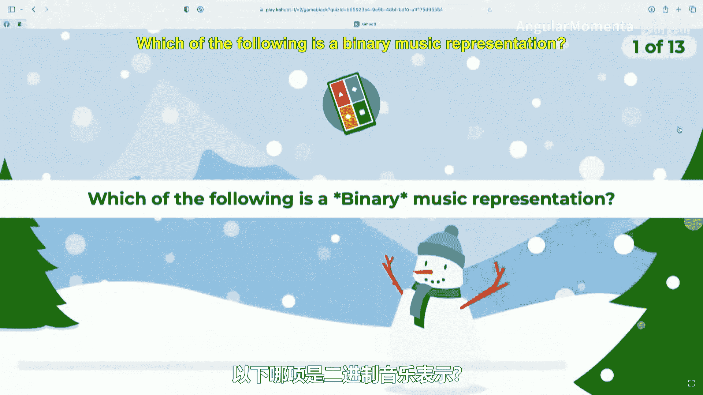
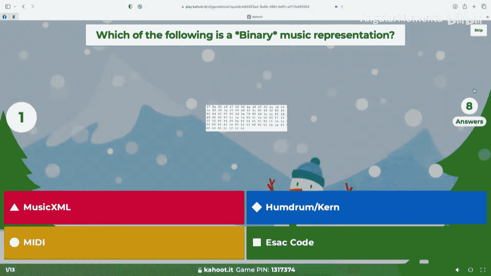
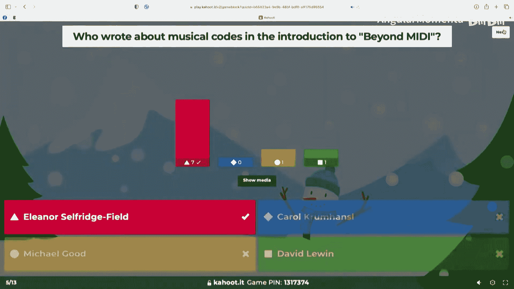
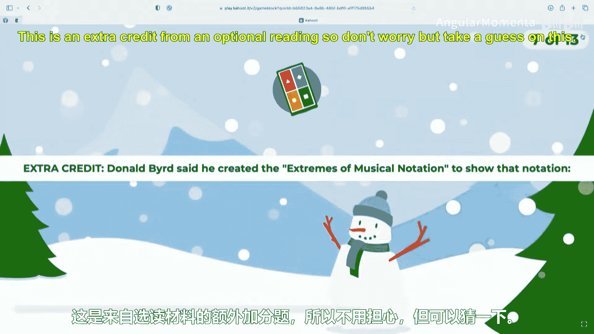
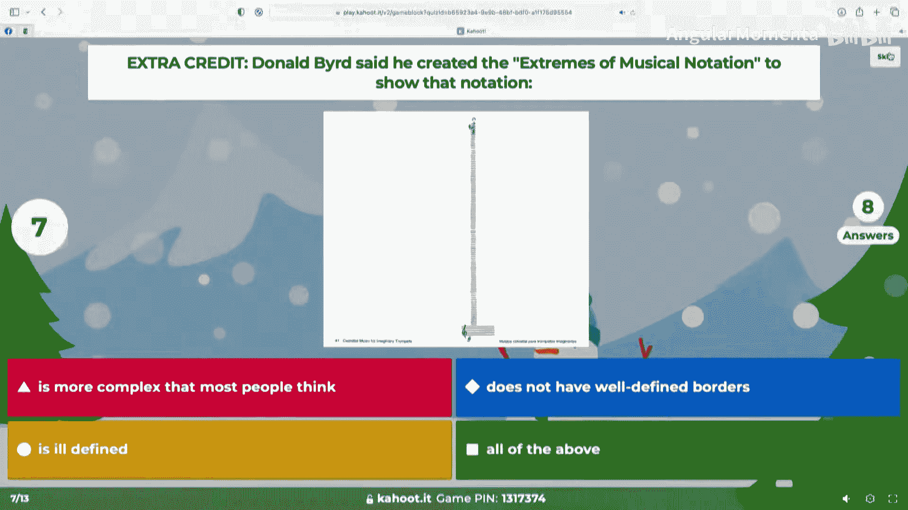
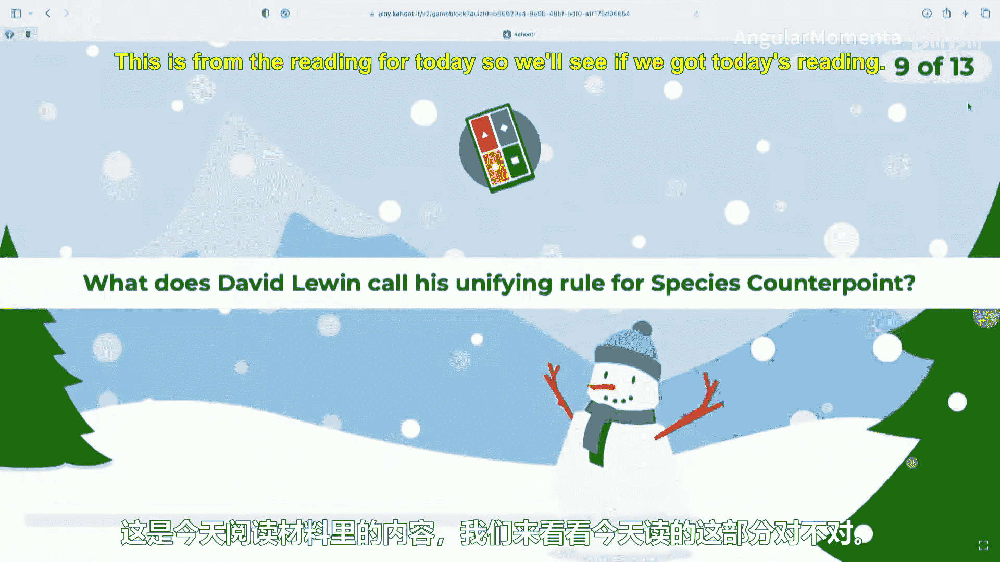
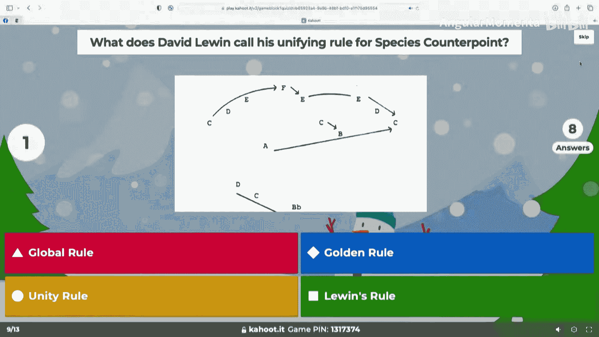
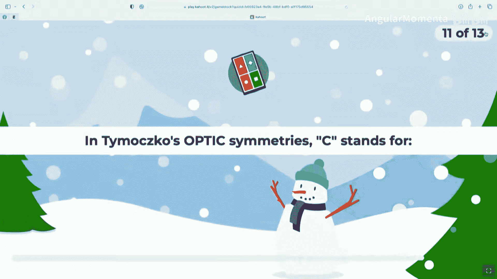
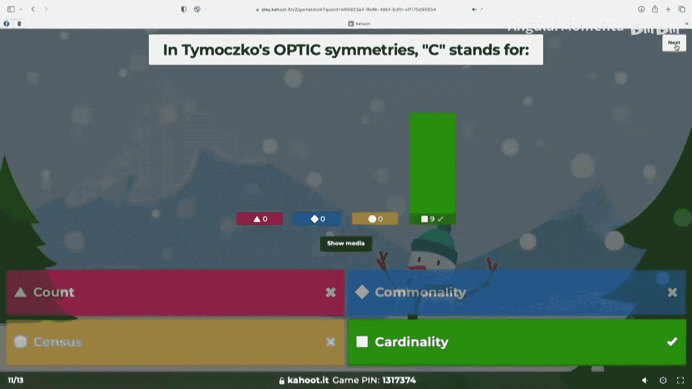
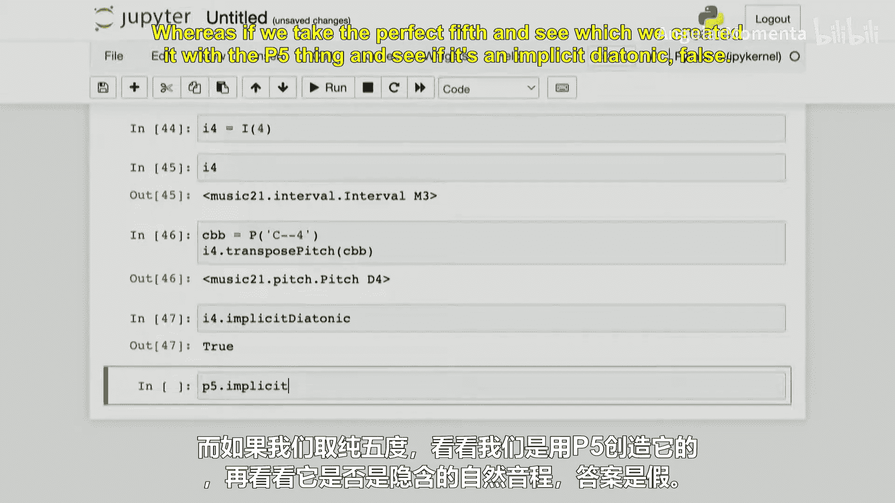

#  032：语料库编码与声部导引


在本节课中，我们将回顾等价性概念，探讨语料库编码的实践，并初步介绍声部导引这一核心主题。我们将通过回顾问题集、讨论在线语料库以及学习音乐21中的音程模块来展开。

## 回顾等价性概念

上一节我们介绍了音乐中的等价性概念。本节中，我们来看看在问题集4中遇到的具体应用。

在音乐中，我们可以在某些语境下说两个音符或音高不同，但在另一语境下，它们可能是等价的。以下是一些常见的等价性类别：

*   **八度**：不同八度的相同音名被视为等价。
*   **排列**：和弦中音符的顺序改变可能被视为等价。
*   **基数**：音符集合的大小被视为等价。
*   **移调**：将一组音符整体升高或降低相同音程被视为等价。
*   **倒影**：围绕一个轴进行镜像反转被视为等价。
*   **拼写**：等音异名（如B♯和C）在某些语境下被视为等价。
*   **乐器**：相同音高在不同乐器上演奏被视为等价。
*   **泛音**：基音与其泛音列中的音在某些分析中可能被视为等价。
*   **时值**：音符的时长不影响其音高身份。

## 问题集4中的挑战

问题集4主要涉及两个编程挑战，它们都与等价性处理有关。





第一个挑战是编写一个能自动计算任意两个音符之间音程的程序。一个隐藏的测试案例涉及音符 **B♯**。B♯在声音上等同于C5，这引发了音程计算的问题。例如，从C5到F♯5是增四度，但从C5到B♯5（听起来是C5到C6）则是减五度。问题的关键在于算法需要在某个步骤进行模12运算，并根据需要添加偏移量，可能需要进行双重模12运算来正确处理跨越八度边界或等音的情况。




第二个挑战是手动找出一个与给定音高集合（A4, E5, C♯4）等价的音高集合，要求使用**排列**和**移调**操作，但不使用八度等价或基数等价。许多错误源于无意中改变了音符的八度。解决此类问题的推荐方法是：
1.  首先在乐谱上标出音符，理解其结构（例如，A4, E5, C♯4构成A大三和弦的第一转位）。
2.  进行排列操作，例如将音符按升序排列。
3.  进行移调操作，例如上移一个大二度，得到D♯4, F♯5, B4（需注意拼写等价性）。









## 探索在线音乐语料库





上一节我们探讨了理论概念，本节中我们来看看实践中的音乐数据来源。学生们分享了他们找到的电子音乐语料库：


*   **Mupedia**：一个包含数据库和搜索查询功能的二重数据库。
*   **Ultimate Guitar**：最初主要包含ASCII文本格式的吉他谱，后来集成了更先进的软件。
*   **电子游戏音乐数据库**：大部分文件采用MIDI格式，因为这是早期游戏中的标准格式，且文件体积小。
*   **爵士乐数据库**：通常使用自定义的、一次性的格式，这是许多数据集常见的情况。

这些语料库的编码方式多样，从标准格式（如MIDI）到自定义格式都有，这体现了音乐数据表示的现状。

## 声部导引简介

前面我们讨论了数据表示，现在我们将转向一个重要的音乐分析领域：声部导引。

声部导引研究多个独立声部如何同时进行。对于计算机分析来说，这是一个特别的问题，因为它需要在两种遍历模式间不断切换：一种是按声部遍历（类似`recurse`），另一种是按时间切片遍历（类似`flatten`）。

一个经典的、用于入门计算声部导引的课题是**种类对位法**。这是一种18世纪发明的、用于学习16世纪音乐写作风格的教学方法。例如，在第一类对位中，给定一个固定旋律（Cantus Firmus），每个音符需配上一个全音符的对位声部，并遵守一系列规则：
*   所有水平（旋律）和垂直（和声）音程都必须是协和音程。
*   禁止连续平行五度（如G-D后接E-B）。
*   禁止某些进行，如增四度/减五度。

为给定的固定旋律自动生成正确的对位声部是一个有趣的计算机优化问题，可能涉及算法复杂度挑战。虽然本课程不会布置如此复杂的作业，但接下来的问题集将要求大家编码实现识别声部导引基本特征的功能，例如避免平行五度。这为后续更高级的分析（如从乐曲中剥离经过音和装饰音，只保留骨架和弦）打下基础。

## 使用音乐21的音程模块

为了支持声部导引分析，我们需要强大的工具来处理音程。现在，我们来学习音乐21库中的`interval`模块。

首先导入必要的模块：
```python
from music21 import corpus, note, pitch, interval
```

可以创建音程对象并获取其信息：
```python
I = interval.Interval  # 创建别名
P = pitch.Pitch        # 创建别名

p5 = I("P5")  # 创建纯五度音程
print(p5.niceName)          # 输出：Perfect Fifth
print(p5.directedNiceName)  # 输出：Ascending Perfect Fifth

p5_desc = I("P-5")  # 或 I("P5", direction=interval.Direction.DESCENDING)
print(p5_desc.directedNiceName)  # 输出：Descending Perfect Fifth
```

可以从两个音高计算音程：
```python
p1 = P("B3")
p2 = P("C5")
m9 = I(p1, p2)  # 计算音程
print(m9.name)        # 输出：m9
print(m9.semitones)   # 输出：13
print(m9.simpleName)  # 输出：m2 (小九度简化为小二度)
```

音程对象可以用于移调音高：
```python
c4 = P("C4")
g4 = p5.transposePitch(c4)  # 向上纯五度移调，返回新音高对象
print(g4)  # 输出：G4

# 也可以在原音高上就地移调
c4 = P("C4")
p5.transposePitch(c4, inPlace=True)
print(c4)  # 输出：G4

# 另一种方式：使用音高对象的.transpose方法
c4 = P("C4")
c4.transpose("+A23")  # 向上移增二十三度
```

`interval`模块内置了音程协和性判断（基于西方古典音乐理论）：
```python
m3 = I("m3")
print(m3.isConsonant())  # 输出：True (小三度是协和音程)

M6 = I("M6")
print(M6.isConsonant())  # 输出：True (大六度是协和音程)

d7 = I("d7")  # 减七度
print(d7.isConsonant())  # 输出：False (拼写影响协和性判断，即使其音高等同于大六度)

P4 = I("P4")
print(P4.isConsonant())  # 输出：False (纯四度在和声语境下常被视为不协和)
```

还可以创建仅指定半音数、不指定音级的“隐式音级”音程，这在某些泛化操作中很有用：
```python
i4 = I(4)  # 仅指定4个半音
print(i4.name)  # 输出：M3 (显示为大三度)
c_dbl_flat = P("C--4")
# 使用隐式音级音程移调时，系统会选择最“简单”的拼写
result = i4.transposePitch(c_dbl_flat)
print(result)  # 输出：D4 (而不是 E--4)
```

## 总结




本节课中我们一起学习了多个主题。我们回顾了音乐等价性的核心概念及其在问题集中的应用。我们探索了现实世界中各种在线音乐语料库及其编码方式。最后，我们引入了声部导引这一重要领域，并深入学习了如何使用音乐21的`interval`模块来创建、操作和分析音程，为后续的声部导引分析和计算打下坚实基础。