#  033：音乐认知入门 🧠


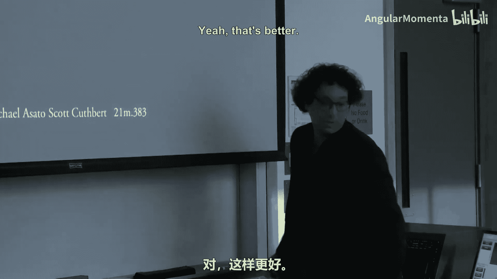

在本节课中，我们将学习音乐认知的基础知识。音乐认知研究我们的大脑如何感知、理解和处理音乐。这是一个与音乐理论、历史、表演乃至计算音乐学都紧密交叉的领域。我们将探讨大脑如何识别音乐的“语法”，以及我们如何学习新的音乐系统。

---

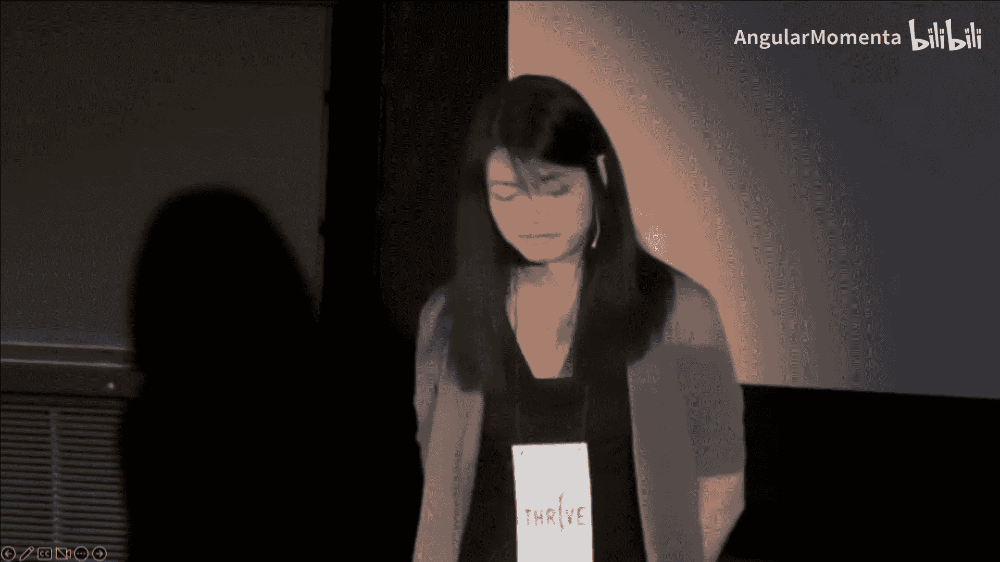

## 大脑对音乐语法的反应


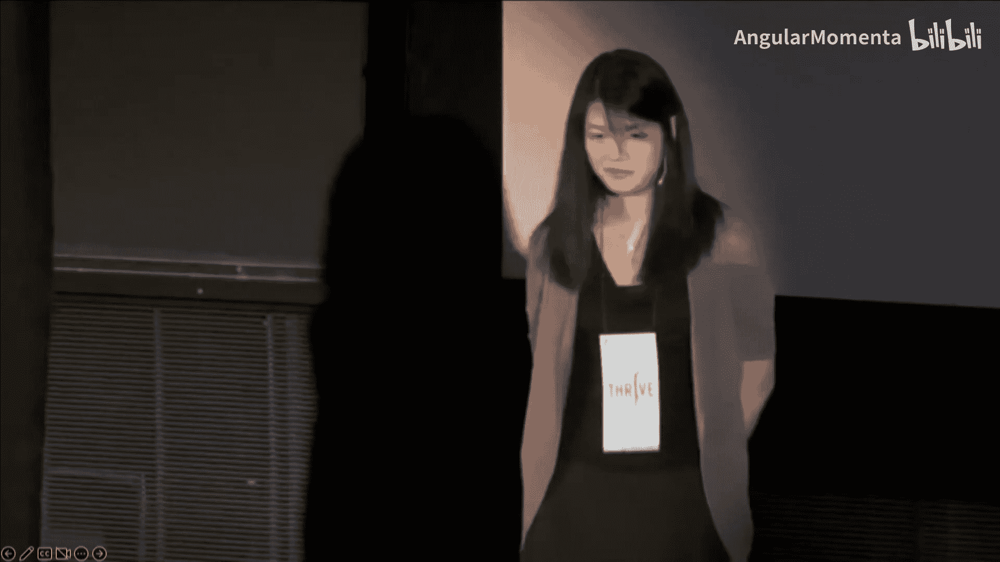

上一节我们提到了音乐认知的广泛关联性。本节中我们来看看大脑对音乐的具体反应。当我们听到一段音乐时，大脑会实时处理其中的信息，并对符合或违反“语法”的部分做出不同反应。

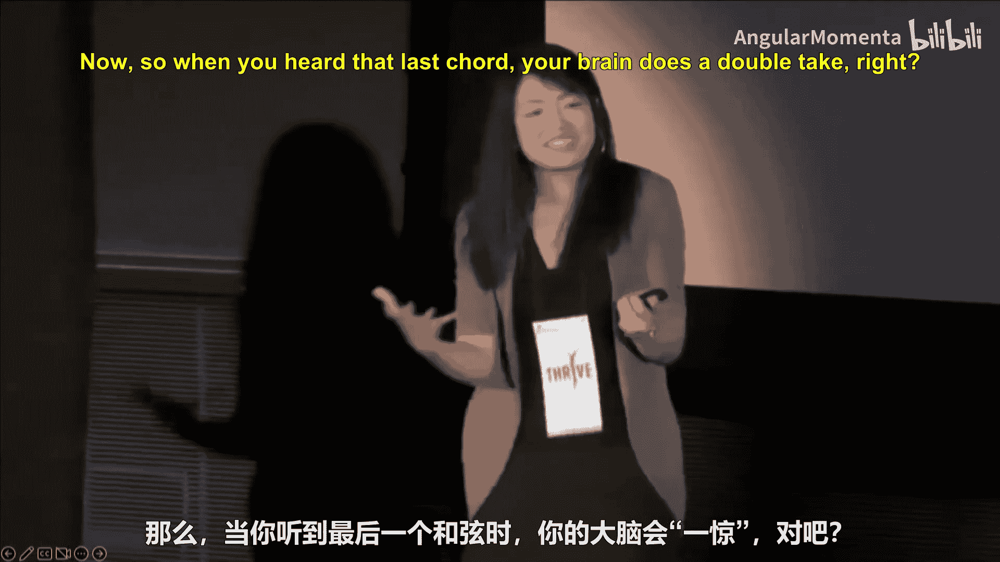


考虑以下音乐示例。第一段听起来正常且和谐。


第二段则包含了一个意外的和弦。对于熟悉西方音乐语法的听众来说，这个和弦会显得突兀和不协调，就像在句子中使用了错误的词语。


当听到这个意外的和弦时，大脑会产生一个“迟疑”的反应。这种反应可以通过记录头皮表面的电活动（脑电图）来精确测量。

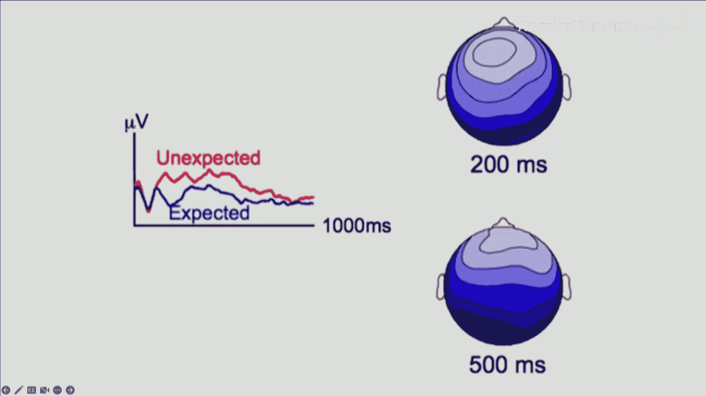

下图展示了大脑对预期和弦与意外和弦的不同反应。在意外和弦出现约200毫秒后，大脑会识别出这种“意外”；约500毫秒后，大脑开始尝试将这个新信息整合到之前的语境中。


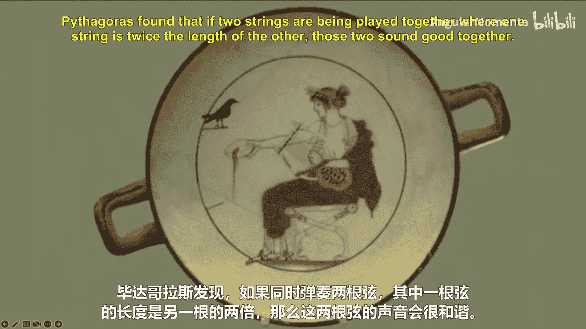

这以毫秒级的精度告诉我们，大脑对西方音乐中的语法规则非常敏感。那么，下一个问题是：这种知识从何而来？

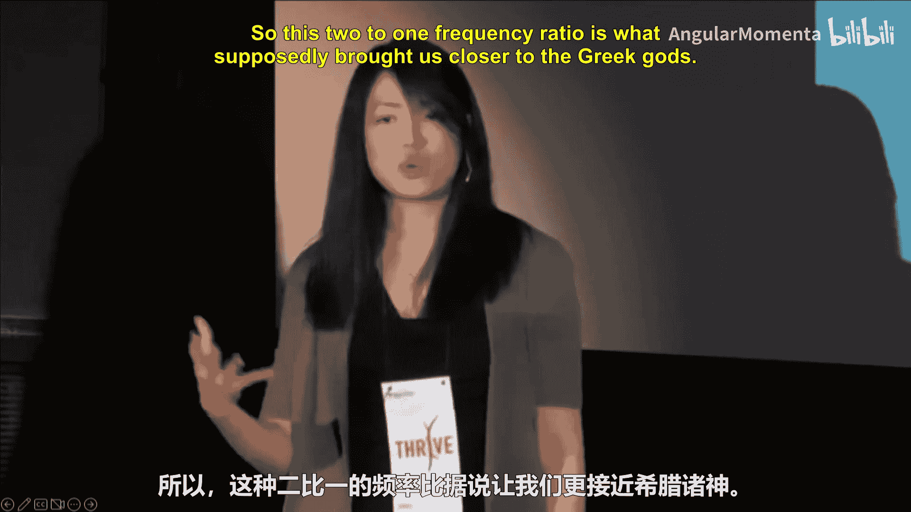

---

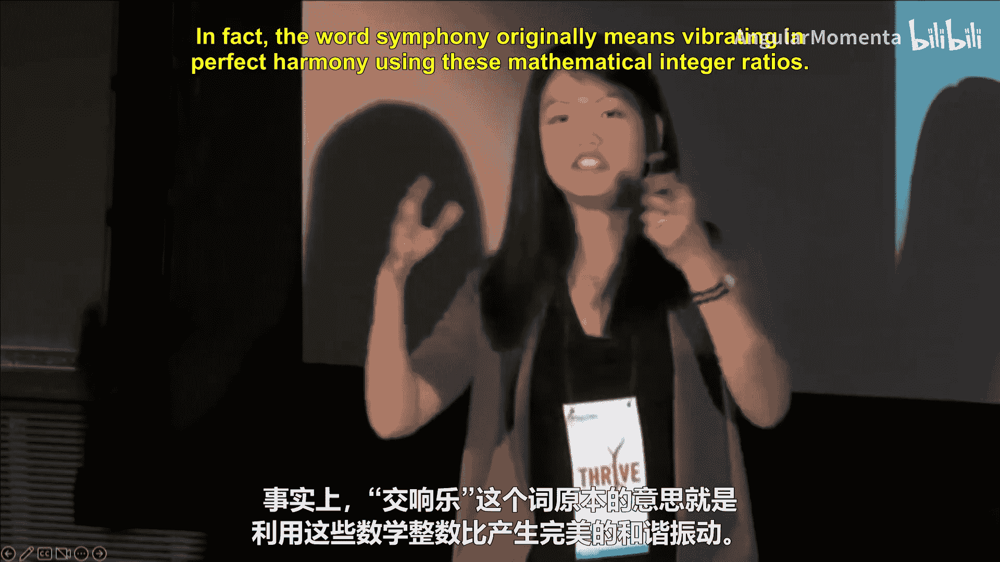

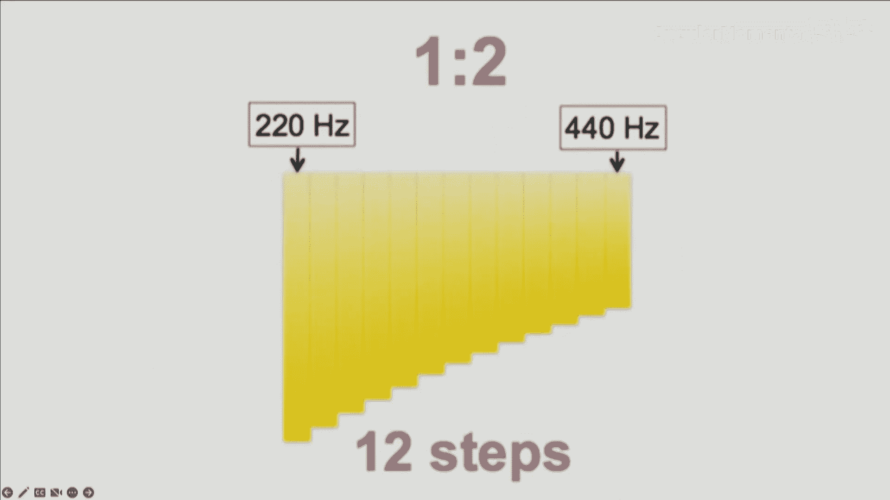

## 音乐知识的起源：从古希腊到现代

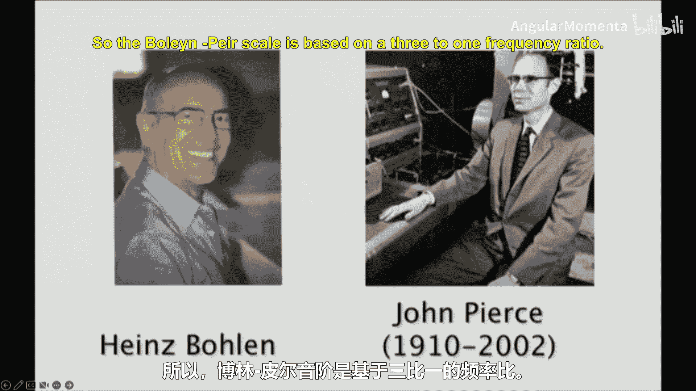

要回答知识从何而来的问题，我们需要回溯到古希腊时期。毕达哥拉斯发现，当两根弦同时振动，且一根弦的长度是另一根的两倍时，它们发出的声音和谐悦耳。

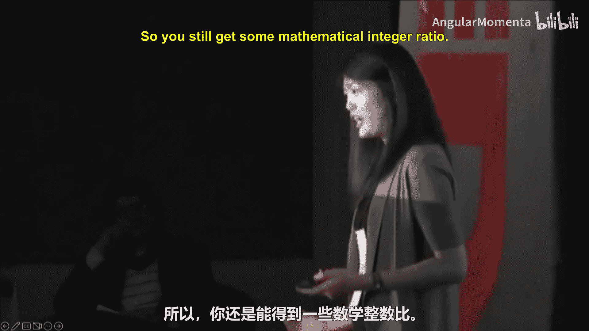

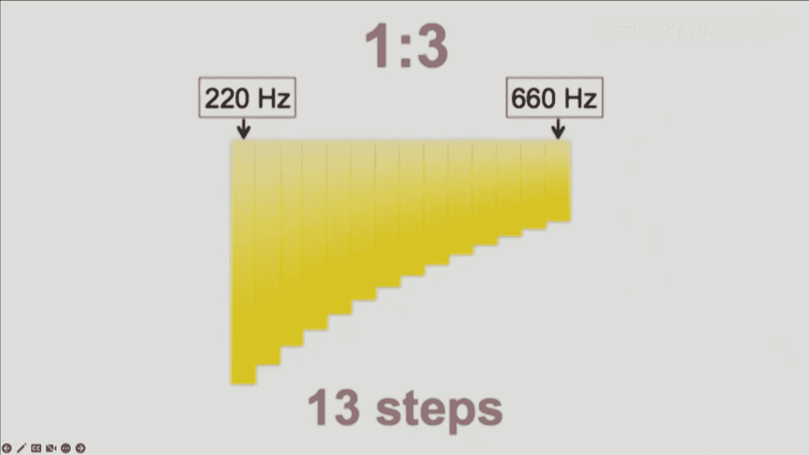

**公式**：`频率比 = 2 : 1`


这种2:1的频率比被认为是协和的，并在世界各地的音乐中普遍存在。然而，不同的文化以不同的方式划分这个八度音程。

我们的文化，即十二平均律，将八度划分为12个等比的半音。

其他文化则有不同的划分方式。例如，鲍尔和皮尔音阶基于3:1的频率比，并在其中进行了13个对数划分。

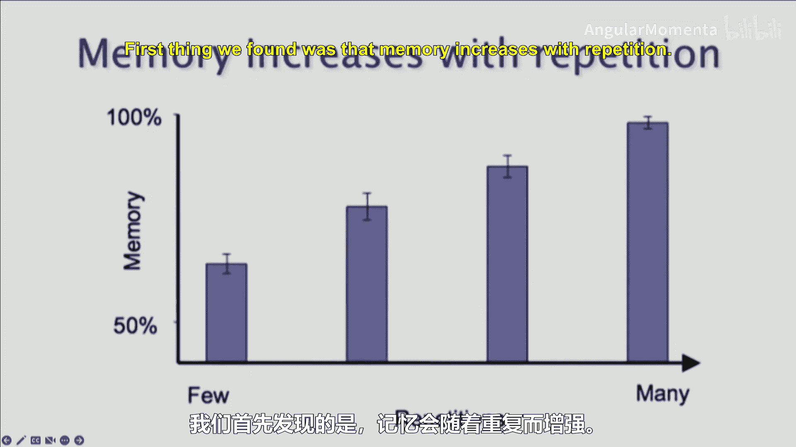

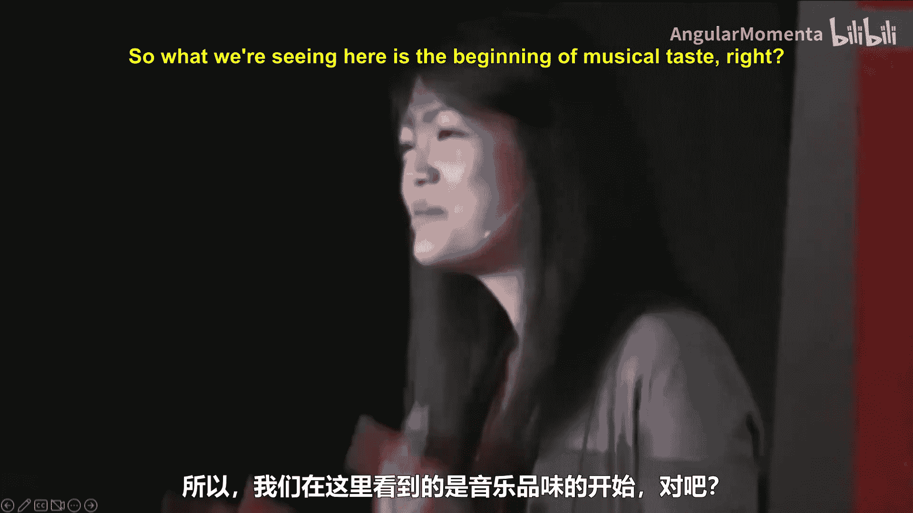

**代码示例（概念性描述）**：
```
西方十二平均律： 八度 = 2^(1/12) 的12次幂
鲍尔和皮尔音阶： 八度 = 3^(1/13) 的13次幂
```

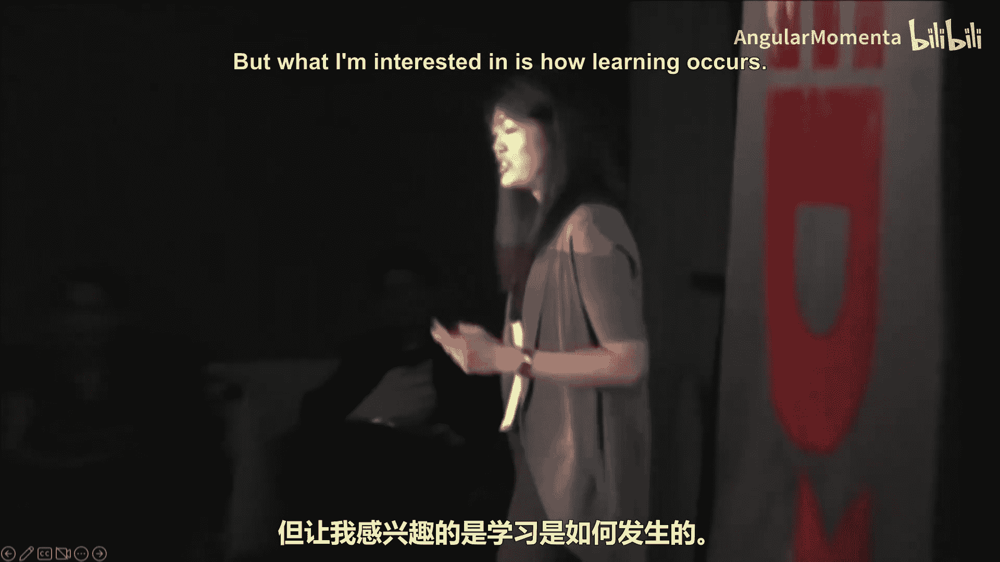

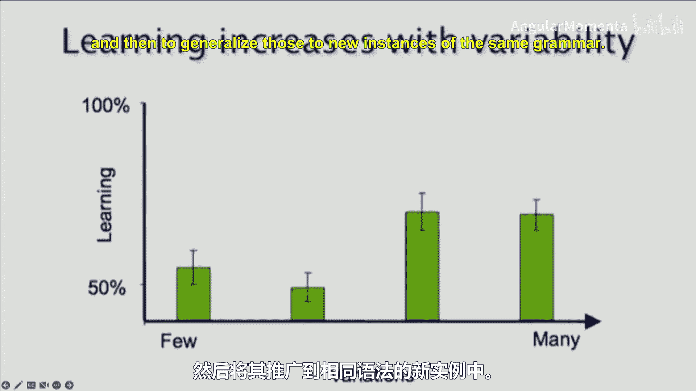

这两种音阶听起来完全不同。这为我们提供了一个强大的实验方法：在实验室中，让人们接触他们从未听过的音乐系统（如鲍尔和皮尔音阶），然后研究他们如何学习其中的规则。

---

## 学习新音乐系统：重复与变奏

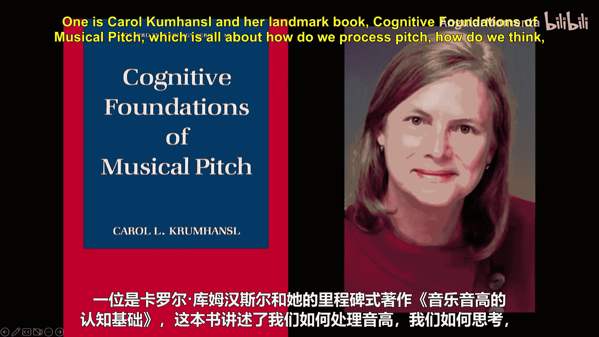

以下是研究新音乐学习的方法。我们让受试者聆听由史蒂芬·易创作的、基于鲍尔和皮尔音阶的乐曲片段约一分钟，以感受这种陌生的音乐体验。

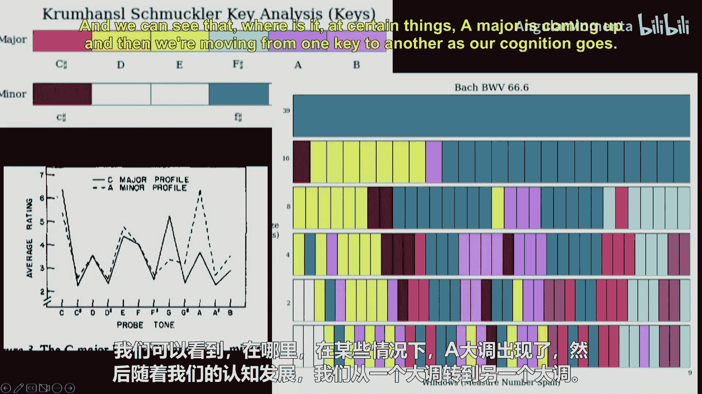

在实验室中，我们让受试者聆听根据特定语法规则生成的、严格控制的新旋律约半小时。

然后，我们研究人们能从这种新体验中学到什么。研究发现：
*   **记忆随重复而增强**。
*   **偏好也随重复而增强**。这实际上是音乐品味的开端：听得越多，就越可能喜欢它。

然而，关于学习过程，更关键的发现是：
*   **学习并非通过简单重复发生，而是通过变奏发生**。换言之，用越多不同的方式呈现相同规则，人们就越能推断出底层结构，并将其推广到同一语法的新实例中。

---

## 音乐认知领域的核心人物与未来方向

我们的问题随之深入。在接下来的课程中，我们将主要关注两位音乐认知领域的核心人物及其工作。

首先是**卡罗尔·克鲁姆汉斯尔**和她里程碑式的著作《音乐音高的认知基础》。该书探讨我们如何处理音高、如何对其进行心理表征，这不仅是音乐认知的基石，也为最广泛使用的调性检测算法提供了理论基础。

例如，分析巴赫的康塔塔（BWV 66.6）时，我们可以观察随着聆听时间（记忆量）的变化，我们对调性的感知如何从A大调转移到其他调性。

第二位重要人物是**大卫·休伦**，他的著作《甜蜜的期待：音乐与期待心理学》堪称经典。书中汇集了音乐认知领域的众多重要研究。

其中一个著名实验比较了巴厘岛音乐家和美国音乐家对巴厘岛旋律的期待。当听到传统巴厘岛旋律时，巴厘岛音乐家对下一个音高的走向非常确定（不确定性低），而旋律转向非传统方向时，他们的不确定性则会上升。

我们也将简要探讨节奏认知。例如，研究如何通过三角图来可视化三个音符的时长比例，以及认知实验如何揭示人们感知的节奏区域与数学精确比例之间的差异。这种研究对生成听起来更自然、而非机械化的音乐节奏很有帮助。

最后，也是休伦著作的核心，是研究**期待、预期与惊喜**。例如，在彼得·席克勒（P.D.Q. Bach）的幽默作品中，通过打破音乐预期来制造喜剧效果，听众的笑声正体现了对音乐期待的违反所带来的认知反应。

---


## 总结与预告

本节课中，我们一起学习了音乐认知的入门知识。我们了解到大脑能以极高的时间精度检测音乐中的语法违反，这种音乐知识源于文化习得。通过接触如鲍尔和皮尔音阶等新系统，我们研究了音乐学习如何通过变奏而非简单重复发生。最后，我们介绍了卡罗尔·克鲁姆汉斯尔和大卫·休伦两位学者的核心贡献，涉及调性感知、节奏认知及音乐期待理论。


为了让大家获得更专业的见解，下节课我们将有幸邀请到两位该领域的专家进行分享：来自佐治亚理工学院的**克莱尔·亚瑟**和来自纽约大学音乐与音频研究实验室的**克莱尔·佩洛菲**。她们将从各自的研究角度，带领我们更深入地探索音乐认知的世界。