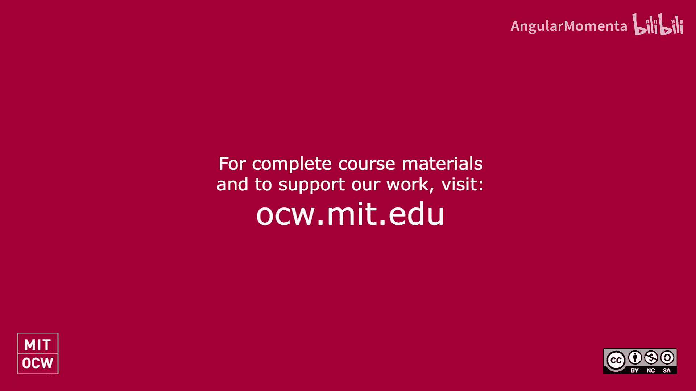

#  034：嘉宾讲座内容简介 🎵

在本节课中，我们将了解课程第18至21节视频内容缺失的原因，并概述这些课程原本计划涵盖的核心主题：音乐认知与算法作曲的历史。这些内容对于理解计算音乐学的应用与哲学基础至关重要。

## 课程视频缺失说明

大家好，我是Cuthbert教授。接下来的两节课程视频未在本站点提供，我需要对此进行说明。

麻省理工学院音乐系在那学期有幸招聘计算音乐学领域的新教授。我们系非常重视教师的教学能力，因此作为面试环节的一部分，候选人需要接管本课程（21M.383）中的一节课进行教学，内容涉及课程本身及其专业领域。

两位候选人的表现都非常出色。然而，我们认为，在面试过程中，既要接受现场评估，又要知道自己在陌生课堂面对陌生学生的教学视频将被公开，这会给候选人带来过大压力。因此，我们决定不公开这些视频。

## 第一场讲座：音乐认知与计算 🧠

上一节我们介绍了课程背景，本节中我们来看看第一场嘉宾讲座的核心内容。该讲座延续了关于音乐认知与计算的系列主题，探讨计算机如何辅助我们理解大脑处理音乐的过程，以及历史上和未来音乐认知的见解如何改进我们的计算机工作。

该领域最重要的例子是**Carol Krumhansl**的探针音实验，这些实验帮助我们理解音阶与调性中每个音符如何影响我们的音乐预期。这些研究成果构成了当今许多计算机自动检测作品调性算法的基础，其中包括Music21库默认的`analyze()`方法。这也解释了为何关于调性分析的作业与认知科学章节紧密相连。

讲座还涵盖并讨论了David Huron在其著作《Sweet Anticipation》中报告的一些实验，学生们被要求阅读相关章节。

作为本场讲座内容的替代，我强烈建议你深入阅读David Huron的这本著作。David Huron是音乐认知领域的杰出专家，也是计算音乐理论与音乐学领域的奠基人之一。阅读他的著作能让你很好地把握讲座的大部分内容。此外，讲座也涉及了演讲者自身的专业特长。

## 第二场讲座：算法作曲的历史 📜

接下来，我们转向第二场讲座。该讲座涵盖了算法作曲的历史，从其开端（甚至在计算机出现之前）直至今日。

讲座的核心阅读材料是关于**《伊利亚克组曲》**的文献，这是最早由计算机使用算法生成音符创作的作品之一。内容从那时起一直延伸到当今人工智能的进展，例如Google的Anna Huang等人开发的Music Transformer等新技术。

从更广阔的历史视角审视算法作曲至关重要。否则，我们很容易陷入当今的特定问题而无法自拔：我们越来越接近让计算机创作出听起来像特定作曲家风格的作品。但如果不问“我们为何要关心这个？”、“为何要让计算机以巴赫的风格创作新曲？”，那么除非你已经听遍了巴赫的所有作品并感到厌倦，否则这种努力的意义并不明确。而大多数人并未穷尽现有作品。

回顾早期历史，当让计算机达到那种复杂程度的创作还遥不可及时，审视人们当时想用计算机做什么，这有助于回答根本性问题：计算机如何能用于产生创意，或帮助我将那些需要太长时间才能独自生成的创意实现得更高效？它如何能成为一个工具，帮助我成为更好的**人类**作曲家，或者仅仅是更好的**人**？

以下是讲座涵盖的部分关键历史节点：
*   从11世纪的修士**Guido of Arezzo**的早期算法创作思想。
*   到莫扎特的音乐骰子游戏。
*   再到《伊利亚克组曲》及之后的發展。

本课程其他未向今年学生展示但可供你观看的配套视频中，也涉及了部分内容。讲座的其他方面则触及了嘉宾演讲者的专业特长，这些内容的引入非常有价值。

## 学生项目与课程调整

学生们随后继续进行了算法作曲实践。他们出色地避免了让计算机去做我们人类已经做得更好、或者我们对其输出并不真正感兴趣的事情。相反，他们超越了这一点，创作出了本身很有趣、且人类永远不会选择去写的音乐作品。

除了由求职候选人主讲的两节课外，同期还有另外两节课的内容被移除并整合到了其他课程中。这是因为麻省理工学院当时正在向全体教员提议设立两个新的音乐技术与计算硕士项目，相关工作与本节课的时间发生了冲突。如果你对本课程感兴趣并希望继续深造，可以关注这些项目，预计在这些视频发布时项目已启动。

## 总结与结语

本节课中我们一起学习了第18至21节视频内容缺失的原因，并概述了这两场重要讲座的核心主题：**音乐认知**如何为计算音乐分析（如调性检测）提供理论基础，以及**算法作曲的历史**如何启发我们思考计算机在音乐创作中的辅助角色与价值。

对于公开课的学习者，这就是我所能提供的关于这几节课的全部信息。除了在课程最后，我还有一个当时录制给大家的简短寄语。

谢谢。