#  035：根音相关问题 🎵


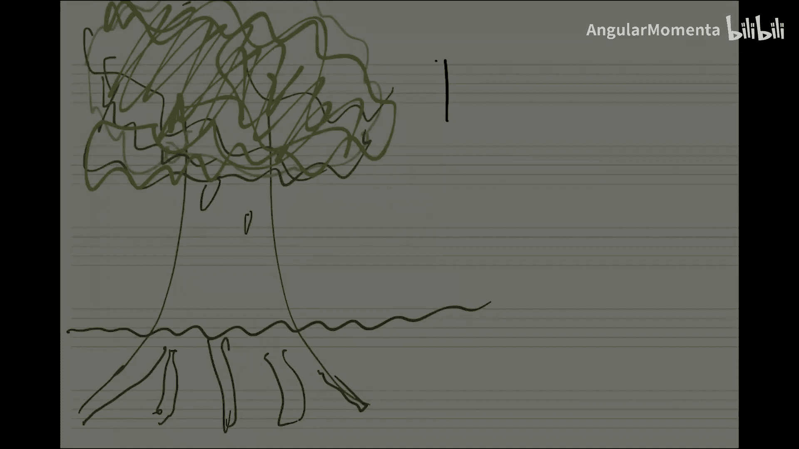

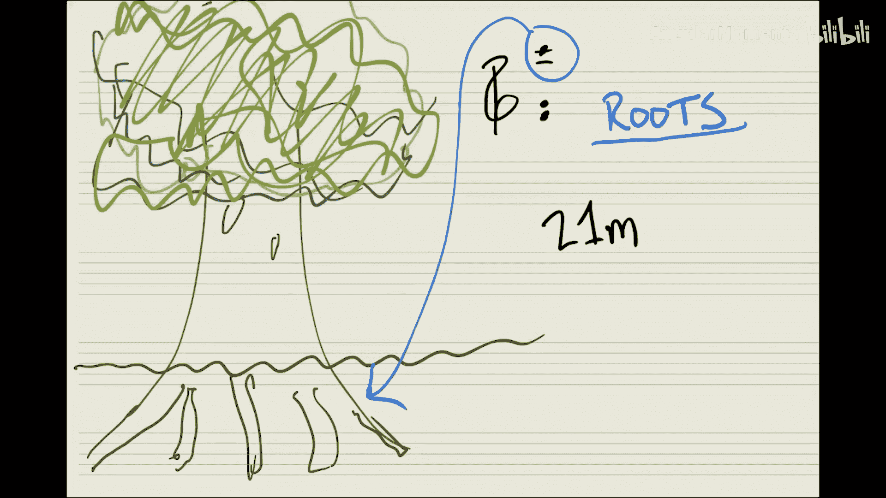

在本节课中，我们将复习和弦的基本操作，并深入探讨一个特殊且有趣的话题：13和弦的根音确定问题。我们将使用 `music21` 库中的 `Chord` 类进行演示，并通过分析本杰明·布里顿歌剧《彼得·格莱姆斯》中的一个片段，来理解当和弦音程结构变得复杂时，计算根音所面临的挑战。

## 和弦基础操作复习 🎹

上一节我们介绍了和弦的基本概念，本节中我们来看看如何在 `music21` 中创建和操作和弦。

我们可以通过多种方式创建一个和弦。以下是几种常见的方法：

```python
from music21 import chord, pitch

# 方法1：使用字符串列表
c_major_1 = chord.Chord(['C4', 'E4', 'G4'])

# 方法2：使用空格分隔的字符串
c_major_2 = chord.Chord('C4 E4 G4')

# 方法3：使用预先创建的 Pitch 对象列表
c4 = pitch.Pitch('C4')
e4 = pitch.Pitch('E4')
g4 = pitch.Pitch('G4')
c_major_3 = chord.Chord([c4, e4, g4])
```

创建和弦后，我们可以获取其根音和低音。对于原位和弦，两者是相同的。

```python
print(c_major_1.root())  # 输出根音：C4
print(c_major_1.bass())  # 输出低音：C4
```

接下来，我们创建一个第一转位的C大六和弦（C major 6）。

```python
c_major_6 = chord.Chord(['E4', 'C5', 'G5'])
print(c_major_6.root())  # 根音仍然是 C
print(c_major_6.bass())  # 低音变为 E
print(c_major_6.inversion())  # 转位为 1
```

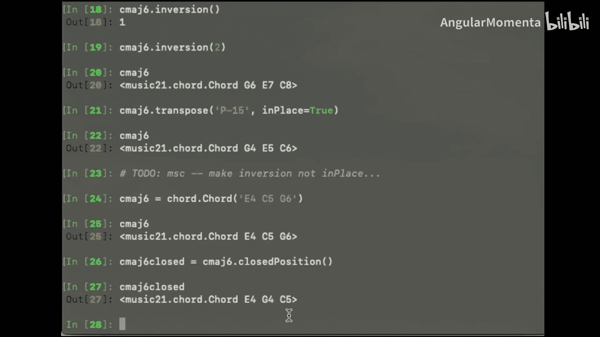

我们可以使用 `.closedPosition()` 方法将开放排列的和弦转换为密集排列。

```python
c_major_6_closed = c_major_6.closedPosition()
print(c_major_6_closed)  # 和弦音高会重新排列到同一个八度内
```

## 根音查找算法 🔍

在之前的作业中，你们已经尝试实现过查找根音的算法。其核心思想通常是将和弦的所有音符规整到同一个八度内，然后尝试不同的排列组合，寻找一个由**纯三度堆叠**构成的形态。在这种形态中，最低的音符即为根音。

以下是查找根音的逻辑步骤：

1.  **规整八度**：将所有音符映射到同一个八度内（例如，都移到C4附近）。
2.  **尝试排列**：对规整后的音符集合进行不同顺序的排列。
3.  **匹配模板**：检查每种排列是否构成纯三度堆叠（例如，C-E-G， E-G-B等）。
4.  **确定根音**：找到符合三度堆叠的排列后，该排列的最低音即为根音。

这种方法对于三和弦、七和弦乃至九和弦通常都有效。

## 13和弦的挑战：以《彼得·格莱姆斯》为例 🎻

现在，让我们来看一个更复杂的案例，它挑战了我们关于根音的常规认知。这个例子来自本杰明·布里顿1945年的歌剧《彼得·格莱姆斯》。

在歌剧结尾，主角彼得·格莱姆斯精神失常，驾船出海自溺。伴奏音乐中，竖琴演奏了一个分解和弦：**F, A, C, E, G, B♭, D**。

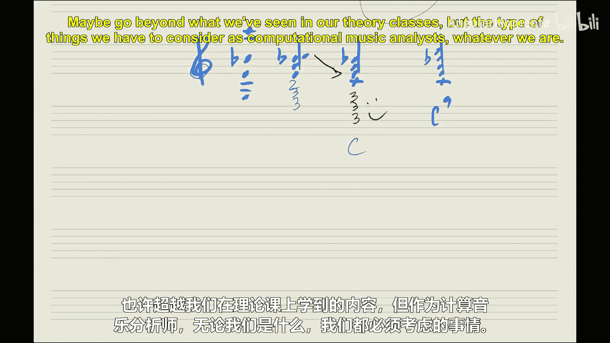

如果我们将所有这些音符堆叠起来，会得到一个完整的 **F13** 和弦（F, A, C, E, G, B♭, D）。按照三度堆叠原则，根音显然是 **F**。

然而，有趣的事情发生了。如果我们从这个和弦中取出不同的音作为低音，并重新排列其余的音符，它们**同样**可以构成由纯三度堆叠的和弦形态。

*   以 **A** 为最低音排列：A, C, E, G, B♭, D, F → 这是一个 **A13** 和弦的第一转位。
*   以 **C** 为最低音排列：C, E, G, B♭, D, F, A → 这是一个 **C13** 和弦的第二转位。


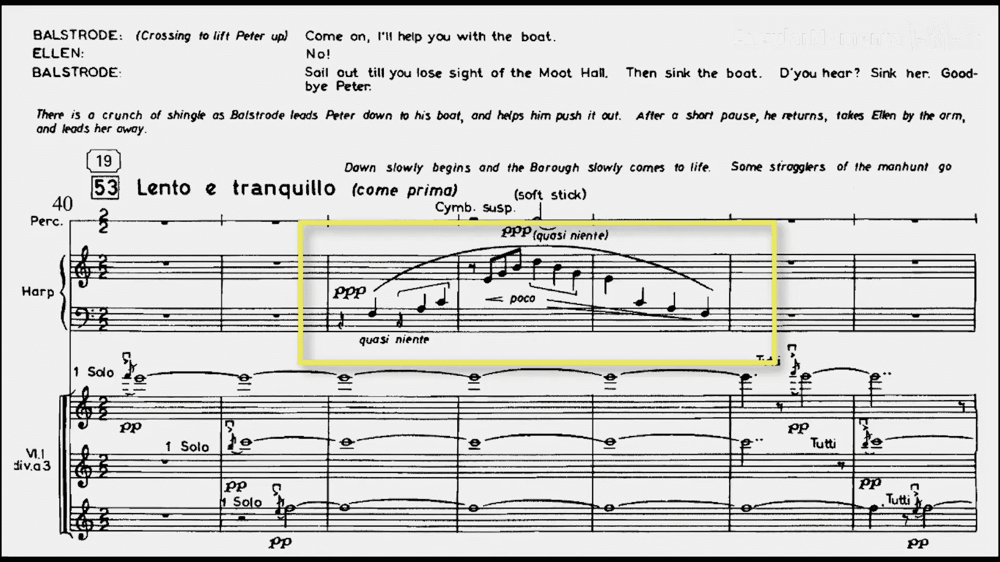

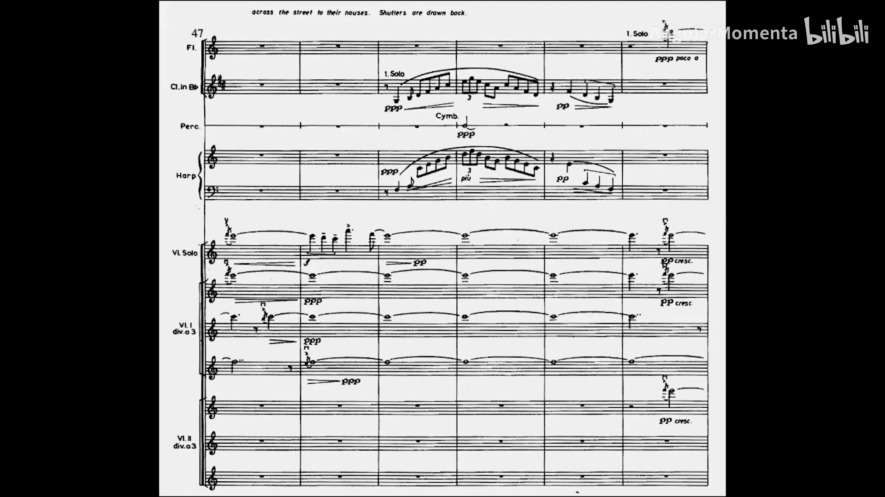

这意味着，同一个音符集合，根据我们选择的“根音”视角，可以被解释为F13、A13或C13和弦的不同转位。这在传统的和声分析中是一个模糊地带。

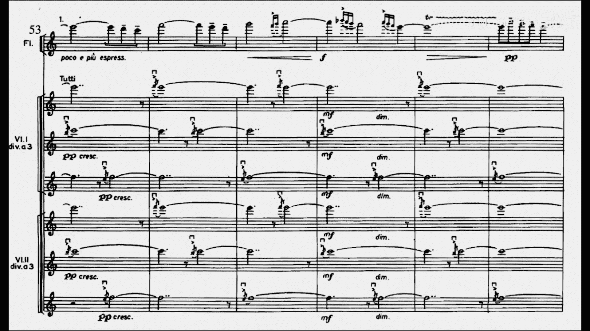

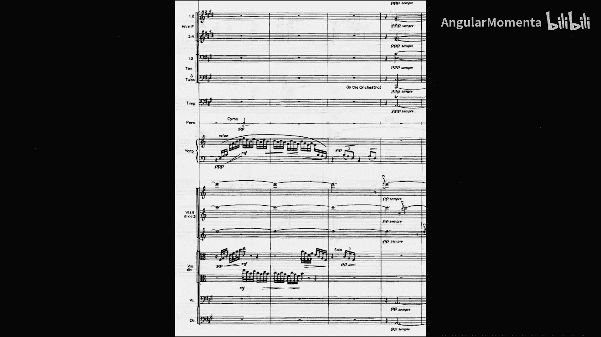

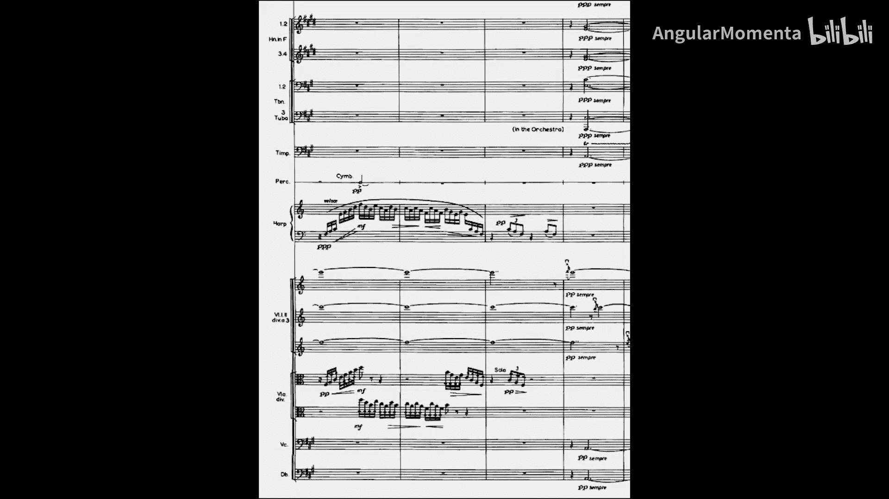

## 在 `music21` 中处理13和弦 💻

让我们在 `music21` 中验证这一现象。首先创建一个F11和弦（省略13音D）。

```python
f11 = chord.Chord(['F3', 'A3', 'C4', 'E4', 'G4', 'B-4'])
print(f11.root())  # 输出: F3
print(f11.inversion()) # 输出: 0 (原位)
```

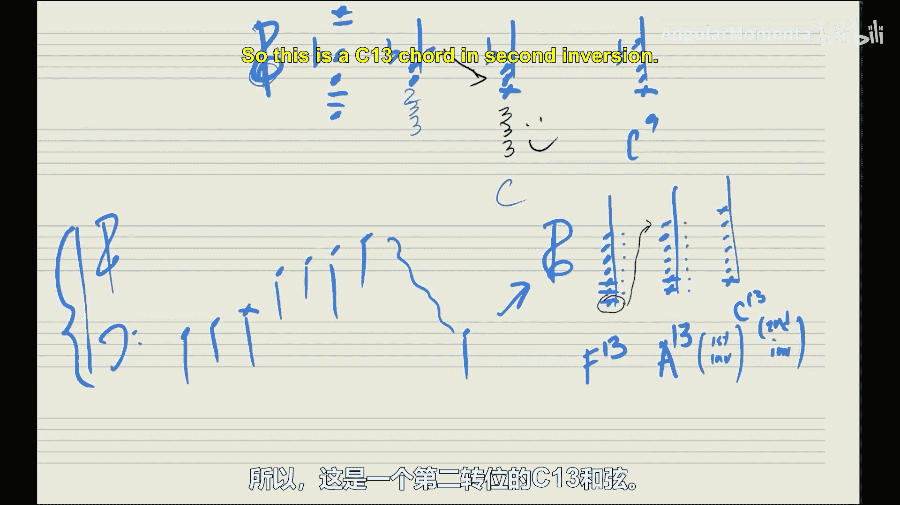

现在，我们将B♭置于低音部，创建一个转位和弦。

```python
f11_inv = chord.Chord(['B-2', 'F3', 'A3', 'C4', 'E4', 'G4'])
print(f11_inv.root())  # 输出: F3 (根音不变)
print(f11_inv.inversion()) # 输出: 5 (第十一转位)
```

最后，我们创建包含所有音的F13和弦，并同样将B♭置于低音。

```python
f13 = chord.Chord(['B-2', 'F3', 'A3', 'C4', 'E4', 'G4', 'D5'])
print(f13.root())  # 注意：这里输出 B-2！
print(f13.inversion()) # 输出: 0 (被处理为原位)
```

这里出现了一个关键点：在 `music21` 的当前实现中，对于13和弦这种极其复杂的和弦，其 `.root()` 方法可能会直接返回低音（`bass`），而不是通过三度堆叠算法计算出的理论根音。开发者这样做是为了避免程序在分析某些高度不协和或模糊的和弦时崩溃。这揭示了计算音乐理论中的一个实际问题：算法需要处理音乐实践中所有的边缘情况和模糊性。

## 总结 📚

本节课中我们一起学习了：
1.  在 `music21` 中创建和操作和弦的多种方法。
2.  根音查找算法的基本逻辑：规整八度、排列尝试、匹配三度堆叠模板。
3.  通过本杰明·布里顿《彼得·格莱姆斯》中的实例，探讨了13和弦带来的根音模糊性问题。同一个音符集合可能对应多个合理的根音解释。
4.  了解了 `music21` 在处理极端复杂的13和弦时采取的策略，这体现了计算音乐学在将理论规则转化为稳定代码时所面临的现实挑战。

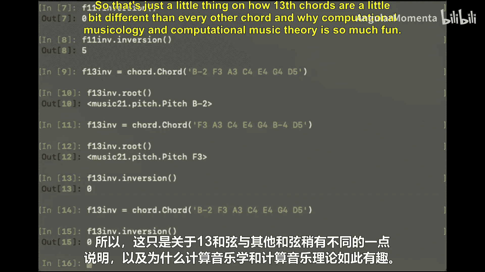

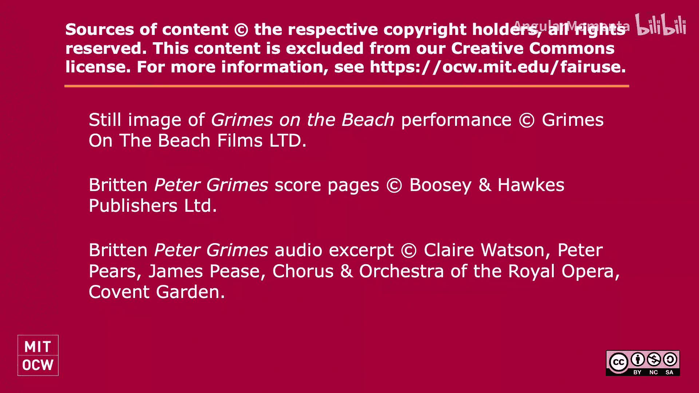

这个例子完美地说明了为什么计算音乐理论如此有趣：它迫使我们去精确地定义那些在传统音乐分析中可能被视为“例外”或“模糊”的概念，并在计算机逻辑中妥善地处理它们。