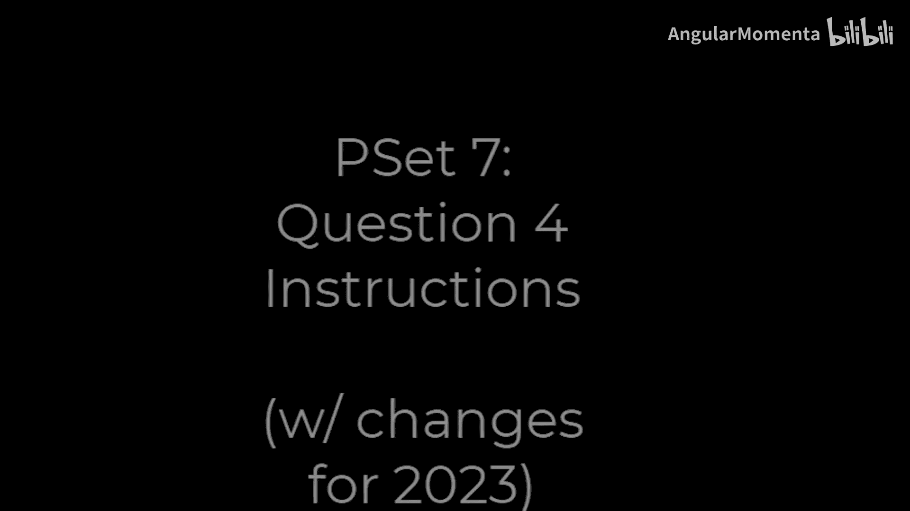
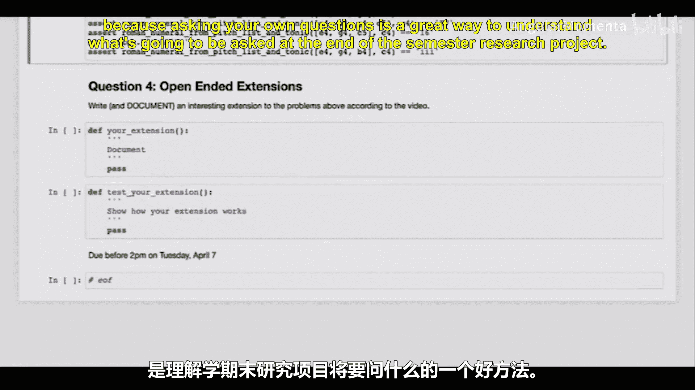

#  036：音阶、和弦与罗马数字的运用与创作 🎵

在本节课中，我们将学习如何超越基础练习，运用想象力来扩展音阶、和弦与罗马数字的应用。我们将探讨小调音阶、更复杂的和弦类型，并思考如何将分析符号系统应用于更广泛的音乐风格中。

---

到目前为止，你一直在完成我要求你做的练习。现在，是时候展示你的想象力了。你可能已经注意到，我们之前只使用了大三和弦、大调音阶以及类似的内容。但我们还能做些什么呢？

我们可以思考另一个重要的音阶体系：**小调音阶**。需要记住的是，小调音阶不止一种形式，至少包括**自然小调**、**和声小调**和**旋律小调**。请思考一下，这三种形式中，哪一种最适合用来书写罗马数字和声？

没错，是**和声小调**形式。这将是你在本部分需要重点思考的内容。

---

接下来，我们为什么要局限于三和弦呢？为什么不能使用七和弦、九和弦、十一和弦或其他类型的和弦？这样我们就需要考虑像 `V7`、`vii°7`、`iiø7` 或 `IV6/4` 这样的罗马数字标记。

与此同时，我们为什么认为所有和弦都必须属于正在演奏的音阶呢？为什么我们不能在C大调中标记一个从 `Eb`、`G`、`Bb` 开始的大三和弦（即 `bIII` 和弦）？对于上过302、303或304课程的同学，何不考虑**副属和弦**？或者思考一下**那不勒斯和弦**或**增六和弦**？你能标记一个法国增六和弦（`Fr+6`）吗？

---

此外，我们为什么要局限于音乐分析中常用的和弦标记，如罗马数字？为什么不考虑在爵士和流行音乐中人们经常使用的和弦标记？例如，用 `Cm` 表示C小调和弦，或用 `Csus4` 表示特定的挂留和弦。如果你知道如何使用爵士和弦符号，为什么不使用它们呢？

如果你学习过巴洛克音乐或中世纪与文艺复兴音乐，你可能会想到**数字低音符号**。它们本身就是一个全新的世界。

---

这应该只是你想象力创造的开始。

因此，对于本作业的最后一部分，我希望你进行一次开放式的扩展。你需要撰写并详细记录一份非常重要的文档：根据你在视频中所见，对上述问题进行一次有趣的扩展。

你可以随意命名你的扩展项目，并对其进行测试。向我展示你真正理解了你的扩展项目应该做什么，以及你能用它做什么。

你需要完成所有这些，但不要花费过多时间，也要投入足够的时间，因为提出自己的问题是理解学期末研究项目要求的好方法。

---

本节课中，我们一起学习了如何将和声分析从基础的大调三和弦扩展到小调音阶（尤其是和声小调）、更复杂的和弦结构（如七和弦），以及不同的和弦标记系统（如爵士符号或数字低音）。关键在于运用想象力，探索音乐分析的多种可能性，并为更深入的研究项目做好准备。