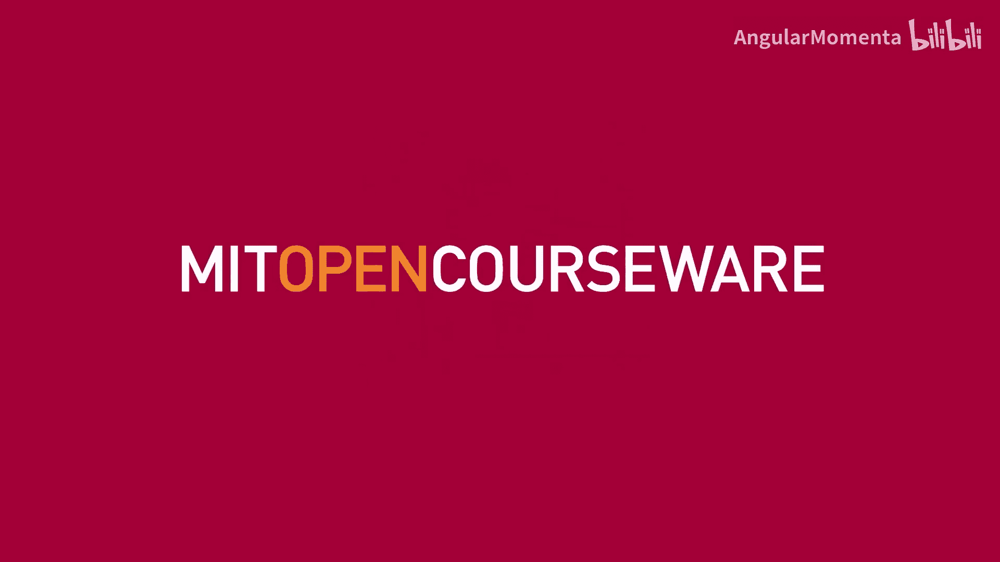
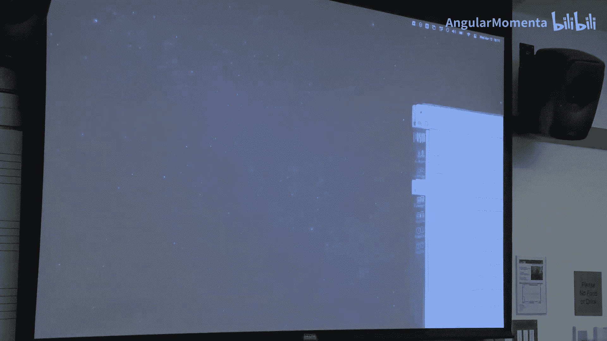
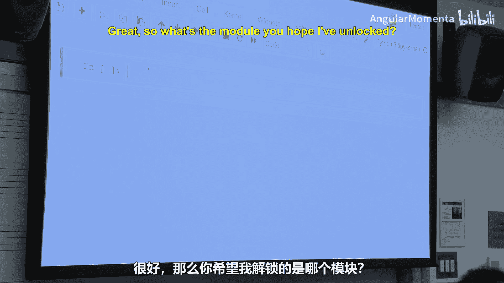
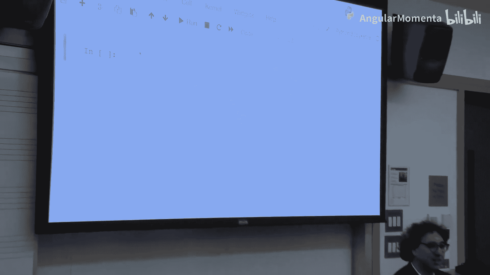
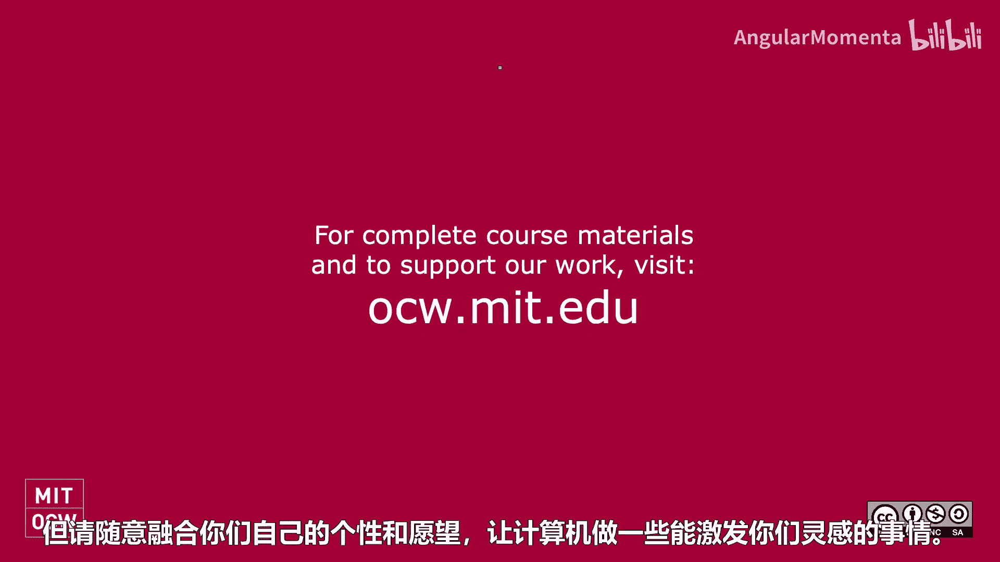

#  038：算法作曲 🎵

在本节课中，我们将学习算法作曲的核心概念，包括确定性与非确定性方法，并通过实际编程练习来探索如何创建简单的随机音乐。我们还将讨论期末项目的相关要求。

---

## 期末项目概述 📋

首先，我们将介绍本课程的期末项目。你需要找到一位合作伙伴，组成两人小组。如果人数为奇数，可以组成一个三人小组，但两人小组通常效果更好。从下周开始，你们将合作完成一个项目。

项目主题可以是任何与符号域音乐理论和分析相关的内容。这意味着主要处理音符和乐谱，而非音频或其他形式。如果你对音频处理感兴趣，可以选修Orgozi的精彩课程，在那里你可以完成出色的音频项目。

项目类型可以是研究型问题、商业开发或创业型问题，也可以是创意项目。学期初我曾提到，唯一的限制是项目必须主要基于符号处理。对于创意项目，我不希望它基于深度学习或人工智能。过去我曾允许这样做，但效果不佳。我们将在后续课程中专门讨论人工智能主题，届时我会详细解释为什么这类项目往往难以成功。

---

## 算法作曲的分类 🔄

上一节我们介绍了期末项目。本节中，我们来看看算法作曲的两种主要分类方式。

我们可以从两个维度来区分算法作曲。第一个维度是作品是确定性的还是包含随机性。这决定了每次运行或演奏作品时，结果是相同的还是不同的。

---

## 确定性作曲示例：相位音乐 🎼

我们将从一个确定性作品的例子开始。这个例子灵感来自物理课上常见的钟摆演示，所有钟摆以不同长度摆动，但会在特定时刻产生有趣的视觉效果。

我思考的问题是：能否创建一个音乐版本？能否编写一个计算机程序，生成12条或8条旋律线，它们开始时同步，然后逐渐失步，最后再次同步，就像钟摆一样？

以下是我实现的一个简单版本。程序设置每个音符比前一个音符稍晚出现。那么，作曲家在创作中能控制哪些元素呢？

以下是作曲家可以控制的一些方面：
*   **音高选择**：决定使用哪些音符。例如，可以使用八度内的8个音，也可以使用全部12个音。
*   **作品时长**：控制作品的总体长度和速度。
*   **乐器选择**：决定使用何种乐器或音色。
*   **音阶体系**：甚至可以尝试人类通常无法在钢琴上演奏的非常规音阶，例如19平均律。

---

## 非确定性作曲：引入随机性 🎲

上一节我们看了一个确定性作品的例子。本节中，我们开始探索包含随机性的非确定性作曲。

我们将首先编写一些代码。为了进行非确定性作曲，我们需要使用Python的`random`模块，它不属于Music21。

以下是`random`模块的一些基本功能：
*   `random.random()`：生成一个0到1之间的随机浮点数。
*   `random.randint(1, 100)`：生成一个1到100之间的随机整数（包括100）。
*   `random.choice()`：从列表中随机选择一个元素。
*   通过将元素多次放入列表，可以实现加权随机选择。

在音乐中，我们还可以设置一个确定性种子。这样，初始时是随机的，但如果你特别喜欢某个结果，可以通过种子重建它，直到你不喜欢的部分。

---

## 构建随机漫步作曲 🚶‍♂️

现在，让我们编写一个“随机漫步”作曲程序。我们将从一个简单的版本开始，然后逐步改进。

首先，创建一个辅助函数来同时显示乐谱和播放音乐。然后，我们将利用“全音音级编号”这个概念。在MIDI中，中央C被任意指定为编号60。在全音音级编号系统中，所有C音（包括C、升C等）都被赋予相同的编号，这有助于编写调性音乐，因为你可以直接操作音级编号而不必担心音名变化。

在Music21中操作对象时，经常需要进行复制。浅拷贝会共享内部对象（如音高或时长），而深拷贝会创建完全独立的新对象。当你需要基于之前的音乐材料进行修改并添加新内容时，通常需要使用深拷贝。

我们的第一个版本将简单地生成30个随机音符，从C4开始，每个后续音符随机向上或向下移动一步。结果可能听起来比较单调。

---

## 改进随机漫步作曲 ✨

我们生成的第一个版本音乐性不强。让我们尝试一些改进。

首先，我们可以改进节奏。让每个音符的时长随机选择为二分音符、四分音符或八分音符。这已经让音乐听起来好一些了。

其次，改进音高移动。除了上下一步，我们还可以加入三度移动。我们可以尝试使用加权概率，让级进进行（一步移动）的概率更高。我们还可以降低停留在相同音高上的权重。

第三，改进节奏与节拍的关系。我们希望强拍上的音符更常见。我们可以通过跟踪当前的偏移量来实现。在4/4拍中，偏移量为0、4、8等的位置是强拍。我们可以检查当前偏移量除以4的余数是否为0。如果不在强拍上，我们可以让节奏保持与上一个音符相同，从而增加音乐的统一性。

还可以考虑加入和声，或者偶尔允许程序打破既定规则，以增加趣味性和人性化。你也可以尝试使用非常规音阶来获得更实验性的声音。

---

## 作业：问题集与算法作曲创作 🧑‍💻

我们一直在构建的算法作曲练习将引向你们的作业。问题集7（实际上是第8个问题集）将包含两部分。

第一部分要求你们编写一个罗马数字分析器，仅针对大调中的三和弦块。我们会给你三个音符，你需要判断出对应的罗马数字。如果你对罗马数字分析生疏了，请与同学合作讨论。

第二部分是一个开放式任务，你可以进行扩展。例如，让它适用于小调、处理七和弦，或者为爵士和流行音乐分析和弦符号。

最后，也是主要的部分，是创作一个你喜欢的算法作曲作品。它可以是多声部的，也可以是单声部的；可以包含和弦，也可以不包含。关键是要融入一些有趣的音乐理论思想。我们课上构建的例子只是一个起点（可能只够D-或D），请尝试做得更好。作品时长请控制在一分钟左右，以便于审听。

---

## 个人作品示例：基于马尔可夫链的作曲 🎹

我将分享我的一个早期算法作曲作品，它被演奏过。这首作品是为“Bang on the can All Stars”乐团创作的，基于马尔可夫链。

我想要一种听起来有点普通但带有奇怪“凸起”的旋律，比如开头的三全音和一些特殊乐句。这些元素会重复出现，成为作品的标志。在深度学习普及之前，我使用概率论和马尔可夫链来让计算机处理这些素材。

我特别想要一些像老式唱片卡住一样不断循环的部分。这意味着，当到达音符A时，给定A再出现A的概率非常高（例如0.9），计算机会卡在这个循环里。

我的工作流程是生成大量旋律，然后从中挑选我喜欢的。作品中还有一个速度变化的彩蛋：从每秒1拍开始，逐渐加速到1.5拍、2拍、3拍、4拍，最后一个不协和音以每秒5拍振动。

在作品首演时，我还为每位观众准备了不同的节目单。节目单开头是“作品的开头相当直接”，然后我写了大约10页的节目单说明，每位观众得到的是基于马尔可夫链生成的不同版本，但总是以“无论他们拥有什么，都带着一丝秩序”结尾。

---

## 总结 📝

本节课我们一起学习了算法作曲的基本概念。我们区分了确定性与非确定性作曲，并通过编写“随机漫步”程序实践了非确定性创作，逐步改进其音高、节奏和节拍处理以增强音乐性。我们还讨论了期末项目的要求，并分析了一个基于马尔可夫链的个人创作实例。

请记住，在你们的算法作曲作业中，自由地混合个人的音乐品味和创意，让计算机生成一些能够激发灵感的内容。