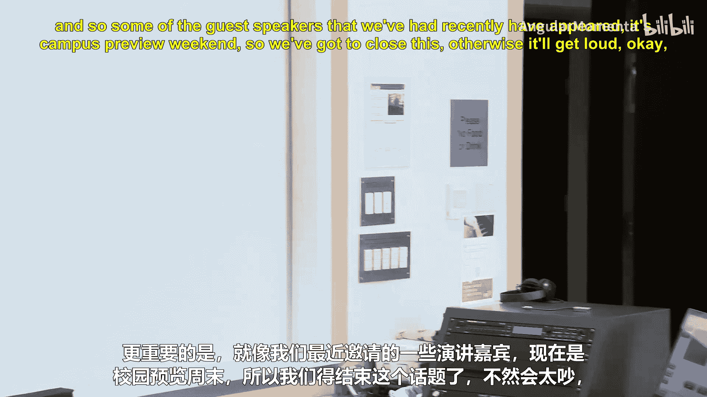
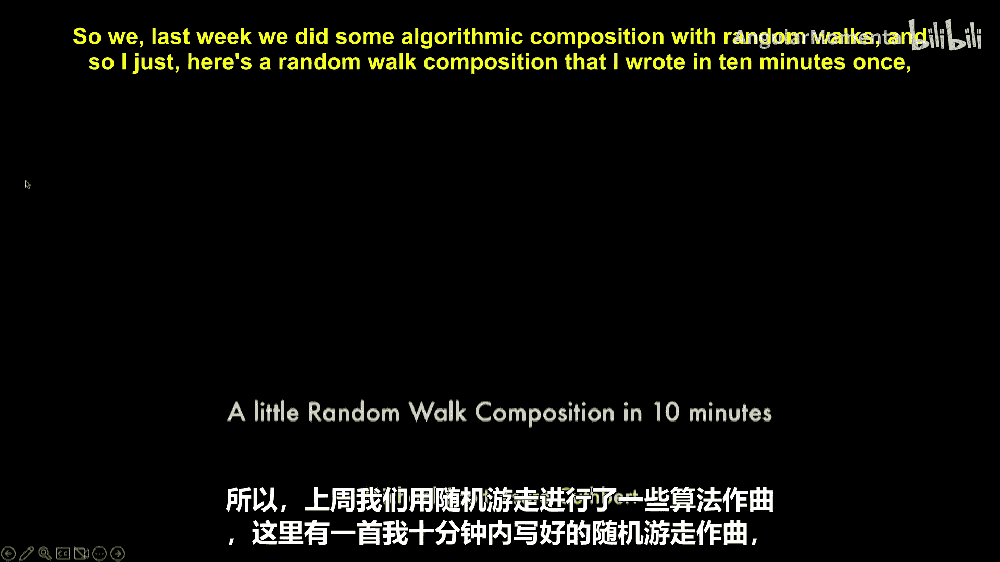
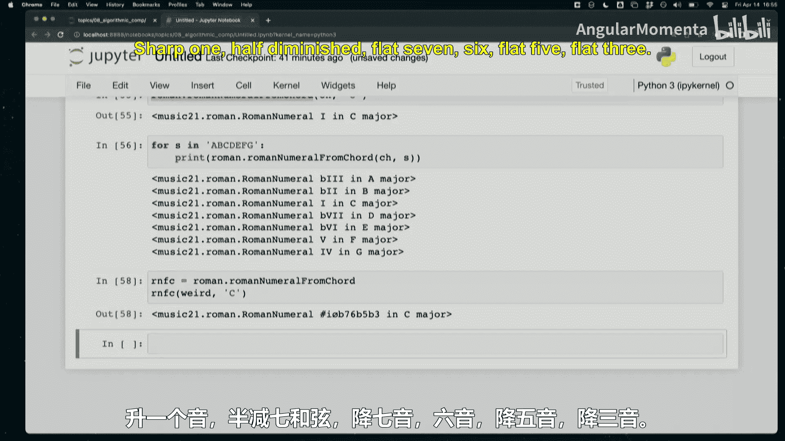

#  039：算法作曲（二）




在本节课中，我们将首先回顾上次测验中的一些核心理论概念，然后转向实践，学习如何使用代码实现和弦分析、调性分析以及罗马数字分析。

## 测验回顾与理论深化

上一节我们探讨了算法作曲的实践，本节我们先回顾一下上次测验中涉及的一些重要理论概念。

### 作者与文献的重要性

在学术研究中，了解作者及其文献至关重要，主要有两个原因：
1.  计算音乐学是一个相对年轻且规模较小的领域，许多提出开创性思想的学者依然活跃，他们的名字会反复出现。
2.  文献引用是学术交流的行业惯例，它指明了观点的来源、争论的语境，并为深入探究提供了线索。

### 经典文献的价值

本课程包含许多“古老”的文献（如70年前的《伊利亚克组曲》），这是因为它们探讨的是**等式**、**等价类**等基础概念。这些概念具有持久的生命力，不像具体的编程工具（如TensorFlow到PyTorch的变迁）那样容易过时，旨在提供能伴随你一生的思维框架。

### 全局规则解析

全局规则是**对位法**中的一项规则，其目标是**最大化音乐性**。它通过一套公式实现，具体操作是从乐曲结尾开始逆向推导。规则要求：旋律线中的每个音符，在其之后都必须出现该调内从该音到终止音之间的每一个**自然音级**。这项规则的重要性在于，它展示了如何通过**算法**来追求和实现音乐性的最大化。

### 等式与等价类

这是由**德米特里·蒂姆丘克**提出的核心概念，涉及**八度等同**、**排列等同**和**基数等同**。
*   **等式** 通常指代事物在某个**属性**上的完全相同（如两个声音频率相等）。
*   **等价类** 则是将事物按照某种逻辑关系**分组**，组内成员在某些方面被视为等同（如所有MIT 21M.383的学生构成一个等价类）。

关于其应用场景，需要注意：
*   等价类在**音乐分析**中比在**音乐表演**中更常用。
*   我们讨论的多是**音高**等价，但**时值**、**速度**（如DJ按BPM对歌曲分组）乃至**整首乐曲**（如按调性分组）都可以形成等价类。
*   应用哪种等价取决于具体情境。例如，进行和声分析时，“翻唱”可能构成一个等价类；但若你花费高价购买演唱会门票，原唱与翻唱的“现场表演”则不属于同一等价类。

### 音乐的三种语境

这是由**埃莉诺·塞尔夫里奇-菲尔德**提出的理论，她指出音乐表征主要存在于三种语境中，而多数记谱格式只专注于其中一种：
1.  **图形语境**：音乐在视觉媒介上的物理呈现（如纸上画的圆圈和线条）。
2.  **声音语境**：音乐作为物理声波的存在。
3.  **逻辑语境**：对图形或声音信息进行抽象解释后形成的概念（如将图形识别为“第三间的四分音符”，或将声波识别为“A4”或“单簧管音色”）。

需要区分的是**逻辑语境**与更抽象的**意义/诠释语境**。后者涉及音乐如何构建意义（如看到音符标题为“萤火虫”，从而将其与萤火虫的闪烁联系起来）。术语“语义”有时被用来指代逻辑语境，有时指意义语境，因此使用时需注意上下文。

---

## 实践编码：音乐分析工具

现在，让我们从理论模式切换回来，进入实践环节。上节课我们以随机漫步结束了算法作曲的讨论，本节课我们将学习几个强大的音乐分析工具。

### 和弦对象

首先，我们学习如何在代码中创建和操作和弦。

以下是创建和弦的几种方法：

```python
from music21 import chord, note, pitch

# 方法1：从音符对象列表创建
c_note = note.Note("C4")
e_note = note.Note("E4")
g_note = note.Note("G4")
ch = chord.Chord([c_note, e_note, g_note])



# 方法2：直接从音名字符串创建（更常用）
ch = chord.Chord(["C4", "E4", "G4"])

# 方法3：从音高对象列表创建
p1 = pitch.Pitch("C4")
p2 = pitch.Pitch("E4")
p3 = pitch.Pitch("G4")
ch = chord.Chord([p1, p2, p3])
```

和弦对象有许多有用的属性和方法：

```python
# 遍历和弦中的音符
for this_note in ch:
    print(this_note)

# 获取和弦的根音（功能之一）
root = ch.root()

# 判断和弦属性
print(ch.containsSeventh())  # 是否包含七音？
print(ch.isAugmentedTriad()) # 是否为增三和弦？
# ... 还有 isDiminishedSeventh(), isHalfDiminishedSeventh() 等

# 将和弦排列为密集排列（所有音高置于一个八度内）
ch_closed = ch.closedPosition(forceOctave=4)
```

### 调性分析

接下来，我们学习如何用不同的算法分析一段音乐的调性。

Music21提供了多种调性分析方法：

```python
from music21 import corpus

# 加载示例乐曲
jig = corpus.parse('essenFolksong/han1')
schoenberg = corpus.parse('schoenberg/opus19', 6)

# 分析调性
key_jig = jig.analyze('key')
print(f"乐曲的调性为: {key_jig}")

# 尝试不同的分析方法
methods = ['key', 'simple', 'krumhansl', 'essenFolksong', 'caplin']
for method in methods:
    key_out = jig.analyze(method)
    print(f"{method:20} -> {key_out}")

# 对于调性模糊的现代音乐（如勋伯格），不同方法可能给出不同结果
for method in methods:
    key_out = schoenberg.analyze(method)
    print(f"{method:20} -> {key_out}")

# 获取所有可能的调性解释（按可能性排序）
key_obj = jig.analyze('key')
alternative_keys = key_obj.alternateInterpretations
print("其他可能的调性:", alternative_keys)
```

这些方法背后有不同的理论基础：
*   `krumhansl`：基于**卡罗尔·克鲁姆汉斯**的**探针音**认知实验数据。
*   `essenFolksong`：基于Essen民谣数据库中已标记调性的乐曲统计学习而来。
*   `caplin`：由**克雷格·萨普林**提出的简化权重模型。

### 罗马数字分析

最后，我们学习如何对和弦进行罗马数字分析，这是理解和声进行的关键。

以下是进行罗马数字分析的方法：

```python
from music21 import roman

# 1. 直接创建罗马数字对象
rn1 = roman.RomanNumeral('V', 'D')  # D大调的属和弦
print(rn1)  # 输出: V
print(rn1.pitches)  # 输出和弦音高: [A4, C#5, E5]

# 2. 从和弦对象推断罗马数字
ch = chord.Chord(['G4', 'B4', 'D5'])
key_of_c = key.Key('C')
rn2 = roman.RomanNumeral.fromChord(ch, key_of_c)
print(rn2)  # 输出: V

# 3. 分析复杂和弦
weird_chord = chord.Chord(['E4', 'G5', 'D#7', 'C#8', 'B9'])
rn3 = roman.RomanNumeral.fromChord(weird_chord, key.Key('C'))
print(rn3)  # 输出可能为: #iø65 (升一级半减七和弦第一转位)

# 4. 获取罗马数字的详细信息
rn4 = roman.RomanNumeral('bII6', 'C')  # C大调的那不勒斯六和弦
print(rn4.figure)      # 输出: bII6
print(rn4.primaryFigure) # 输出: bII
print(rn4.frontAlterationAccidental) # 输出: flat (降号)
print(rn4.inversion)   # 输出: 1 (第一转位)
```

罗马数字分析本身蕴含了多种等价关系：
*   **八度等同**：和弦音高可移至任何八度。
*   **排列等同**：和弦内音高的顺序不重要。
*   **基数等同**：重复的音高不计。
*   **低音等同**：转位会影响罗马数字的后缀（如6、64），但低音音高本身可八度移动。
*   **基于主音的移调等同**：I级和弦在C大调中是CEG，在D大调中是D#F#A，它们因与各自调性主音的关系相同而被归为同类。

---

## 总结

本节课中，我们一起深入探讨了音乐理论中的核心概念——等式与等价类，并回顾了测验中的相关问题。随后，我们转向实践，学习了三个强大的计算音乐分析工具：
1.  **和弦对象**的创建与操作，使我们能够以编程方式处理和声材料。
2.  **调性分析**的不同算法及其应用，理解了如何让计算机判断乐曲的调性。
3.  **罗马数字分析**的实现，掌握了如何将具体的和弦序列转化为抽象的和声功能标识。




这些工具将为我们后续更复杂的音乐分析与算法作曲任务奠定坚实的基础。