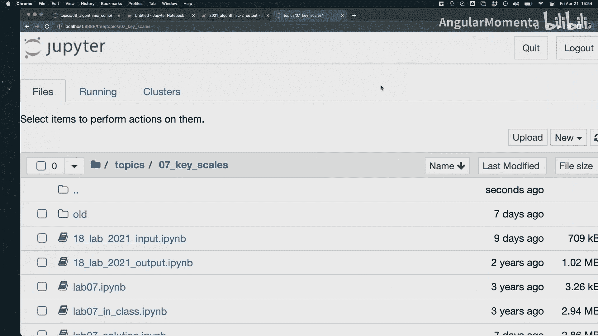
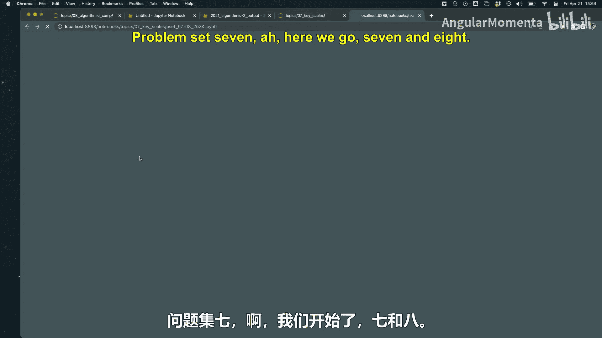
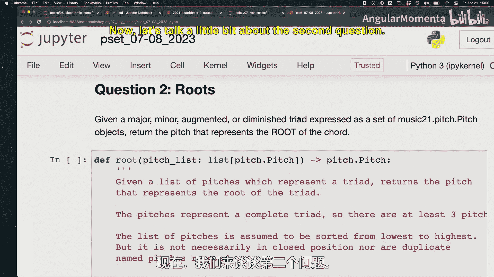
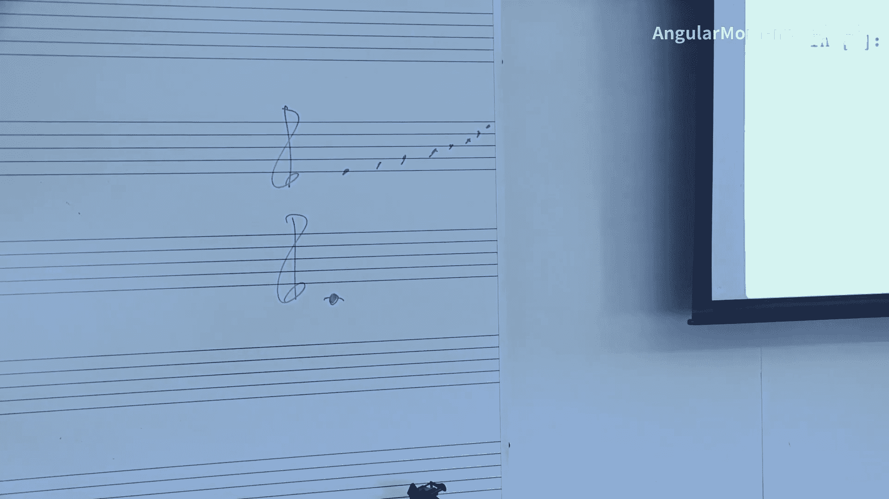
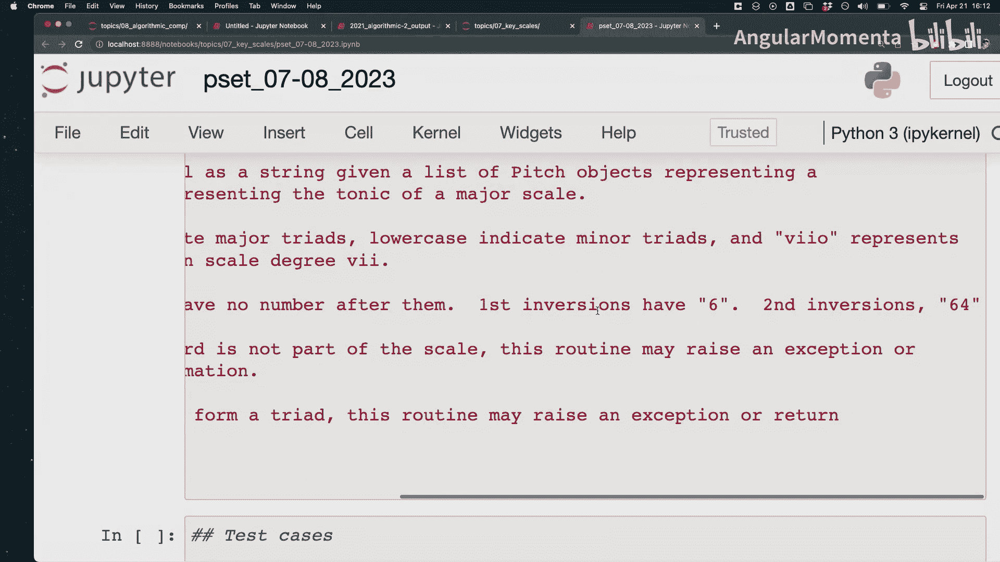
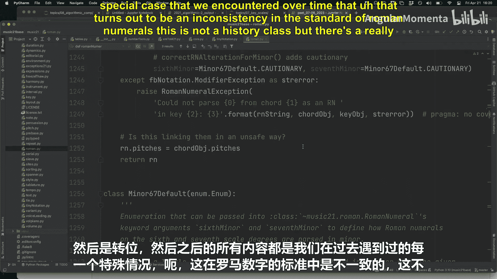
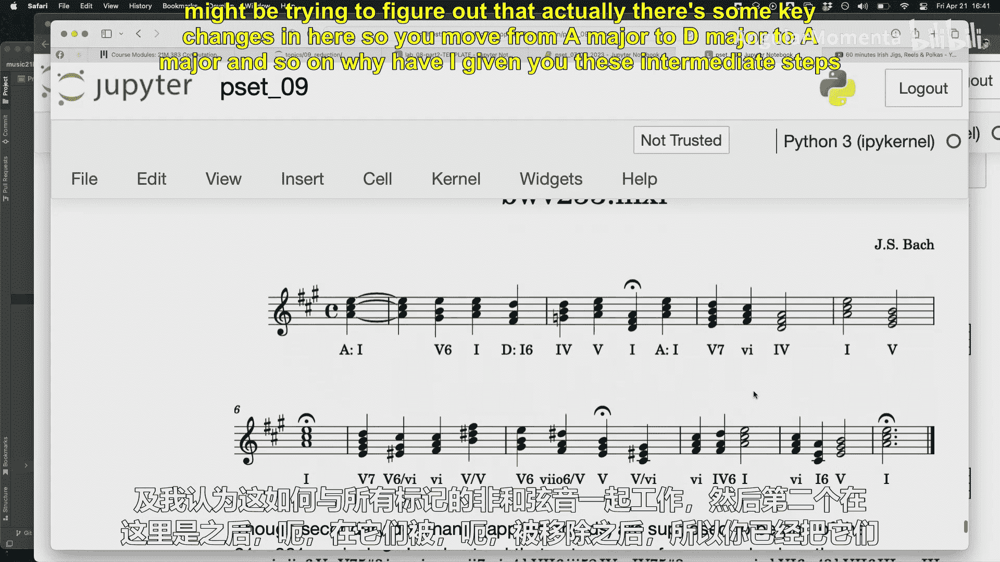
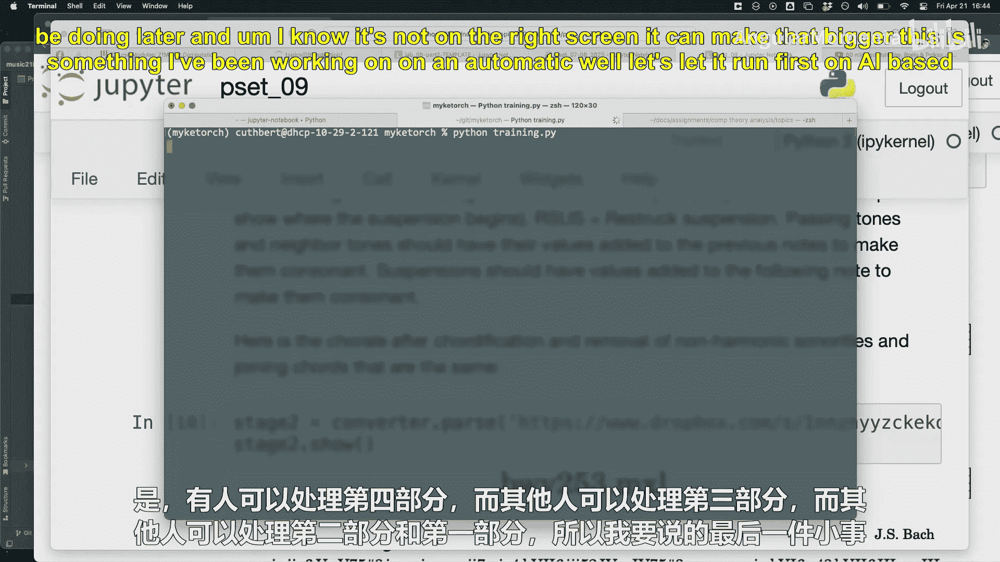
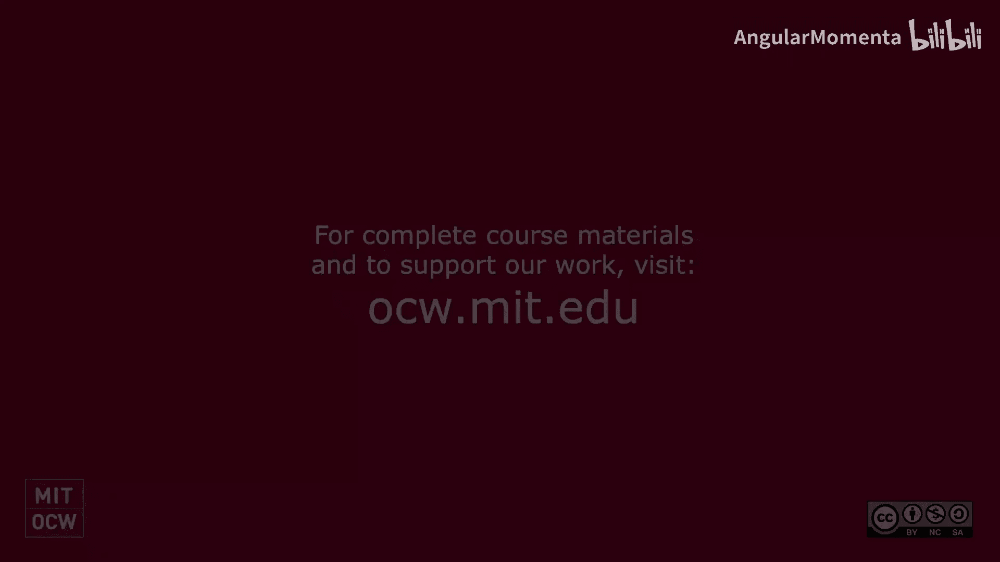

#  040：算法作曲（三）🎵


在本节课中，我们将学习如何利用马尔可夫链进行算法作曲，并回顾问题集7中关于音阶、和弦根音与罗马数字分析的核心概念。我们还将预览问题集9的内容，即通过识别并移除和弦外音来简化音乐织体。

## 课程回顾与问题集7讨论

上一节我们介绍了算法作曲的基础。本节中，我们先来回顾问题集7中的一些关键点。





### 大调音阶构建

第一个问题要求构建大调音阶。核心在于确保音阶的每个音级（线或间）只使用一次，这可能需要使用升号或降号。例如，F#大调音阶的导音是E#，而不是F自然音或E##。





**公式示例**：`大调音阶 = [根音, 根音+2半音, 根音+4半音, 根音+5半音, 根音+7半音, 根音+9半音, 根音+11半音]`

### 寻找和弦根音

第二个问题涉及寻找和弦的根音。以下是几种常见的技术方法：

*   **使用音高集合与音级空间**：将所有音符转换到同一个八度内，通常表示为0到11的数字（音级），然后检查音程关系。
*   **检查五度音程**：寻找根音与上方纯五度音程的关系。但需注意，增四度（如C-F#）在等音意义上等同于纯五度，但在功能和声分析中不被视为五度。
*   **检查连续的三度堆叠**：尝试将和弦排列为三度堆叠的形式，最底下的音即为根音。对于转位和弦（如六四和弦），可能需要将低音移高八度来识别三度结构。
*   **处理七和弦与不完整和弦**：算法需要能处理包含七音或省略音（如属七和弦常省略五音）的和弦。

### 罗马数字分析

第三个问题是将和弦分析为罗马数字。基本步骤如下：

1.  **确定调性**：基于给定的主音构建大调音阶。
2.  **找到根音**：使用上述方法确定和弦根音。
3.  **确定音级**：找到根音在音阶中的级数（如1, 2, 3...）。
4.  **判断大小写**：通过根音与三音的音程（大三度或小三度）决定罗马数字的大小写（大写代表大三和弦，小写代表小三和弦）。
5.  **添加变音记号与转位标记**：对于调外音，添加升号或降号前缀。根据低音位置添加转位数字（如6、64等）。

需要注意的是，罗马数字分析体系存在多种惯例，例如在和声小调中如何处理六、七级和弦，以及对于增六和弦等特殊结构的命名，不同理论体系可能有不同规定。

## 使用Music21进行实际分析

现在，让我们使用Music21库实际进行和弦与罗马数字分析。



首先，我们加载一首巴赫的众赞歌（BWV 66.6），将其进行四部和声化处理，并在F#小调下进行罗马数字分析。

```python
from music21 import *
# 加载巴赫众赞歌
bach = corpus.parse('bwv66.6')
# 进行四部和声化处理
chorded_bach = bach.chordify()
# 设定调性为F#小调
fm = key.Key('F#')
# 为每个和弦添加罗马数字分析作为歌词
for ch in chorded_bach.recurse().getElementsByClass(chord.Chord):
    rn = roman.romanNumeralFromChord(ch, fm)
    ch.lyric = rn.figure
# 显示乐谱
chorded_bach.show()
```

运行代码后，你可能会发现分析出的罗马数字看起来很奇怪（例如频繁出现`b6`、`b7`等）。这通常意味着**调性判断可能错误**。这首乐曲实际上是从A大调开始的，如果错误地设定为关系小调（F#小调），就会导致大量不寻常的变音记号。相反，如果在大调作品中看到过多的小调六级（vi）、二级（ii）、三级（iii）和弦，也可能暗示调性判断有误。

此外，奇怪的低音数字（如`7#6#4`）可能意味着和弦中包含了**和弦外音**。

## 和弦外音识别与问题集9预览



问题集9的核心任务就是识别并移除和弦外音，从而获得清晰的和声进行。以下是常见的和弦外音类型及其处理逻辑：

*   **经过音**：在两个和弦音之间级进填充的音。
    *   **识别条件**：前后音均为和弦音，且自身与前后音均构成二度关系，方向一致（同上或同下）。
    *   **处理**：通常可删除。
*   **辅助音（邻音）**：从和弦音级进离开后又级进回到原和弦音。
    *   **识别条件**：前后音为同一个和弦音，且自身与该音构成二度关系。
    *   **处理**：通常可删除。
*   **延留音**：前一个和弦的音延续到下一个和弦，造成不协和后再解决。
    *   **识别条件**：通常出现在强拍，下行级进解决到和弦音。
    *   **处理**：可将其缩短，使其更早解决。
*   **先现音**：后一和弦的音提前出现在弱拍。
    *   **识别条件**：出现在弱拍，并与后一和弦音相同。
    *   **处理**：可删除或将其后的休止符提前。

识别工作可以在两个层面进行：
1.  **声部层面**：在每个单独的旋律声部中寻找符合上述模式的音符。
2.  **和弦层面**：在已经和弦化的织体中，分析哪些音不属于当前和弦结构。

在问题集9中，你们将以四人小组合作，实现一个`reduce()`函数，对给定的四部和声进行简化。策略是分工合作，有人负责识别和弦外音，有人负责移除它们，有人负责处理转调分析。

## 算法作曲：基于马尔可夫链的旋律生成

现在，让我们回到本节课的主题——算法作曲。我们将使用Music21库中大量的吉格舞曲（Jig）作为数据源，基于马尔可夫模型生成新的旋律。

以下是准备数据的步骤：

1.  **搜索并加载曲库**：从Music21的曲库中搜索所有标题包含“jig”的乐曲。
2.  **筛选调性**：分析每首乐曲的调性，筛选出G大调的作品。

```python
# 搜索所有吉格舞曲
jigs = corpus.search('jig')
print(f"找到 {len(jigs)} 首吉格舞曲")

# 筛选出G大调的吉格舞曲
jigs_in_G = []
for j_meta in jigs:
    # 解析乐曲
    j = j_meta.parse()
    # 分析调性
    k = j.analyze('key')
    # 检查主音是否为G
    if k.tonic.name == 'G':
        jigs_in_G.append(j)
        print(f"找到G大调乐曲: {j.metadata.title}")

print(f"共有 {len(jigs_in_G)} 首G大调的吉格舞曲可用于分析。")
```

这段代码会遍历所有吉格舞曲，分析其调性，并将G大调的作品收集到`jigs_in_G`列表中。有了这个数据集后，我们就可以进行下一步：**提取旋律音符，计算音符之间转换的概率（马尔可夫链），然后根据这些概率随机生成新的旋律序列**。这就是基于数据的算法作曲的核心思想。

## 前沿探索：基于AI的罗马数字分析



课程最后，我们预览了一个使用神经网络自动进行罗马数字分析的研究项目。通过使用莫扎特钢琴奏鸣曲全集（已人工标注罗马数字）作为训练数据，模型学习从音符集合到罗马数字标签的映射。经过训练，模型可以达到很高的准确率。然而，这类项目的挑战在于：
*   **数据准备耗时**：高质量、一致的标注数据获取与清洗需要大量人工。
*   **计算资源需求**：训练复杂的神经网络需要时间和算力。
*   **模糊边界处理**：音乐分析本身存在主观性，模型可能在某些和弦（如IV和ii、V和vii°）的分析上产生与人工标注不同的“合理”答案。



这展示了计算音乐学结合现代机器学习技术的前沿方向，但也提示我们，在期末项目中，扎实地运用规则性方法（如本节课所授）往往是更可行和有效的策略。

## 总结

本节课中我们一起学习了：
1.  **回顾了和声分析基础**：包括大调音阶构建、和弦根音寻找以及罗马数字分析的原理与挑战。
2.  **实践了计算分析**：使用Music21对音乐进行实际的罗马数字分析，并理解了错误调性设定对分析结果的影响。
3.  **探讨了音乐简化**：介绍了和弦外音的类型、识别逻辑以及问题集9的协作完成目标。
4.  **引入了算法作曲**：开始了基于马尔可夫链的算法作曲实践，学习了如何从曲库中筛选和准备特定风格（吉格舞曲）、特定调性（G大调）的音乐数据。
5.  **展望了AI应用**：了解了神经网络在自动音乐分析领域的应用与挑战。



通过结合理论、实践代码与前沿概念，我们进一步掌握了使用计算工具理解和创造音乐的方法。