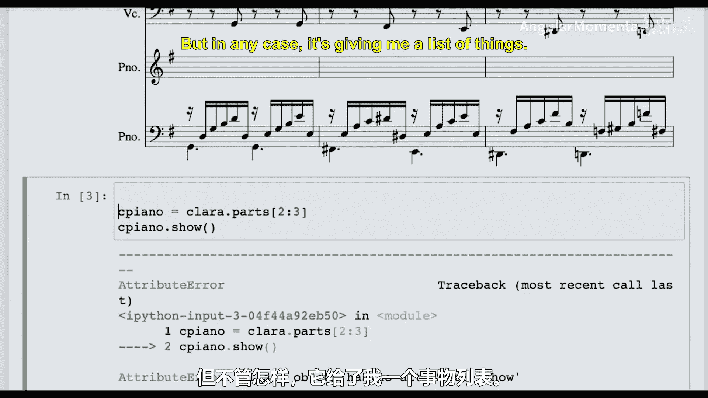
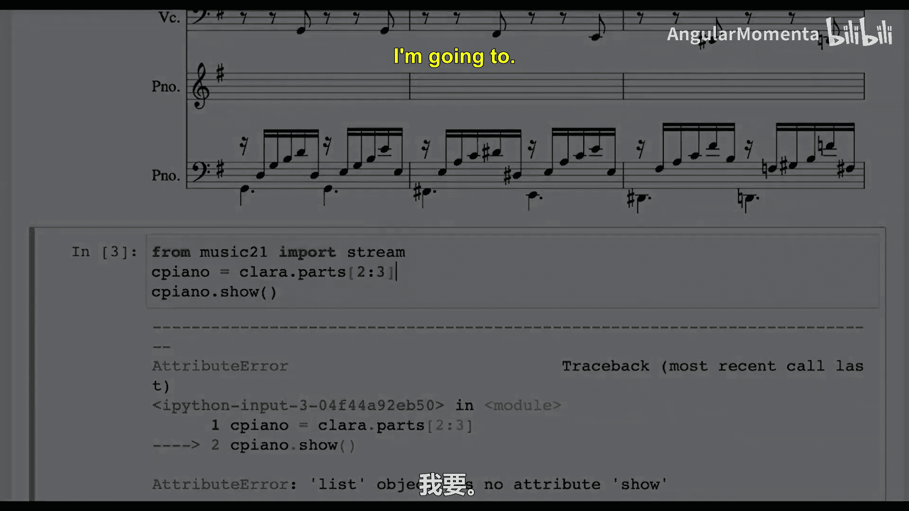
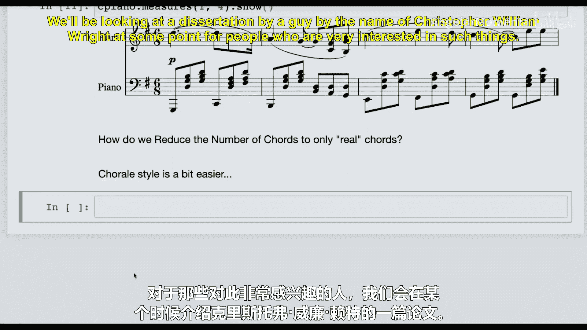
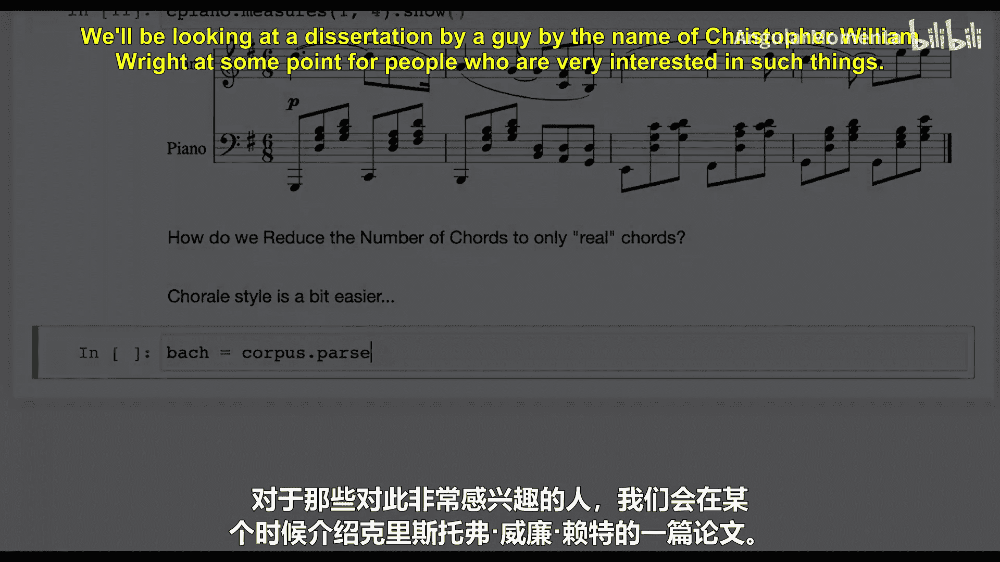
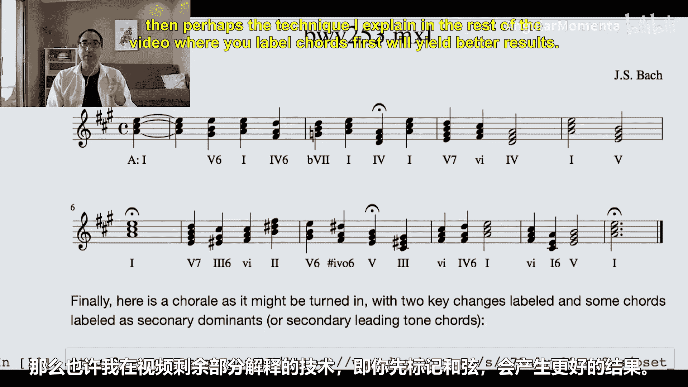
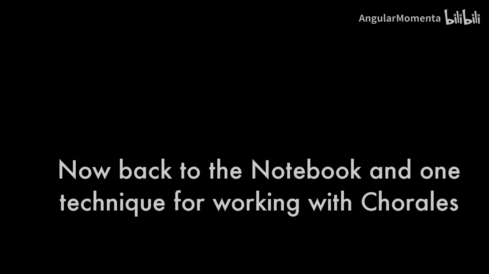
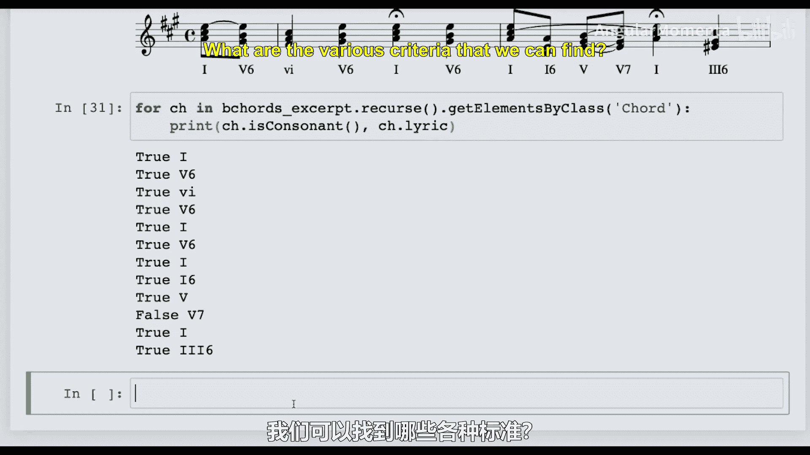
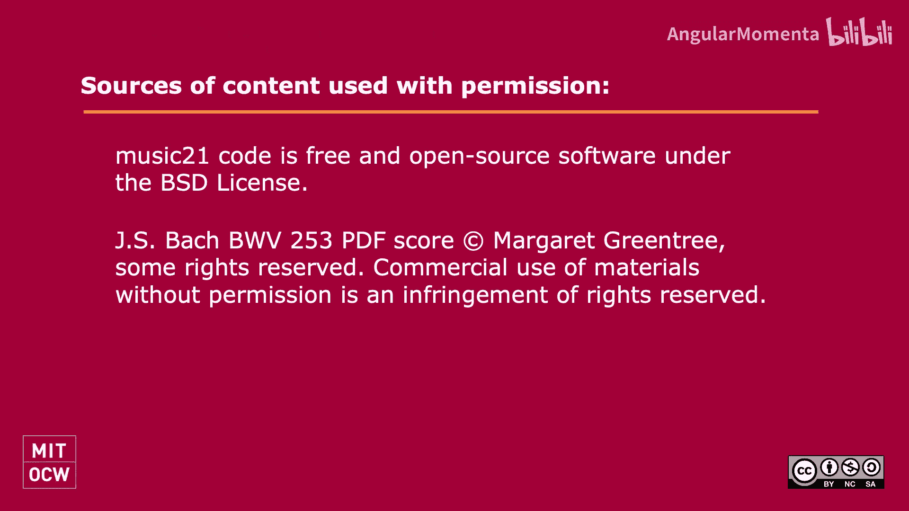

#  041：词汇精简 🎵


在本节课中，我们将学习一个听起来深奥但实际非常核心的概念：**词汇精简**。我们将探讨如何在音乐分析中，将复杂的乐谱信息简化为更少、更易于管理的核心元素，并了解如何将这一过程教给计算机。

## 概述

词汇精简是我们每次进行分析时都会做的事情，无论是音乐分析、文本分析，还是试图理解一段对话的核心。其目标是将复杂的数量减少到更小、更易管理的程度。在罗马数字分析中，我们经常进行词汇精简——我们不会为每个音符都标记罗马数字，而是只标记那些“真正的和弦”。本节课，我们将深入理解这个过程，以便训练计算机系统也能做到这一点。

## 从实际音乐开始

为了理解词汇精简，我们首先需要处理实际的音乐。让我们从克拉拉·舒曼的《钢琴三重奏》慢板乐章开始。这是一个优美的片段，我们之前曾在课堂上分析过它。

首先，我们从 `music21` 库导入必要的模块，并加载这首作品。





```python
from music21 import corpus
schumann_trio = corpus.parse('schumann/clara/trio')
```

接下来，我们提取钢琴部分，并只关注前16小节，以便更快地进行处理。

```python
from music21 import stream
piano_part = stream.Score()
piano_part.insert(0, schumann_trio.parts[2]) # 钢琴右手
piano_part.insert(0, schumann_trio.parts[1]) # 钢琴左手
excerpt = piano_part.measures(0, 16)
```

## 和弦提取与罗马数字分析

现在，我们有了钢琴部分的片段。下一步是提取其中的和弦并进行罗马数字分析。我们将使用 `music21` 的 `chordify` 功能。

```python
chords_excerpt = excerpt.chordify()
for c in chords_excerpt.recurse().getElementsByClass('Chord'):
    c.closedPosition(forceOctave=4, inPlace=True)
```

和弦被提取并置于闭集位置后，我们就可以为每个和弦确定一个罗马数字标记。为此，我们需要知道乐曲的调性。这个乐章是G大调。

```python
from music21 import roman
key_G = key.Key('G')
for c in chords_excerpt.recurse().getElementsByClass('Chord'):
    rn = roman.RomanNumeralFromChord(c, key_G)
    c.lyric = rn.figure
```

完成标记后，我们可以查看结果。你会发现，并非所有被标记的“和弦”都是我们想在分析中保留的“真正和弦”。例如，一些音符可能是经过音或装饰音，并不构成独立和声。这正是词汇精简需要解决的问题：**如何区分“结构性和弦”与“非和声音”**。

## 词汇精简的挑战与应用





上一节我们看到了在复杂钢琴谱中识别“真正和弦”的挑战。对于包含大量琶音和旋律线条的音乐，这仍然是一个未完全解决的学术问题。

本节中，我们将把词汇精简的概念应用到更简单的音乐形式上：**巴赫的四声部众赞歌**。这类音乐的和声变化清晰，非和声音相对规整，是练习精简算法的理想材料。

在开始之前，需要了解两种主要的实现思路：
1.  **先标记，后删除**：首先为每个垂直的音符集合（可能的和弦）都标记罗马数字，然后根据规则删除那些不代表独立和声的标记。
2.  **先识别，后移除**：首先识别出所有非和声音（如经过音、辅助音、延留音），将它们从乐谱中移除，然后再对剩余的音符进行和弦化与标记。

以下是两种方法的简要步骤：

*   **方法一：先标记后删除**
    *   对音乐进行和弦化处理。
    *   为每个垂直的音符集合生成罗马数字。
    *   制定规则（如：只保留协和和弦、只保留强拍上的和弦等），删除不符合规则的标记。



*   **方法二：先识别后移除**
    *   分析各声部线条，识别并标记非和声音。
    *   从乐谱中移除这些非和声音符。
    *   对清理后的乐谱进行和弦化与罗马数字分析。



对于小组协作项目，如果分工明确，从识别单个非和声音开始可能更高效。如果小组成员希望共同完成每个步骤，那么先标记所有和弦再精简的方法可能更容易协调。

## 在众赞歌上实践精简

让我们以巴赫的众赞歌 BWV 66.6 为例进行实践。这首作品有一个特点：它起始于一个调性，结束于另一个调性。

我们首先加载并处理这首众赞歌。

```python
bach_chorale = corpus.parse('bwv66.6')
chords_bach = bach_chorale.chordify()
for c in chords_bach.recurse().getElementsByClass('Chord'):
    c.closedPosition(forceOctave=4, inPlace=True)
```

我们需要分段处理，因为调性发生了变化。假设前3小节是A大调，最后7小节是升f小调。

```python
# 处理A大调部分
excerpt1 = chords_bach.measures(0, 2)
key_A = key.Key('A')
for c in excerpt1.recurse().getElementsByClass('Chord'):
    rn = roman.RomanNumeralFromChord(c, key_A)
    c.lyric = rn.figure

# 处理升f小调部分
excerpt2 = chords_bach.measures(4, 10)
key_fis = key.Key('f#') # 注意小写字母表示小调
for c in excerpt2.recurse().getElementsByClass('Chord'):
    rn = roman.RomanNumeralFromChord(c, key_fis)
    c.lyric = rn.figure
```

观察升f小调部分的第8小节，我们会发现其中包含许多不协和、看起来像是声部进行中产生的“和弦”，例如包含明显经过音的纵向结构。

## 实现一个简单的精简规则

一个最基础的词汇精简规则是：**只保留协和和弦**。在西方调性和声中，协和和弦（如三和弦、六和弦）通常被视为结构支柱，而不协和和弦（包含七度、增减音程）常常是经过性或装饰性的。

我们可以使用 `music21` 中 `Chord` 对象的 `isConsonant()` 方法来判断。

让我们以第8小节为例，移除所有不协和的和弦。

```python
measure_8 = excerpt2.measures(8, 8)
# 注意：在迭代中修改列表需要小心，这里作为示例简化处理
for c in measure_8.recurse().getElementsByClass('Chord'):
    if not c.isConsonant():
        measure_8.remove(c, recurse=True)
# 现在 measure_8 中只剩下协和和弦
```

应用此规则后，第8小节中许多复杂的、过渡性的罗马数字标记会被移除，只留下骨干和声。这就是一种有效的词汇精简。

然而，回到A大调部分，我们发现几乎所有的和弦都是协和的。这意味着简单的“协和性”规则可能过于宽松，无法在相对简单的段落中进行有效精简。我们可能需要更复杂的规则，例如考虑**和弦的节拍位置**（强拍 vs 弱拍）、**时值长短**，或**前后和弦的上下文关系**。

## 总结

本节课我们一起学习了**词汇精简**在计算音乐分析中的核心概念与应用。

我们首先以克拉拉·舒曼的钢琴三重奏为例，展示了在复杂织体中区分“真正和弦”与装饰性音符的挑战。接着，我们将问题简化，在巴赫的四声部众赞歌上实践了词汇精简的过程。我们学习了两种实现思路（先标记后删除 vs 先识别后移除），并亲手实现了一个基于**和弦协和性**的简单精简规则。





核心的收获是：词汇精简的本质是**构建一套规则或模型，用以过滤音乐表面复杂的音响，提取出背后支撑性的和声骨架**。虽然我们只实现了一个简单规则，但更完善的系统需要结合节拍、时值、声部进行、调性上下文等多种因素。这正是计算音乐学富有挑战性与吸引力的地方——将人类音乐家的直觉分析，转化为计算机可以逐步执行的明确逻辑。