#  042：特征提取与机器学习 🎵🤖


在本节课中，我们将学习如何将音乐元素转换为计算机可以处理的数字形式，即特征提取。这是应用人工智能和机器学习技术处理音乐数据前的必要步骤。我们将通过具体实例，学习如何手动和自动提取特征，并构建一个简单的分类器来区分不同类型的音乐。

---

## 概述

特征提取是将音乐元素（如音符、和弦、节奏）转换为单个数字或数字列表（如向量、数组）的过程。虽然这个过程本身可能显得有些枯燥，因为音乐的情感与艺术性被简化为数字，但它是所有现代人工智能和机器学习算法的基础。这些算法都需要在数字数据上运行。

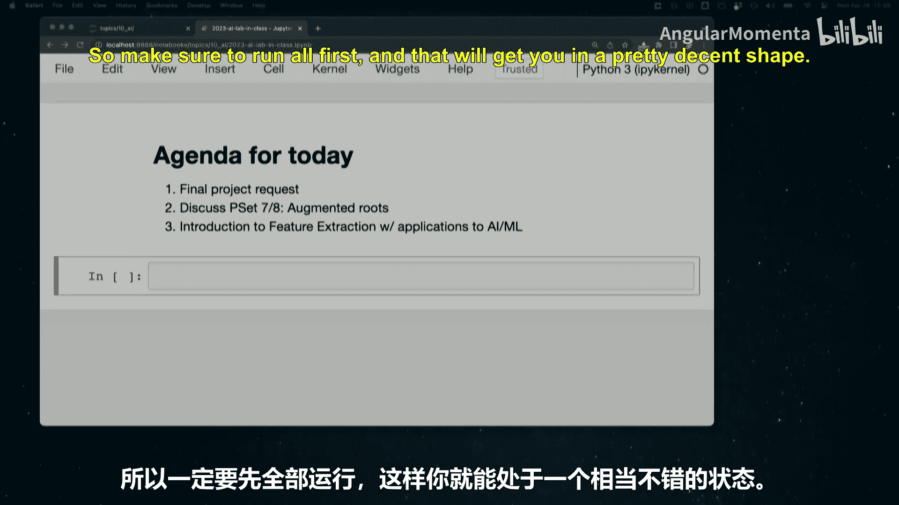

本节课我们将从手动特征提取开始，然后过渡到自动提取，并最终使用提取的特征来训练一个机器学习模型，尝试区分“吉格舞曲”和“里尔舞曲”。

---

## 手动特征提取

首先，我们通过一个简单的例子来理解特征提取。以巴赫的众赞歌 BWV 66.6 为例，我们可以手动提取两个特征：声部数量和每小节的初始拍数。

```python
number_of_parts = 4
time_signature_numerator = 4
```

这描述了这首曲子，但信息量非常有限。这仅仅是开始。

---

## 自动特征提取：节拍提取器

接下来，我们定义一个自动特征提取函数。这个函数将接收一个乐谱流，并返回两个整数：拍号的分子和分母。

```python
def extract_meter(score):
    all_meters = score.flat.getTimeSignatures()
    if not all_meters:
        return 0, 0  # 处理没有拍号的情况
    first_meter = all_meters[0]
    return first_meter.numerator, first_meter.denominator
```

这里引入了一个重要的考量：错误处理。如果乐谱没有拍号（例如格里高利圣咏），我们的函数会返回 `(0, 0)` 作为一个特殊值，而不是让程序崩溃。这在处理大型数据集时至关重要，可以防止个别错误数据导致整个长时间运行的任务失败。然而，这也可能掩盖数据中系统性的问题，需要谨慎使用。

测试我们的提取器：
```python
extract_meter(bach_score)  # 应返回 (4, 4)
```

---

## 构建数据集：吉格舞曲 vs. 非吉格舞曲

我们将使用一个名为“Ryan‘s Mammoth Collection”的19世纪小提琴曲集。我们的目标是构建一个分类器，区分其中的“吉格舞曲”和“非吉格舞曲”（主要是“里尔舞曲”）。

首先，我们定义一个辅助函数，根据文件名判断是否为吉格舞曲。这构成了我们的“真实标签”，尽管它可能不完美（例如，有些曲子可能没有“jig”在文件名中但确实是吉格舞曲）。

```python
def is_jig(metadata_entry):
    return ‘jig‘ in metadata_entry.title.lower()
```

然后，我们加载数据集，并平衡吉格与非吉格曲子的数量，以便更好地训练模型。

---

## 定义更多特征提取器

基于对吉格和里尔舞曲的听觉观察，我们定义更多特征提取器。

1.  **调号特征提取器**：返回曲子的升号数量（降号用负数表示）。
    ```python
    def get_sharps(score):
        try:
            return score.flat.getKeySignatures()[0].sharps
        except (AttributeError, IndexError):
            return 0  # 假设没有调号即为C大调/无调号
    ```

2.  **八分音符比例特征提取器**：返回曲子中八分音符所占的比例。我们观察到吉格舞曲中八分音符可能更常见。
    ```python
    def eighth_fraction(score):
        all_notes = list(score.flat.notes)
        if not all_notes:
            return 0.0
        eighth_count = sum(1 for n in all_notes if n.duration.type == ‘eighth‘)
        return eighth_count / len(all_notes)
    ```

---

## 整合特征提取器

现在，我们创建一个总特征提取函数，它运行所有单个提取器，并将结果与文件名、真实标签一起打包返回。

```python
def feature_extractor(score, filename):
    file_basename = filename.split(‘/‘)[-1]
    num, denom = extract_meter(score)
    eighth_prop = eighth_fraction(score)
    sharps_feature = get_sharps(score)
    ground_truth = int(is_jig(score.metadata))  # 将布尔值转换为整数 1 或 0
    return file_basename, num, denom, eighth_prop, sharps_feature, ground_truth
```

---

## 训练与测试机器学习模型

我们将数据集分为训练集和测试集，并将特征数据写入文件以供机器学习库使用。

以下是使用 `orange3` 库进行机器学习的基本步骤：

1.  **加载数据**：
    ```python
    import orange
    train_data = orange.data.Table(‘train_data.tab‘)
    test_data = orange.data.Table(‘test_data.tab‘)
    ```

2.  **创建分类器**：
    *   **多数类分类器**：作为基准模型，它总是预测训练集中最常见的类别。如果我们的模型不能超越它，说明模型没有学到有用的东西。
        ```python
        majority_learner = orange.classification.MajorityLearner()
        majority_classifier = majority_learner(train_data)
        ```
    *   **K-最近邻分类器**：一个简单但有效的分类器，通过查找测试样本在特征空间中最近的K个训练样本的类别来进行预测。
        ```python
        knn_learner = orange.classification.KNNLearner()
        knn_classifier = knn_learner(train_data)
        ```

3.  **评估模型**：在测试集上运行分类器，计算准确率。
    ```python
    majority_correct = 0
    knn_correct = 0
    for test_row in test_data:
        majority_guess = majority_classifier(test_row)
        knn_guess = knn_classifier(test_row)
        true_class = test_row.get_class()
        if majority_guess == true_class:
            majority_correct += 1
        if knn_guess == true_class:
            knn_correct += 1
    total = len(test_data)
    print(f“多数类分类器准确率：{majority_correct/total:.2%}“)
    print(f“K-最近邻分类器准确率：{knn_correct/total:.2%}“)
    ```
    在我们的例子中，使用手动设计的几个特征，K-最近邻模型获得了约87%的准确率，显著高于基准的59%。

---

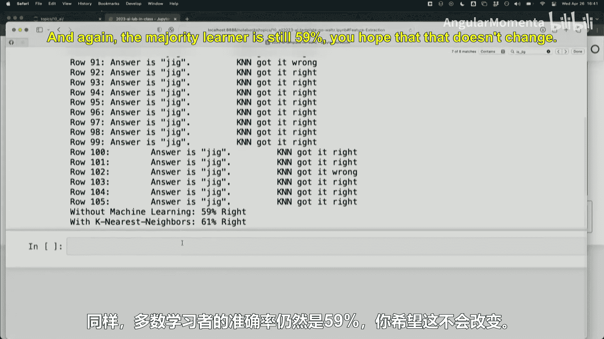

## 使用更多特征与反思

我们可以使用 `music21` 内置的或更复杂的特征提取器来尝试提升性能。然而，有时“更多”并不等于“更好”。在我们尝试添加了大量通用特征后，准确率反而下降到了61%。这说明：
*   **特征质量优于数量**：精心设计的、与问题领域相关的特征比一堆无关特征更有效。
*   **计算成本**：复杂的特征提取可能非常耗时。
*   **过拟合风险**：在小数据集上使用太多特征容易导致模型记住噪声而非一般规律。

当前一些最先进的符号音乐机器学习方法，会将乐谱转换为“钢琴卷帘”图像，然后使用图像处理领域的深度学习模型。这避免了手动设计特征的困难，但需要海量的数据。

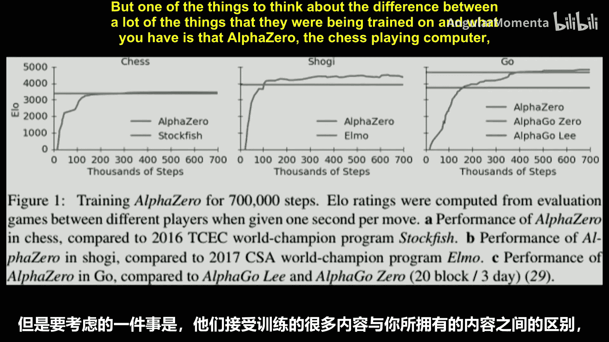

---

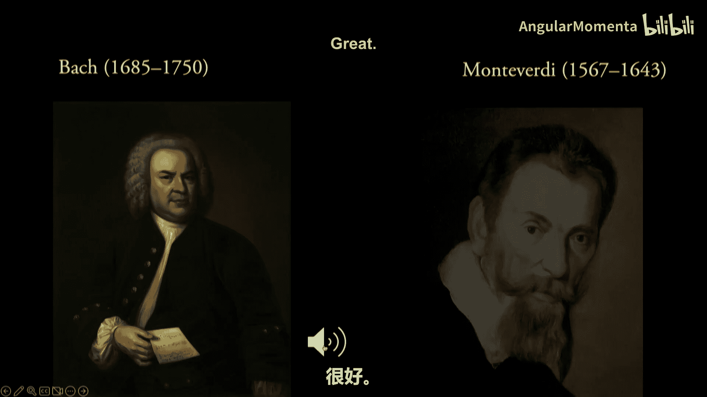

## 特征提取的陷阱与启示

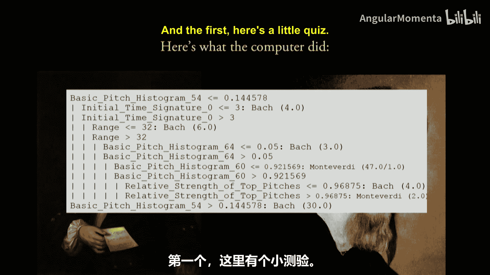

最后，我们通过几个例子来审视特征提取和机器学习中可能出现的陷阱。

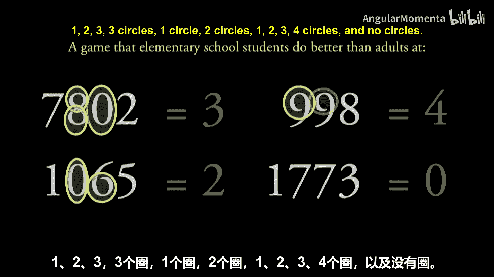

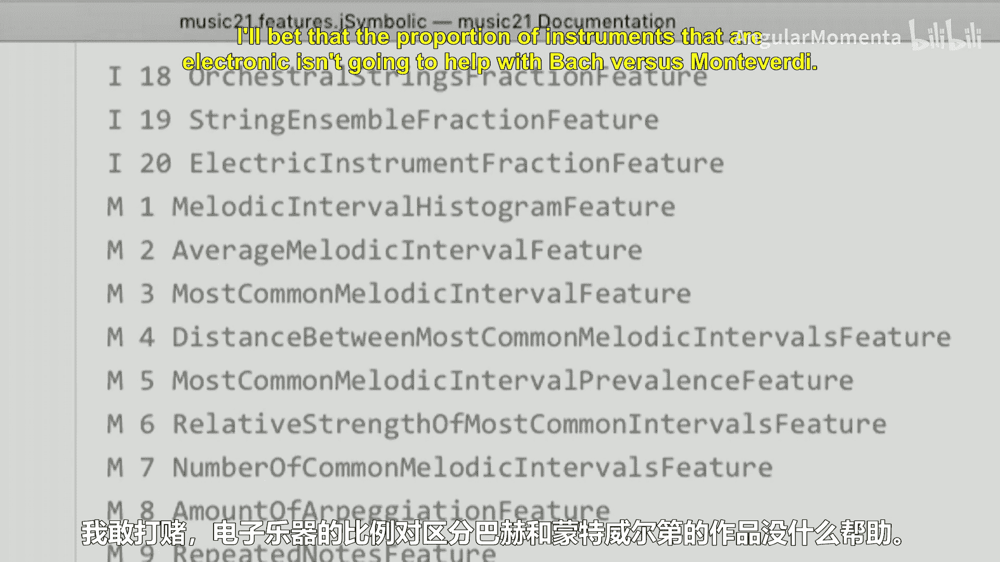

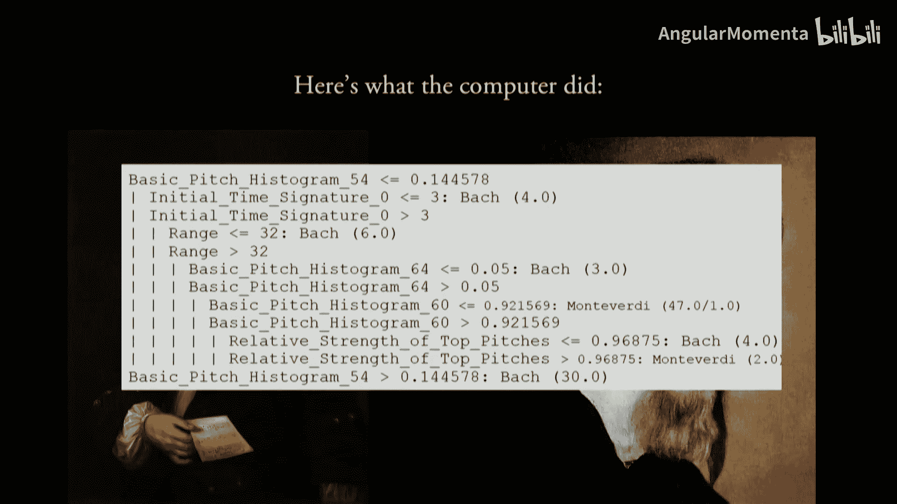

1.  **“垃圾进，垃圾出”**：分类器的质量极度依赖于训练数据的“真实标签”质量。如果标签有误或有偏见，模型就会学习这些错误。
2.  **学习到无关特征**：一个著名的例子是，一个音频分类器本应区分音乐流派，结果却学会了区分不同录音棚常用的麦克风类型。因为不同流派的音乐通常使用特定的录音设备。
3.  **决策树的可解释性**：与“黑箱”神经网络不同，决策树等模型可以显示其决策路径。例如，一个区分巴赫和蒙特威尔第作品的决策树可能显示，它首先检查“中音区F#音的使用频率是否超过14%”。这虽然可能准确，但反映的可能是作品编辑方式的差异（如现代记谱习惯），而非作曲家本身的风格。这提醒我们，模型找到的规律需要谨慎解读。

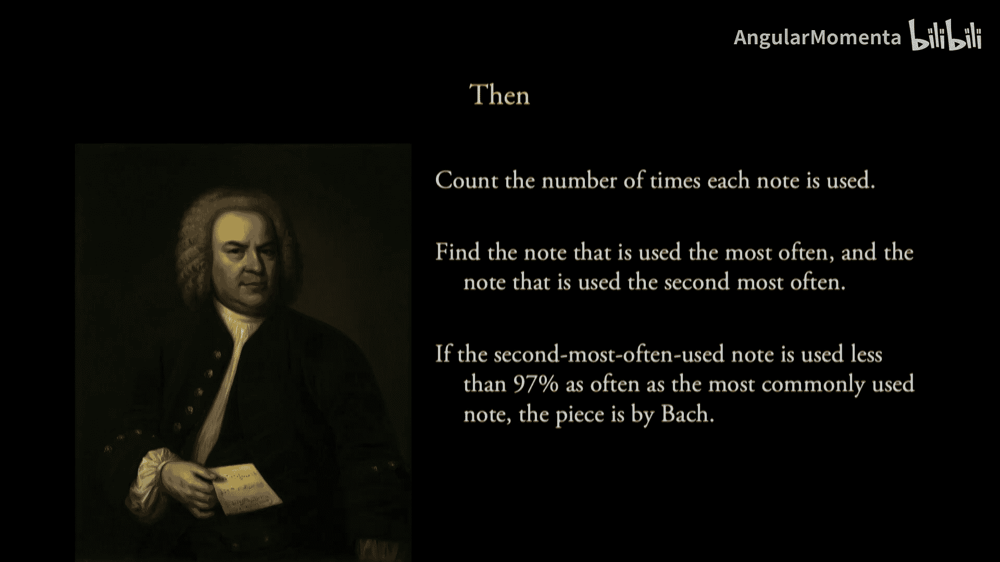

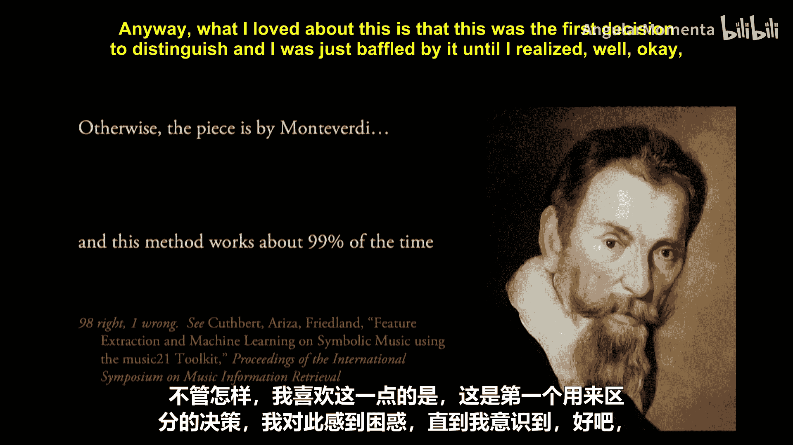

---

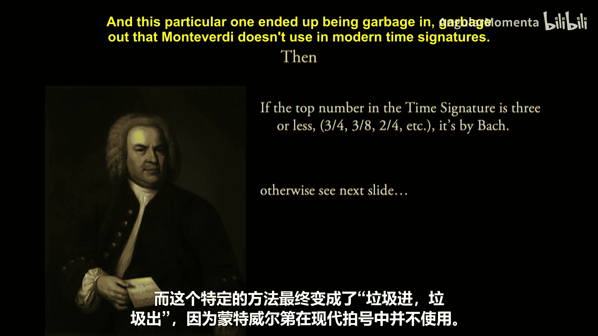

## 总结

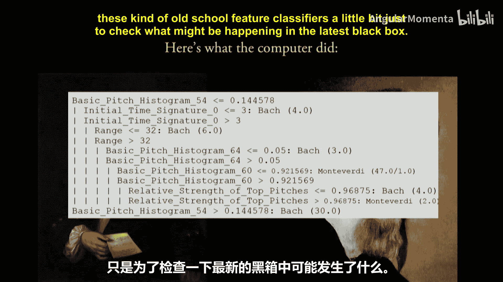

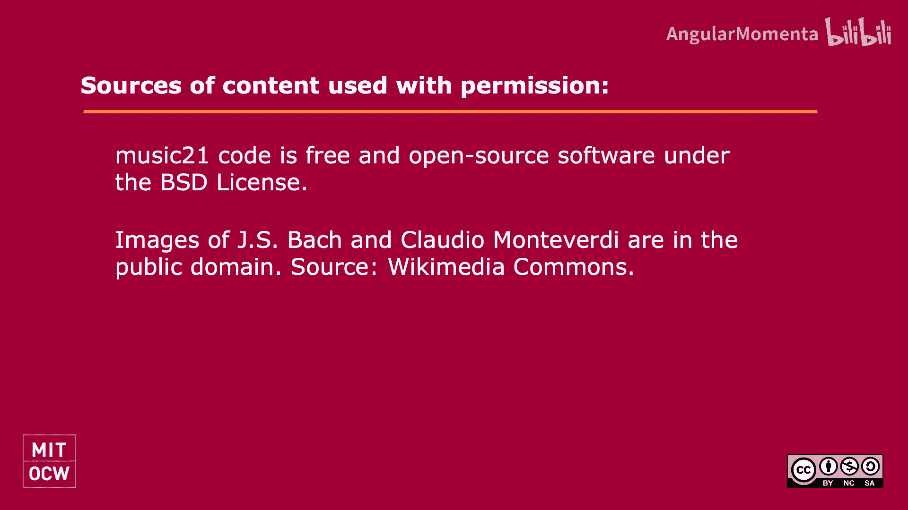

本节课我们一起学习了音乐特征提取的核心概念与实践。我们了解到，特征提取是将音乐转化为机器可读数字的关键步骤，虽然过程可能繁琐，但它是连接音乐艺术与计算分析的桥梁。我们实践了手动和自动提取特征的方法，并构建了一个简单的分类器来区分舞曲类型。更重要的是，我们讨论了特征选择的重要性、数据质量的关键影响以及机器学习模型中可能存在的陷阱。在将强大的AI工具应用于音乐时，保持批判性思维和对音乐本身的理解至关重要。