#  043：特征提取与机器学习（二）

## 概述
在本节课中，我们将要学习音乐模式检测的核心概念，特别是如何通过特征提取和距离度量来量化音乐的相似性。我们将探讨一种用于音乐模式检测的算法，并理解如何通过“视点”表示和编辑距离等工具，让计算机识别人类感知中的相似音乐片段。

---

## 模式检测的挑战
在音乐中，我们常常希望自动识别出乐谱中的重要音乐思想或模式。然而，一个核心挑战是：我们大脑认为代表相同音乐想法的片段，在乐谱上可能看起来非常不同。

以下是《Baby Shark》旋律中的一些片段示例：
*   **蓝色片段**：三个片段在音符和时值上完全相同，只是出现位置不同。将它们归为同一模式是合理的。
*   **绿色片段**：情况更复杂。片段2和3完全相同，但片段1的时值不同，片段4则更为不同，仅保留了三个音符的轮廓。

这揭示了音乐模式挖掘的两个主要难点：
1.  **音乐变换**：对音乐片段应用数学变换（如移调）后，我们的大脑仍可能认为它们是等价的。
2.  **相似性度量**：即使没有直接的变换关系，我们仍能感知到某些片段在“想法”上是相似的。

---

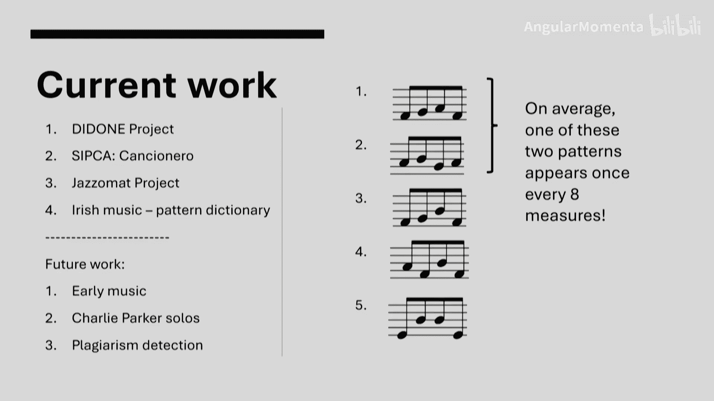

## 视点表示法
为了从计算角度处理变换和简化表示，我们引入了“视点”的概念。视点表示法将复杂的音乐信息简化为单一的符号序列。

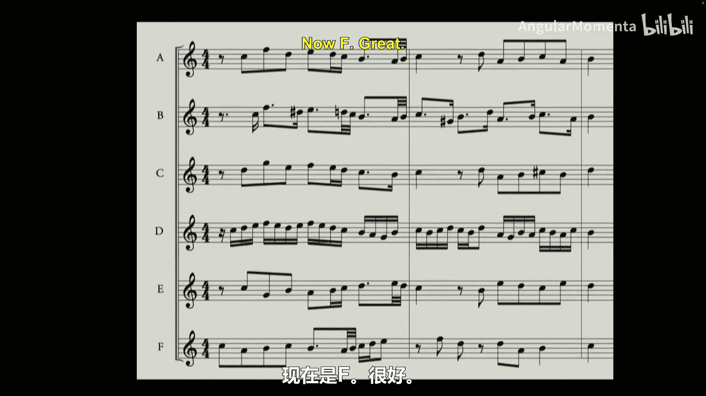

**视点** 是一个映射函数，它将当前事件（音符）及其所有前序事件的信息映射为一个符号（通常是整数或浮点数）。

例如，对于同一个音乐片段，我们可以有不同的视点表示：
*   **音高视点**：生成一个MIDI音符编号序列，例如 `[83, 83, 83, 85]`。
*   **时值视点**：生成一个时值序列，例如 `[0.5, 0.5, 0.5, 2]`。
*   **音程视点**：生成一个音程序列，例如 `[0, 0, 2]`。

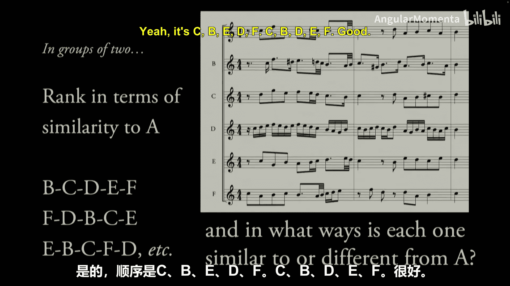

这种方法的优势在于：
*   **直接处理变换**：例如，对一个片段进行八度移调，其音高视点会改变，但音程视点保持不变。任何寻找该音程序列的模式挖掘算法都会将它们识别为相同。
*   **简化复杂表示**：音乐具有复杂的逻辑结构，视点通过将乐谱视为重叠的信息层，简化了其表示形式。

---

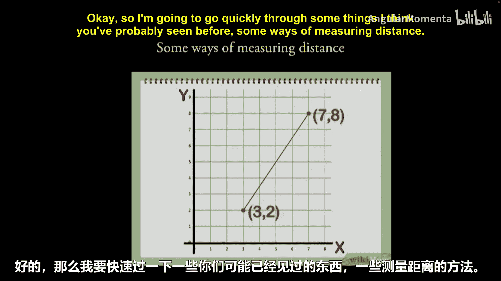

## 距离函数
然而，仅靠视点变换不足以处理所有相似性问题。例如，《Baby Shark》中的两个绿色片段，没有任何视点表示能直接将一个转换为另一个。

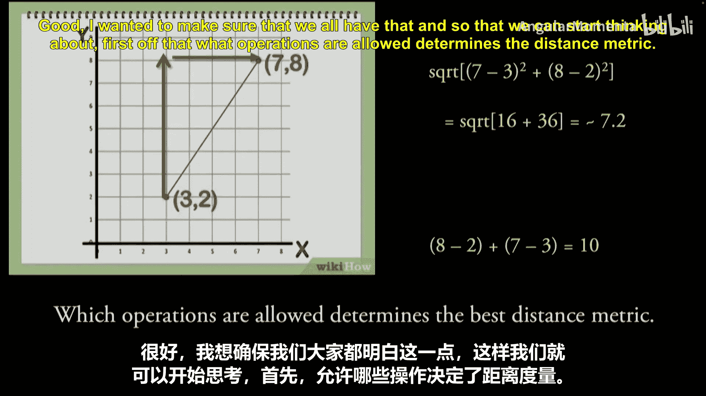

因此，我们需要一个数学工具来评估两个片段之间的差异程度，即**距离函数**。距离函数接收两个对象，并返回一个非负实数，用以衡量它们的不相似度。

在序列（如视点表示的序列）的语境下，一个常用且简单的距离函数是**莱文斯坦距离**（编辑距离）。

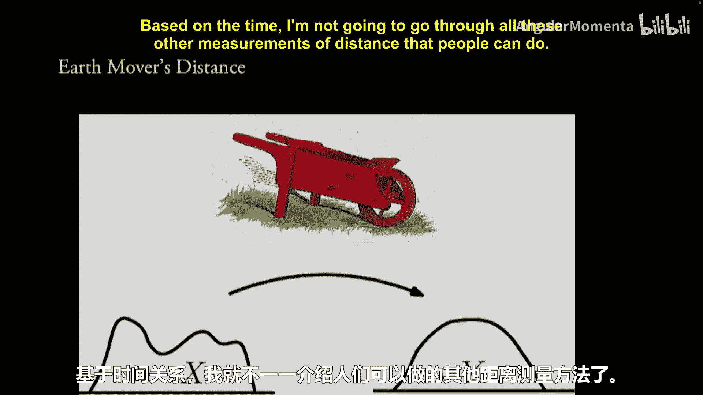

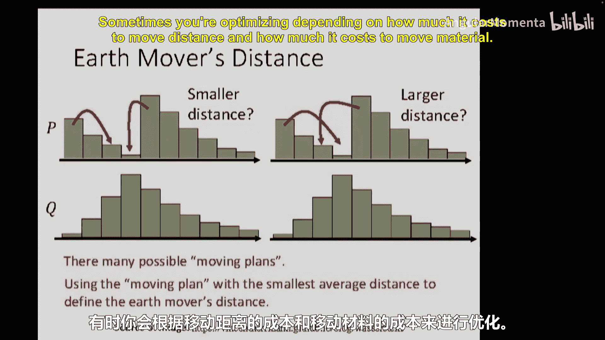

**莱文斯坦距离** 定义为将一个序列转换为另一个序列所需的最少编辑操作次数（插入、删除、替换）。

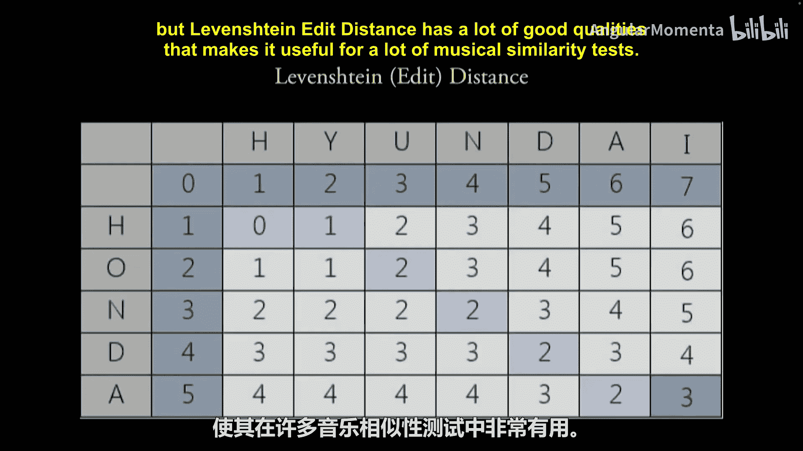

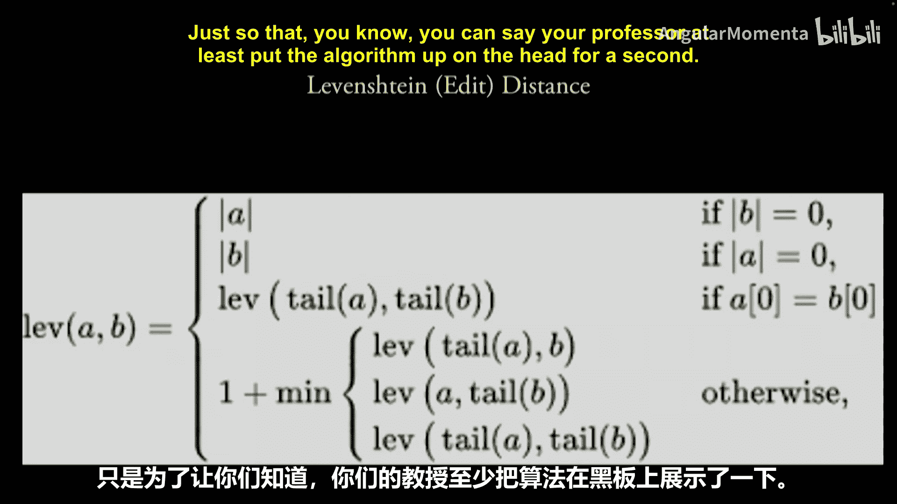

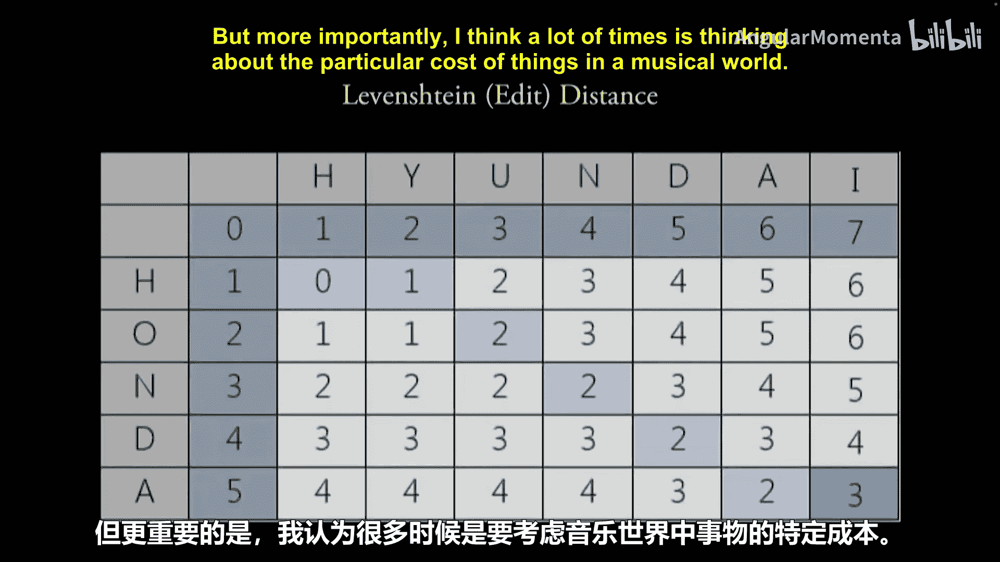

例如，将时点序列 `[0.5, 0.5, 0.5]` 转换为 `[0.5, 0.5, 2]` 只需要 **1** 次替换操作。而两个完全不同的片段，其编辑距离会大得多。

---

## 模式检测算法框架
基于视点表示和距离函数，我们可以构建一个模式检测算法。

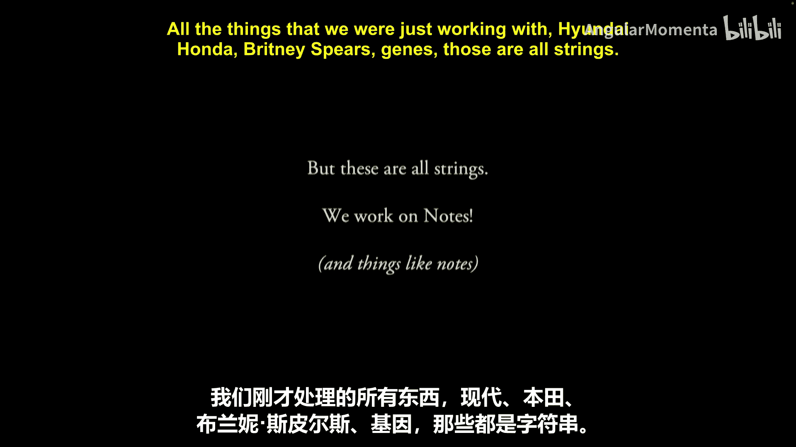

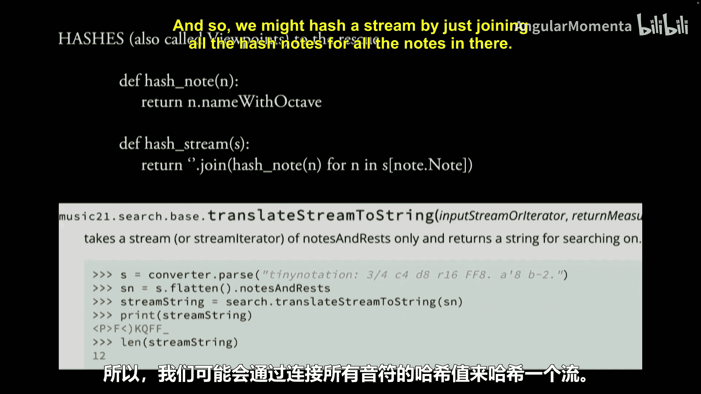

**算法输入**：
1.  **音乐语料库**：待分析的乐曲或作品集。
2.  **视点表示**：用户选择的特征表示方式。
3.  **参数**：
    *   `min_support`：模式被视为“频繁”所需的最小重复次数。
    *   `min_length`, `max_length`：要挖掘的模式长度范围。
    *   控制相似度阈值的参数。

**算法输出**：
一个包含所有频繁模式的列表，以及每个模式在乐谱中出现的位置。

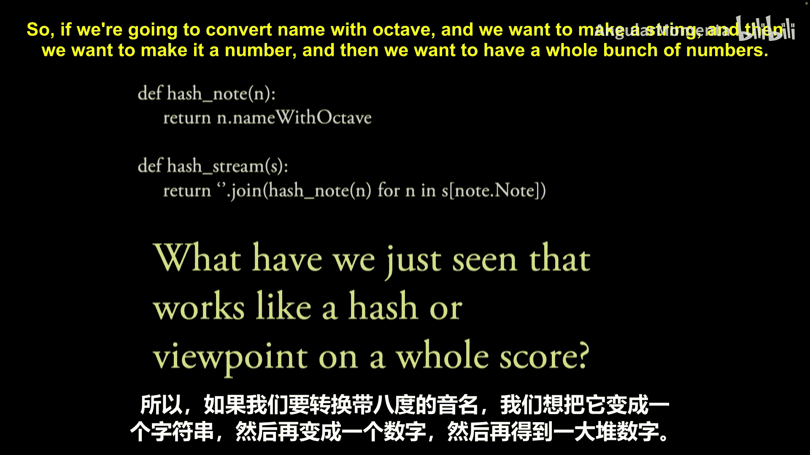

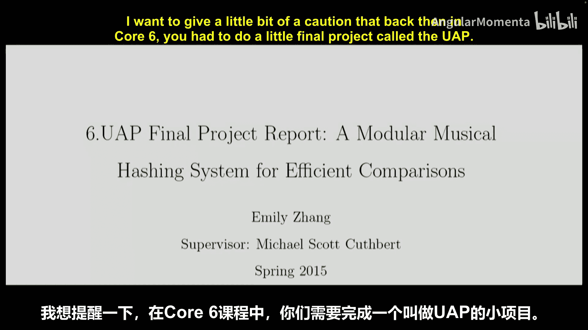

**算法步骤概述**：
1.  **创建初始数据库**：使用滑动窗口（长度为 `min_length`）遍历乐谱，生成所有候选片段及其位置的数据库。
2.  **度量模式分组**：比较每一对片段，如果它们之间的距离满足约束条件（即足够相似），则将它们归入同一个“度量模式”组。
3.  **剪枝**：删除那些出现次数未达到 `min_support` 的组。
4.  **模式扩展**：通过重叠较短的度量模式，形成更长的模式。

---

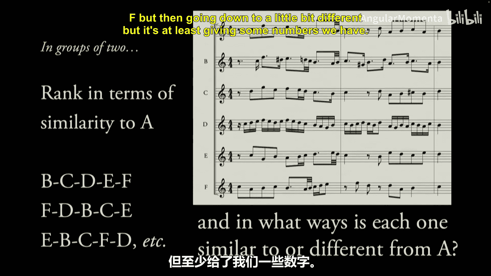

## 实际应用与总结
本节课中，我们一起学习了音乐模式检测的基本流程。我们了解到：
*   音乐相似性没有唯一正确答案，但可以通过计算工具进行量化。
*   **视点表示法** 是简化音乐信息和封装音乐变换的有效工具。
*   **距离函数**（如莱文斯坦距离）提供了衡量序列差异的方法。
*   结合视点和距离函数，可以构建自动化的模式检测算法，用于音乐分析、风格分类、即兴演奏研究乃至抄袭检测等多个领域。

通过定义合适的视点、等价类和距离度量，我们可以让计算机系统更好地对齐我们对音乐相似性的直觉理解。关键在于，这些工具的选择决定了算法将何种特征视为重要，从而直接影响其分析结果。