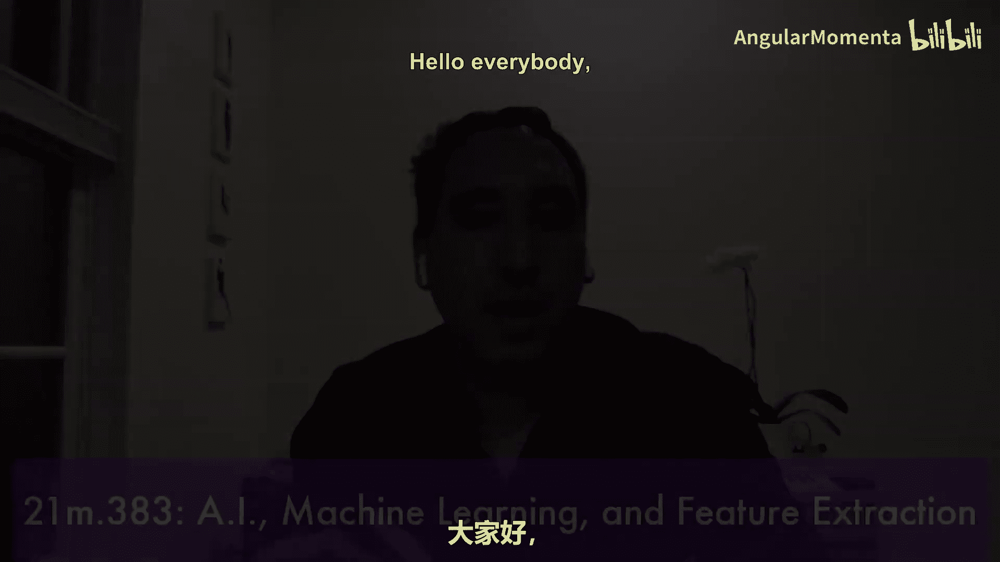
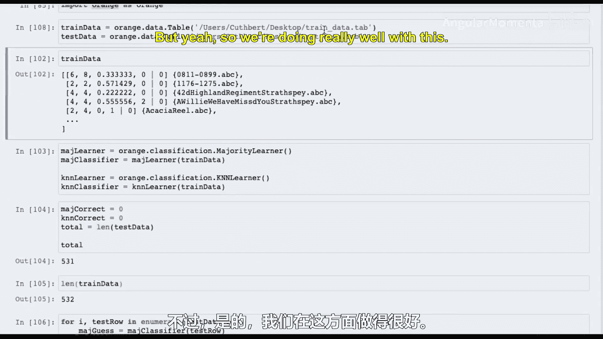
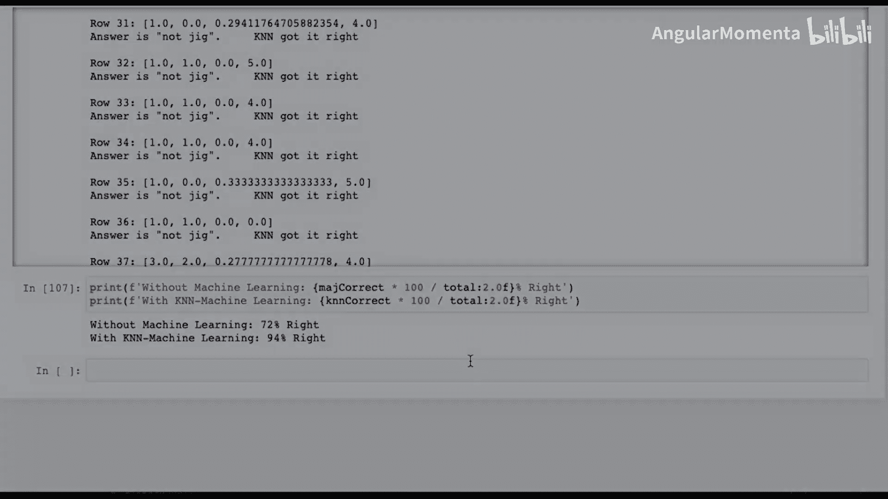
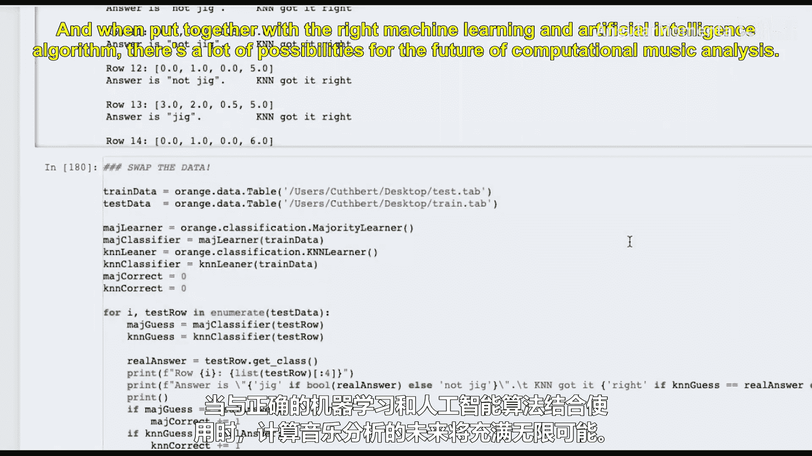
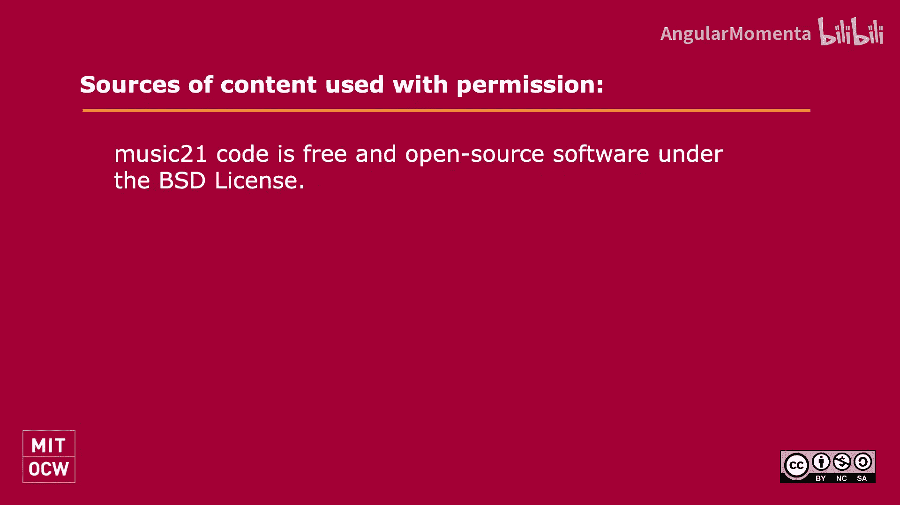

#  044：人工智能 🎵🤖




在本节课中，我们将学习如何利用机器学习和人工智能来深入理解音乐行为、音乐理论以及音乐本身。我们将从最基础的概念开始，探讨如何将音乐转化为计算机能够学习和处理的数据格式。

## 概述

我们的首要任务是理解如何将音乐乐谱转换成计算机能够学习的格式，因为单独的乐谱本身并不能直接用于人工智能分析。因此，我们将从**特征提取**开始，这是将音乐乐谱转换为智能数值数据的关键步骤。我们将学习特征提取如何使机器学习成为可能。

## 什么是特征？🔍

首先，我们需要理解什么是“特征”。特征是一个非常基础的概念。让我们通过一个例子来说明。

假设我们有一首乐曲。我们将从 Music21 的语料库中加载一首巴赫的众赞歌。

```python
from music21 import corpus
bach = corpus.parse('bach/bwv66.6')
```

现在，让我们从这个作品中手动提取两个特征。

```python
num_parts = len(bach.parts)  # 声部数量特征
ts_numerator = bach.flat.getTimeSignatures()[0].numerator  # 拍号分子特征
```

特征提取就是将音乐元素（或任何元素）转换为单个数字、列表或数字向量的过程。正如你所见，它本质上就是一堆数字。特征提取抽离了音乐的“生命血液”，将音乐中一切美好的事物转化为数字。然而，世界上所有令人惊叹的机器学习、人工智能和深度学习算法都有一个共同点：它们都只能处理数字集合或数字向量。因此，如果我们要对音乐记谱法进行人工智能分析或预测，至少目前，我们需要将音乐转换为数字。这就是特征提取的意义。

## 基础特征提取示例

让我们编写一个函数来自动提取乐曲的拍号。

```python
from typing import Tuple
from music21 import stream, meter

def extract_meter(score: stream.Stream) -> Tuple[int, int]:
    """
    提取乐谱中第一个拍号的分子和分母。
    如果未找到拍号，则返回 (0, 0)。
    """
    meters = score.recurse().getElementsByClass(meter.TimeSignature)
    if not meters:
        return (0, 0)
    first_meter = meters[0]
    return (first_meter.numerator, first_meter.denominator)
```

我们返回 (0, 0) 而不是抛出异常，是因为在特征提取中，通常希望返回一个“越界”数字，而不是让整个处理流程因为某首乐曲（例如没有拍号的格里高利圣咏）而失败。但这也引出了一个关于人工智能伦理的思考：我们是否应该隐藏错误？作为未来的技术从业者，我们需要思考这些问题。

现在，让我们测试这个函数。

```python
print(extract_meter(bach))  # 输出: (4, 4)
```

## 构建更复杂的特征

假设我们想预测一首乐曲是否是华尔兹。我们可能首先会想到拍号。一个简单的假设是：华尔兹的拍号是 3/4。但这是最糟糕的假设之一，因为最著名的华尔兹《蓝色多瑙河》的开头是 6/8 拍的慢板引子。

让我们加载《蓝色多瑙河》并检查。

```python
from music21 import converter
blue_danube = converter.parse('/path/to/blue_danube.musicxml')
print(extract_meter(blue_danube))  # 这个版本可能直接是 3/4，忽略了引子
```

这提醒我们“垃圾进，垃圾出”的原则。在人工智能中，我们必须确保训练数据的正确性。

除了拍号，我们还可以观察其他模式。例如，在华尔兹中，第三拍（偏移量2）的音高是否经常高于第一拍（偏移量0）？让我们创建一个特征来检查这个比例。

首先，编写一个函数判断单个小节中第三拍是否高于第一拍。

```python
def is_beat3_above_beat1(measure: stream.Measure) -> bool:
    """检查给定小节中，偏移量2处的音符音高是否高于偏移量0处的音符音高。"""
    notes = stream.Stream(measure.recurse().getElementsByClass('Note'))
    beat1_notes = [n for n in notes if n.offset == 0.0]
    beat3_notes = [n for n in notes if n.offset == 2.0]

    if not beat1_notes or not beat3_notes:
        return False

    # 取每个位置的第一音符
    first_beat1_note = beat1_notes[0]
    first_beat3_note = beat3_notes[0]

    # 比较音高（使用MIDI音高空间）
    return first_beat3_note.pitch.ps > first_beat1_note.pitch.ps
```

接着，编写函数计算整首乐曲中满足此条件的小节比例。

```python
def proportion_beat3_above_beat1(score: stream.Stream) -> float:
    """计算乐谱中所有小节里，第三拍高于第一拍的小节比例。"""
    total_measures = 0
    waltz_like_measures = 0

    for measure in score.recurse().getElementsByClass('Measure'):
        total_measures += 1
        if is_beat3_above_beat1(measure):
            waltz_like_measures += 1

    if total_measures == 0:
        return 0.0
    return waltz_like_measures / total_measures
```

测试这个特征。

```python
print(proportion_beat3_above_beat1(blue_danube))
print(proportion_beat3_above_beat1(bach))
```

## 组合多个特征

现在，让我们创建一个特征提取器，将多个特征组合成一个元组输出。这对于机器学习算法准备数据非常有用。

```python
def multi_feature_extractor(score: stream.Stream, ground_truth_func=None) -> tuple:
    """
    组合多个特征提取器。
    返回: (文件名, 拍号分子, 拍号分母, 第三拍高于第一拍的比例, 升号数, 真实标签)
    """
    file_name = score.metadata.title or str(score.filePath)
    meter_num, meter_den = extract_meter(score)
    beat3_prop = proportion_beat3_above_beat1(score)
    # 假设有一个提取升号数的函数 get_sharps
    sharps = get_sharps(score)  # 需要提前定义此函数

    # 真实标签（例如，是否是吉格舞曲）。这里用函数参数灵活定义。
    if ground_truth_func:
        ground_truth = ground_truth_func(file_name)
    else:
        ground_truth = 0  # 默认值

    return (file_name, meter_num, meter_den, beat3_prop, sharps, ground_truth)

# 示例：定义一个判断文件是否包含‘jig’的函数
def is_jig_from_filename(filename: str) -> int:
    """根据文件名判断是否是吉格舞曲。返回1（是）或0（否）。"""
    return 1 if 'jig' in filename.lower() else 0
```

## 从特征提取到机器学习 🧠

上一节我们介绍了如何从音乐中提取多种特征。本节中，我们来看看如何将这些特征数据用于机器学习。

机器学习的一个重要概念是，我们需要用一部分数据来训练算法（训练集），然后用另一部分未见过的数据来测试算法的性能（测试集）。这里我们采用一种简单的方法：将数据交替分为训练集和测试集。

首先，我们需要将提取的特征写入文件，以供机器学习工具包读取。

```python
import csv

def write_features_to_file(features_list, train_filename, test_filename):
    """将特征列表写入训练和测试文件（TSV格式）。"""
    columns = ['filename', 'meter_num', 'meter_den', 'beat3_prop', 'sharps', 'is_jig']
    descriptions = ['string', 'discrete', 'discrete', 'continuous', 'discrete', 'class']

    with open(train_filename, 'w', newline='') as train_file, \
         open(test_filename, 'w', newline='') as test_file:

        train_writer = csv.writer(train_file, delimiter='\t')
        test_writer = csv.writer(test_file, delimiter='\t')

        # 写入列名和描述
        train_writer.writerow(columns)
        train_writer.writerow(descriptions)
        test_writer.writerow(columns)
        test_writer.writerow(descriptions)

        # 交替写入数据
        for i, feature_tuple in enumerate(features_list):
            if i % 2 == 0:
                train_writer.writerow(feature_tuple)
            else:
                test_writer.writerow(feature_tuple)

# 假设 all_features 是一个包含所有乐曲特征元组的列表
# write_features_to_file(all_features, 'train_data.tab', 'test_data.tab')
```

## 使用机器学习算法

文件准备好后，我们可以使用机器学习库（如 `orange3`）来加载数据并训练分类器。以下是一个使用 K-最近邻算法进行分类的简化示例。

```python
import Orange

# 加载数据
train_data = Orange.data.Table('train_data.tab')
test_data = Orange.data.Table('test_data.tab')

# 创建学习器
# 1. 多数类学习器（基准）
majority_learner = Orange.classification.MajorityLearner()
# 2. K-最近邻学习器
knn_learner = Orange.classification.KNNLearner()

# 在训练数据上训练分类器
majority_classifier = majority_learner(train_data)
knn_classifier = knn_learner(train_data)

# 在测试集上评估
majority_correct = 0
knn_correct = 0
total = len(test_data)

for i, test_row in enumerate(test_data):
    true_answer = test_row.get_class()
    majority_guess = majority_classifier(test_row)
    knn_guess = knn_classifier(test_row)

    if majority_guess == true_answer:
        majority_correct += 1
    if knn_guess == true_answer:
        knn_correct += 1

print(f"多数类学习器正确率: {majority_correct/total*100:.1f}%")
print(f"K-最近邻学习器正确率: {knn_correct/total*100:.1f}%")
```





## 使用 Music21 的特征提取模块 🧰

手动编写所有特征提取器可能很繁琐。幸运的是，Music21 提供了一个 `features` 模块，其中包含许多预定义的特征提取器，这些提取器基于如 jSymbolic 等工具包。

以下是使用 Music21 特征模块的流程：

```python
from music21 import features

# 创建数据集对象
training_set = features.DataSet(classLabel='is_jig')
testing_set = features.DataSet(classLabel='is_jig')

# 添加一系列预定义的特征提取器（例如，一组旋律和节奏特征）
feature_ids = ['p1', 'p2', 'r1', 'r31', 'r32']  # 示例ID，具体需查阅文档
for fid in feature_ids:
    training_set.addFeatureExtractor(features.extractorsById(fid))
    testing_set.addFeatureExtractor(features.extractorsById(fid))

# 遍历语料库，将乐曲流添加到数据集中
for metadata_entry in corpus.search('ryansMammoth'):  # 假设的搜索
    piece = metadata_entry.parse()
    file_name = piece.metadata.title
    is_jig = 1 if 'jig' in file_name.lower() else 0

    # 决定加入训练集还是测试集（这里简化处理）
    if some_condition:
        training_set.addData(piece, classValue=is_jig, id=file_name)
    else:
        testing_set.addData(piece, classValue=is_jig, id=file_name)

# 处理数据集并写入文件
training_set.process()
training_set.write('train_features.tab')
testing_set.process()
testing_set.write('test_features.tab')
```

使用这些自动提取的大量特征进行机器学习，流程与之前类似。但关键教训是：**特征的选择至关重要**。盲目添加大量不相关的特征可能不会带来性能提升，甚至可能因为数据维度灾难而降低效果。精心设计、与任务相关的少数特征往往比一大堆随机特征更有效。

## 总结

本节课中，我们一起学习了人工智能在音乐分析中的应用基础。我们从**特征提取**开始，理解了如何将音乐乐谱转换为机器可读的数值特征。我们动手编写了提取拍号、音高模式等特征的函数，并将多个特征组合起来。

接着，我们探讨了**机器学习**的基本流程：准备数据、划分训练集与测试集、使用分类算法进行训练和评估。我们看到了即使是简单的 K-最近邻算法，在精心选择的特征上也能取得不错的效果。



最后，我们介绍了 Music21 提供的特征提取工具包，它可以帮助我们快速应用大量预定义的特征，但也强调了特征工程中“质量优于数量”的原则。



通过本课，你已经掌握了使用计算工具对音乐进行智能分析的基础。未来你可以将此应用于风格分类、作曲家识别、音乐生成等更多有趣的项目中。记住，好的分析始于对数据和问题本身的深刻理解。