#  045：数学与统计音乐学 📊🎵


在本节课中，我们将探讨计算音乐学中数学与统计方法的应用。我们将了解如何利用这些工具来研究历史音乐文献，特别是中世纪音乐的片段，并学习如何通过编程和数据分析来揭示音乐作品之间的关系。

---

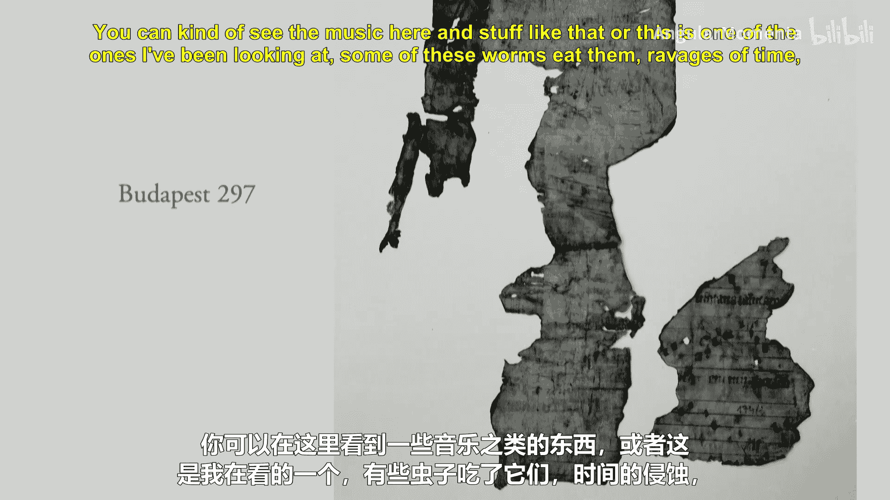

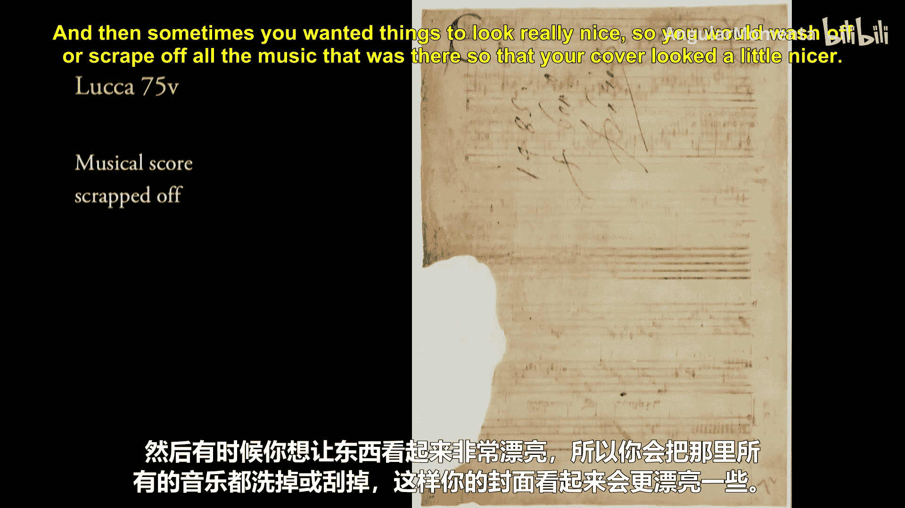

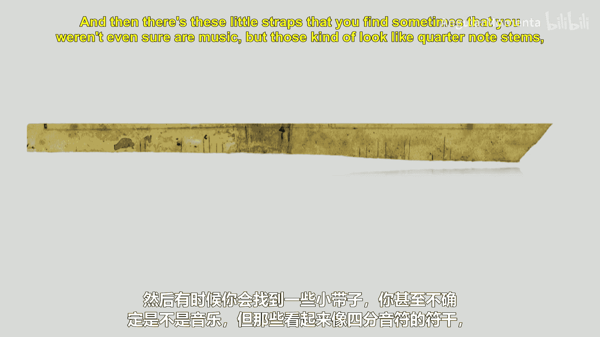

## 概述

本节课将分为几个部分。首先，我们将了解讲师如何利用统计学方法估算中世纪音乐的失传比例。接着，我们将探讨如何通过计算技术来识别和匹配音乐片段。最后，我们将学习如何使用音乐可视化工具来分析现代音乐作品的结构。

---

## 中世纪音乐研究中的统计学应用

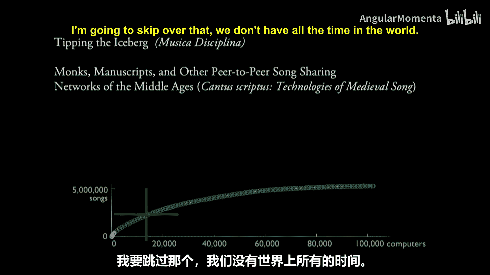

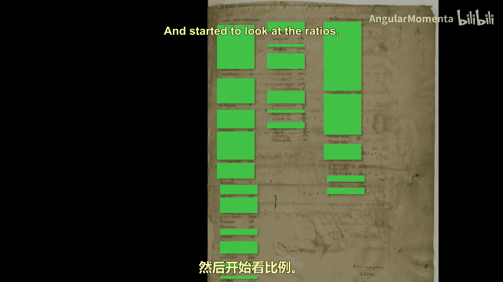

上一节我们介绍了课程的整体方向，本节中我们来看看如何将统计学应用于中世纪音乐研究。

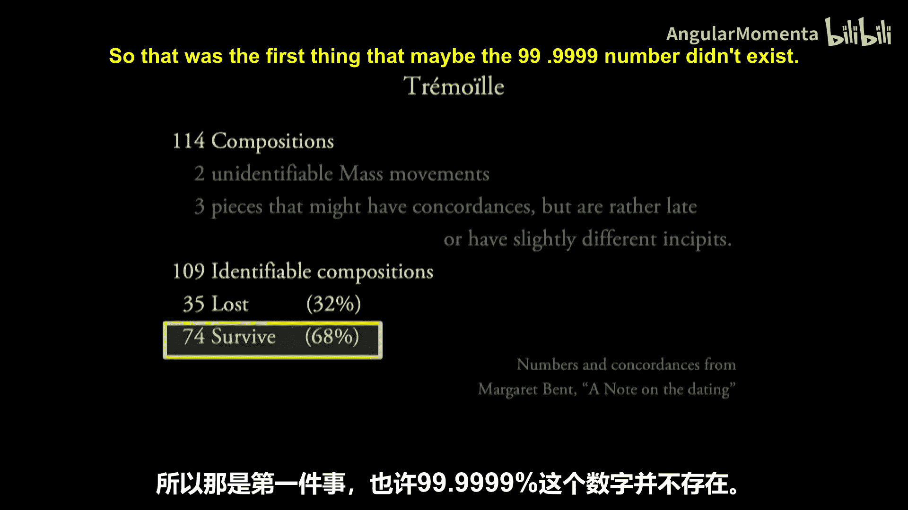

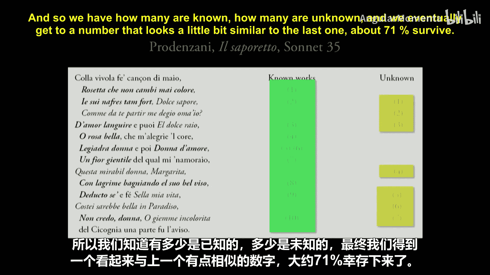

讲师的研究方向是中世纪音乐史，特别是14世纪意大利的复调音乐。许多历史音乐手稿已经遗失或损坏，只剩下一些碎片。传统的研究方法需要耗费大量时间进行人工比对和复原。

为了估算有多少音乐作品已经失传，讲师借鉴了生态学中估算动物种群数量的方法。以下是其核心思路：

1.  **核心公式**：失传作品的数量 = 原始作品总数 × 任一作品失传的概率。
2.  **问题**：这个公式中有三个未知数：原始作品总数、失传作品数量和失传概率。
3.  **解决方法**：通过分析现存手稿中作品的重复出现情况来估算。如果一个作品出现在一份手稿中，可以将其视为被“标记”。通过统计在其他手稿中再次遇到这个“标记”作品的概率，可以反推总体数量。

以下是简化的推导过程：

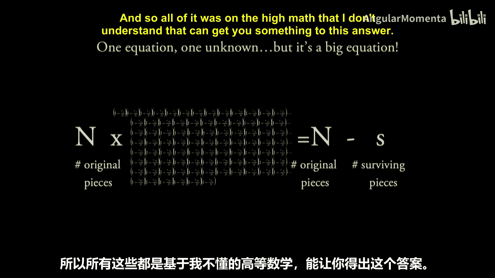

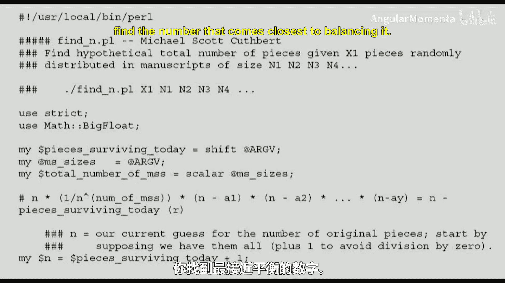

*   一个作品出现在某份手稿中的概率是：`R_i / N`（`R_i` 是该手稿中的作品数，`N` 是原始作品总数）。
*   一个作品不出现在某份手稿中的概率是：`1 - (R_i / N)`。
*   一个作品不出现在所有已知的 `M` 份手稿中的概率是：`∏_{i=1}^{M} [1 - (R_i / N)]`。这个值也等于任一作品失传的概率。
*   失传作品数量也等于：`N - S`（`S` 是现存作品总数）。

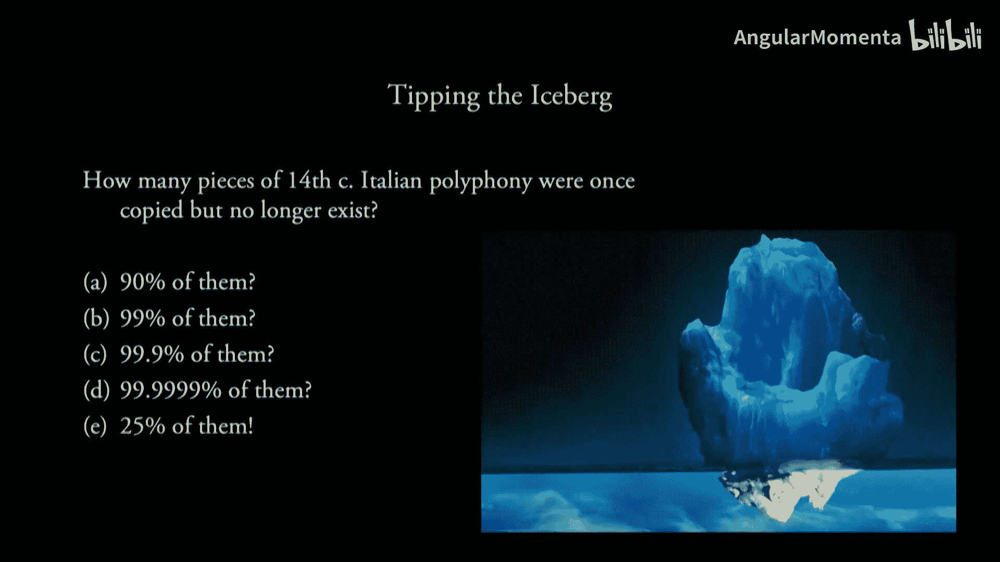

通过联立方程，可以将问题简化为只含一个未知数 `N` 的方程。由于这是一个高次方程，讲师通过编程（使用Perl语言）进行数值求解，即尝试不同的 `N` 值，计算方程两边的误差，找到最平衡的解。

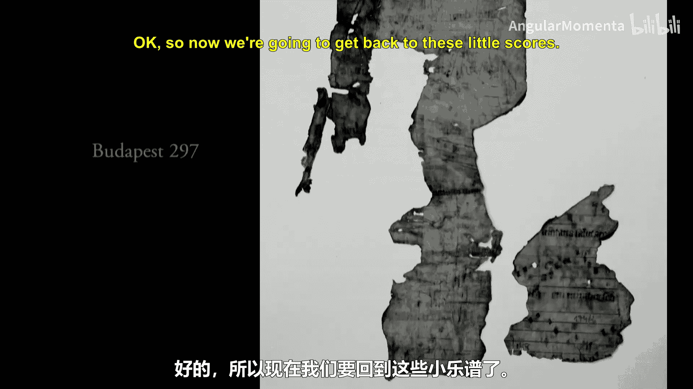

研究结果表明，不同体裁的音乐失传比例不同。例如，用于宗教仪式的弥撒曲失传较多，而世俗歌曲（如关于爱情和舞蹈的歌曲）保存相对完好。总体估算，约有25%到60%的14世纪音乐作品得以存世，而非此前认为的极低比例。

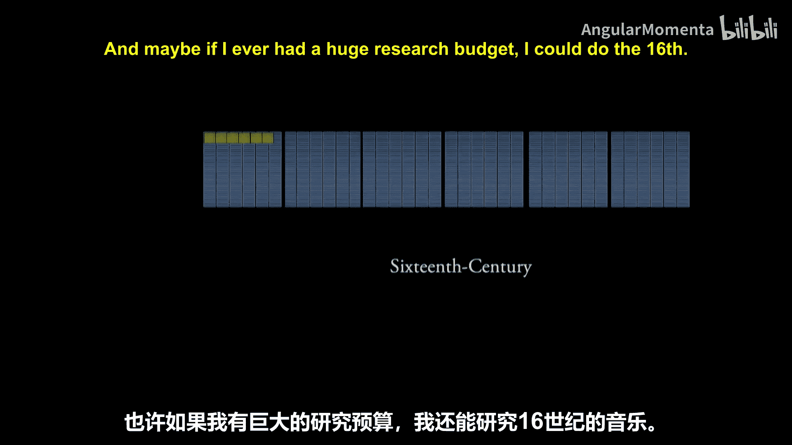

---

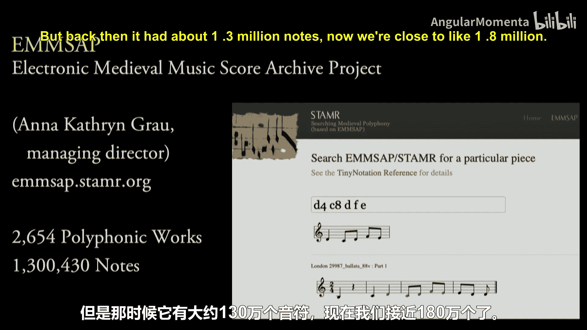

## 使用计算技术匹配音乐片段

在确定了有相当数量的作品存世后，下一步就是尝试识别那些残缺的音乐碎片具体对应哪些已知作品。

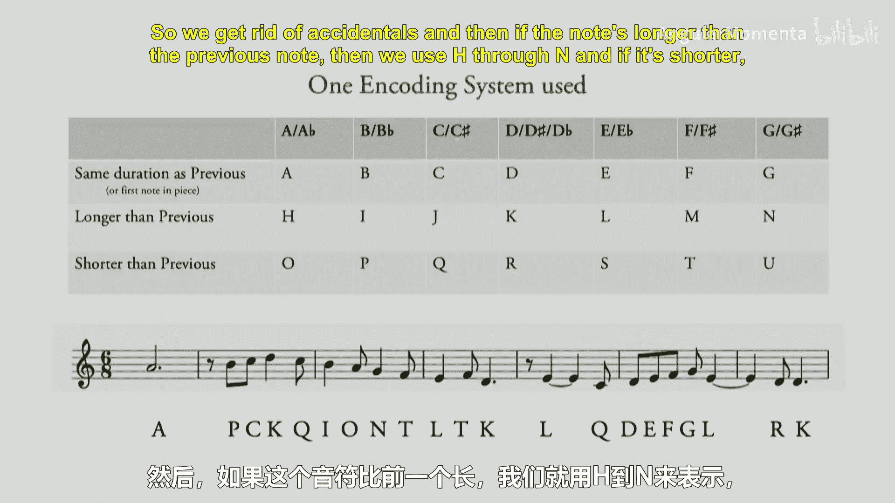

讲师参与了一个名为“中世纪音乐评分档案项目”（MSAP）的项目，该项目将大量中世纪音乐数字化。为了在这些海量数据中寻找匹配，需要进行海量的两两比较。例如，一个包含约150首作品的曲集，需要进行的比较次数约为 `(150^2)/2 = 11,250` 次。而整个14世纪音乐的数据量更大，比较次数可能达到数百万甚至更多。

以下是实现自动匹配的技术流程：

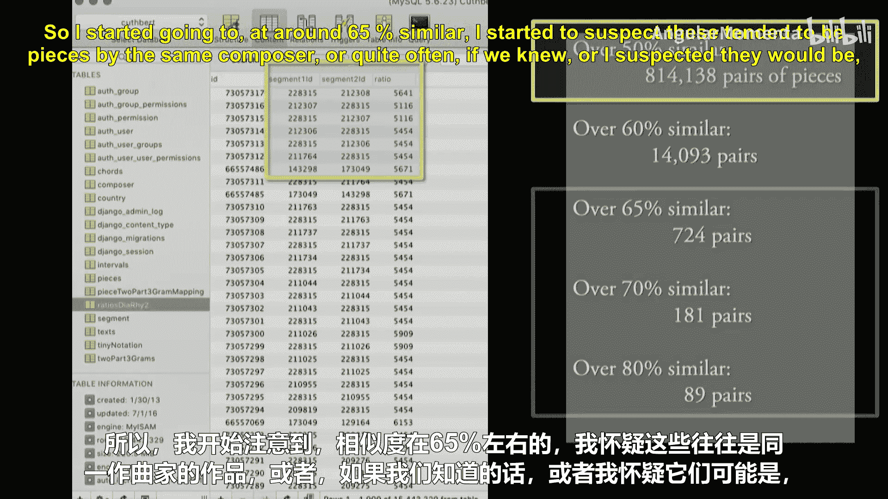

1.  **数据准备**：将扫描的乐谱通过Finale等软件录入，并导出为MusicXML格式。
2.  **分段处理**：使用Python和Music21库，将每首作品切分成固定长度（例如31个音符）的连续片段，滑动窗口为1个音符。
3.  **特征编码**：为了高效比较，将每个音符片段编码成一个字符串序列（哈希）。编码规则基于音符时值的相对变化：
    *   如果时值与前一音符相同，编码为字母 A-G。
    *   如果时值更长，编码为 H-N。
    *   如果时值更短，编码为 O-U。
    *   忽略升降号，因为中世纪记谱中临时记号有时不写。
4.  **相似度计算**：将编码后的片段两两比较，使用编辑距离（如莱文斯坦距离）等算法计算相似度，得到一个0到1之间的分数（存储时乘以10000转换为整数）。
5.  **结果筛选**：经验表明，相似度超过80%的片段基本可以确定为同一作品的不同部分。相似度在65%-70%之间可能指向同一作曲家或风格模仿。

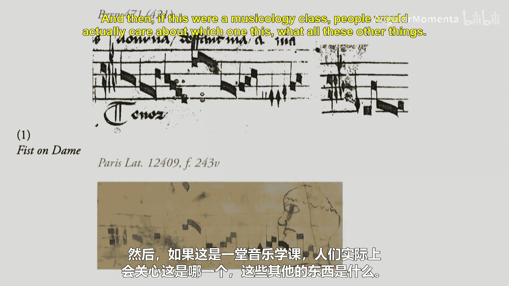

通过这种方法，研究者发现了许多之前未知的作品引用和抄袭关系，例如约翰内斯·奇科尼亚的作品中引用了匿名的德国歌曲，以及一些法国和意大利作品之间复杂的互文关系。

Music21库的创建初衷正是为了辅助这类中世纪音乐碎片的研究，因此其中包含了许多针对早期音乐分析的特定功能。

---

## 音乐可视化分析实践

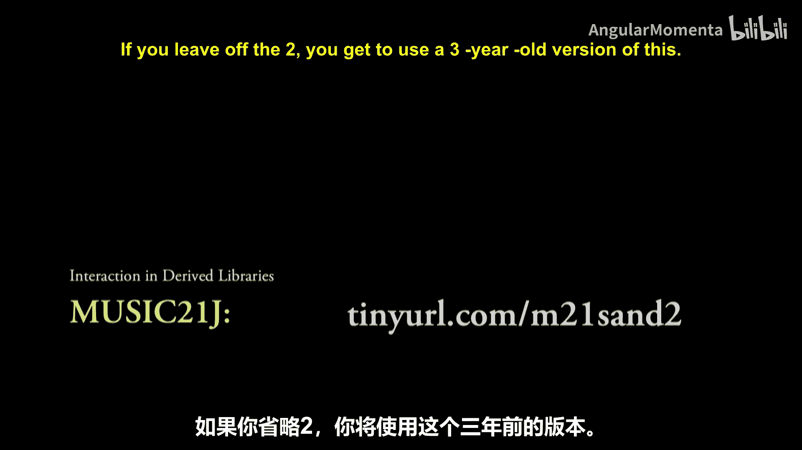

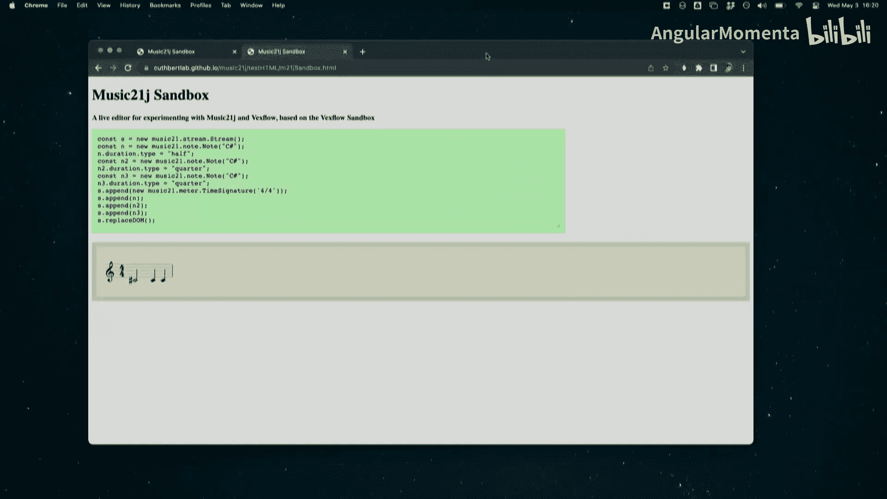

现在，让我们转向现代音乐的分析，并学习如何使用可视化工具。

我们将分析爱沙尼亚作曲家阿沃·帕特（Arvo Pärt）的合唱作品《Which Was the Son of...》。首先，我们聆听这首作品，并尝试感知其结构。

通过聆听和分析，我们可以发现：
*   作品大致分为三个部分。
*   节拍在2/4和3/4之间规律切换。
*   中间声部（女低音和男高音）的旋律最为活跃。

为了更直观地验证和分析这些特征，我们可以使用Music21进行可视化。

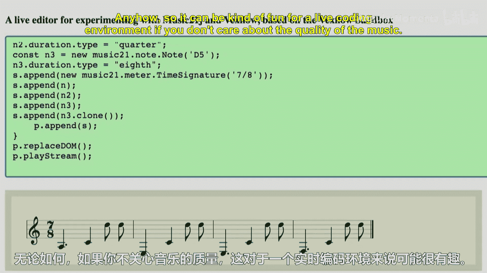

以下是使用Music21进行可视化分析的步骤：

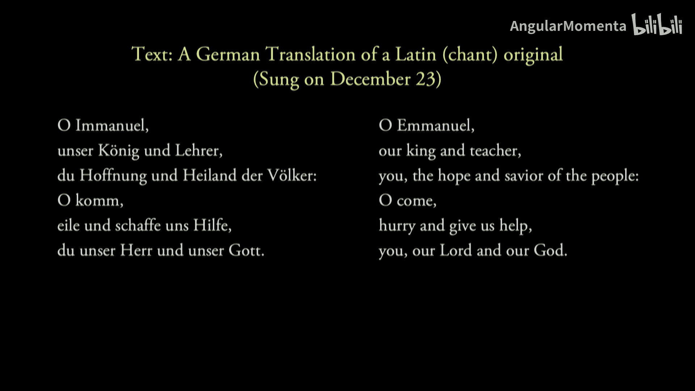

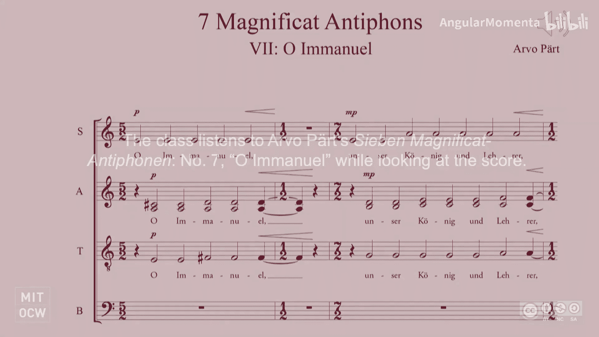

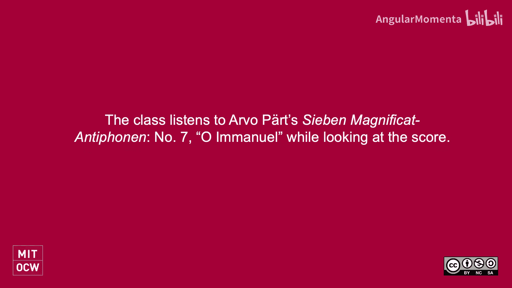

1.  **载入乐谱**：从MusicXML文件加载作品。
    ```python
    from music21 import *
    arvo = converter.parse('path_to_musicxml.xml')
    ```

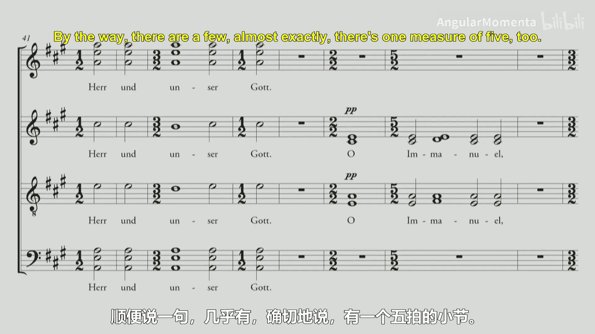

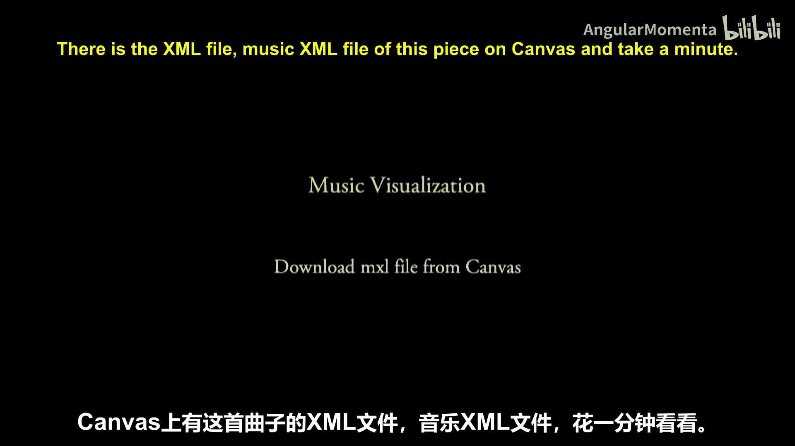

2.  **绘制钢琴卷帘图**：这是最基础的视图，可以展示所有声部音符的音高和时序。
    ```python
    arvo.plot('pianoroll')
    ```
    通过钢琴卷帘图，可以清晰地看到作品的三个段落，以及中间段落内声部的活跃运动。

3.  **分段分析**：我们可以将作品分成三个部分，并分别绘制。
    ```python
    sec1 = arvo.measures(1, 13)
    sec2 = arvo.measures(14, 44)
    sec3 = arvo.measures(45, 76)
    sec2.plot('pianoroll')
    sec3.plot('pianoroll')
    ```
    对比第二和第三部分的图表，可以发现它们在旋律形态上非常相似，但第三部分整体移高了约五度。

4.  **深入观察模式**：通过放大观察活跃声部，可以发现它们的运动是逐步的（级进），并围绕一个中心音上下波动，形成“上-下-上-下”的固定模式。这种模式化的创作正是阿沃·帕特“钟鸣作曲法”的特点。

5.  **其他可视化**：Music21的`.plot()`方法支持多种图表类型。
    *   **声部进入与力度图**：可以显示各个声部在何时演唱以及力度变化，有助于观察全曲张力起伏。
        ```python
        arvo.plot('horizontalities')
        ```
    *   **散点图**：可以探索音高与其他参数的关系，例如音高与音符时长的关系。
        ```python
        arvo.plot('scatter', 'pitch', 'quarterLength')
        ```
    *   **自定义分析图**：可以提取特定特征进行绘制，例如音高与力度的关系。
        ```python
        # 需要先提取相关数据
        # 此处为概念性代码
        # for note in arvo.recurse().notes:
        #     x_axis.append(note.pitch.midi)
        #     y_axis.append(note.volume.velocity)
        # 然后使用matplotlib等库绘制散点图
        ```

可视化工具对于快速把握大型作品的结构、识别声部间关系以及发现潜在的创作模式非常有帮助，尤其对于不熟悉传统记谱法的人来说，它是一种强大的辅助分析手段。

---

## 总结

本节课我们一起学习了数学和统计学在计算音乐学中的具体应用。

*   我们首先看到，如何通过建立统计模型（借鉴生态学方法），来估算历史中失传音乐作品的比例，从而修正了关于中世纪音乐留存数量的传统认知。
*   接着，我们深入探讨了如何利用计算技术（Music21库、特征编码、相似度算法）来处理海量音乐数据，实现音乐片段的自动识别与匹配，从而发现作品间新的联系。
*   最后，我们通过分析阿沃·帕特的作品，实践了使用音乐可视化工具（如钢琴卷帘图、各种分析图表）来直观揭示音乐作品的结构、声部运动模式和创作特征。

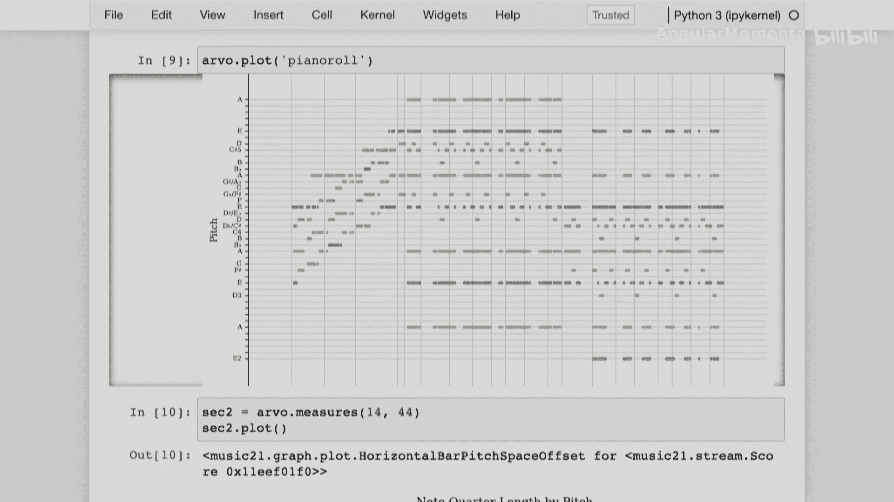

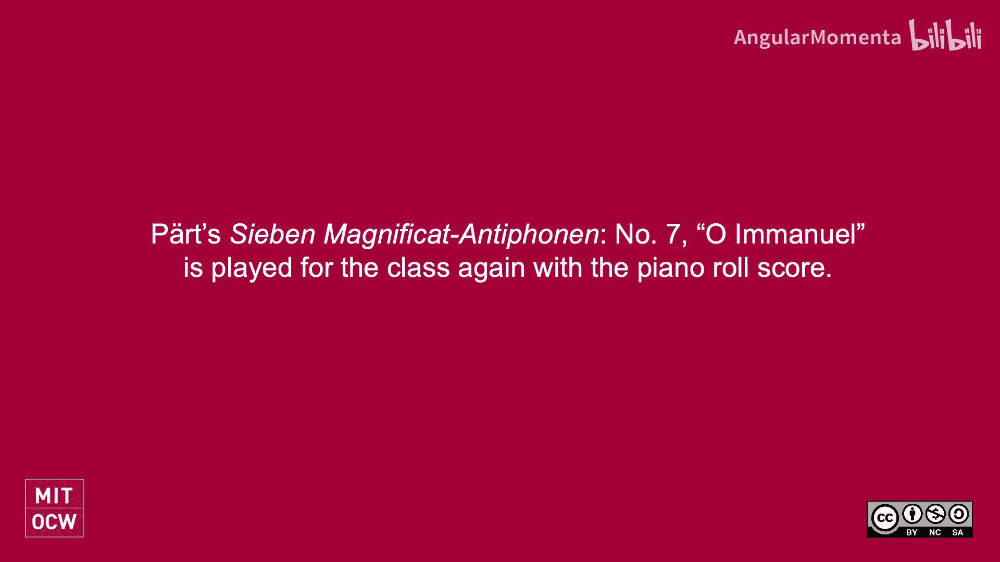

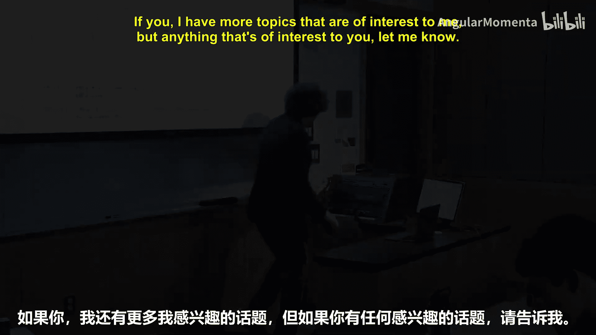

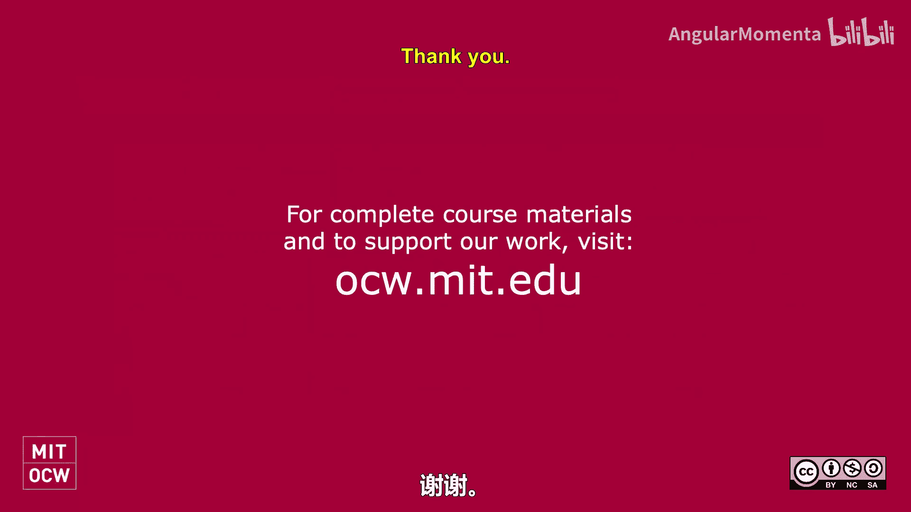

这些方法展示了计算音乐学如何将人文研究与定量分析、编程技术相结合，开辟新的研究路径和理解音乐的视角。