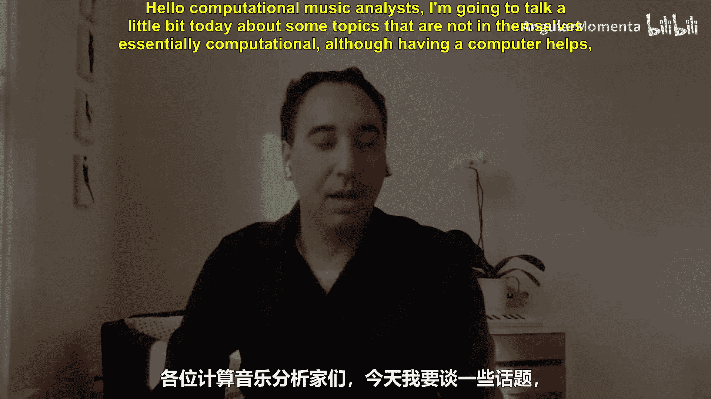
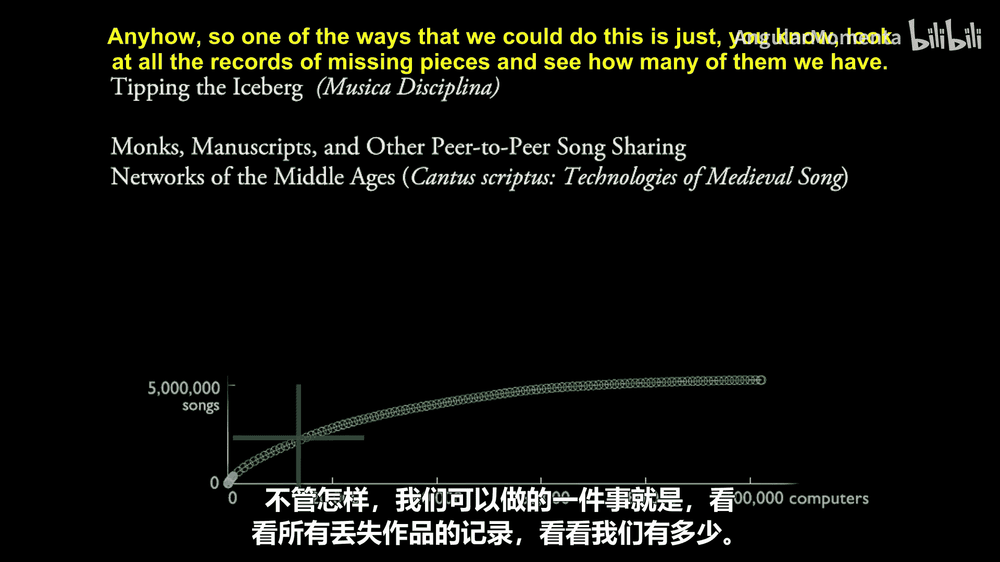
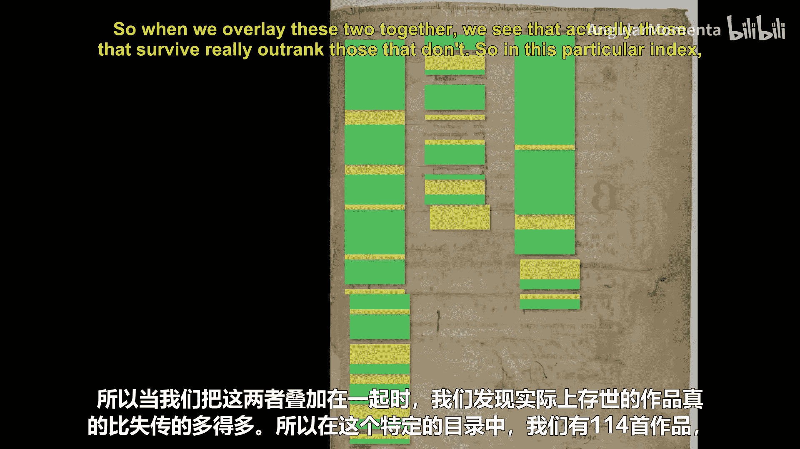
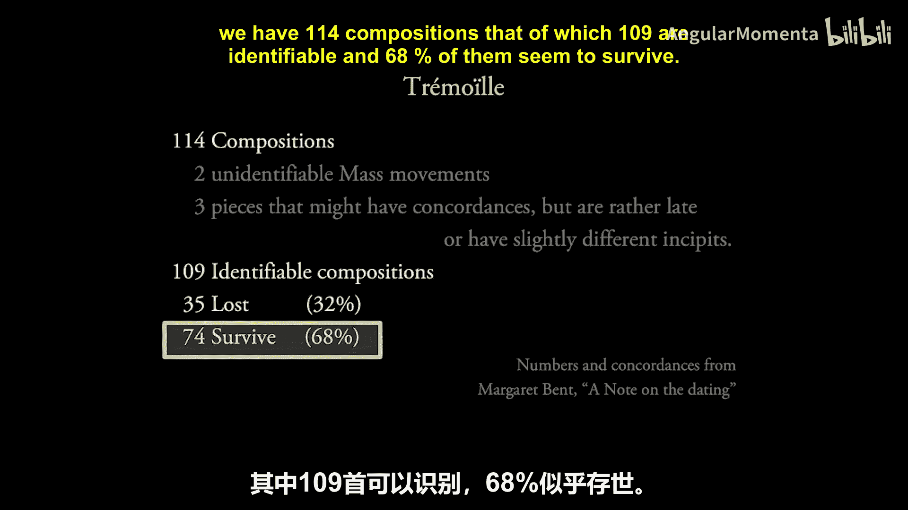
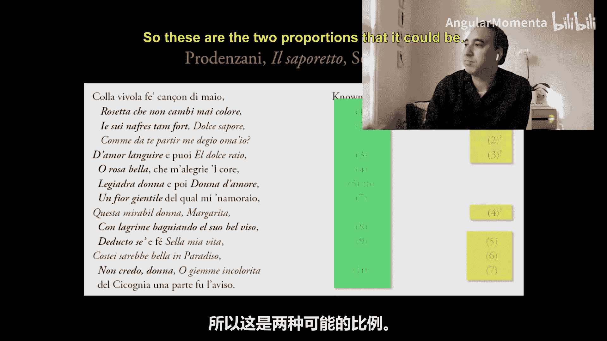
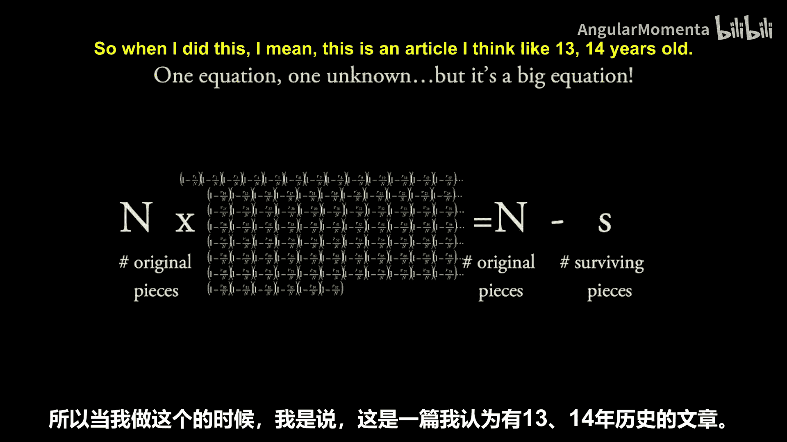
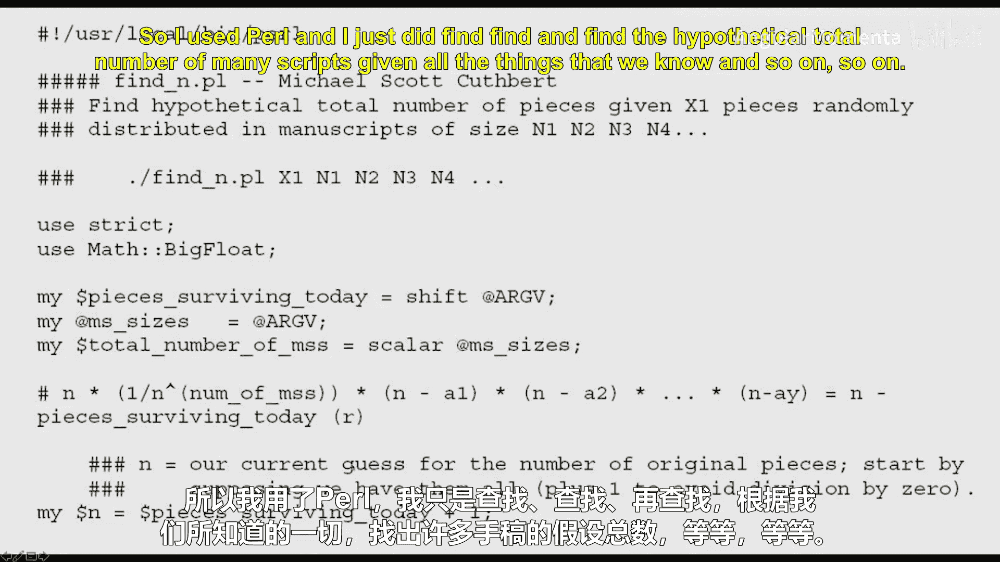
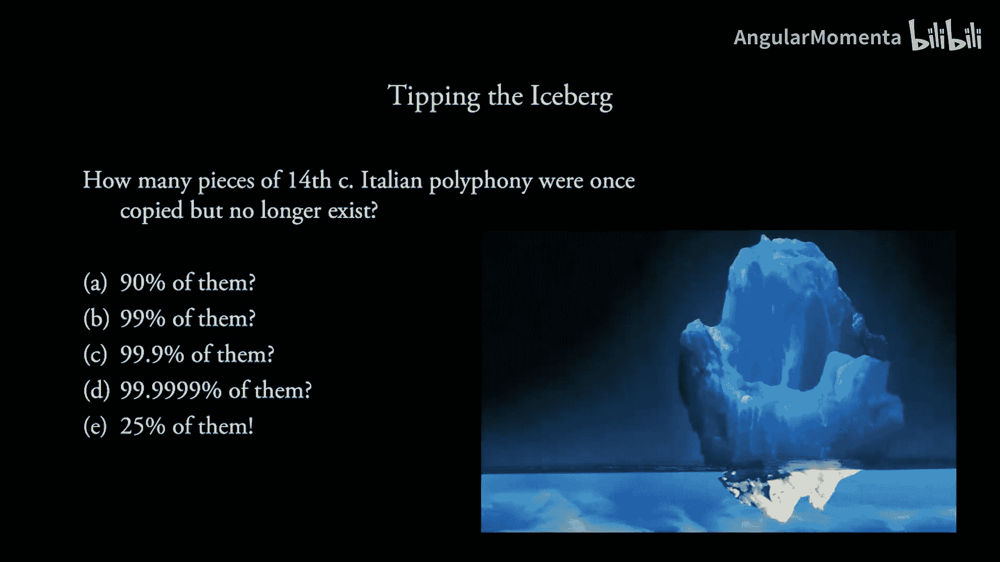
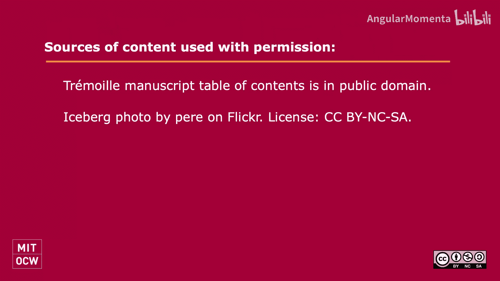

#  047：冰山一角 🧊




## 概述
在本节课中，我们将探讨如何将数学与定量思维应用于音乐分析、音乐理论和音乐史研究。我们将学习一种创新的方法，利用数据分析和简单的编程，来回答一个长期困扰音乐史学家的难题：我们究竟丢失了多少中世纪音乐作品？

## 从“冰山一角”的比喻说起
上一节我们介绍了计算音乐分析的多种可能性。本节中，我们来看看如何将定量方法应用于音乐史研究。

一个关于中世纪音乐的普遍观点是：现存的作品只是“冰山一角”，绝大部分已经遗失。但“绝大部分”究竟是多少？是90%、99%，还是99.999%？传统上，这被认为是一个无法回答的问题。

## 寻找证据：现存的线索
为了估算遗失作品的数量，我们可以先寻找一些直接的文本证据。以下是两种可以尝试的方法：

**1. 通过残存手稿的目录**
有些中世纪手稿本身已经遗失，但我们保留了它们的目录（索引）。通过对比目录中列出的作品和现存的作品，我们可以估算该手稿中作品的幸存比例。



例如，一份被称为“Tramoy manuscript”的手稿仅存数页，但保留了完整的目录。目录中列出了114首作品，其中109首可以识别。分析显示，其中约68%的作品以某种形式幸存了下来。

**2. 通过文学作品中的引用**
中世纪文学作品有时会列出当时流行的歌曲名称。通过统计这些被引用的歌曲有多少留存至今，我们可以得到另一个幸存比例的估计。





例如，意大利诗人Prozani的十四行诗中列举了多首歌曲。在一组诗作中，我们识别出16到17首作品，其中3到7首已遗失，10到12首幸存，幸存率在59%到75%之间。纵观他的全部相关诗作，在59首可识别的作品中，有40首幸存，幸存率为71%。

## 引入新方法：捕获-再捕获模型 🦌
上述方法依赖于零散的文本证据。我们能否找到一种更系统、更普适的估算方法？



这让我们联想到生态学中估算动物种群数量的“捕获-再捕获”方法。生物学家无法清点森林里的每一头鹿，但他们可以：
1.  首次捕获一批鹿并做标记，然后放归。
2.  一段时间后，再次捕获一批鹿。
3.  统计第二次捕获的鹿中有多少是带有标记的（即被重复捕获的）。

如果重复捕获的比例很高，说明种群总数可能较小；如果比例很低，则说明种群总数可能远大于两次捕获数量的总和。数学家为此推导出了相应的估算公式。

## 将模型应用于音乐手稿
我们可以将中世纪手稿网络类比为这个“森林”，每一首流传的乐曲类比为一头“鹿”。思路如下：

*   **核心问题**：我们想知道最初存在的作品总数 **`N`**，以及遗失作品的数量 **`M`**。
*   **已知量**：我们确切知道现存的作品数量，以及85份幸存手稿中各自包含的作品数量。
*   **关键假设（简化模型）**：假设抄写员在制作一份手稿时，从当时流传的所有 **`N`** 首作品中“随机”挑选一部分进行抄录。
    *   那么，一首特定作品被抄录进某份手稿的概率，大约等于该手稿容量（作品数 **`R_i`**）与总作品数 **`N`** 的比值：**`P(in manuscript i) ≈ R_i / N`**。
    *   反之，一首作品**不**在这份手稿中的概率为：**`1 - (R_i / N)`**。

基于这个假设，我们可以计算一首作品**不**在**任何**一份现存手稿中的概率。这个概率，恰恰就是这首作品已经**遗失**的概率 **`P(missing)`**。

于是，我们建立起一个关系式：
**`M（遗失总数） = N（原始总数） × P(missing)`**

其中，**`P(missing)`** 可以根据85份手稿的 **`R_i`** 和未知的 **`N`** 计算出来。同时，我们知道 **`M = N - S`**（**`S`** 是现存作品数）。

## 利用计算求解
现在，我们得到了一个方程，只有一个未知数 **`N`**（原始作品总数）。虽然方程复杂，但利用计算机进行数值求解非常简单：

以下是求解思路的伪代码描述：
```python
# 已知：现存作品总数 S， 各手稿作品数列表 R
# 目标：估算原始作品总数 N

def calculate_missing_probability(N, R_list):
    """计算当原始作品总数为N时，单首作品遗失的概率"""
    p_not_missing_in_all = 1.0
    for R_i in R_list:
        p_not_in_this_manuscript = 1 - (R_i / N)
        p_not_missing_in_all *= p_not_in_this_manuscript
    return 1 - p_not_missing_in_all

# 尝试不同的N值，从 S+1 开始逐步增加
for N_candidate in range(S+1, S+10000):
    P_missing = calculate_missing_probability(N_candidate, R_list)
    M_estimated = N_candidate * P_missing
    # 理论上的遗失数应等于 (N_candidate - S)
    if abs(M_estimated - (N_candidate - S)) < tolerance:
        estimated_N = N_candidate
        break

estimated_loss_percentage = ((estimated_N - S) / estimated_N) * 100
```

通过这种方法，我们可以对不同体裁的音乐进行估算。





## 研究结果与意义
应用上述模型对1370-1420年意大利的四种音乐体裁进行估算后，得到了令人惊讶的结论：对于大多数体裁，遗失作品的比例可能远低于“冰山一角”的假设。在某些体裁中，我们可能已经掌握了现存绝大部分作品，遗失率可能远低于50%，甚至更低。



当然，这个模型基于“随机抄录”等简化假设。在实际研究中，可以通过更复杂的模型（如考虑作品流行度差异）或交叉验证（如“留出”部分手稿检验预测效果）来完善它。

这项研究的意义在于，它展示了如何通过数学思维和基础编程，去挑战并尝试解答人文领域中那些看似无法量化的问题。



## 总结
本节课中，我们一起学习了如何将生态学中的“捕获-再捕获”模型创新地应用于音乐史学。我们从“冰山一角”的比喻出发，探讨了利用现存手稿数据，通过建立概率模型和计算机求解，来估算中世纪音乐作品遗失规模的全过程。这个方法表明，跨学科的定量分析能够为传统音乐学研究提供新的视角和有力的工具。