# 1：L1.1 - 什么是计算科学 🧮

以下内容基于知识共享许可协议提供。您的支持将帮助麻省理工学院开放课程持续提供高质量的免费教育资源。如需捐款或查看来自数百门麻省理工学院课程的其他材料，请访问相关网站。

我们开始吧。正如我之前提到的，本次讲座将被录制用于开放课程。因此，在未来的讲座中，如果您不希望自己的后脑勺出现在视频中，请不要坐在前排区域。

首先，多么庞大的听众群。你们终于进入了6.0001课程，并且规模很大。下午好，欢迎来到6.0001和6.00课程的第一堂课。我的名字是安娜贝尔，名安娜，姓贝尔。我是EECS系的讲师，今天我将与稍后在本学期授课的埃里克·格里姆森教授一起进行部分讲座。

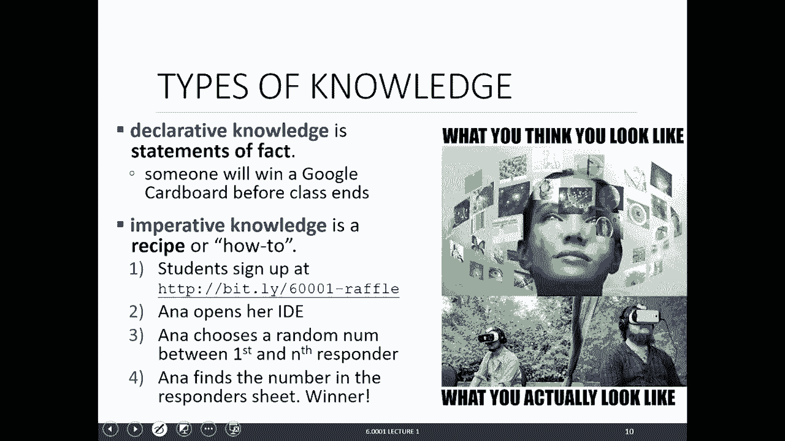

今天我们将介绍一些基本的行政事务和课程信息，然后我们将讨论什么是计算。我们将在高层次上讨论计算机做什么，以确保我们都在同一理解层面上。接着，我们将直接深入Python基础，讨论一些可以用Python进行的数学运算，然后讨论Python变量和类型。

正如我在介绍性电子邮件中提到的，讲座中涉及的所有幻灯片和代码都将在讲座前发布。我强烈建议您下载并打开它们。我们将进行一些课堂练习，这些练习将在幻灯片上提供。这样做很有趣，并且在代码上做笔记也很有益，以便将来参考。这门课程节奏非常快，我们会迅速提升难度，因此我们希望为您在这门课程中取得成功做好准备。

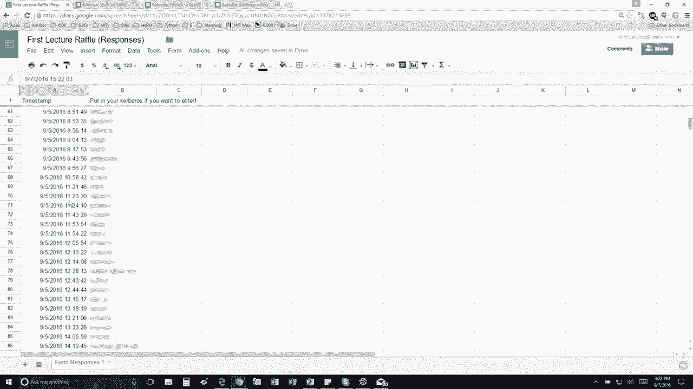

当我编写这些内容时，我试图回想自己刚开始学习编程时，是什么帮助我完成了第一门编程课程。以下是一个很好的清单：首先，我尽早阅读问题集，确保术语能够逐渐理解。然后在讲座中，如果讲师谈到某个内容，我突然想起在问题集中见过那个词但当时不明白，现在我就知道它是什么了。所以，先通读一遍，如果您是编程新手，我认为关键词是练习。就像数学或阅读一样，练习得越多，就越熟练。仅仅观看我编写程序是无法吸收编程知识的，因为我已经知道如何编程。你们需要练习。所以在讲座前下载代码，跟着我输入的内容进行输入。我认为另一件重要的事情是，如果您是编程新手，可能会担心弄坏电脑。仅仅运行Anaconda并输入一些命令是不会弄坏电脑的。不要害怕输入一些内容看看会发生什么。最坏的情况就是重启电脑。所以，不要害怕。

这基本上是6.0001或6.00课程的全部路线图。我们希望您从这门课程中获得三样东西：第一是概念知识，这几乎适用于您将学习的任何课程；第二是编程技能；最后，我认为这是这门课程的真正伟大之处，我们教您如何解决问题，这是通过问题集实现的。这就是我对这门课程路线图的看法，而所有这些的基础都是练习。您必须多输入、多编码，才能在这门课程中取得成功。

那么，我们在这门课程中将学习什么？我认为可以分为三个主要部分：第一部分与编程相关，学习如何编程，包括创建什么对象、如何用数据结构表示知识，以及程序的控制流。第二部分更抽象，涉及如何编写风格良好、可读性强的代码。当您编写代码时，希望它易于他人阅读和使用。因此，代码需要组织良好、模块化且易于理解。不仅他人会阅读您的代码，明年您可能选修另一门课程时，也会回顾您在这门课程中编写的问题集。如果代码混乱，您可能无法理解当时在做什么。因此，编写可读性强且组织良好的代码也是重要部分。最后一部分主要涉及计算机科学，讨论如何比较Python程序，如何知道一个程序比另一个更好、更高效，以及如何知道一种算法比另一种更好。这就是我们将在课程最后部分讨论的内容。

以上就是课程管理部分的内容。现在，让我们从高层次开始讨论计算机做什么。从根本上说，计算机做两件事：执行计算和存储结果。计算机执行大量计算，现在的计算机速度非常快，每秒数十亿次计算可能并不夸张。计算机还需要将结果存储在内存中。现在，拥有数百GB存储空间的计算机并不少见。

计算机执行的计算有两种类型：一种是内置在语言中的低级计算，如加法、减法、乘法等；另一种是程序员可以将这些基本计算类型组合起来，定义自己的计算，创建新的计算类型，计算机也能执行这些计算。我想强调的一点是，计算机只知道您告诉它的内容。计算机只做您告诉它做的事情，它们不是神奇的，没有思想，只是知道如何非常快速地执行计算。但您必须告诉它们执行什么计算。计算机什么都不知道。

接下来，我们讨论知识的类型。第一种是陈述性知识，即事实陈述。例如，今天讲座的一个事实陈述是：在课程结束前，有人将赢得奖品，奖品是Google Cardboard。这是一个事实陈述。但假设我是一台机器，除了您告诉我的内容，我什么都不知道。您告诉我这个陈述，我会想：但如何在课程结束前有人赢得Google Cardboard呢？这就是过程性知识的作用。过程性知识是食谱、方法或步骤序列。如果我是机器，您需要告诉我如何让某人在课程结束前赢得Google Cardboard。如果我遵循这些步骤，理论上我应该得出结论。第一步，我们已经完成了，想报名的人已经报名了。现在我将打开我的IDE，基本上像机器一样遵循您告诉我的步骤。我们在这门课程中使用的IDE叫做Anaconda。我将滚动到底部，希望从零开始。我已经打开了IDE，我将遵循下一组指令：在第一个和最后一个响应者之间选择一个随机数。现在我将使用Python来实现，这也是一个例子，说明如何在日常生活中使用计算机或编程来完成简单任务。因为如果我选择一个随机数，可能会有偏见，例如我可能喜欢数字8。为了选择一个随机数，我将使用Python，导入随机数包，选择一个在16到272之间的随机数。我选择了随机数75，然后在响应者列表中查找编号75，是Lauren CoV。很好，您在这里。这是一个我作为机器的例子，同时也是在日常生活中使用Python的例子，仅仅是为了选择一个随机数。所以，尽可能多地使用Python，这会给你练习的机会。

这很有趣，但在麻省理工学院，我们热爱数字。这是一个展示陈述性知识和过程性知识区别的数值例子。我想找到一个数的平方根。陈述性知识的例子是：数字X的平方根是Y，使得Y乘以Y等于X。这是一个事实陈述，它是正确的。但计算机不知道如何处理这个陈述。计算机知道如何遵循食谱。这是一个著名的算法，用于找到数字X的平方根。假设X最初是16。如果计算机遵循这个算法，它将从一个猜测值G开始，比如3。我们试图找到16的平方根，计算G乘以G得到9。然后我们问：G乘以G是否足够接近X？如果是，停止并说G是答案。但9并不接近16，所以我不停止，继续。如果不够接近，那么我将创建一个新的猜测，取G和X/G的平均值。然后使用新的猜测重复这个过程。我们不断重复，直到决定足够接近。我们在前面的数值例子中看到的过程性知识是找到X平方根的食谱。食谱的三个部分是：简单的步骤序列、控制流以及停止的方式。在编程中，您不希望程序永远运行，必须有一种停止的方式。在这个例子中，停止的方式是我们决定足够接近，可能是差值在0.01或0.0001以内。这个食谱就是一个算法，这就是我们在这门课程中要学习的内容。

我们处理计算机，实际上希望将食谱捕获到计算机内部。计算机是一个机械过程。历史上，有两种类型的计算机：最初是固定程序计算机，它们只知道如何执行特定任务，如加法、乘法、减法、除法。如果您想做其他事情，必须创建另一个固定程序计算机。这不太理想。于是，存储程序计算机出现了。这些机器可以存储指令序列，执行这些序列，并且可以更改指令序列以执行不同的任务。这就是我们现在所知的计算机。中央处理单元是所有决策发生的地方。基本的机器架构包括四个主要部分：内存、输入/输出、算术逻辑单元和控制单元。ALU可以执行非常原始的操作，如加法、减法等。内存包含数据和指令序列。控制单元与ALU交互，包含一个程序计数器。当您加载指令序列时，程序计数器从第一个指令开始，获取指令并发送给ALU。ALU询问操作对象是什么，可能会从内存获取数据，执行操作，并将数据存储回内存。完成后，ALU返回，程序计数器增加1，意味着我们将转到指令集中的下一个序列。它线性地逐条执行指令。可能有某个特定指令执行某种测试，例如判断某个值是否大于、等于或小于另一个值。测试将返回真或假，根据测试结果，您可能会转到下一条指令，或者将程序计数器设置回开头等。因此，您不仅仅是线性地逐步执行所有指令，可能涉及一些控制流，您可能会跳过指令或从头开始等。当您执行完最后一条指令时，可能会输出一些内容。这就是计算机工作的基本方式。

回顾一下，存储程序计算机包含这些指令序列，它可以执行的原始操作包括加法、减法、逻辑操作、测试以及数据存储和数据移动等。解释器遍历每条指令，决定是转到下一条指令、跳过指令还是重复指令等。我们讨论了原始操作。事实上，伟大的计算机科学家艾伦·图灵证明了可以使用六种原始操作计算任何东西。这六种原始操作是：左移、右移、读、写、扫描和不操作。使用这六种指令和一条纸带，他证明了可以计算任何东西。基于这六种指令，编程语言出现了，它们创建了更方便的原始操作集。因此，您不必仅用这六种命令编程。从这六种原始操作中产生的一个非常重要的事情是：如果您可以用Python编写程序计算某物，理论上您可以用任何其他语言编写程序计算完全相同的东西。这是一个非常强大的陈述。

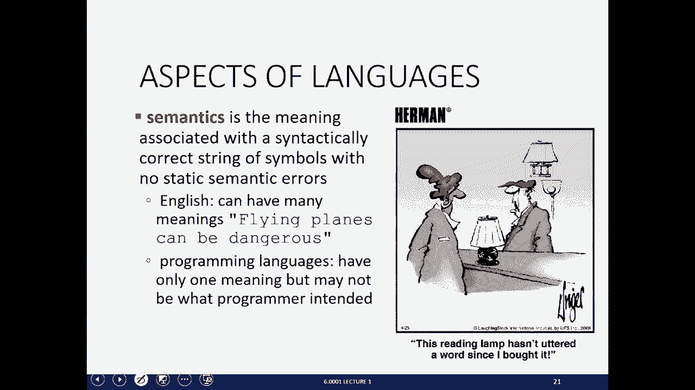

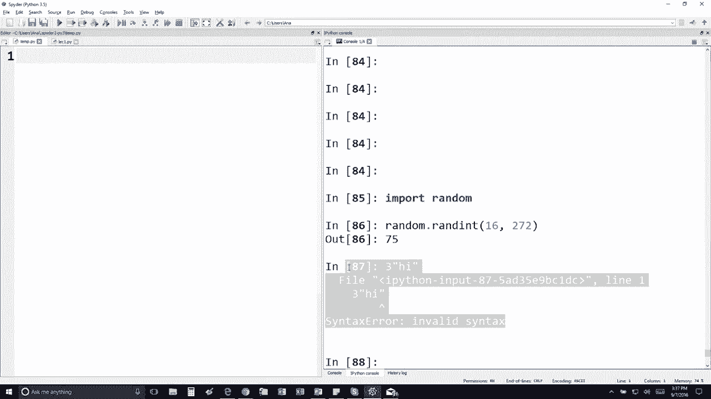

一旦您为特定语言设置了原始操作集，就可以开始创建表达式。这些表达式将是编程语言中原始操作的组合，它们将具有某种值，并在编程语言中具有某种含义。让我们与英语做一个类比，以便您理解我的意思。在英语中，原始结构是单词。在Python编程中，也有原始结构，但数量很多，例如浮点数、布尔值、数字、字符串以及加法、减法等简单运算符。使用这些原始结构，我们可以开始创建英语短语和句子，在编程语言中也是如此。在英语中，我们可以说“cat dog boy”，但这不是语法有效的。具有良好语法的英语是“名词动词名词”，例如“cat hugs boy”在语法上是有效的。类似地，在编程语言中，像“word”和数字5这样的组合没有意义，语法无效。但像“运算符 操作数 运算符”这样的结构是可以的。一旦创建了语法有效的短语或表达式，就必须考虑短语的静态语义。例如，在英语中，“I are hungry”语法正确，但说起来很奇怪。我们有代词和形容词，但不太合理。“I am hungry”更好，这在静态语义上是正确的。类似地，在编程语言中，随着练习增多，您会掌握这一点。例如，“3.2 * 5”是可以的，但“word + 5”是什么意思？将单词与数字相加没有意义。它的语法没问题，因为您有运算符、操作数和运算符，但将数字与单词相加没有意义。

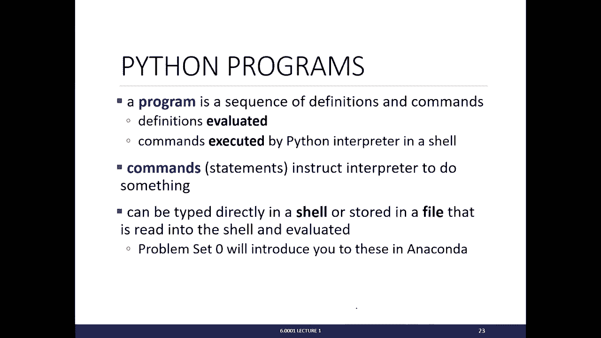

一旦创建了语法正确且静态语义正确的表达式，在英语中，您需要考虑语义，即短语的含义。在英语中，一个短语可以有多种含义。例如，“Flying planes can be dangerous”可以有两种含义：驾驶飞机是危险的，或者正在飞行的飞机是危险的。另一个例子是：“This reading lamp hasn’t uttered a word since I bought it.” 这也有两种含义，它是在玩弄“reading lamp”这个词。在编程中，情况不同。在编程语言中，您编写的一组指令只有一个含义。记住，计算机只做您告诉它做的事情。它不会突然决定添加另一个变量。它只会执行您编写的语句。在编程语言中，只有一个含义，但问题在于，这个含义可能不是程序员所期望的。这就是可能出错的地方。课程后面会有关于调试的讲座，但这里只是告诉您，如果在程序中看到错误弹出，例如一些文本显示错误，比如如果我们这样做，语法不正确，您会看到一些愤怒的文本。随着编程经验增加，您会逐渐掌握阅读这些错误。这基本上是在告诉我，我编写的这一行语法不正确，并指向确切的行，说这是错误的，因此我可以返回修复它。语法错误实际上很容易被Python捕获。静态语义错误也可以被Python捕获，只要您的程序需要做出决策，并且您已经进入了发生静态语义错误的分支。这可能最令人沮丧，尤其是刚开始时。程序可能会执行与预期不同的操作，或者程序可能崩溃，这意味着它们停止运行。这没关系，只需返回代码并找出问题所在。另一个与预期含义不同的例子是程序可能停止，这也没关系，除了重启电脑，还有其他方法可以停止它。

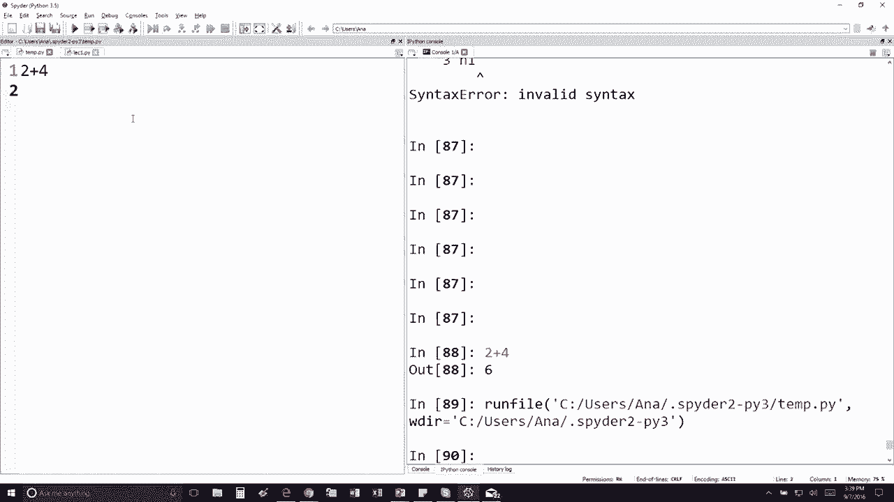

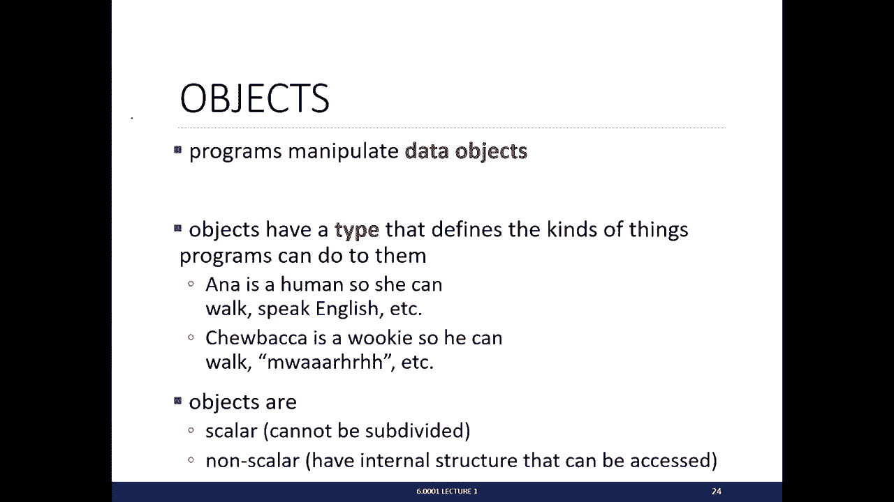

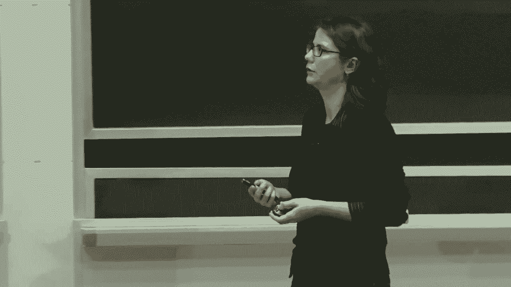

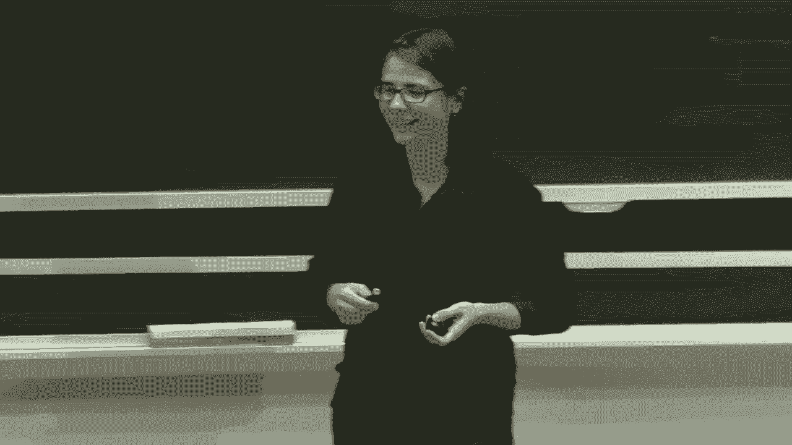

Python程序将是定义和命令的序列。我们将有被求值的表达式，以及告诉解释器执行某些操作的命令。如果您完成了问题集零，您会看到可以直接在shell中键入命令，我在右侧进行了一些非常简单的操作，如“2 + 4”，或者您可以在左侧编辑器键入命令并运行程序。请注意，右侧通常用于编写非常简单的命令进行测试，而左侧编辑器用于编写更多行和更复杂的程序。

现在我们将开始讨论Python。在Python中，一切都是对象。Python程序操作这些数据对象。Python中的所有对象都有一个类型，类型告诉Python可以对这些对象执行哪些操作。例如，如果对象是数字5，您可以将该数字与另一个数字相加、相减、求幂等。更一般的例子是：我是人类，这是我的类型，我可以走路、说英语等。楚巴卡是伍基人类型，他可以走路、发出我无法发出的声音等。一旦有了这些Python对象，一切都是对象。实际上有两种类型的对象：一种是标量对象，这些是Python中非常基本的对象，无法再细分；另一种是非标量对象，这些对象具有内部结构。例如，数字5是标量对象，因为它无法再细分，但数字列表[5, 6, 7, 8]将是非标量对象，因为可以细分它，可以找到它的部分，它由一系列数字组成。

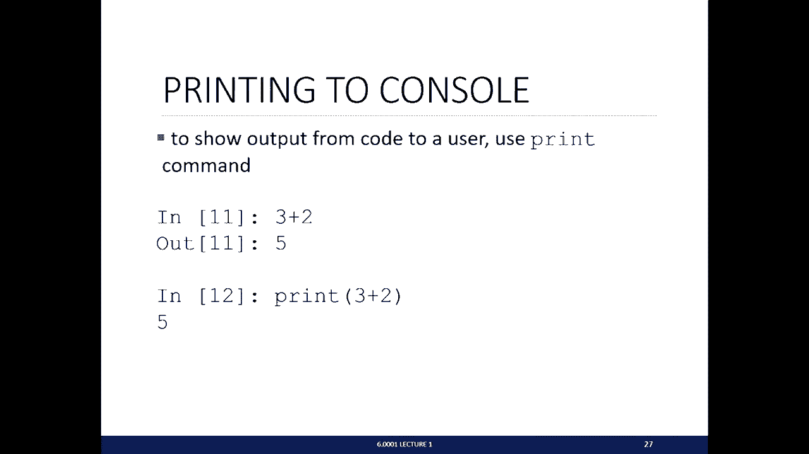

以下是Python中所有标量对象的列表：整数（所有整数）、浮点数（所有十进制实数）、布尔值（只有两个值：True和False，注意大写T和F），以及一种称为NoneType的特殊类型，它只有一个值None，表示类型的缺失，有时在某些程序中很有用。如果您想查找对象的类型，可以使用特殊命令`type()`，在括号中放入要查找类型的对象。例如，在shell中键入`type(5)`，shell会告诉您那是整数。如果您想在不同类型之间转换，Python允许您这样做。为此，您使用要转换到的类型，放在要转换的对象之前。例如，`float(3)`将整数3转换为浮点数3.0。同样，您可以将任何浮点数转换为整数，转换为整数会截断小数部分，不进行四舍五入，只保留整数部分。

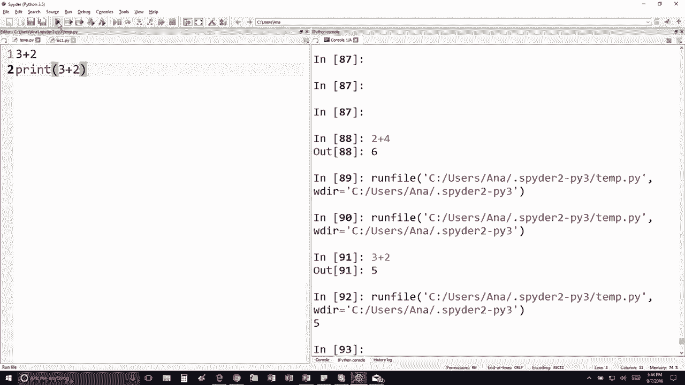

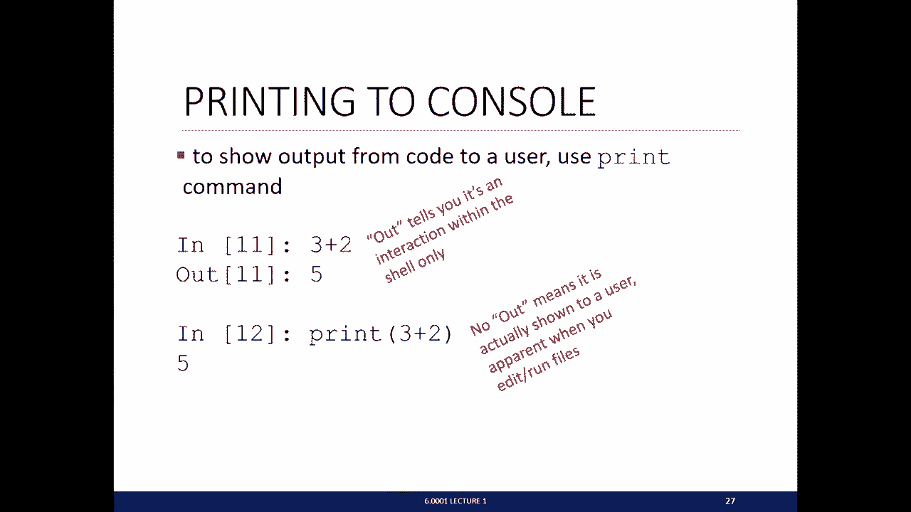

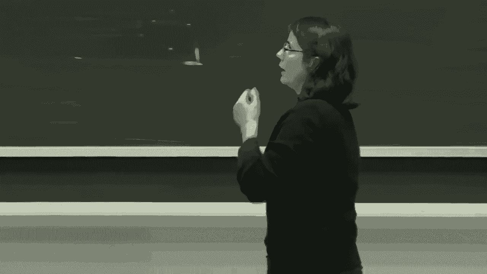

在编程中，最重要的事情之一是打印输出。打印输出是您与用户交互的方式。要打印内容，请使用`print`命令。如果您在shell中，只需键入`3 + 2`，您会看到值5，但这并不是真正打印出来。当您在编辑器中键入内容时，这一点变得明显。如果您只做`3 + 2`并运行程序，您会在右侧看到程序运行，但并未实际打印任何内容。如果您在控制台中键入此内容，它会显示该值，但这只是作为程序员窥视该值，并不是实际打印给任何人。如果您想打印某些内容，必须使用`print`语句。在这种情况下，这将把数字5打印到控制台。这基本上是我的设置，它只是在shell内交互，不与任何其他人交互。如果没有输出，意味着它被打印到控制台。

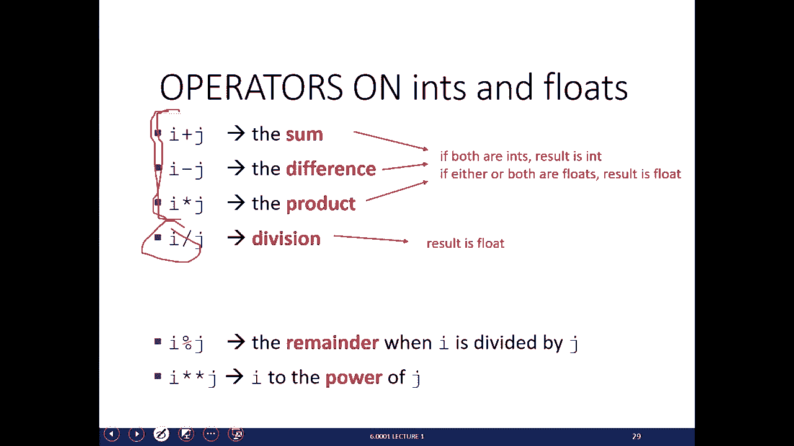

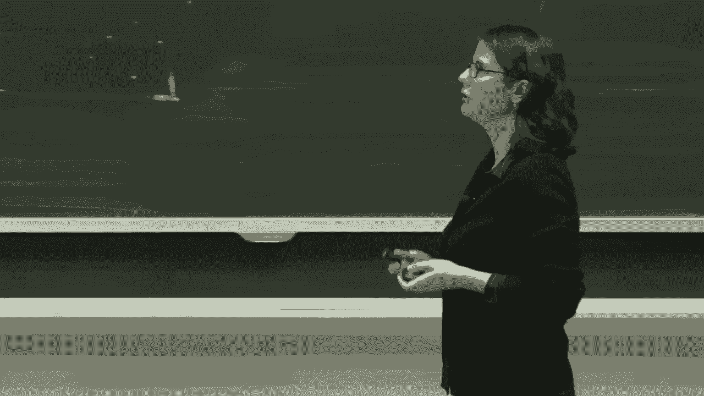

我们讨论了对象。一旦有了对象，可以将对象和运算符组合起来形成表达式。每个表达式都有一个值，表达式求值为一个值。表达式的语法是“对象 运算符 对象”。这些是可以在整数和浮点数上执行的一些运算符：典型的加法、减法、乘法和除法。对于前三种运算，得到的答案类型取决于变量的类型。如果两个操作数都是整数，则得到的结果是整数类型；但如果至少有一个是浮点数，则得到的结果是浮点数类型。除法有点特殊，无论操作数是什么，结果总是浮点数。其他有用的操作包括取余运算符`%`，`i % j`给出i除以j的余数；求幂运算符`**`，`i ** j`表示i的j次方。这些操作具有典型的数学优先级，如果您想为其他操作赋予优先级，可以使用括号。

我们有创建表达式的方法，也有对对象执行的操作，但能够将值保存到某个名称将非常有用。名称是您选择的，应该是描述性的。当您将值保存到变量名时，将能够在程序后面访问该值。要将值保存到变量名，请使用等号。等号是赋值操作，它将右侧的值分配给左侧的变量名。例如，我将浮点数3.14159分配给变量`pi`。在第二行，我将表达式`22 / 7`求值，得到一个小数，并将其保存到变量`pi_approx`。值存储在内存中，在Python中，我们说赋值将名称绑定到值。当您稍后在程序中使用该名称时，将引用内存中的值。如果您想稍后引用该值，只需键入您分配给的变量名。

为什么我们要给表达式命名？我们希望重用名称而不是值，这使您的代码看起来更好。这是一段计算圆面积的代码。请注意，我已将变量`pi`赋值为3.14159，将另一个变量`radius`赋值为2.2。然后，在代码后面，我有另一行`area = pi * (radius ** 2)`。这是一个赋值给这个表达式，这个表达式引用了这些变量名`pi`和`radius`。它将查找它们在内存中的值，用这些值替换变量名，并为我进行计算。最后，整个表达式将被一个数字替换，那就是浮点数。

在讨论这页幻灯片时，我想提一下编程与数学的区别。在数学中，您经常遇到需要求解X的问题，例如`X + Y = Z`，求解X。但计算机不知道如何处理这个问题，计算机需要被告知该做什么。在编程中，如果您想求解X，需要确切地告诉计算机如何求解X，需要找出需要给计算机什么公式才能求解X。这意味着在编程中，右侧总是一个表达式，它将被求值为一个值，而左侧总是一个变量。因此，等号表示赋值，不像数学中那样等号两边可以有很多东西。等号左边只有一样东西，那就是变量。等号代表赋值。

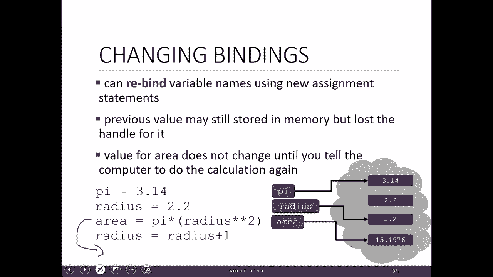

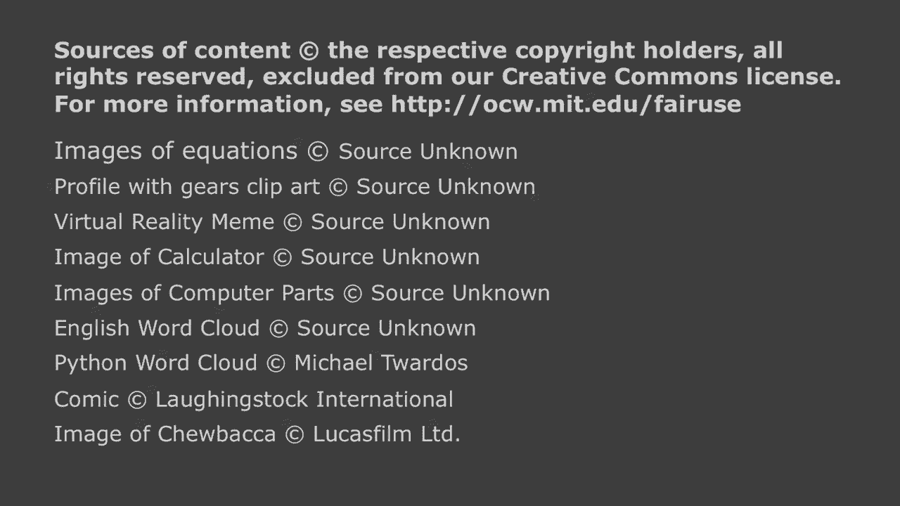

一旦我们创建了表达式并有了这些赋值，就可以使用新的赋值语句重新绑定变量名。让我们看一个例子。假设这是我们的内存。让我们重新输入计算半径的例子。假设`pi = 3.14`，在内存中，我们创建值3.14，并将其绑定到变量名`pi`。下一行`radius = 2.2`，在内存中，我们创建值2.2，并将其绑定到变量名`radius`。然后我们有这个表达式`area = pi * (radius ** 2)`，它将用内存中`pi`和`radius`的值替换，