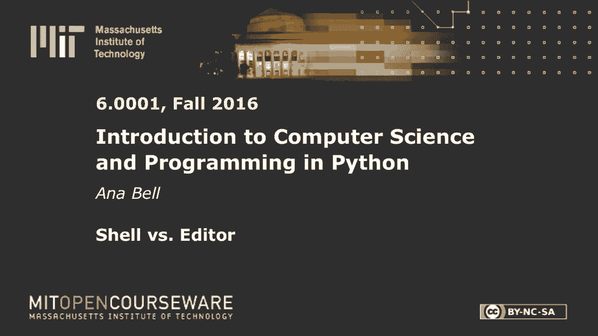
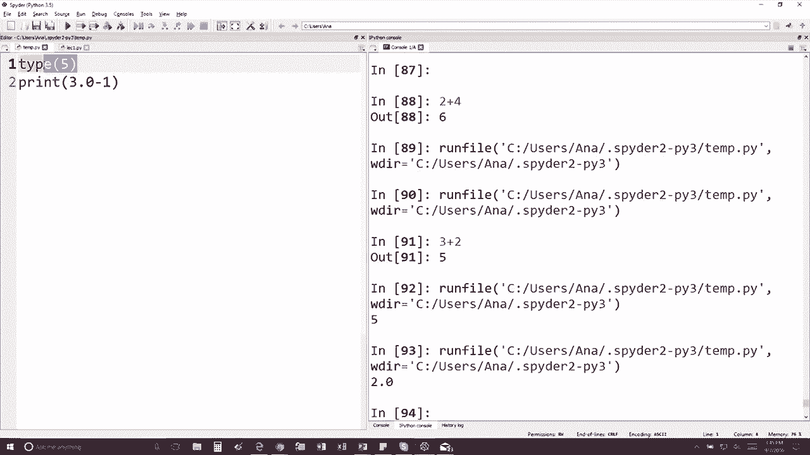

# 2：L1.2 - Shell 与编辑器 🖥️


以下内容基于知识共享许可协议提供。您的支持将帮助 MIT OpenCourseWare 继续免费提供高质量的教育资源。如需捐款或查看来自数百门 MIT 课程的其他材料，请访问相关网站。

在本节课中，我们将学习如何通过 Shell 和编辑器来运行和测试代码，并通过一个具体的例子来理解代码执行与输出的关系。



## 代码执行与输出示例

上一节我们介绍了编程环境的基本概念，本节中我们来看看一个具体的代码示例及其输出结果。


问题是：如果你有以下两行代码（我将它们放大显示以便更清楚）：
```python
type(5)
print(3.0 - 1)
```
输出将会是什么？

如果我在编辑器中运行这段代码，对于这类问题，你总是可以自己进行验证。这引出了一个要点：如果你是编程新手，不要害怕尝试。不要问我，也不要问你的邻居，只需将其输入到 Shell 中并执行，答案就会揭晓。

所以，这个问题的答案将是 **2.0**。让我们看看我们是否正确。是的，很好，75% 的人答对了。

如果你没有答对，这里再次解释一下原因：`type(5)` 这一行之所以没有打印出任何内容，是因为我们实际上从未使用 `print` 语句来输出它。




如果你想在屏幕上显示某些内容，你必须明确地使用 `print` 函数。

## 核心要点总结

本节课中我们一起学习了如何通过 Shell 直接测试代码片段，并理解了 `print` 函数在输出结果中的关键作用。记住，实践是学习编程的最佳方式，不要犹豫，大胆尝试运行你的代码。