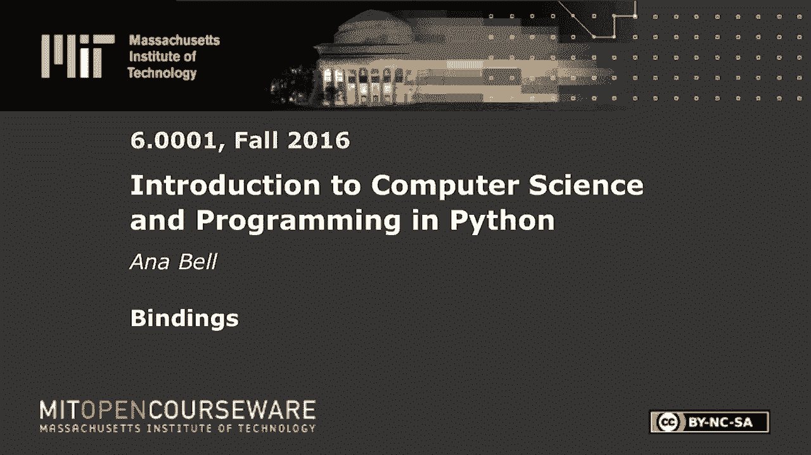

# 4：L1.4 - 连接(Bindings) 🧠


以下内容基于知识共享许可协议提供。您的支持将帮助 MIT OpenCourseWare 继续免费提供高质量的教育资源。如需捐款或查看来自数百门 MIT 课程的其他材料，请访问相关网站。

在本节课中，我们将学习编程中的“连接”（Bindings）概念，并通过一个具体的代码示例来理解变量赋值与计算的关系。我们将看到，程序中的计算是静态的，除非我们明确指示，否则它不会自动更新。

## 代码示例分析 📝



在上一节中，我们介绍了变量的基本概念。本节中，我们来看看一个具体的练习代码，它演示了连接（变量绑定）的一个重要特性。

以下是练习中的代码：


```python
USA_gold = 46
UK_gold = 27
Romania_gold = 1

total_gold = USA_gold + UK_gold + Romania_gold
print(total_gold)

Romania_gold += 1
print(total_gold)
```

这段代码首先定义了三个变量，分别存储美国、英国和罗马尼亚的金牌数。然后，它计算了金牌总数并将其存储在变量 `total_gold` 中。接着，程序增加了罗马尼亚的金牌数，并再次打印 `total_gold` 的值。

## 关键概念解析 🔑

现在，我们来分析这段代码的执行逻辑。核心在于理解变量 `total_gold` 的值是如何确定的。

当程序执行到 `total_gold = USA_gold + UK_gold + Romania_gold` 这一行时，它进行了一次计算。此时，`USA_gold` 是 46，`UK_gold` 是 27，`Romania_gold` 是 1。因此，计算结果是：

**公式：** `46 + 27 + 1 = 74`

所以，变量 `total_gold` 被**绑定**（或称为赋值）为数值 74。这个绑定关系在赋值语句执行的那一刻就固定了。

## 程序行为与常见误区 ⚠️

上一节我们介绍了变量的赋值，本节中我们来看看一个常见的误区：认为变量会随着其组成部分的变化而自动更新。

代码随后执行 `Romania_gold += 1`，这行代码将 `Romania_gold` 的值从 1 增加到了 2。然而，**变量 `total_gold` 的值并不会因此自动改变**。因为 `total_gold` 存储的是第一次计算的结果（74），而不是一个动态的公式。

因此，两次 `print(total_gold)` 语句的输出都是 **74**。

如果要让第二次打印输出更新后的总数（75），我们需要在修改 `Romania_gold` 后，**重新执行一次求和计算**，并再次赋值给 `total_gold`。

以下是修改后的正确代码逻辑：

```python
USA_gold = 46
UK_gold = 27
Romania_gold = 1

total_gold = USA_gold + UK_gold + Romania_gold
print(total_gold)  # 输出 74

Romania_gold += 1
# 关键步骤：重新计算并绑定新值
total_gold = USA_gold + UK_gold + Romania_gold
print(total_gold)  # 输出 75
```

## 练习回顾与总结 ✅


对于这个练习，如果你没有得到正确答案，请务必亲自尝试将代码放入 Python 环境中运行测试。多数人能够正确理解，如果你没有，请通过实践来加深理解。


本节课中我们一起学习了“连接”（Bindings）的核心概念。我们明白了：

1.  变量是对一个值的**绑定**，这个绑定在赋值语句执行时发生。
2.  绑定是静态的。一个变量（如 `total_gold`）的值不会因为其来源变量（如 `Romania_gold`）的改变而自动更新。
3.  要更新依赖于其他变量的结果，必须**显式地重新执行计算和赋值操作**。

记住，计算机严格按指令执行。它只会做你明确告诉它的事情，不会进行假设或自动推导。这是编程思维中需要建立的重要基础。