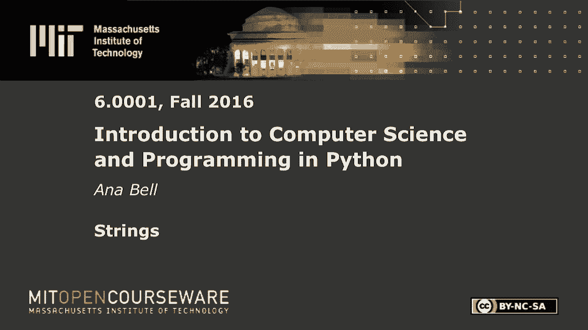
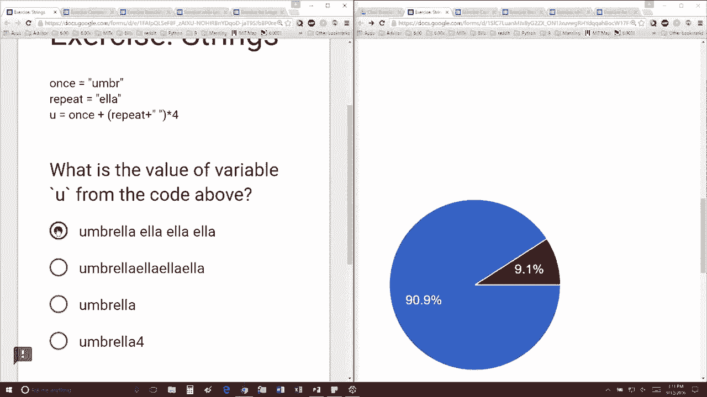

# 6：L2.2 - 字符串 🧵


以下内容基于知识共享许可协议提供。您的支持将帮助 MIT OpenCourseWare 继续免费提供高质量的教育资源。如需捐款或查看来自数百门 MIT 课程的其他材料，请访问相关网站。




在本节课中，我们将学习字符串的基本操作，特别是字符串的拼接与重复。我们将通过一个具体的例子来理解这些概念。

我有一个名为 `name` 的变量，其值为 `"Br"`。同时，我有一个名为 `repeat` 的变量，其值为 `"ell"`。现在，我创建了一个新变量 `U`，它是 `name` 与 `repeat` 重复四次的结果进行拼接。

具体来说，代码可以表示为：
```python
name = "Br"
repeat = "ell"
U = name + repeat * 4
```

通过观察，大约 90% 的参与者已经理解了这一点，这个操作将得到结果 `"Brellllll"`。




本节课中，我们一起学习了字符串的拼接（使用 `+` 运算符）和重复（使用 `*` 运算符）。通过简单的变量赋值和运算，我们可以组合出新的字符串。理解这些基础操作是进行更复杂文本处理的第一步。