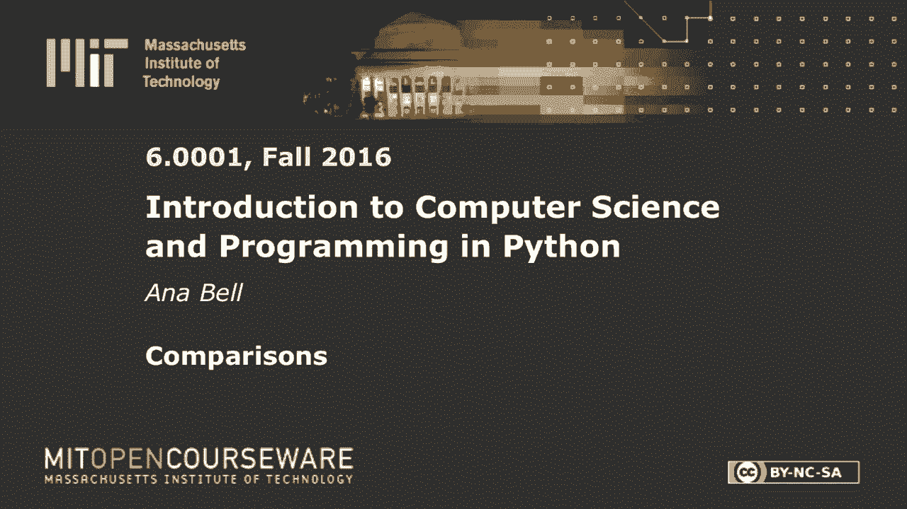
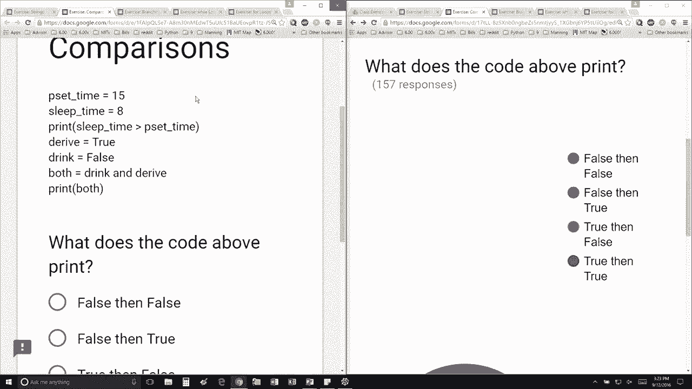

# 7：L2.3 - 程序中的「比较」逻辑 🧮

以下内容基于知识共享许可协议提供。您的支持将帮助 MIT OpenCourseWare 继续免费提供高质量的教育资源。如需捐款或查看来自数百门 MIT 课程的其他材料，请访问相关网站。

在本节课中，我们将学习如何在程序中使用「比较」逻辑。我们将通过创建变量、进行比较操作以及使用布尔运算符来理解程序是如何做出判断的。这些是编程中构建条件语句和决策逻辑的基础。

## 变量赋值与比较操作

首先，我们来看一个简单的例子，它演示了如何创建变量并进行比较。

我创建了一个名为 `pset_time` 的变量，并将其赋值为 `15`。接着，我创建了另一个名为 `sleep_time` 的变量，并将其赋值为 `8`。然后，我将打印下面这个表达式的值。

这个表达式是一个条件判断，内容是：`sleep_time` 是否大于 `pset_time`？在 Python 中，解释器会用变量的实际值来替换这些变量名。

所以，实际判断的是：`8` 是否大于 `15`？这个结果是 `False`（假）。

## 布尔运算

接下来，我们看看对布尔值（`True` 或 `False`）的操作。这里有一个关于 `derive`（推导）和 `drink`（喝）的运算。

`derive` 是 `True`（真），`drink` 是 `False`（假）。我使用 `and`（与）运算符来判断是否应该同时满足 `drink` 和 `derive` 两个条件。

本节课中，我们一起学习了程序中的比较逻辑。我们首先创建了变量并为其赋值，然后使用比较运算符（如 `>`）来评估条件表达式，得到布尔结果。最后，我们接触了布尔运算符 `and`，它用于组合多个布尔条件。理解这些基本概念是编写能够做出判断的程序的关键第一步。