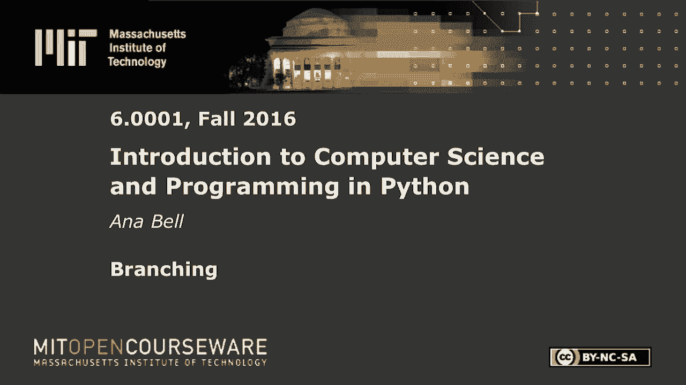
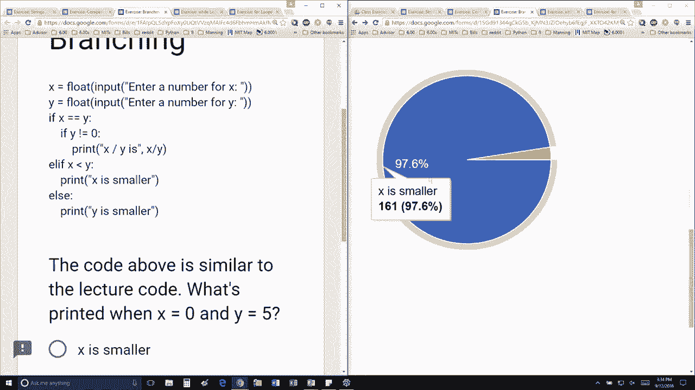

# 8：L2.4 - 分支结构 🧭


在本节课中，我们将要学习编程中的分支结构。分支结构允许程序根据特定条件执行不同的代码块，这是实现决策逻辑的核心。我们将通过一个简单的例子，理解 `if`、`elif` 和 `else` 语句是如何工作的。

---

## 概述

分支结构是控制程序流程的基本方式。它通过检查一个或多个条件，决定执行哪一部分代码。这就像在岔路口选择方向，程序会根据条件判断的结果走向不同的路径。

## 条件判断流程

以下是一个典型的分支结构执行流程。我们假设用户输入了两个数字，分别存储在变量 `X` 和 `Y` 中。

首先，程序会检查第一个条件：`X` 是否等于 `Y`。

```python
if X == Y:
    # 执行某些操作
```



如果这个条件为真（`True`），程序将执行其对应的代码块，然后跳过后续的所有 `elif` 和 `else` 检查。

如果第一个条件为假（`False`），程序将继续检查下一个 `elif` 条件。

```python
elif X < Y:
    # 执行另一些操作
```

程序会按顺序检查每一个 `elif` 条件，直到找到第一个为真的条件，并执行其代码块。

如果所有 `if` 和 `elif` 条件都为假，程序将执行 `else` 块中的代码（如果存在的话）。

```python
else:
    # 当以上条件都不满足时执行
```

## 示例解析

让我们通过一个具体例子来理解这个过程。

假设用户输入了 `X = 0` 和 `Y = 5`。

1.  程序首先检查条件：`X == Y`（即 `0 == 5`）。这个条件为**假**，因此跳过其代码块。
2.  接着，程序检查下一个条件：`X < Y`（即 `0 < 5`）。这个条件为**真**。
3.  由于这是第一个被满足的条件，程序将执行这个 `elif` 块内的代码，例如打印 `"X is less than Y"`。
4.  执行完毕后，整个分支结构结束，后续的 `elif` 或 `else` 都不会再被检查。

这个机制确保了只有**第一个**被满足的条件对应的代码会被执行。

---



## 总结

本节课中我们一起学习了分支结构。我们了解到程序通过 `if`、`elif` 和 `else` 语句实现条件判断，并且会顺序执行，直到找到第一个为真的条件。掌握分支结构是编写能够做出决策的智能程序的关键一步。