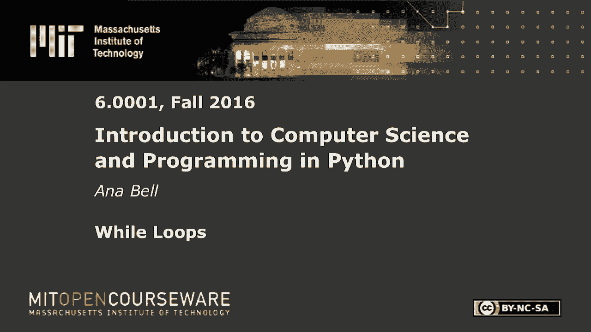
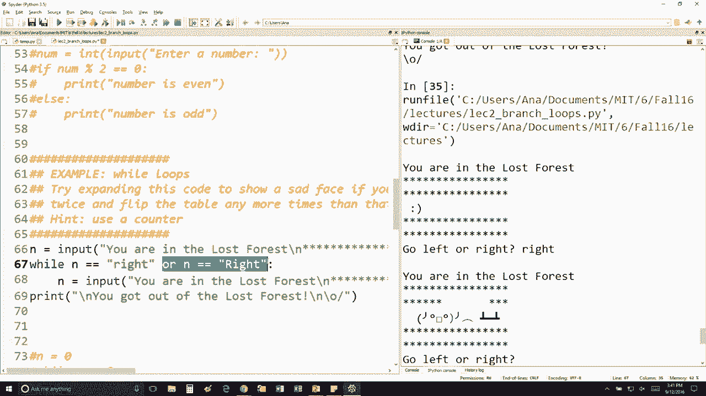

# 9：L2.5 - while循环 🌀


以下内容基于知识共享许可协议提供。您的支持将帮助 MIT OpenCourseWare 继续免费提供高质量的教育资源。如需捐款或查看来自数百门 MIT 课程的其他材料，请访问相关网站。




在本节课中，我们将学习 `while` 循环，并通过一个课堂练习来深入理解其工作原理。我们将分析一个具体的代码示例，探讨用户输入如何影响循环的执行，并学习如何使程序对不同的输入格式更加灵活。

## 课堂练习：迷失森林 🌲

让我们来看一个关于 `while` 循环的课堂练习示例。代码模拟了一个场景：你在一片迷失的森林中，需要选择向左或向右走。

以下是代码的核心逻辑：`while` 循环会检查用户的输入是否等于一个特定的字符串。如果是，程序会重复询问相同的问题，直到输入不符合条件为止。

```python
while n == "right":
    n = input("You are in the lost forest. Go left or right? ")
```

我的问题是：当你输入大写的 “R” 时会发生什么？我认为班上大多数同学都答对了，也许有些同学后来改变了答案，但你是对的。程序会再次询问“向左还是向右？”。这是因为 Python 对字符串匹配非常严格。我们告诉它，用户输入必须完全匹配这个字符串。因此，即使输入的是 “Right”，由于大小写不同，它也不匹配。

## 处理不同输入格式 🛠️

如果你想处理这种情况，让程序同时接受“right”和“Right”，你需要扩展循环中的条件判断。

以下是修改后的代码示例：

```python
while n == "right" or n == "Right":
    n = input("You are in the lost forest. Go left or right? ")
```

通过使用逻辑运算符 `or`，我们让循环在输入为“right”或“Right”时都继续执行。这样，程序就对用户输入的大小写不再敏感，变得更加灵活。



## 总结 📝


本节课我们一起学习了 `while` 循环的基本用法。我们通过“迷失森林”的例子，看到了循环如何根据条件重复执行代码块。重要的是，我们认识到 Python 中字符串比较是区分大小写的，并学会了如何使用逻辑运算符 `or` 来让条件判断更包容，从而处理不同格式的用户输入。理解这些概念对于编写健壮且用户友好的程序至关重要。