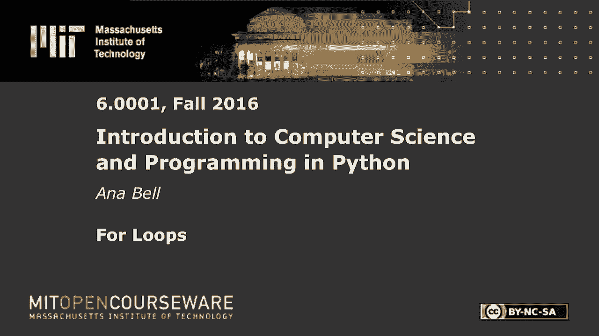
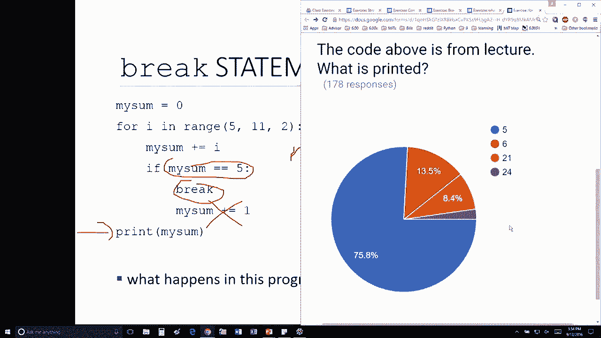

# 10：L2.6 - for循环 🌀


在本节课中，我们将学习 `for` 循环的基本概念，并通过一个具体的代码示例来理解循环的执行流程，特别是 `break` 语句在循环中的作用。

---



## 循环与累加求和

上一节我们介绍了循环的基本结构，本节中我们来看看一个结合了累加和条件判断的循环示例。

以下代码演示了如何使用 `for` 循环遍历一个数字列表，并在满足特定条件时使用 `break` 语句提前退出循环。

```python
my_sum = 0
for value in [5, 7, 9, 11]:
    my_sum = my_sum + value
    if my_sum == 5:
        break
print(my_sum)
```

## 代码执行步骤解析

以下是上述代码的逐步执行过程：

1.  初始化变量 `my_sum` 为 `0`。
2.  进入 `for` 循环，第一次迭代时，`value` 的值为 `5`。
3.  执行 `my_sum = my_sum + value`，此时 `my_sum` 的值变为 `5`。
4.  判断 `if my_sum == 5` 条件，结果为 `True`。
5.  执行 `break` 语句，立即终止当前循环。
6.  跳转到循环体之后的语句，即执行 `print(my_sum)`，输出结果为 `5`。

## 关键概念：`break` 语句

`break` 语句的作用是立即终止它所在的最内层循环，并将程序控制流跳转到该循环之后的语句。在上面的例子中，当 `my_sum` 的值第一次等于 `5` 时，循环就被提前终止了。



---

本节课中我们一起学习了 `for` 循环与 `break` 语句的配合使用。通过一个累加求和的例子，我们清晰地看到了循环的执行顺序以及 `break` 如何中断循环流程。理解这些控制流语句是掌握编程逻辑的重要一步。