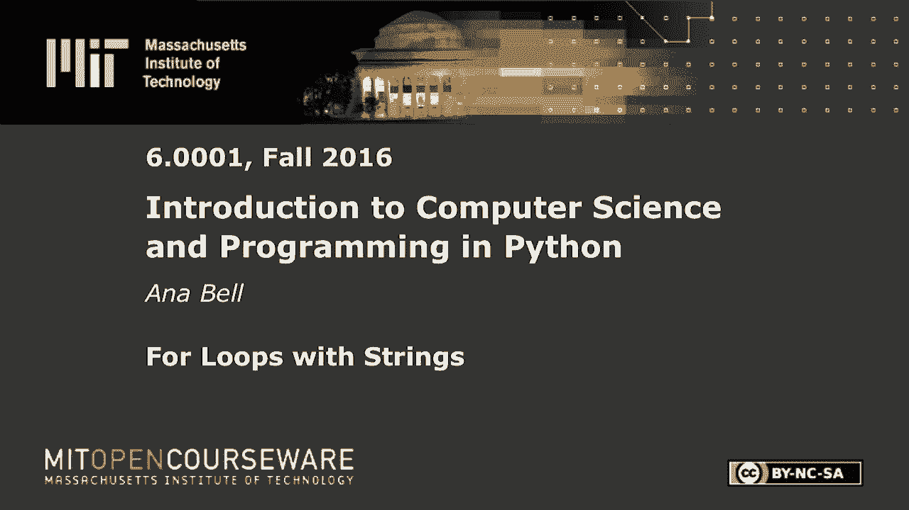
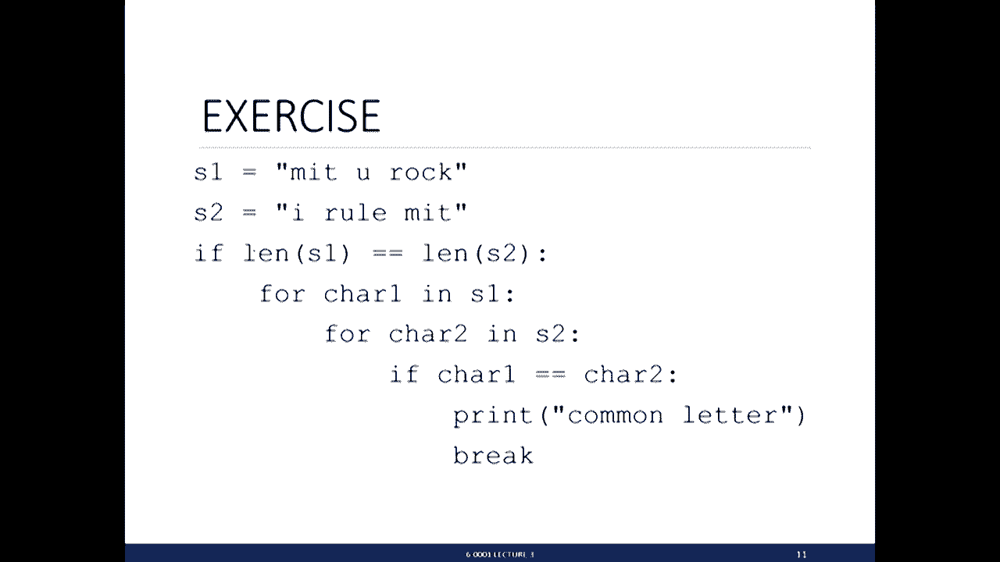
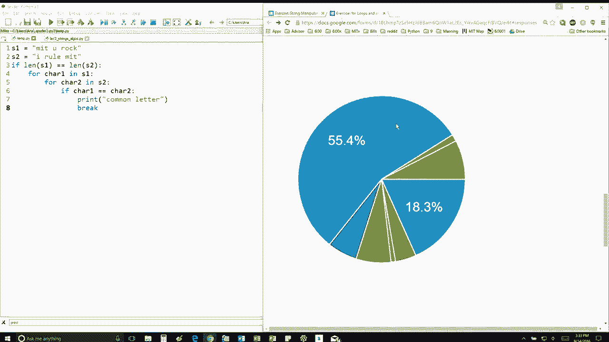

# 13：L3.3 - 字符串的for循环处理 🧵


在本节课中，我们将要学习如何使用嵌套的for循环来处理和比较两个字符串。我们将通过一个具体的例子，逐步分析代码的执行过程，理解循环如何遍历字符串中的每个字符，并在找到匹配时执行特定操作。



---



## 概述

我们有两个字符串 `s1` 和 `s2`。首先，我们将检查 `s1` 的长度是否等于 `s2` 的长度。如果长度相等，我们将进入一个if语句块。在这个块中，我们将使用嵌套的for循环来比较两个字符串中的每一个字符。当找到相同的字符时，程序会打印一条消息，并立即跳出内层循环。

## 字符串长度检查

首先，我们需要检查两个字符串的长度是否相等。这可以通过以下代码实现：

```python
if len(s1) == len(s2):
```

在这个例子中，`s1` 和 `s2` 都包含10个字符，包括空格。因此，条件成立，程序将进入if语句块。

## 嵌套循环比较字符

进入if语句块后，我们将使用嵌套的for循环来比较两个字符串中的字符。

以下是嵌套循环的结构：

```python
for char1 in s1:
    for char2 in s2:
        if char1 == char2:
            print("Common letter")
            break
```

外层循环遍历 `s1` 中的每一个字符，内层循环遍历 `s2` 中的每一个字符。对于每一对字符，我们检查它们是否相等。如果相等，则打印“Common letter”并执行 `break` 语句，跳出内层循环。

## 逐步执行过程

让我们逐步分析代码的执行过程。

首先，外层循环从 `s1` 中取出第一个字符 `'M'`。然后，内层循环开始遍历 `s2` 中的字符。

*   将 `'M'` 与 `s2` 的第一个字符 `'I'` 比较，不相等。
*   将 `'M'` 与 `s2` 的第二个字符 `' '`（空格）比较，不相等。
*   将 `'M'` 与 `s2` 的第三个字符 `'R'` 比较，不相等。
*   继续比较，直到将 `'M'` 与 `s2` 中的 `'M'` 比较，此时相等。

当找到匹配的字符 `'M'` 时，程序打印“Common letter”，并执行 `break` 语句，立即跳出内层循环。这意味着不再继续比较 `s2` 中剩余的字符。

跳出内层循环后，程序返回到外层循环，取出 `s1` 中的下一个字符 `'I'`，并重复上述过程。

## 结果分析

通过这种方式，程序会为 `s1` 和 `s2` 中每一个匹配的字符对打印一次“Common letter”。根据给定的字符串，程序总共会打印七次“Common letter”。

如果你得到了不同的结果，建议你回头逐步跟踪程序的执行过程，仔细检查每一步中变量的值，以确保理解正确。



---

## 总结

本节课中我们一起学习了如何使用嵌套的for循环来比较两个字符串中的字符。我们了解了如何通过 `break` 语句在找到匹配时提前退出内层循环，以及如何逐步跟踪程序的执行以理解其逻辑。掌握这些概念对于处理字符串和编写高效的循环结构至关重要。