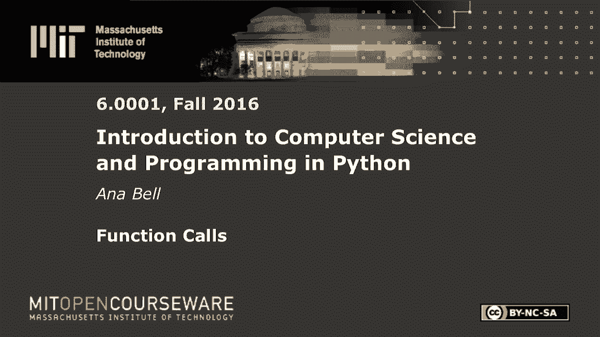
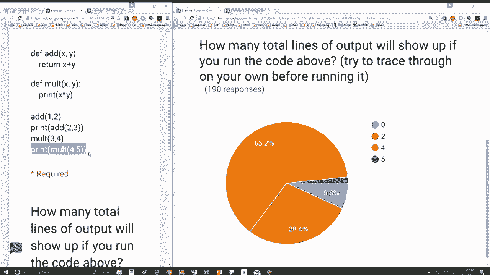

# 15：L4.2 - 函数调用 🧩


以下内容基于知识共享许可协议提供。您的支持将帮助 MIT OpenCourseWare 继续免费提供高质量的教育资源。如需捐款或查看来自数百门 MIT 课程的其他材料，请访问相关网站。

在本节课中，我们将通过一个具体的代码示例，学习函数调用、返回值以及 `print` 语句如何共同作用，最终决定程序在控制台输出的行数。我们将分析代码的执行流程，并计算出确切的输出行数。



## 代码示例分析

首先，我们来看提供的代码。这里定义了两个函数：`add` 和 `multiply`。

```python
def add(x, y):
    return x + y

def multiply(x, y):
    print(x * y)
```

`add` 函数接收两个参数 `x` 和 `y`，并**返回**它们的和 `x + y`。`multiply` 函数也接收两个参数，但它并不返回值，而是使用 `print` 语句直接**打印**出 `x * y` 的结果。由于 `multiply` 函数内部没有 `return` 语句，它将隐式地返回 `None`。

接下来是函数调用的代码：

```python
add(1, 2)
print(add(2, 3))
multiply(3, 4)
print(multiply(4, 5))
```

我们的目标是分析执行这四行代码后，控制台总共会显示多少行输出。

## 逐行执行过程

上一节我们介绍了两个函数的定义，本节中我们来看看每一行调用代码的具体执行过程。

以下是每一行代码执行时的输出分析：

1.  **`add(1, 2)`**：调用 `add` 函数，计算 `1 + 2` 得到结果 `3`。由于这行代码只是调用函数而没有使用 `print`，返回值 `3` 不会被显示在控制台。因此，**这一行没有产生任何输出**。

2.  **`print(add(2, 3))`**：首先执行内部的 `add(2, 3)`，计算得到 `5`。然后 `print` 语句将这个返回值 `5` 输出到控制台。因此，**这一行产生一行输出：`5`**。

3.  **`multiply(3, 4)`**：调用 `multiply` 函数。函数内部执行 `print(3 * 4)`，即 `print(12)`。这会将 `12` 直接打印到控制台。函数本身返回 `None`，但此处没有打印这个返回值。因此，**这一行产生一行输出：`12`**。

4.  **`print(multiply(4, 5))`**：首先执行内部的 `multiply(4, 5)`。函数内部执行 `print(4 * 5)`，即 `print(20)`，这产生了第一行输出 `20`。接着，`multiply` 函数执行完毕，返回 `None`。外层的 `print` 语句接收到这个返回值 `None`，并将其打印出来，这产生了第二行输出（通常是 `None`）。因此，**这一行产生两行输出：`20` 和 `None`**。

## 总结输出行数

综合以上分析，我们将各步骤产生的输出行数汇总：



以下是输出行数的统计列表：
*   第 2 行代码输出：`5`（1行）
*   第 3 行代码输出：`12`（1行）
*   第 4 行代码输出：`20` 和 `None`（2行）

总计输出行数为：**1 + 1 + 2 = 4 行**。


本节课中我们一起学习了如何跟踪函数调用的执行过程，关键点在于区分函数的**返回值**和使用 `print` 语句产生的**直接输出**。我们分析了 `add` 和 `multiply` 两个函数的不同行为，并逐步推导出四行调用代码最终在控制台产生了 **4** 行输出。理解这些概念对于调试程序和预测代码行为至关重要。