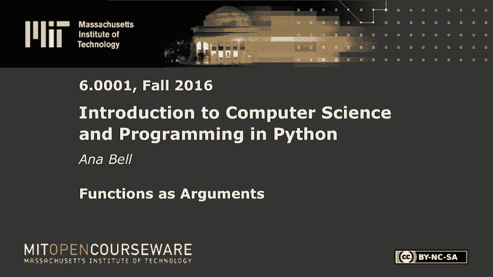
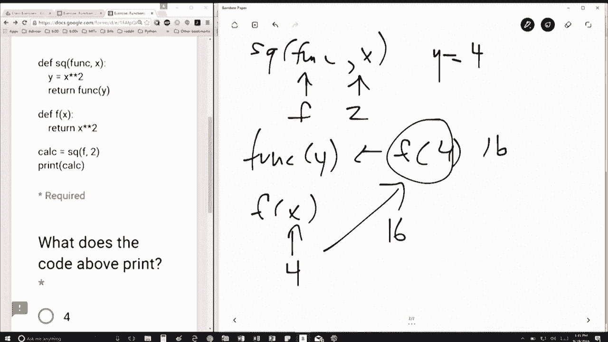

# 16：L4.3 - 函数参数 🧩

以下内容基于知识共享许可协议提供。您的支持将帮助 MIT OpenCourseWare 继续免费提供高质量的教育资源。如需捐款或查看来自数百门 MIT 课程的其他材料，请访问相关网站。

## 概述

在本节课中，我们将学习函数参数传递的机制，特别是当一个函数作为参数传递给另一个函数时，程序是如何执行的。我们将通过一个具体的代码示例，逐步分析其执行流程。

## 代码示例与分析

首先，我们来看一段代码。这里定义了两个函数。

第一个函数名为 `sq`，它接收两个参数。第二个函数名为 `f`，它接收一个参数。定义完函数后，程序执行了两行代码：第一行调用了函数 `sq`，第二行打印了一个值。

目前，我们暂时不关心函数内部的具体实现，因为函数调用尚未发生。让我们先关注第一个函数调用：`calc = sq(f, 2)`。

在函数 `sq` 内部，参数 `func` 将被映射为 `f`，参数 `x` 将被映射为 `2`。参数是按顺序进行映射的。

函数 `sq` 执行的第一件事是创建变量 `y`，并计算 `y = x * x`。此时 `x` 是 `2`，所以 `y` 等于 `4`。

接着，函数 `sq` 执行 `return func(y)`。这意味着它将调用 `func` 函数，并传入 `y` 的值（即 `4`）。所以，这里实际上是在计算 `f(4)`。

现在，程序需要知道 `f` 函数是什么。`f` 函数是在之前定义的，其功能是返回 `x` 的平方。

在 `f` 函数内部，参数 `x` 被映射为我们传入的值 `4`。因此，`f(4)` 将计算并返回 `4 * 4`，结果是 `16`。

`f(4)` 的计算结果 `16` 将返回给调用者，也就是 `sq` 函数中的 `return func(y)` 这一行。

因此，`sq(f, 2)` 这个函数调用最终返回的值是 `16`。这个返回值被赋给了变量 `calc`。

最后，程序执行 `print(calc)`，这行代码会打印出变量 `calc` 的值，也就是 `16`。

## 核心概念总结

通过这个例子，我们可以理解以下几个核心概念：

*   **参数映射**：函数调用时，实参按顺序传递给形参。
*   **函数作为参数**：一个函数（如 `f`）可以作为参数传递给另一个函数（如 `sq`）。
*   **作用域与返回**：函数执行完毕后，返回值会传递给调用它的上下文。

## 执行流程简述

以下是代码执行的简化步骤：

1.  定义函数 `sq(func, x)` 和 `f(x)`。
2.  调用 `sq(f, 2)`。
3.  在 `sq` 内，`func` 绑定为 `f`，`x` 绑定为 `2`。
4.  计算 `y = 2 * 2`，得到 `4`。
5.  执行 `return f(4)`，即调用函数 `f`。
6.  在 `f` 内，`x` 绑定为 `4`，计算并返回 `4 * 4 = 16`。
7.  `sq` 函数接收到 `16` 并将其返回。
8.  返回值 `16` 被赋给变量 `calc`。
9.  打印 `calc`，输出 `16`。

## 总结

本节课中，我们一起学习了函数参数的传递过程，特别是高阶函数（以函数为参数的函数）的执行机制。我们通过跟踪一个具体示例中变量的绑定和函数调用流程，理解了代码如何从外层函数进入内层函数，并最终将结果返回。掌握这一流程对于理解复杂的程序逻辑至关重要。