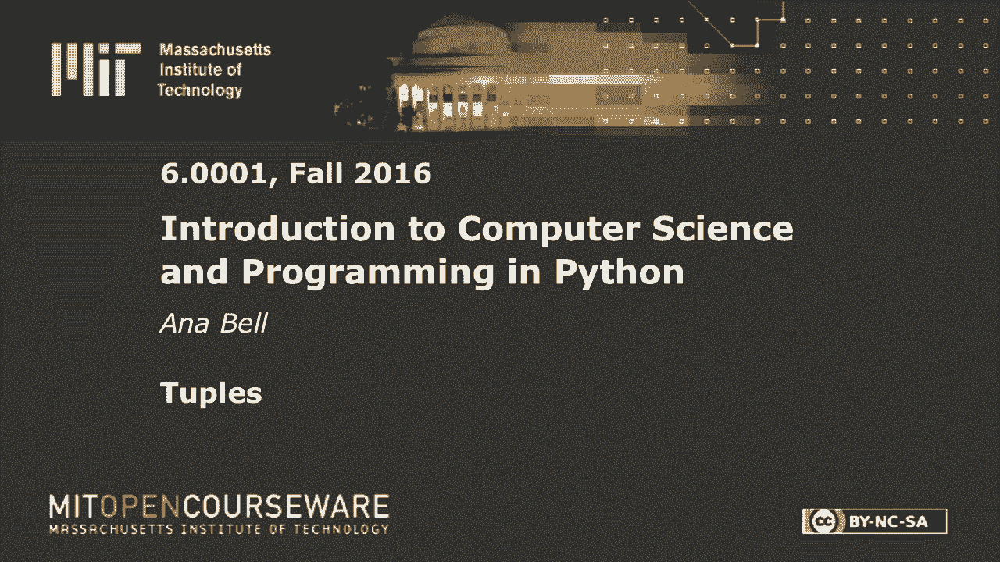
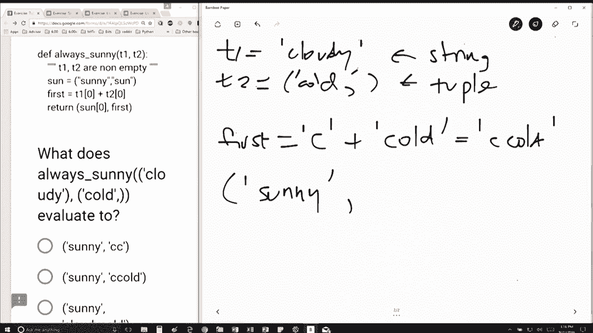

# 18：L5.2 - 元组 🧩


以下内容基于知识共享许可协议提供。您的支持将帮助 MIT OpenCourseWare 继续免费提供高质量的教育资源。如需捐款或查看来自数百门 MIT 课程的其他材料，请访问相关网站。




## 概述

在本节课中，我们将通过一个具体的代码示例来学习元组（tuple）的基本概念和操作。我们将分析一个名为 `always_sunny` 的函数，理解元组与字符串在定义和索引上的区别，并逐步推导代码的执行结果。

## 代码分析

我们有一个名为 `always_sunny` 的函数，它接收两个变量 `t1` 和 `t2`。我们使用参数 `cloudy` 和 `cold` 来调用这个函数。

```python
def always_sunny(t1, t2):
    # 函数体
```

当进行函数调用时，`t1` 被赋值为字符串 `"cloudy"`，`t2` 被赋值为元组 `("cold",)`。这里的关键在于，代码中 `t2` 的赋值形式是 `cold,`，根据 Python 语法，**末尾的逗号会将单个元素定义为元组**，而没有逗号的 `cloudy` 则是一个字符串。

所以初始赋值如下：
*   `t1 = "cloudy"` （字符串）
*   `t2 = ("cold",)` （元组）

## 变量赋值与索引

接下来，代码执行 `sun = ("sunny",)`。这同样定义了一个包含单个字符串 `"sunny"` 的元组。

然后，代码计算变量 `first` 的值：
```python
first = t1[0] + t2[0]
```

我们来分解这个表达式：
1.  `t1[0]`：由于 `t1` 是字符串 `"cloudy"`，索引 `[0]` 获取其第一个字符，即 `"c"`。
2.  `t2[0]`：由于 `t2` 是元组 `("cold",)`，索引 `[0]` 获取其第一个（也是唯一一个）元素，即字符串 `"cold"`。
3.  将两者使用 `+` 连接，`first` 的结果是字符串 `"ccold"`。

## 返回值

最后，函数返回一个元组：
```python
return (sun[0], first)
```

这个返回的元组包含两个元素：
1.  `sun[0]`：从元组 `sun` 中获取第一个元素，即字符串 `"sunny"`。
2.  `first`：即我们上一步计算出的字符串 `"ccold"`。

因此，函数的最终返回值是元组 `("sunny", "ccold")`。

## 核心概念总结



本节课中我们一起学习了元组的关键特性：

1.  **元组的定义**：在 Python 中，**逗号是创建元组的关键**，括号通常可省略。例如 `t = 1,` 或 `t = (1,)` 创建单元素元组，而 `t = 1` 只是一个整数。
2.  **字符串与元组的区别**：字符串是字符序列，用引号定义；元组是任意对象的序列，用逗号定义。它们的索引操作 `[0]` 行为一致，都是获取第一个元素。
3.  **类型的重要性**：理解变量是字符串还是元组，对预测代码行为至关重要。在本例中，`t1` 和 `t2` 初始类型的差异直接影响了 `first` 变量的计算结果。

通过这个例子，我们巩固了对元组基本语法和操作的理解。记住逗号在定义元组时的作用，就能准确区分元组和其他数据类型。