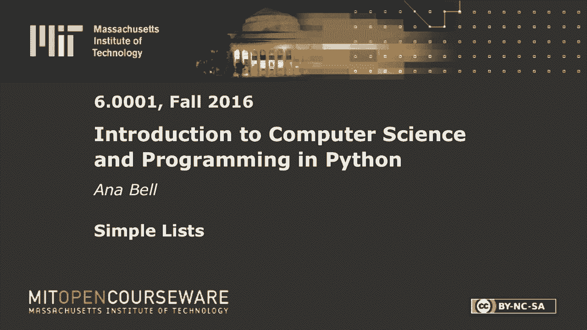
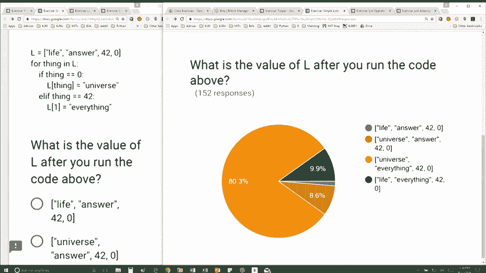

# 19：L5.3 - 简单列表操作详解 🧾


在本节课中，我们将学习如何通过循环遍历列表，并根据条件修改列表中的元素。我们将通过一个具体的例子，详细解析每一步的操作过程，帮助你理解列表在循环中的动态变化。

---

## 概述 📋



本节教程将展示一个对列表进行遍历和修改的完整过程。我们将从一个初始列表开始，通过循环逐个检查其元素，并在满足特定条件时修改列表对应位置的值。这个过程将清晰地展示列表索引、元素访问以及条件判断在编程中的实际应用。

## 初始列表与循环结构

首先，我们有一个初始列表 `L`，其内容如下：

```python
L = ["life", "answer", 42, 0]
```

在这个例子中，列表包含了字符串 `"life"`、字符串 `"answer"`、数字 `42` 和数字 `0`。数字 `42` 是一个有趣的彩蛋，它来源于科幻作品《银河系漫游指南》。

接下来，我们编写一个循环来直接遍历列表 `L` 中的每一个元素：

```python
for thing in L:
    # 循环体内的操作
```

在循环的每一次迭代中，变量 `thing` 会依次代表列表中的一个元素。第一次迭代时，`thing` 是 `"life"`；第二次是 `"answer"`；第三次是 `42`；第四次是 `0`。

## 循环内的条件判断与修改

现在，我们来看看循环内部的具体操作。代码结构如下：

```python
for thing in L:
    if thing == 0:
        L[thing] = "universe"
    else:
        L[1] = "everything"
```

循环体内包含一个条件判断。它的逻辑是：如果当前元素 `thing` 等于 `0`，则执行一个操作；否则，执行另一个操作。

让我们一步步跟踪这个循环的执行过程：

1.  **第一次迭代**：`thing = "life"`
    *   条件 `thing == 0` 为 `False`（因为 `"life"` 是字符串，不等于数字 0）。
    *   因此执行 `else` 分支：`L[1] = "everything"`。
    *   此时，列表 `L` 变为：`["life", "everything", 42, 0]`。位置 1（即第二个元素）被修改为 `"everything"`。

2.  **第二次迭代**：`thing = "answer"`（注意：此时 `thing` 取的是**原始列表**中第二个位置的值，即修改前的 `"answer"`）
    *   条件 `thing == 0` 为 `False`。
    *   执行 `else` 分支：`L[1] = "everything"`。
    *   列表 `L` 再次被修改，但位置 1 的值已经是 `"everything"`，所以结果不变：`["life", "everything", 42, 0]`。

3.  **第三次迭代**：`thing = 42`
    *   条件 `thing == 0` 为 `False`。
    *   执行 `else` 分支：`L[1] = "everything"`。
    *   列表 `L` 保持不变：`["life", "everything", 42, 0]`。

4.  **第四次迭代**：`thing = 0`
    *   条件 `thing == 0` 为 `True`。
    *   执行 `if` 分支：`L[thing] = "universe"`。由于 `thing` 的值是 `0`，所以这行代码等同于 `L[0] = "universe"`。
    *   此时，列表 `L` 的第一个元素（位置 0）被修改。列表最终变为：`["universe", "everything", 42, 0]`。

## 关键操作解析

上一节我们逐步跟踪了循环，本节中我们重点分析代码中的两个关键修改操作：

以下是修改操作的详细说明：

*   **操作 `L[1] = "everything"`**：此操作直接将列表 `L` 中索引为 1 的元素（即第二个元素）的值更改为字符串 `"everything"`。无论 `thing` 是什么值，只要不满足 `thing == 0`，就会执行此操作。
*   **操作 `L[thing] = "universe"`**：此操作使用当前元素 `thing` 的值作为索引来修改列表。仅当 `thing == 0` 为真时执行。此时，`thing` 的值为 `0`，因此它修改的是 `L[0]`，即列表的第一个元素。

## 最终结果总结

本节课中我们一起学习了如何遍历列表并基于条件修改其元素。通过上面的逐步分析，我们可以清晰地看到列表 `L` 的完整变化轨迹：

1.  初始列表：`["life", "answer", 42, 0]`
2.  第一次迭代后：`["life", "everything", 42, 0]`
3.  第二次迭代后：`["life", "everything", 42, 0]`（无变化）
4.  第三次迭代后：`["life", "everything", 42, 0]`（无变化）
5.  第四次迭代后：`["universe", "everything", 42, 0]`

因此，整个代码段运行结束后，列表 `L` 的最终状态是 **`["universe", "everything", 42, 0]`**。



这个例子演示了在循环中直接修改正在遍历的列表时需要特别注意执行顺序和索引变化，否则可能会得到与直觉不符的结果。理解每一步的状态变化是掌握列表操作的关键。