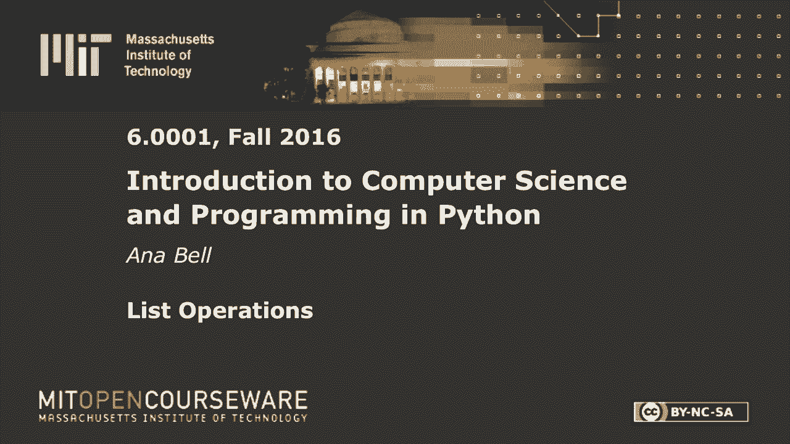
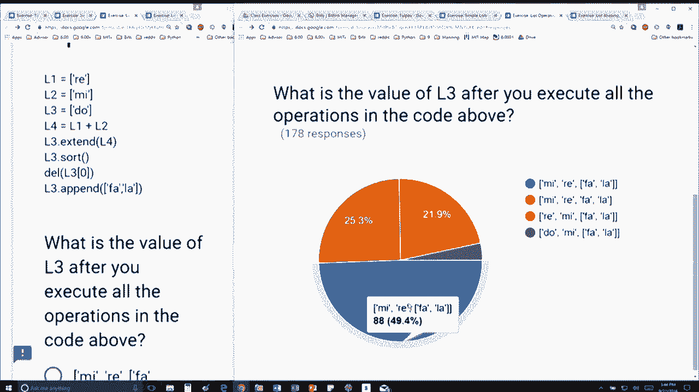

# 20：L5.4 - 列表操作 🧩

在本节课中，我们将学习Python中列表的基本操作，包括列表的拼接、扩展、排序和删除元素。我们会通过一个具体的例子，一步步分析代码的执行过程，以理解列表是如何被修改的。

## 初始列表定义

首先，我们定义了四个列表：

*   `l1 = ['Ray']`
*   `l2 = ['Me']`
*   `l3 = ['Doh']`
*   `l4 = ['Ray', 'Me']`

## 列表拼接与扩展

上一节我们定义了初始列表，本节中我们来看看如何操作它们。

以下是列表的拼接操作：
*   `l1 + l2` 会创建一个**新的列表**，其结果为 `['Ray', 'Me']`。这个操作不会改变 `l1` 或 `l2`。

接着，我们使用 `extend` 方法：
*   `l3.extend(l4)` 会**修改（mutate）** `l3` 列表。`l3` 最初是 `['Doh']`，被 `l4`（即 `['Ray', 'Me']`）扩展后，变为 `['Doh', 'Ray', 'Me']`。原始的 `l3` 列表已经不存在了。

## 列表排序与删除

在列表被扩展之后，我们继续对其进行排序和删除操作。

以下是排序操作：
*   `l3.sort()` 会**修改** `l3` 列表，将其元素按字母顺序排列。`['Doh', 'Ray', 'Me']` 排序后变为 `['Doh', 'Me', 'Ray']`。同样，排序前的 `l3` 版本被覆盖。

接着是删除操作：
*   `del l3[0]` 会**修改** `l3` 列表，删除索引为0的元素。因此，`['Doh', 'Me', 'Ray']` 在删除 `'Doh'` 后，变为 `['Me', 'Ray']`。

## 列表追加操作

最后，我们对列表进行追加操作。

以下是追加操作：
*   `l3.append(['Fa', 'La'])` 会**修改** `l3` 列表。注意，`append` 方法是将整个参数作为一个**元素**添加到列表末尾。因此，当前的 `l3`（即 `['Me', 'Ray']`）会变为 `['Me', 'Ray', ['Fa', 'La']]`。最终结果是一个包含两个字符串和一个子列表的列表。

## 总结

本节课中我们一起学习了Python列表的几种关键操作。我们了解到 `+` 操作符用于拼接并生成新列表，而 `extend()`、`sort()`、`del` 和 `append()` 方法则会直接修改原始列表。通过逐步追踪代码，我们清晰地看到了列表在每一步操作后的状态变化，这对于理解列表的可变性（mutability）至关重要。