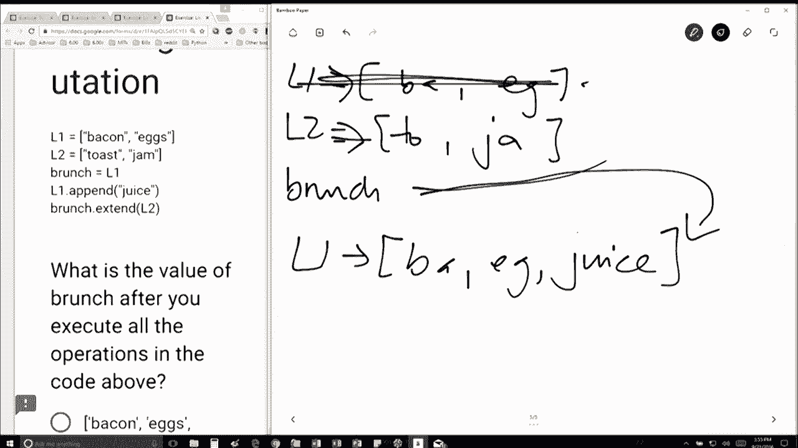

# 21：L5.5 - 列表重命名与元素更改 🧾


以下内容基于知识共享许可协议提供。您的支持将帮助 MIT OpenCourseWare 继续免费提供高质量的教育资源。如需捐款或查看来自数百门 MIT 课程的其他材料，请访问相关网站。

在本节课中，我们将学习 Python 中列表的别名现象以及如何通过方法修改列表元素。理解这些概念对于掌握列表的可变性至关重要。


首先，我们创建两个列表。第一个列表 `L1` 包含 `'bacon'` 和 `'eggs'`。第二个列表 `L2` 包含 `'toast'` 和 `'jam'`。

```python
L1 = ['bacon', 'eggs']
L2 = ['toast', 'jam']
```

接着，我们创建一个名为 `brunch` 的新变量，并让它等于 `L1`。这被称为“别名”，意味着 `brunch` 将指向 `L1` 所指向的同一个列表对象。

```python
brunch = L1
```

现在，我们通过 `append` 方法修改 `L1`，为其添加一个新元素 `'juice'`。`L1` 现在变成了 `['bacon', 'eggs', 'juice']`。

```python
L1.append('juice')
```

由于 `brunch` 是 `L1` 的别名，它们指向同一个列表对象。因此，当我们修改 `L1` 时，`brunch` 所看到的内容也随之改变。此时，`brunch` 的值也是 `['bacon', 'eggs', 'juice']`。




接下来，我们对 `brunch` 使用 `extend` 方法，将 `L2` 中的所有元素添加到 `brunch` 列表的末尾。

```python
brunch.extend(L2)
```

执行此操作后，`brunch` 列表（也就是 `L1` 所指向的列表）将包含五个元素：`'bacon'`, `'eggs'`, `'juice'`, `'toast'`, `'jam'`。

这个例子清晰地展示了由别名引起的“副作用”问题：因为 `brunch` 和 `L1` 指向同一个对象，所以通过任何一个变量对列表进行的修改，都会影响到另一个变量。

本节课中我们一起学习了列表的别名赋值以及如何使用 `append` 和 `extend` 方法修改列表。关键点在于理解多个变量可以指向同一个可变对象，对对象的修改会通过所有引用它的变量反映出来。