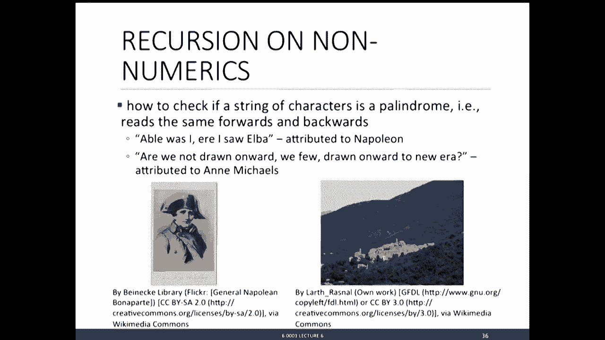
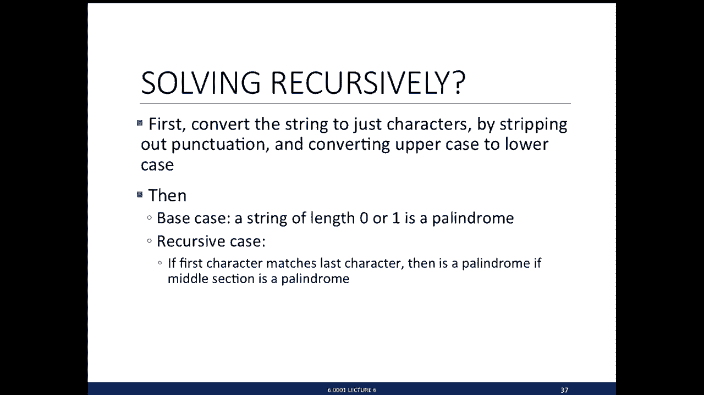
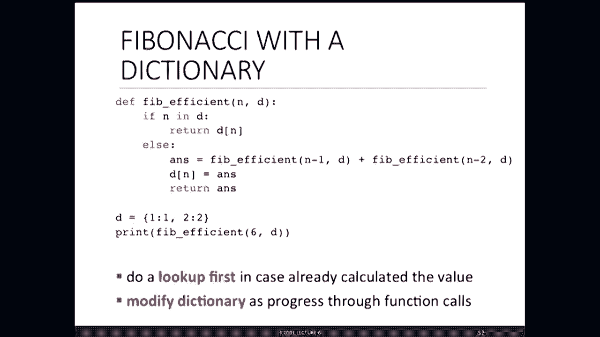
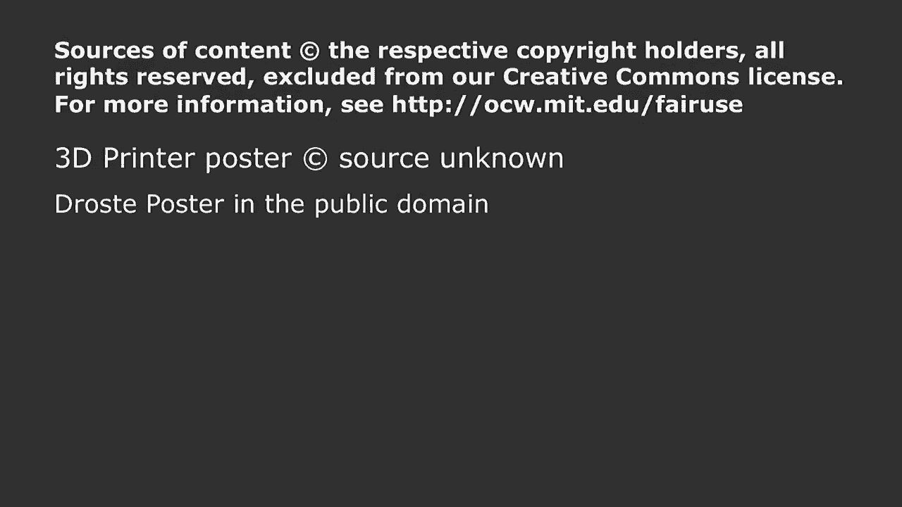

# 22：L6 - 递归与字典 🧠📚


在本节课中，我们将要学习两个核心概念：**递归**和**字典**。递归是一种通过将问题分解为更小的相同问题来解决问题的强大编程技术。字典则是Python中一种灵活的数据结构，允许我们使用键值对来存储和访问数据。我们将通过多个实例来理解它们的工作原理和应用方式。

***

## 递归：什么是递归？ 🤔

上一节我们介绍了课程的整体目标，本节中我们来看看递归的具体含义。

从抽象或算法层面看，递归通常被称为“分而治之”或“减而治之”。其核心思想是：将一个待解决的问题，简化为一个更简单的相同问题，再加上一些已知的、可以直接处理的部分。然后，对这个更简单的问题重复此过程，直到达到一个可以直接解决的简单情况（称为**基例**）。

从语义或编程层面看，递归通常表现为一个函数在其定义体内调用自身。只要我们能确保存在一个或多个易于解决的基例，并且每次递归调用都向基例靠近，就可以避免无限递归。

***

## 递归示例：整数乘法 ✖️

为了理解递归，我们先看一个迭代算法的例子：仅使用加法来实现整数乘法。迭代算法通常由一组**状态变量**来描述，这些变量记录了计算的精确状态。

以下是使用迭代方法（`while`循环）实现乘法的代码：

```python
def mult_iter(a, b):
    result = 0
    while b > 0:
        result += a
        b -= 1
    return result
```

现在，让我们用递归的视角来看待同一个问题。`a * b` 等价于 `a` 加上 `a * (b-1)`。这听起来像是文字游戏，但它至关重要，因为它将原问题 `a * b` 简化为了一个更小的相同问题 `a * (b-1)`，再加上一个已知操作（加法）。我们可以不断重复这个过程，直到达到基例（例如 `b == 1` 时，答案为 `a`）。

以下是递归实现的代码：

```python
def mult_recursive(a, b):
    if b == 1:          # 基例
        return a
    else:               # 递归步骤
        return a + mult_recursive(a, b-1)
```

这个递归定义清晰地将问题简化为更小的版本。

***

## 递归示例：阶乘函数 🔢

阶乘是另一个经典的递归问题。n的阶乘（n!）定义为从1到n所有正整数的乘积。

我们可以这样思考递归方案：
*   **基例**：当 `n == 1` 时，`1! = 1`。
*   **递归步骤**：`n! = n * (n-1)!`

根据这个思路，我们可以轻松写出递归代码：

```python
def fact(n):
    if n == 1:
        return 1
    else:
        return n * fact(n-1)
```

为了理解递归调用的执行过程，我们可以跟踪函数调用栈。每次递归调用都会创建一个新的栈帧，其中包含该次调用独有的变量绑定。计算会不断“展开”，直到达到基例，然后结果会沿着调用栈“回溯”并组合，最终得到答案。

***

## 数学归纳法与递归正确性 ✅

我们如何确信递归代码是正确的？数学归纳法是一个强大的工具。要证明一个关于整数n的命题对所有n都成立，我们需要：
1.  **基础步骤**：证明命题对最小的n（如n=0或1）成立。
2.  **归纳步骤**：假设命题对某个任意值k成立（归纳假设），然后证明在此假设下，命题对k+1也成立。

这与递归编程的思想完全一致：
*   **基础步骤**对应**基例**，我们直接验证代码能返回正确结果。
*   **归纳步骤**对应**递归调用**，我们假设函数对更小的输入（如`n-1`）能正确工作，然后验证利用这个结果能计算出`n`的正确结果。

通过归纳法，我们可以逻辑上证明递归函数的正确性。

***

## 递归示例：汉诺塔 🗼

汉诺塔问题是一个著名的递归应用实例。问题描述：有三根柱子，其中一根上有N个从大到小叠放的圆盘。目标是将所有圆盘移动到另一根柱子上，每次只能移动一个圆盘，且任何时候都不能将大盘子放在小盘子上。

其递归解决方案非常优雅：
1.  将上面N-1个盘子从起始柱移动到辅助柱（这是一个更小的汉诺塔问题）。
2.  将最大的第N个盘子从起始柱直接移动到目标柱。
3.  再将那N-1个盘子从辅助柱移动到目标柱（这又是一个更小的汉诺塔问题）。

**基例**是当只需要移动一个盘子（N=1）时，直接移动即可。

代码如下：

```python
def printMove(fr, to):
    print('move from ' + str(fr) + ' to ' + str(to))

def Towers(n, fr, to, spare):
    if n == 1:
        printMove(fr, to)
    else:
        Towers(n-1, fr, spare, to) # 步骤1
        Towers(1, fr, to, spare)   # 步骤2
        Towers(n-1, spare, to, fr) # 步骤3
```

这个例子展示了递归如何让一个看似复杂的问题变得清晰易懂。

***

## 递归示例：斐波那契数列与回文检测 📈🔤

斐波那契数列是另一个递归例子，但它有两个基例，并且递归步骤包含两个不同的递归调用：
*   `fib(0) = 1`
*   `fib(1) = 1`
*   `fib(n) = fib(n-1) + fib(n-2) (n>1)`

代码如下：

```python
def fib(x):
    if x == 0 or x == 1:
        return 1
    else:
        return fib(x-1) + fib(x-2)
```

我们也可以对非数值数据使用递归，例如判断一个字符串是否是回文（正读反读都一样）：
1.  基例：长度为0或1的字符串是回文。
2.  递归步骤：检查字符串首尾字符是否相同，如果相同，则递归检查去掉首尾字符后的子串是否是回文。

***




## 字典：一种灵活的数据结构 📖


现在，让我们转向另一种复合数据类型：**字典**。字典是**可变的**，它存储的是**键-值对**的映射关系，而不是像列表那样通过整数索引访问元素。

想象一个记录学生成绩的场景。使用列表，我们可能需要维护多个并行列表（姓名、成绩、课程），并通过索引来关联它们。字典提供了更直观的方式：我们可以直接用学生姓名（键）来查找其成绩（值）。




***

## 字典的基本操作 🛠️

以下是字典的核心操作：

创建字典：
```python
grades = {} # 空字典
grades = {'Anna':'B', 'John':'A+', 'Denise':'A'} # 初始化字典
```

访问元素：
```python
grades['John'] # 返回 'A+'
```

添加或修改元素：
```python
grades['Sylvan'] = 'A' # 添加新条目
```

检查键是否存在：
```python
'John' in grades # 返回 True
```

删除元素：
```python
del grades['Anna']
```

获取所有键或值：
```python
grades.keys()   # 返回一个包含所有键的“可迭代对象”
grades.values() # 返回一个包含所有值的“可迭代对象”
```

关于字典需要记住的要点：
*   **值**可以是任何类型（可变或不可变），甚至可以重复。
*   **键**必须是**唯一的**和**不可变的**（如整数、浮点数、字符串、元组、布尔值）。
*   字典中的条目是**无序**存储的。

***

## 字典应用示例：歌词词频分析 🎵

让我们看一个结合循环和字典的实际例子：分析歌词中单词的出现频率。

思路是遍历歌词单词列表，使用字典记录每个单词出现的次数：

```python
def lyrics_to_frequencies(lyrics):
    myDict = {}
    for word in lyrics:
        if word in myDict:          # 如果单词已在字典中
            myDict[word] += 1       # 计数加1
        else:                       # 如果单词是第一次出现
            myDict[word] = 1        # 在字典中创建新条目，计数为1
    return myDict
```

有了频率字典后，我们可以进一步分析，例如找出出现次数最多的单词：

```python
def most_common_words(freqs):
    best = max(freqs.values())      # 找到最高频率
    words = []
    for k in freqs:                 # 遍历所有键（单词）
        if freqs[k] == best:        # 如果该单词频率等于最高频率
            words.append(k)         # 将其加入列表
    return (words, best)            # 返回单词列表和该频率
```

我们还可以编写函数，找出所有出现频率超过某个阈值的单词，并在找出后将其从字典中删除，以便进行下一轮查找。

***

## 递归优化：使用字典进行记忆化（Memoization）⚡

最后，我们看看如何用字典提升递归效率。以斐波那契数列为例，朴素的递归`fib(n)`会进行大量重复计算（例如`fib(3)`会被计算多次）。

**记忆化**技术通过字典来存储已经计算过的结果，避免重复计算：

```python
def fib_memo(n, memo={0:1, 1:1}): # 初始化字典存储基例
    if n in memo:                 # 如果结果已经计算过
        return memo[n]            # 直接从字典返回
    else:                         # 否则进行计算
        memo[n] = fib_memo(n-1, memo) + fib_memo(n-2, memo) # 计算并存储结果
        return memo[n]            # 返回结果
```

对于`fib(30)`，朴素递归需要超过1100万次调用，而记忆化版本仅需约60次调用，速度差异巨大。这展示了字典作为缓存工具的威力。

***

## 总结 📝



本节课中我们一起学习了：
1.  **递归**的核心思想：将问题分解为更小的相同问题，并通过基例终止递归。我们通过阶乘、汉诺塔、斐波那契数列和回文检测等例子进行了实践。
2.  **字典**的基本概念和操作：字典是一种可变的键值对映射数据结构，提供了基于键的高效数据访问。我们学习了如何创建、访问、修改字典，并分析了歌词词频。
3.  **递归与字典的结合**：我们看到了如何使用字典进行记忆化，来显著优化存在重叠子问题的递归算法（如斐波那契数列），这体现了将不同编程工具结合起来的强大力量。



递归和字典是Python编程中极为重要的工具，掌握它们将帮助你更优雅、更高效地解决复杂问题。