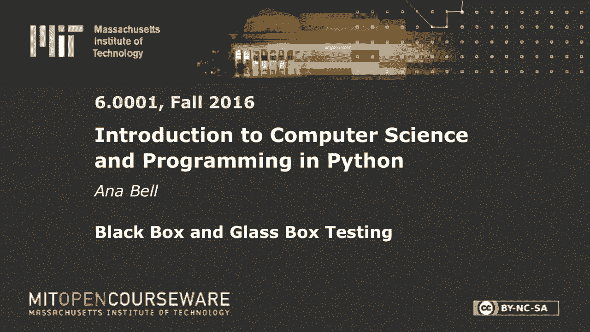
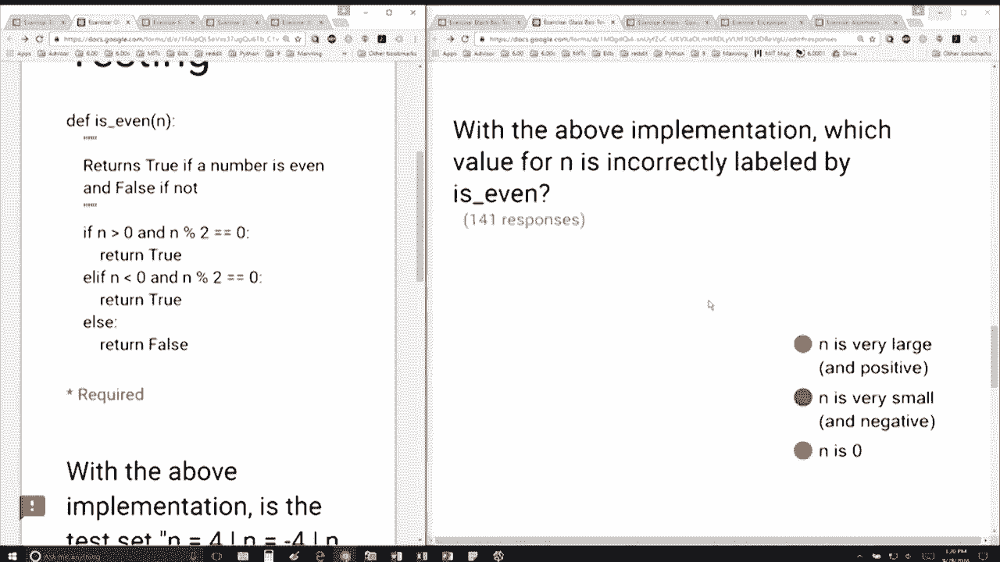

# 24：L7.2 - 黑盒与白盒测试 🧪


在本节课中，我们将学习黑盒测试与白盒测试的核心概念，并通过一个具体的函数示例来理解如何设计测试用例以确保代码的正确性。

---

## 概述

我们有一个名为 `is_even` 的函数，其实现如下：

```python
if n is positive and n divided by two's remainder is 0:
    return true
if n is negative and divisible by 2:
    return true
otherwise:
    return false
```



我们的目标是分析这个实现，并回答关于测试集完整性和潜在错误的问题。

---

## 测试集路径完整性分析

上一节我们介绍了函数的基本实现，本节中我们来看看给定的测试集是否能够覆盖所有可能的执行路径。

测试集包含两个值：`4` 和 `-4`。

以下是分析过程：

*   `4` 是正数且能被2整除，因此会执行第一个 `if` 语句并返回 `true`。
*   `-4` 是负数且能被2整除，因此会执行第二个 `if` 语句并返回 `true`。
*   测试集没有包含会触发 `else` 分支（即返回 `false`）的用例，例如一个奇数。

因此，该测试集**不是**路径完整的，因为它未能覆盖所有可能的代码执行路径（缺少对 `else` 分支的测试）。

---

## 识别程序错误标签

在分析了测试覆盖后，我们接下来需要找出程序可能错误标记的输入值。

程序逻辑存在一个缺陷：它没有处理 `n = 0` 的情况。

以下是具体分析：

*   根据代码，第一个条件 `n is positive` 对 `0` 不成立。
*   第二个条件 `n is negative` 对 `0` 也不成立。
*   因此，输入 `0` 会落入 `else` 分支，返回 `false`。

然而，`0` 是一个偶数。所以，程序会将偶数 `0` 错误地标记为“非偶数”。

对于其他边界值，例如非常大的数或非常小的数（只要它们是偶数），程序逻辑仍然有效。

---

## 总结



本节课中我们一起学习了如何基于给定的代码实现进行白盒测试分析。我们首先检查了测试集的路径覆盖完整性，发现其缺失了对 `else` 分支的测试。接着，我们通过分析代码逻辑，识别出程序在处理输入 `n = 0` 时会返回错误结果，因为它既不是正数也不是负数，从而落入了返回 `false` 的默认分支。这个例子强调了考虑所有边界条件（特别是像 `0` 这样的特殊值）在测试中的重要性。