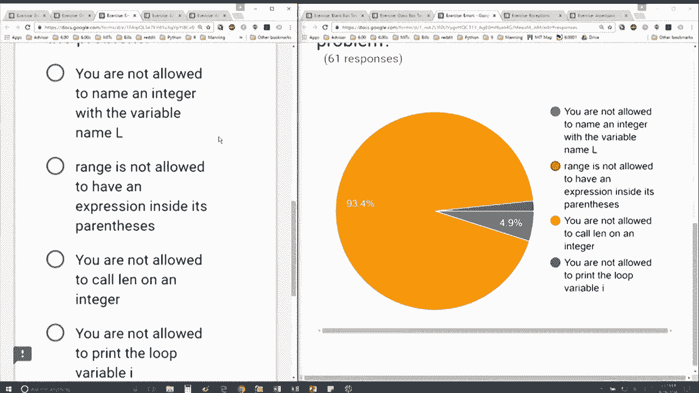

# 25：L7.3 - 错误处理 🐛


以下内容基于知识共享许可协议提供。您的支持将帮助 MIT OpenCourseWare 继续免费提供高质量的教育资源。如需捐款或查看来自数百门 MIT 课程的其他材料，请访问相关网站。


在本节课中，我们将学习如何识别和处理 Python 编程中常见的错误。通过分析具体的错误案例，我们将理解错误信息的结构，并学会如何修正代码。


上一节我们介绍了错误的基本概念，本节中我们来看看一个具体的错误案例。

请看这段代码：
```python
L = 3
for I in range(length L)
    print I
```
运行这段代码后，我们得到了一个错误信息。这个错误信息通常会告诉我们出错的**文件名**、**行号**、具体的**错误代码行**，以及一个**错误类型描述**。在这个例子中，错误类型是 `TypeError`。

以下是关于这个错误的几个可能原因，请判断哪个是正确的：
*   A. `range` 的参数数量不对。
*   B. `length` 不是一个函数。
*   C. `L` 没有被定义。
*   D. `I` 需要在引号内。




通过分析代码和错误信息，我们可以找到问题的根源。如果你逐一检查其他选项，会发现那些操作在 Python 中实际上是可行的，你甚至可以亲自测试一下。


本节课中我们一起学习了如何解读 Python 的错误信息。我们通过一个 `TypeError` 的实例，了解到错误信息会提供文件、行号和错误类型等关键信息，这对于我们调试代码至关重要。记住，仔细阅读错误描述是解决问题的第一步。