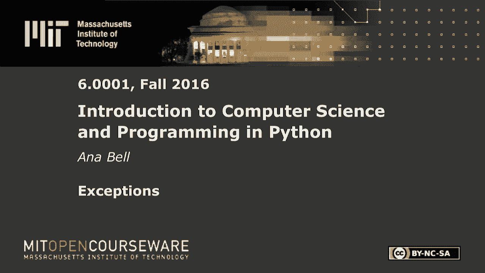
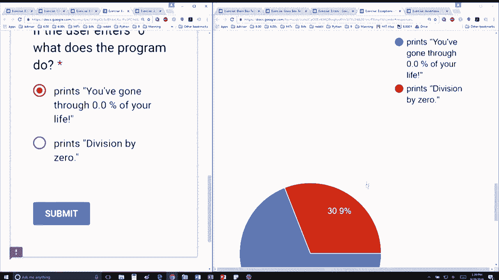

# 26：L7.4 - 异常处理 🛡️


以下内容基于知识共享许可协议提供。您的支持将帮助 MIT OpenCourseWare 继续免费提供高质量的教育资源。如需捐款或查看来自数百门 MIT 课程的其他材料，请访问相关网站。


在本节课中，我们将学习 Python 中的异常处理机制。异常处理是编写健壮程序的关键，它允许我们优雅地处理程序运行时可能出现的错误，而不是让程序直接崩溃。我们将通过一个具体的代码示例来理解 `try`、`except` 语句块的工作原理。




## 代码示例分析


下面的代码初看可能有点令人却步，但其实并不复杂。真正执行功能的部分是这里的几行代码。

```python
try:
    age = int(input("How old are you? "))
    percent = round(age * 100 / 80, 1)
    print(f"You've gone through {percent}% of your life.")
except ValueError:
    print("Oops, you must enter a number.")
except ZeroDivisionError:
    print("Divided by zero error.")
except:
    print("Something went very wrong.")
```

这段代码的核心逻辑是：
1.  从用户获取一个输入，询问年龄。
2.  将输入转换为整数。
3.  假设预期寿命为 80 岁，计算已度过生命的百分比：`(年龄 / 80) * 100`。
4.  将结果四舍五入到一位小数并打印。

由于用户输入是不可预测的，我们使用异常处理来捕获可能发生的错误。


## 异常捕获逻辑

上一节我们介绍了代码的整体结构，本节中我们来看看具体的异常捕获逻辑。代码中设置了三个 `except` 块来捕获不同类型的错误。

以下是各个 `except` 块的作用：

*   `except ValueError:`：当用户输入的内容无法转换为整数（例如输入了字母）时触发。程序会打印 “Oops, you must enter a number.”。
*   `except ZeroDivisionError:`：当发生除零错误时触发。在这个特定计算中，除非分母 `80` 被改为 `0`，否则不会触发。程序会打印 “Divided by zero error.”。
*   `except:`：这是一个通用的异常捕获块，会捕获所有前面未指定的其他异常。程序会打印 “Something went very wrong.”。


## 场景测试与分析

现在，让我们通过几个测试场景来深入理解程序的执行流程。


### 场景一：用户输入 `20`

如果用户输入字符串 `"20"`，会发生什么？

输入被作为字符串接收，`int()` 函数成功将其转换为整数 `20`。随后计算 `20 * 100 / 80` 得到 `25.0`，四舍五入后打印 “You‘ve gone through 25.0% of your life.”。整个过程没有触发任何异常。


### 场景二：用户输入 `"twenty"`

如果用户输入的是非数字字符串 `"twenty"`，会发生什么？

`int("twenty")` 转换会失败，并引发 `ValueError` 异常。程序流程会跳转到第一个 `except ValueError:` 块，执行其中的代码，打印 “Oops, you must enter a number.”。


### 场景三：用户输入 `0`

这是一个容易混淆的场景。如果用户输入 `0`，会发生什么？

程序会计算 `0 * 100 / 80`，结果是 `0`。这里进行的是 `0` 除以 `80`，而不是 `80` 除以 `0`，因此**不会**引发 `ZeroDivisionError`。计算正常进行，四舍五入后打印 “You‘ve gone through 0.0% of your life.”。只有当你试图用某个数除以 `0` 时，才会触发零除错误。



零除错误仅在尝试将某个数除以零时发生。


## 总结


本节课中我们一起学习了 Python 异常处理的基础知识。我们通过一个计算生命百分比的程序，实践了如何使用 `try-except` 语句结构来捕获和处理 `ValueError` 与 `ZeroDivisionError` 等特定异常，同时也了解了通用异常捕获块的使用。关键点在于理解异常处理能让程序更友好、更稳定地应对意外输入或运行时错误，而不是直接崩溃。记住，清晰的异常处理是高质量代码的重要组成部分。