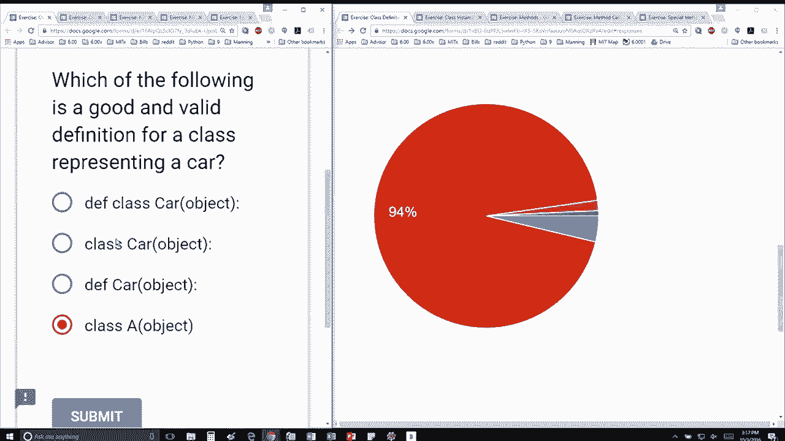

# 28：L8.2 - 类的定义 🚗

以下内容基于知识共享许可协议提供。您的支持将帮助MIT OpenCourseWare继续免费提供高质量的教育资源。如需捐款或查看来自数百门MIT课程的其他材料，请访问相关网站。

在本节课中，我们将学习如何在Python中定义一个类。我们将通过一个具体的例子来理解什么是有效的类定义，并区分正确的定义与不合适的定义。

---

上一节我们介绍了面向对象编程的基本概念。本节中，我们来看看如何具体定义一个类。

以下哪个是用于表示“汽车”的、良好且有效的类定义？

以下是四个选项：

*   `class Car(object):`
*   `def Car(object):`
*   `class Car():`
*   `class a():`

大多数人都答对了，正确答案是标红的那个，即 **`class Car(object):`**。这个定义非常完美。

让我们逐一分析其他选项为何不合适：

*   `def Car(object):` 这个语句定义的是一个**函数**，而不是一个类。
*   `class Car():` 这个语句虽然定义了一个**类**，但括号内为空，在Python 3中虽然有效，但明确继承自 `object` 是更清晰、更符合旧版本兼容性的写法。
*   `class a():` 这个语句也定义了一个类，但类名 `a` **完全不具备描述性**，不是一个好的命名。

因此，正确定义一个表示汽车的类，应该使用 `class Car(object):` 这样的语法结构。

---

本节课中我们一起学习了Python中类的定义方法。我们了解到，定义类需要使用 `class` 关键字，后跟一个具有描述性的类名，并通常指定其继承自 `object` 基类。同时，我们区分了类定义与函数定义的区别，并强调了为类选择有意义名称的重要性。