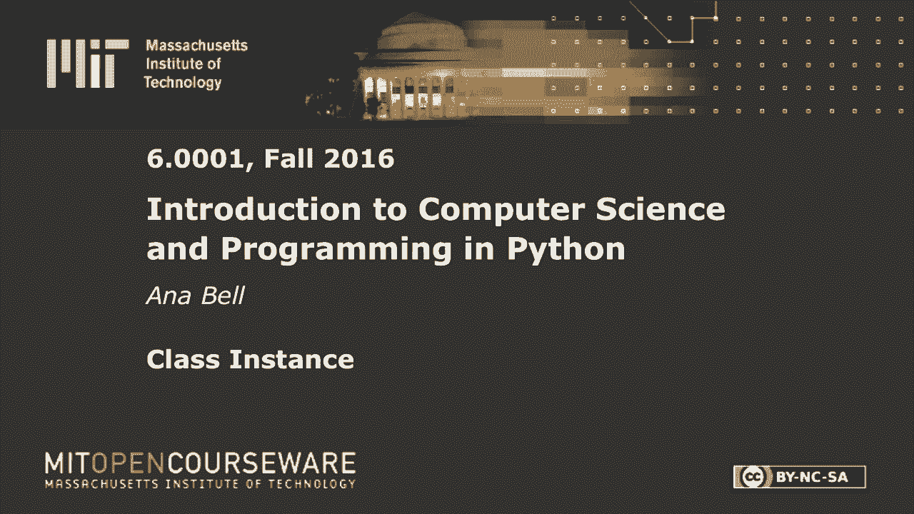
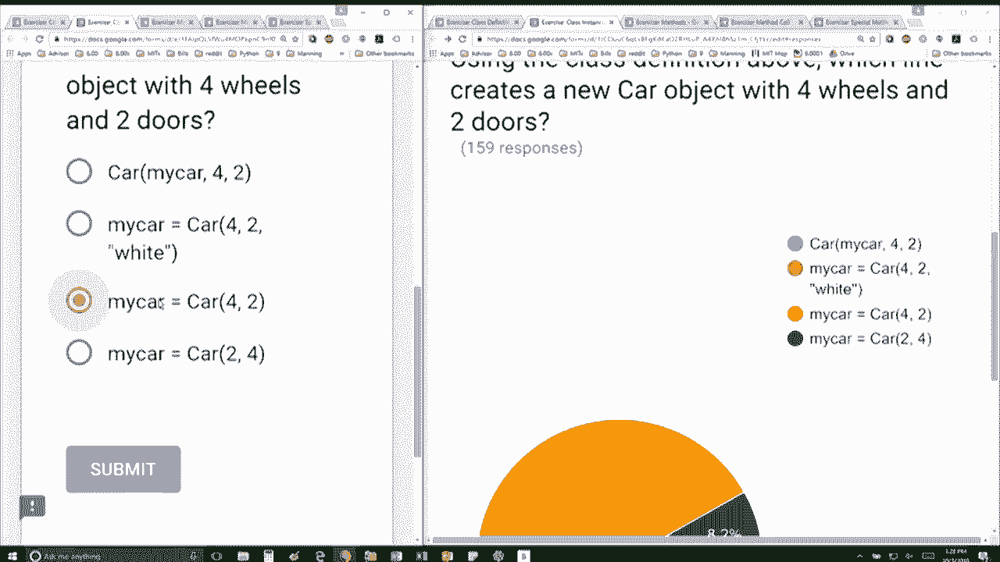
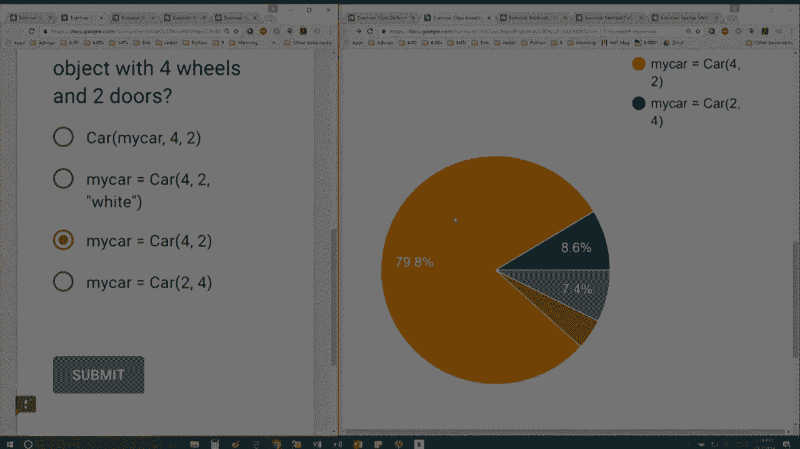

# 29：L8.3 - 类的实例 🚗


在本节课中，我们将学习如何根据类定义创建具体的对象实例，并理解初始化方法 `__init__` 中参数与对象属性之间的关系。



---

上一节我们介绍了类的定义，本节中我们来看看如何创建类的实例。

以下是根据提供的类定义创建新 `Car` 对象的正确方法。

```python
class Car:
    def __init__(self, W, D):
        self.wheels = W
        self.doors = D
        self.color = ""
```

要创建一个新的 `Car` 对象，需要调用类名并传入 `__init__` 方法中除 `self` 外的所有参数。

以下是创建新 `Car` 对象的步骤说明。

*   调用类名 `Car`。
*   传入第一个参数 `4`，对应 `__init__` 方法中的 `W` 参数，它将被赋值给对象的 `wheels` 属性。
*   传入第二个参数 `2`，对应 `__init__` 方法中的 `D` 参数，它将被赋值给对象的 `doors` 属性。

因此，创建具有四个轮子和两扇门的新 `Car` 对象的正确代码是：

```python
my_car = Car(4, 2)
```

---





本节课中我们一起学习了如何根据类定义实例化对象。我们明确了在调用类创建实例时，需要提供的参数与 `__init__` 方法中定义的参数（除 `self` 外）一一对应，这些参数值会在初始化过程中被赋给对象的数据属性。