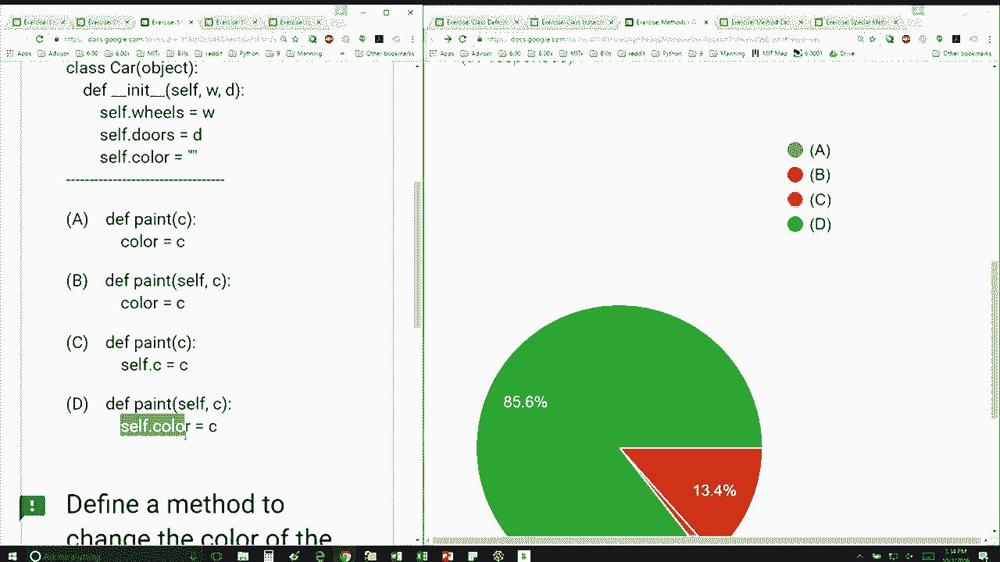

# 30：L8.4 - 类方法 🚗


以下内容基于知识共享许可协议提供。您的支持将帮助MIT OpenCourseWare继续免费提供高质量的教育资源。如需捐款或查看来自数百门MIT课程的其他材料，请访问相关网站。


上一节我们介绍了类的定义和实例的创建。本节中，我们来看看如何为类添加一个能够修改实例属性的方法。

我们被提供了以下`Car`类的定义，这个定义在之前的幻灯片中已经见过。现在，我想添加一个方法来改变汽车的颜色。以下是四个选项，看起来大家正在逐渐掌握要领，这很棒。

为了定义一个能改变汽车颜色的方法，我们需要知道`self`必须是第一个参数。因此，我们可以立即排除选项A和C。现在，选择就在B和D之间。

请记住，我们必须清楚要访问的是谁的数据属性。在这个例子中，我们想要改变一个特定汽车实例的颜色。因此，我们必须使用`self.color`来引用该实例的`color`属性，而不是仅仅使用`color`。



如果我们只写`color`，那么`color`将仅仅指向一个局部变量或全局变量，而不是实例的属性。这不会达到修改特定实例颜色的目的。


以下是定义此类方法的正确方式：


```python
def change_color(self, new_color):
    self.color = new_color
```

在这个方法中：
*   `self`参数代表调用该方法的实例本身。
*   `new_color`是传入的新颜色值。
*   `self.color = new_color`这行代码将实例的`color`属性更新为新的值。


本节课中我们一起学习了如何为类定义实例方法，特别是如何正确地使用`self`参数来访问和修改特定实例的属性。理解`self`的指向是编写有效类方法的关键。