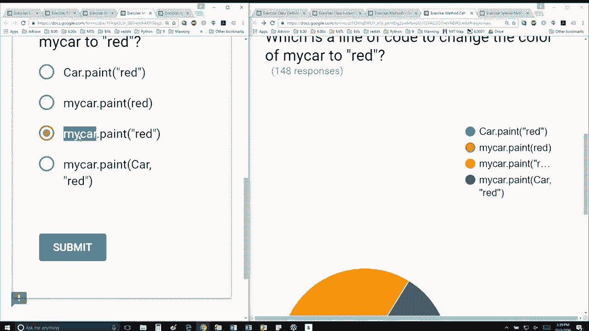

# 31：L8.5 - 方法调用 🚗


在本节课中，我们将学习如何在面向对象编程中调用方法。我们将通过一个具体的例子，理解如何正确地使用对象来调用其方法，并改变对象的属性。

---

上一节我们介绍了类的定义和方法的基本概念。本节中，我们来看看如何实际调用一个对象的方法。


假设我们有一个 `Car` 类，其定义如下：

```python
class Car:
    def __init__(self, wheels, doors):
        self.wheels = wheels
        self.doors = doors
        self.color = "unknown"

    def paint(self, new_color):
        self.color = new_color
```

这个类包含一个初始化方法 `__init__` 和一个用于改变颜色的 `paint` 方法。

现在，我们使用以下代码创建了一个 `Car` 对象：

```python
my_car = Car(4, 2)
```

这行代码初始化了一辆有4个轮子和2扇门的汽车，其初始颜色为 "unknown"。

问题是：哪一行代码可以将汽车的颜色从初始值改为红色？

以下是几个选项：

1.  `Car.paint("red")`
2.  `my_car.paint(red)`
3.  `my_car.paint("red")`
4.  `my_car.paint(self, "red")`

让我们逐一分析这些选项。

第一个选项 `Car.paint("red")` 试图使用类名直接调用方法，就像幻灯片右侧展示的那样。但这种方法缺少了 `self` 参数，我们不知道要对哪个对象执行操作，因此这个选项不正确。

第二个选项 `my_car.paint(red)` 看起来更接近，因为它是在对象 `my_car` 上调用方法。然而，这里的 `red` 被当作一个变量名，而不是表示颜色的字符串 `"red"`。如果之前没有定义名为 `red` 的变量，这行代码将无法工作。

第三个选项 `my_car.paint("red")` 是正确的。它正确地调用了 `my_car` 对象的 `paint` 方法，并传递了字符串 `"red"` 作为参数，这会将汽车的 `color` 属性设置为红色。

第四个选项 `my_car.paint(self, "red")` 是错误的。当我们使用 `对象名.方法名()` 的格式调用方法时，Python 会自动将 `self` 参数绑定到该对象上。因此，在调用时显式地传递 `self` 参数是不必要且不正确的。



---


本节课中我们一起学习了如何正确地调用对象的方法。关键在于理解 `self` 参数的隐式传递机制，以及确保传递给方法的参数类型和数量都正确。记住，通常我们使用 `对象.方法(参数)` 的格式来调用方法。