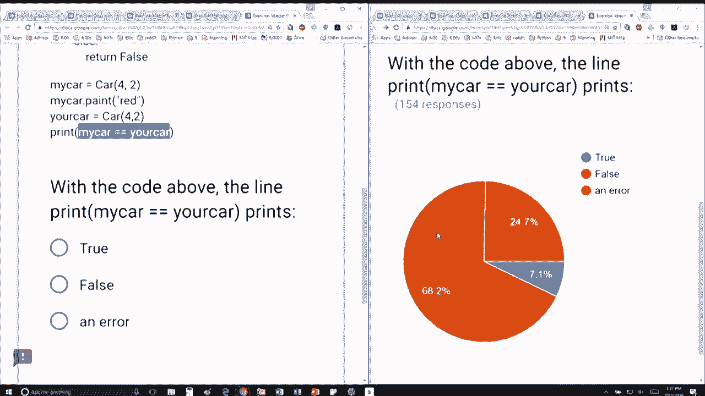

# 32：L8.6 - 特殊函数(方法) 🚗


以下内容基于知识共享许可协议提供。您的支持将帮助MIT OpenCourseWare继续免费提供高质量的教育资源。如需捐款或查看来自数百门MIT课程的其他材料，请访问相关网站。


## 概述

在本节课中，我们将学习如何为自定义类实现一个特殊的函数（方法），即 `__eq__` 方法。这个方法用于定义两个对象之间“相等”的比较逻辑。我们将通过一个“汽车”类的例子，来具体说明如何实现和使用它。


## 实现 `__eq__` 方法

我们已经完成了类的其他部分，现在要添加这个特殊函数。我们实现的是 `__eq__` 方法。实现这个方法将允许我们使用 `==` 运算符来比较两个自定义类的对象。


我决定比较两种汽车类型的方式是：如果两辆汽车具有相同的轮子数量、相同的颜色和相同的车门数量，那么它们就是相等的。


以下是实现逻辑：如果所有这些属性都相等，则返回 `True`，否则返回 `False`。


在具体的程序中，我创建了一辆有四个轮子、两个门的汽车，并将其颜色改为红色。接着，我创建了另一辆有四个轮子、两个门的汽车。默认情况下，这辆新车（你的车）的颜色是空字符串，因为这是新车的初始化方式。


因此，我的车和你的车之间的区别在于颜色。它们的轮子数量和车门数量是相同的。由于我在代码中实现了 `__eq__` 方法，使用 `==` 进行比较时不会抛出错误。程序会比较轮子数量（4与4，匹配），比较车门数量（2与2，匹配），然后比较颜色（不匹配），所以最终会返回 `False`。


## 代码示例

以下是实现 `__eq__` 方法的代码示例：

```python
class Car:
    def __init__(self, wheels, doors, color=""):
        self.wheels = wheels
        self.doors = doors
        self.color = color

    def __eq__(self, other):
        # 比较轮子数量、车门数量和颜色
        if self.wheels == other.wheels and self.doors == other.doors and self.color == other.color:
            return True
        else:
            return False

# 创建两个Car对象进行测试
my_car = Car(4, 2)
my_car.color = "red"

your_car = Car(4, 2)  # 颜色默认为空字符串

# 使用 == 进行比较
print(my_car == your_car)  # 输出: False
```


## 总结



本节课中，我们一起学习了如何为自定义类实现 `__eq__` 特殊方法。通过定义这个方法，我们可以自定义两个对象使用 `==` 运算符进行比较时的行为。我们以“汽车”类为例，展示了如何通过比较轮子数量、车门数量和颜色来判断两辆汽车是否相等。掌握特殊方法的使用，能让你的类更加灵活和强大。