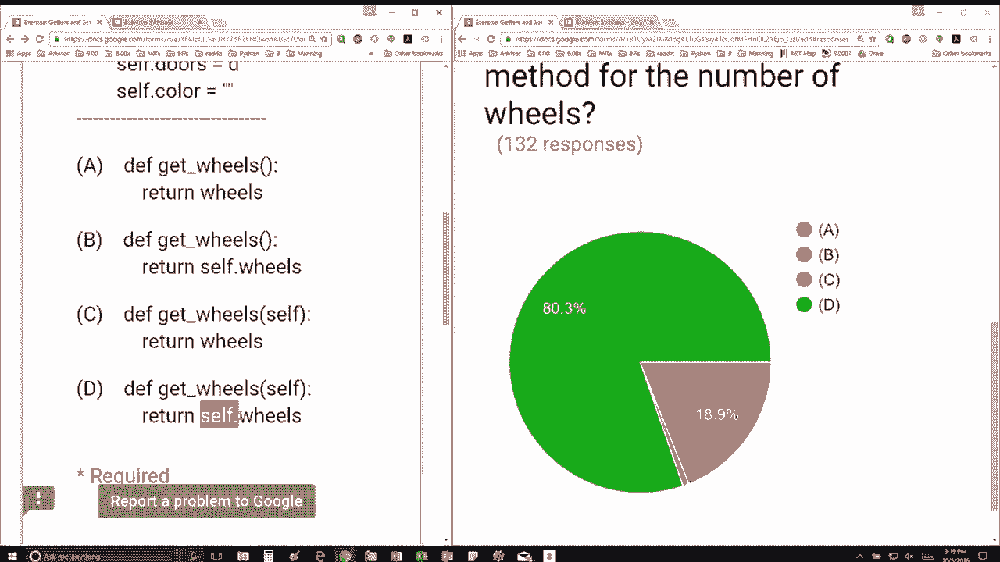

# 34：L9.2 - get与set系列处理方法 🚗


在本节课中，我们将学习Python中用于获取和设置对象属性的getter与setter方法。这些方法是面向对象编程中的重要概念，能帮助我们更安全、更灵活地管理对象的数据。

---

## 🛠️ 类的定义与初始化


我们首先定义一个名为`Car`的类。与往常一样，`__init__`方法接受`self`作为第一个参数。`Car`类在初始化时接收两个参数，并将第一个参数赋值给`wheels`数据属性，第二个参数赋值给`doors`数据属性。此外，我们还将`color`数据属性初始化为空字符串。

以下是`Car`类的初始化代码示例：

```python
class Car:
    def __init__(self, wheels, doors):
        self.wheels = wheels
        self.doors = doors
        self.color = ""
```

---

## 🔍 理解Getter方法

Getter方法用于获取对象的数据属性。它是一个类的方法，本质上是一个函数。在Python中，我们通常使用`self`来引用当前实例的属性。

以下是四个选项，问题是：哪一个选项是用于获取车轮数量的getter方法？

1. `def get_wheels(): return wheels`
2. `def get_wheels(self): return wheels`
3. `def get_wheels(): return self.wheels`
4. `def get_wheels(self): return self.wheels`

---

## ✅ 正确选项分析

由于getter方法是类的方法，它必须包含`self`参数。因此，选项1和选项3被排除。接下来，我们需要返回当前实例的`wheels`属性，而不是一个未定义的变量。因此，正确的getter方法应该使用`self.wheels`来引用属性。

以下是正确的getter方法：

```python
def get_wheels(self):
    return self.wheels
```

---

## 📝 总结



本节课中，我们一起学习了Python中getter方法的基本概念和实现方式。通过定义`Car`类，我们了解了如何使用`self`参数来访问实例的属性，并正确实现了获取车轮数量的getter方法。掌握这些知识将帮助你在面向对象编程中更有效地管理对象数据。