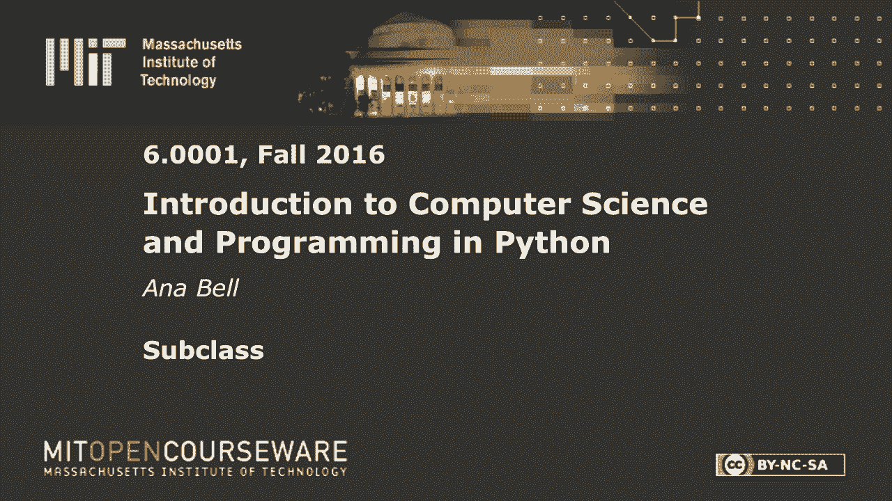
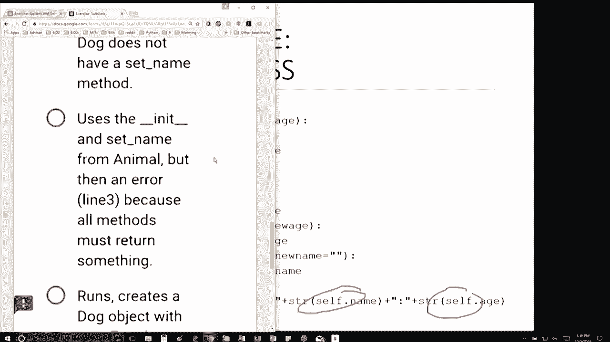
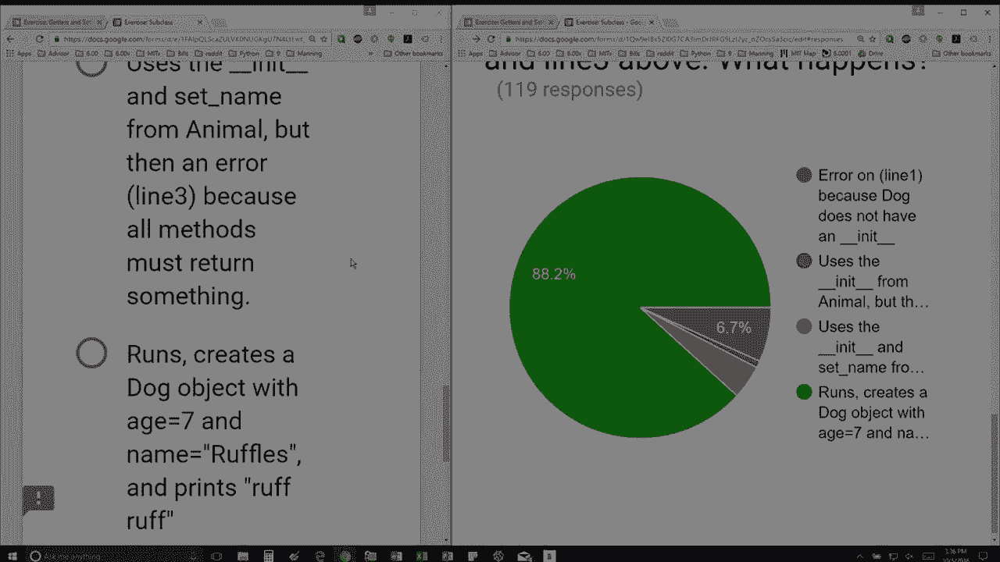

# 35：L9.3 - 子类 🐕




以下内容基于知识共享许可协议提供。您的支持将帮助麻省理工学院开放课程持续免费提供高质量的教育资源。如需捐款或查看来自数百门麻省理工学院课程的其他材料，请访问相关网站。

在本节课中，我们将学习如何创建子类，即一个类如何从另一个类（称为父类）继承属性和方法。我们将通过一个具体的例子来理解继承的概念和实际应用。


首先，我们看到一段代码的初始部分。这里有一些空行，然后定义了一个名为 `speak` 的方法。题目要求我们写一行代码来替换空白处，以创建一个从 `Animal` 类继承的 `Dog` 类。

我注意到我需要写一个类定义。从选项来看，要么是第一个，要么是第三个。因为我想从 `Animal` 继承，而不是从 `object` 继承，所以第三个选项 `class Dog(Animal):` 是完美的选择。

接下来，题目问：使用这个 `Dog` 类的定义，运行包含以下三行代码的程序会发生什么？这是我们的类定义，下面是三行测试代码。

第一行代码是 `d = Dog(7)`，它尝试创建一个年龄为7的 `Dog` 对象。这一行会抛出错误吗？这行代码会寻找 `__init__` 方法。我们当前的 `Dog` 类定义中没有 `__init__` 方法，但是，我继承了 `Animal` 类。`Animal` 类有 `__init__` 方法吗？正如我们在幻灯片中看到的，它有。因此，这一行会成功创建一个名为 `None`、年龄为7的 `Dog` 对象，不会抛出错误。

第二行代码是 `d.set_name(‘Ruffles’)`。同样，这个特定的 `Dog` 类中没有 `set_name` 方法，但我的父类 `Animal` 有这个方法吗？是的，它有。所以会调用父类的方法，这一行也不会抛出错误。

第三行代码是 `d.speak()`。这将导致 Python 在当前类定义中查找 `speak` 方法。它发现这里定义了一个名为 `speak` 的方法，因此会使用这个方法。它将打印出 `ruff ruff`，因为它是一只狗。



是的，你可以像函数一样直接打印内容。



## 核心概念总结

在本节课中，我们一起学习了子类和继承。我们看到了如何通过 `class Dog(Animal):` 这样的语法让 `Dog` 类继承 `Animal` 类的所有功能。当子类中没有某个方法时，Python 会自动到父类中去寻找。我们还通过实例操作，验证了即使子类没有定义 `__init__` 或 `set_name` 方法，也能成功创建对象和设置属性，因为继承了父类的这些方法。同时，子类可以**重写**父类的方法（如 `speak` 方法），以实现自己特有的行为。


**关键代码示例：**
```python
class Dog(Animal):
    def speak(self):
        print(‘ruff ruff’)
```


本节课的核心在于理解继承机制如何提高代码的复用性和组织性。