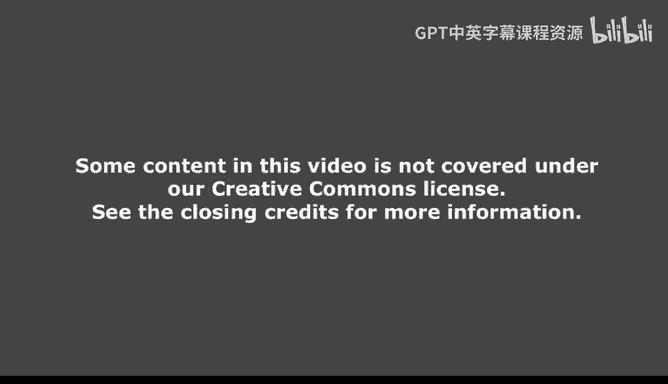
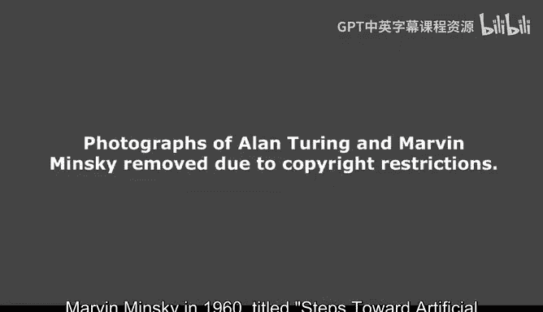
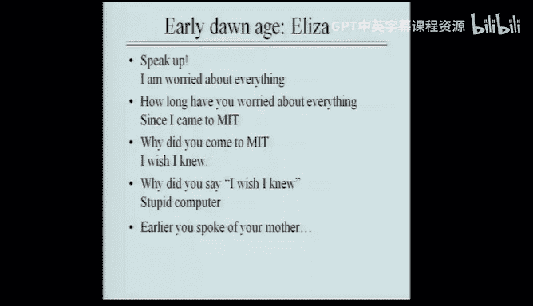
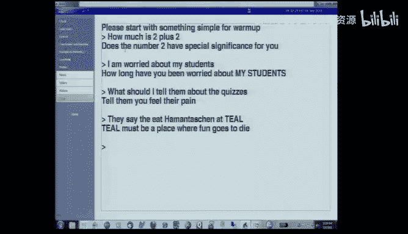
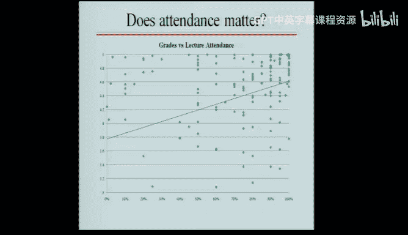
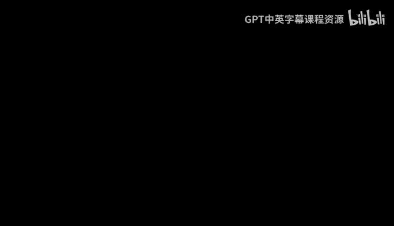
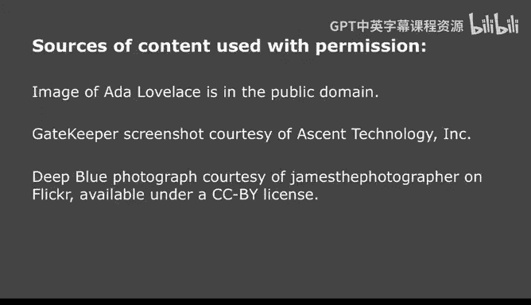

# 1：引言与范围 🧠

在本节课中，我们将学习人工智能的基本定义、其核心组成部分、历史发展以及本课程的教学安排。我们将通过具体的例子来理解人工智能如何通过模型、表示和算法来模拟思考、感知和行动。

---

## 什么是人工智能？

人工智能是关于**思考**、**感知**和**行动**的学科。然而，在麻省理工这样的工程学背景下，我们不止步于哲学讨论。我们致力于构建**模型**，这些模型旨在帮助我们理解、预测和控制与思考、感知及行动相关的现象。

为了构建有效的模型，我们需要合适的**表示**。表示是模型的基础，它能够揭示问题中的**约束**条件。最后，我们还需要**算法**或**方法**，利用这些表示和约束来解决问题。因此，人工智能可以概括为：**由表示所支持的、能够暴露约束的算法，这些算法用于构建针对思考、感知和行动的模型**。

---

## 表示的力量：两个例子

上一节我们介绍了表示的重要性，本节中我们通过两个例子来具体看看好的表示如何简化问题。

### 例子一：陀螺仪与右手定则

许多人使用“右手螺旋定则”来判断陀螺仪的受力方向，但这个方法并不可靠。一个更好的方法是使用胶带标记轮子的一小部分，然后单独分析这一小部分的运动轨迹。通过这种具体的、可视化的表示，我们能够更直观、更准确地理解陀螺仪的行为。

这个例子表明，正确的表示能将复杂的物理现象转化为易于理解的模型。

### 例子二：农夫过河问题

问题描述：农夫需要将狐狸、鹅和谷物运过河，但船每次只能载农夫和一样物品，且狐狸和鹅、鹅和谷物不能单独留在一边。

一个有效的表示是使用**状态图**。我们用“左岸”和“右岸”来表示每个参与者（农夫、狐狸、鹅、谷物）的位置。理论上，有 `2^4 = 16` 种可能状态。但当我们画出所有状态并连接合法的移动（即船运载农夫和一件物品过河）后，非法的状态（如鹅被狐狸吃掉）会被自动排除。

通过这种图表示，我们不仅清晰地看到了所有可能的解决方案，还直观地暴露了问题的核心约束。最终，我们发现这个问题只有**两个**有效的解决方案。

---

## 核心方法：生成与测试

在介绍了表示之后，我们来看看人工智能中一个基础而强大的问题解决方法：**生成与测试**。

这个方法非常直观：首先生成一系列可能的解决方案，然后逐一测试它们，直到找到一个可行的方案。例如，当你捡到一片叶子并想识别它时，你会翻阅图鉴（生成可能答案），并将每一页的图片与手中的叶子进行比较（测试），直到找到匹配项。

以下是生成与测试方法的关键组成部分：
*   **生成器**：负责产生候选解决方案。一个好的生成器应该具备**非冗余性**（不重复生成相同方案）和**可告知性**（能利用新信息缩小搜索范围，例如“这是落叶树，不用看针叶树部分”）。

这个方法虽然简单，但极其强大。这引出了我们的第一个重要原则：**朗普斯蒂尔茨金原则**。该原则指出，**一旦你能为某个事物命名，你就获得了掌控它的力量**。例如，知道了鞋带末端的金属头叫“**鞋带头（aglet）**”，你就能更有效地思考和讨论它的功能。

**注意**：请避免使用“**琐碎的（trivial）**”这个词来形容简单的方法。简单不等于没有价值；相反，人工智能中最简单的方法往往是最强大的。

---

## 感知与行动的循环

人工智能不仅仅是关于符号推理。我们的智能严重依赖于**感知系统**（如视觉）与思考系统的紧密协作。

例如，当被问到“赤道穿过非洲多少个国家？”时，你的语言系统会命令你的视觉系统在脑海中“扫描”非洲地图上的赤道线并计数。然后，视觉系统将结果“6”返回给语言系统。这种**感知-思考-行动**的循环是智能的核心，也是我们未来需要深入理解的方向。

---

## 人工智能的历史脉络

了解历史能帮助我们看清人工智能的发展轨迹以及本课程将涵盖的内容。

*   **思想启蒙（1842）**：埃达·洛夫莱斯（第一位程序员）评论说，分析机“没有任何意图去创造任何东西，它只能执行我们知道如何命令它去执行的事情”。这开启了关于机器能否思考的早期讨论。
*   **现代开端（1950）**：艾伦·图灵提出了著名的“图灵测试”，为衡量机器智能设立了标准。
*   **黎明时代（1960s）**：马文·明斯基发表了《迈向人工智能的步骤》。随后出现了早期里程碑程序，例如：
    *   **符号积分程序**：能够像人类一样进行符号积分。
    *   **ELIZA**：简单的模式匹配对话程序，虽不“智能”，但引发了广泛讨论。
    *   **几何类比解题程序**：可以解决智力测试中的图形类比问题。
    *   **形状识别程序**：开始尝试让计算机理解视觉世界。
    *   **基于规则的专家系统（如MYCIN）**：在特定领域（如血液感染诊断）达到甚至超过人类专家水平，并催生了大量商业应用（如飞机调度系统）。
*   **推土机时代（1990s-）**：随着计算能力的大幅提升，人们开始用巨大的计算量来弥补智能算法的不足，例如**深蓝**通过暴力搜索击败了国际象棋世界冠军。
*   **当下与未来：整合之道**：我们现在认识到，真正的智能在于**思考、感知和行动的紧密整合与循环**。例如，一个系统可以根据语言描述在记忆中“想象”出一个场景（如“一个男人跑向一个女人”），然后回答关于这个想象场景的问题（如“他们接触了吗？”）。这类似于你回答非洲国家问题时动用的视觉想象能力。

---

## 人类智能的起源

我们与黑猩猩的DNA高度相似，但智能却天差地别。古人类学研究表明，大约在5万年前，一小群人类偶然获得了一种关键能力：**能够将两个概念组合起来，创造出第三个概念，并且这个过程可以无限进行下去**。

从人工智能的角度看，这或许意味着我们掌握了用**语言**进行**描述**和**讲故事**的能力。语言不仅能向上构建复杂的思想和知识体系（讲故事），还能向下调动我们的感知资源，命令我们“想象”从未见过的事物（如“拿着一满桶水跑步会怎样？”）。这种**语言与感知的循环**，可能是人类智能的独特之处，也是人工智能研究的终极前沿之一。

---

## 课程运行机制

最后，我们来了解一下本课程的教学安排和评分方式。

### 课程活动与目的
本课程包含四种教学活动，各有侧重：
1.  **讲座**：介绍核心概念、宏大思想和领域经验。
2.  **常规复习课**：深入和扩展讲座材料，提供小范围讨论空间。
3.  **大型复习课**：围绕过往测验题目展开，讲解解题技巧。
4.  **辅导课**：针对作业提供帮助。

**数据表明，课堂出勤率与课程成绩存在正相关。** 虽然有个别学生不出勤也能取得好成绩，但课程设计的初衷是让你通过互动获得难以替代的“经验”和“强大思想”。

### 评分体系
我们的评分体系有些特别：
*   **五分制转换**：原始百分制分数会依据对知识的掌握程度（精通、良好、需努力）被转换到5、4、3分制平台。平台内的分数差异不影响最终等级。
*   **双重机会**：你的最终成绩由**四次测验**和**一次期末考**共同决定。期末考对应覆盖了每次测验的内容。你的每部分成绩，将取**该次测验成绩**和**期末考对应部分成绩**的**较高者**。这给了你弥补之前失误的机会。

### 近期安排
*   请填写并提交**辅导课时间偏好表**。
*   本周没有常规复习课。
*   本周五**可能**会有针对Python复习的大型复习课，请关注课程主页的通知。

---

## 总结

本节课中，我们一起学习了人工智能的广泛定义，认识到它关乎**思考、感知和行动**，并通过**模型、表示和算法**来实现。我们看到了好的**表示**如何揭示问题**约束**，体验了**生成与测试**这一基础方法，并理解了为事物**命名**所带来的力量。我们还回顾了人工智能的**历史发展**，从早期符号推理到如今的感知-行动整合，并探讨了人类智能可能源于**语言与想象的循环**。最后，我们了解了本课程的**教学结构和评分机制**。希望这为你开启人工智能的学习之旅奠定了坚实的基础。