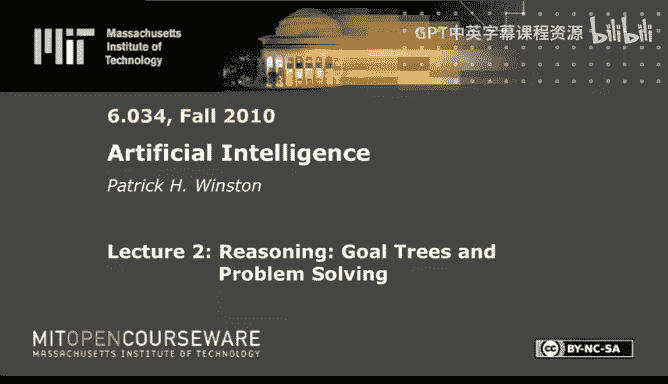
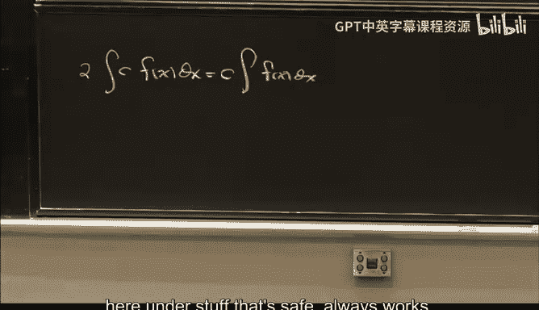
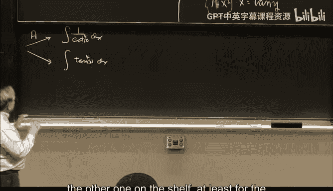

# 2：目标树与问题求解 🎯

在本节课中，我们将学习一种名为“问题归约”的通用问题求解方法。我们将通过一个具体的例子——符号积分——来详细探讨这种方法。你将看到如何将复杂问题分解为更简单的子问题，并最终通过一个“目标树”或“与或树”来组织求解过程。这种方法不仅适用于积分，也适用于许多其他需要逻辑推理和步骤分解的领域。

---

## 问题归约与目标树 🌳

上一节我们提到了生成与测试法，本节中我们来看看另一种常见的问题求解策略：问题归约。其核心思想是，将一个复杂问题通过应用一系列变换，转化为一个或多个更简单的问题。

当我们面对一个积分问题时，例如：

`∫ 5x^4 / (1 - x^2)^(5/2) dx`

我们不会直接求解。相反，我们会尝试应用一些变换，将其转化为更容易处理的形式，最终希望简化为能在积分表中查到的标准形式。

---

## 安全变换 🔒

首先，我们引入一类总是有效且安全的变换。以下是几个例子：

1.  **常数提取**：`∫ c * f(x) dx = c * ∫ f(x) dx`
2.  **负号提取**：`∫ -f(x) dx = - ∫ f(x) dx`
3.  **和差分解**：`∫ [f(x) + g(x)] dx = ∫ f(x) dx + ∫ g(x) dx`
4.  **多项式除法**：当被积函数为 `P(x)/Q(x)` 且 `P(x)` 的次数高于 `Q(x)` 时，先进行多项式除法。

这些变换是“安全”的，意味着它们总是正确的，并且通常能使问题变得更简单。

---

## 构建求解框架 ⚙️

基于这些变换，我们可以构建一个简单的求解程序框架：

1.  **应用安全变换**：尝试所有可用的安全变换来简化问题。
2.  **查表**：检查简化后的问题是否能在积分表中找到。
3.  **判断完成**：如果找到，则报告成功；否则，进入下一步。
4.  **应用启发式变换**：当安全变换用尽时，尝试使用一些不一定总有效但经常有帮助的启发式方法。

值得注意的是，第三个安全变换（和差分解）会将一个问题分解为**多个**子问题，并且必须**全部**解决，原问题才算解决。在目标树中，这表示一个 **“与”节点**。

---

## 启发式变换 🧠

当安全变换无法继续推进时，我们需要一些更智能但非绝对可靠的策略。以下是几个启发式变换的例子：

*   **变换A（三角恒等式）**：利用三角恒等式在不同三角函数组合之间转换，例如将只包含 `sin x` 和 `cos x` 的函数，转换为包含 `tan x` 和 `sec x` 的函数。
*   **变换B（三角代换）**：例如，遇到 `∫ f(tan x) dx` 时，可令 `y = tan x`，转化为 `∫ f(y) / (1 + y^2) dy`，从而消除三角函数。
*   **变换C（特定形式代换）**：例如，看到 `1 - x^2` 这样的形式，可以尝试代换 `x = sin y`。

应用变换A时，我们可能面临**多个**可行的转换路径，选择其中**任意一个**求解成功即可。这在目标树中表示一个 **“或”节点**。

---

## 示例求解过程 📝

让我们用上述框架来求解最初的积分问题。过程可以简化为以下步骤：

1.  应用安全变换1和2，提取常数和负号。
2.  应用启发式变换C，令 `x = sin y`，将问题转化为三角积分。
3.  应用启发式变换A，在可能的三角形式中选择一个（例如，全部转化为 `tan x` 的形式）。
4.  应用启发式变换B，令 `z = tan y`，将三角积分转化为有理函数积分。
5.  应用安全变换4（多项式除法），将有理函数分解。
6.  应用安全变换3（和差分解），将积分拆分为三个更简单的积分。
7.  这三个积分分别可以通过查表或简单的安全变换解决。

这个求解过程形成了一个**目标树**（或称与或树），清晰地展示了原问题如何被归约为一系列子目标，以及子目标之间的“与”、“或”关系。

---

## 关键洞察与元知识 💡

通过对这个积分程序的分析，我们可以得到一些关于知识和问题求解的深刻见解：

*   **所需知识量**：令人惊讶的是，解决这类积分问题所需的核心知识并不多。一个约26个条目的积分表，加上十多个安全与启发式变换规则，就足以应对很多难题。
*   **领域特性**：在微积分习题这个领域，目标树的平均深度很浅（约3层），且探索的无效分支很少（约1个）。这意味着即使选择策略不完美，求解过程也不会陷入严重的组合爆炸。
*   **元知识的力量**：最重要的不是具体的积分知识，而是**关于如何运用知识的知识**（元知识）。例如，“先尝试安全变换，再尝试启发式变换”、“选择函数嵌套深度最浅的问题进行处理”，这类策略性知识才是强大问题求解能力的核心。

---

## 总结 🎓

本节课中，我们一起学习了**问题归约**和**目标树**的概念。我们通过一个符号积分的具体案例，看到了如何将复杂问题分解，并利用“安全变换”和“启发式变换”来逐步求解。我们构建了求解程序的框架，并理解了“与节点”和“或节点”在目标树中的含义。

更重要的是，我们认识到，在许多领域，高效的问题求解并不一定需要海量的具体知识，而是依赖于对领域特性的理解（如问题结构的复杂度）以及有效的元知识——即关于如何组织、选择和运用知识的知识。掌握这种分析问题求解过程的方法，是培养人工智能思维的关键一步。

最后，一个有趣的思考是：当我们彻底理解了一个智能系统（或一个人）如何解决问题后，其表现出的“智能感”似乎会消失。这提醒我们，智能的神秘性往往源于我们对其内部机制的不了解，而人工智能的目标之一，正是去揭开这层神秘的面纱。