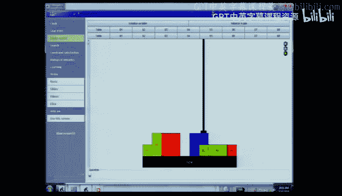
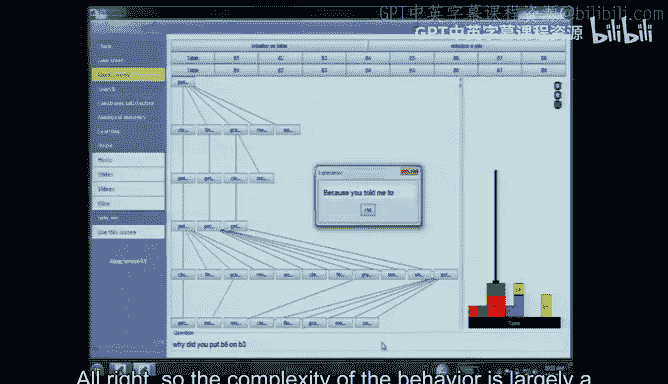
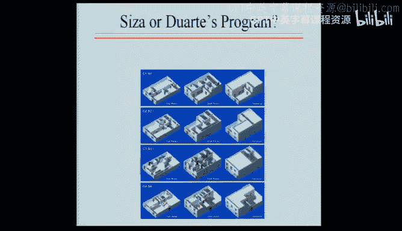
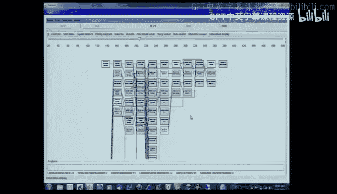
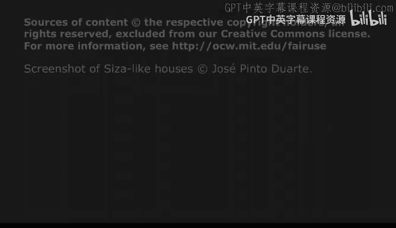

# 3：推理 - 目标树与基于规则的专家系统 🧠


在本节课中，我们将学习如何构建能够回答关于自身行为问题的程序。我们将探讨两种核心方法：**目标导向编程**和**基于规则的专家系统**。通过理解这些方法如何构建**目标树**，你将能够编写出看似智能、并能解释自身行为的程序。

---




## 1. 目标导向编程与积木世界 🧱

我们从一个简单的积木世界程序开始。这个程序的目标是执行“将积木A放到积木B上”这样的命令。为了实现这个目标，程序需要分解成一系列子目标。

以下是实现 `put_on`（放置）功能的核心步骤：
1.  **寻找空间**：在目标积木上找到空位。
2.  **抓取**：抓住需要移动的积木。
3.  **移动**：将积木移动到目标位置。
4.  **松开**：放下积木。

然而，在执行“抓取”步骤时，有一个前提条件：目标积木的顶部必须是空的。因此，“抓取”操作会调用 `clear_top`（清空顶部）子程序。`clear_top` 本身又可能通过循环调用 `get_rid_of`（移开）来移除顶部的多个积木。而 `get_rid_of` 的实现方式，通常就是再次调用 `put_on` 将障碍物移到别处（比如桌子上）。

**代码结构示意**：
```pseudo
function put_on(block, target):
    find_space(target)
    grasp(block)
    move(block, target)
    ungrasp(block)

function grasp(block):
    clear_top(block) // 可能需要递归调用 get_rid_of
    // ... 执行抓取动作

function clear_top(block):
    for each item on block:
        get_rid_of(item)

function get_rid_of(item):
    put_on(item, table) // 递归调用 put_on
```



这个简单的结构通过递归调用，能够处理复杂的积木排列问题，并在此过程中自然构建出一个**目标树**（或称与或树）。

---

## 2. 如何回答“为什么”和“怎么做” ❓

程序之所以能回答关于其行为的问题，正是因为它记录了执行过程中构建的目标树。

*   **回答“为什么”**：程序沿着目标树**向上回溯一层**。例如，如果问“你为什么移开了积木X？”，程序会查看目标树，发现移开X是为了“清空积木B1的顶部”，于是它回答：“因为我试图清空B1的顶部。”
*   **回答“怎么做”**：程序沿着目标树**向下展开一层**。例如，如果问“你是怎么把B1放到B2上的？”，程序会列出实现这个目标的四个子步骤：寻找空间、抓取B1、移动、松开。

**行为复杂性的来源**：这里引出了本节课的第一个核心观点——**西蒙的蚂蚁隐喻**。蚂蚁爬行的路径看起来很复杂，但这主要是由复杂的地面环境（如沙砾分布）造成的，而非蚂蚁本身拥有复杂的智能。同样，我们程序的复杂行为，更多是源于**问题环境**的复杂性，而不是程序内部逻辑的复杂性。公式表示为：
**行为复杂度 = max(程序复杂度， 环境复杂度)**

---

## 3. 基于规则的专家系统 🦁

上一节我们介绍了目标导向编程，本节中我们来看看另一种实现方式：基于规则的专家系统。这种方法在20世纪80年代被广泛应用于商业人工智能领域。

其核心思想是将所有知识封装成简单的“如果-那么”规则。我们以一个动物识别系统为例。

以下是识别猎豹的规则片段：
*   **规则1**：如果 `动物有毛发`，那么它是 `哺乳动物`。
*   **规则2**：如果 `动物有爪子` **且** `有尖牙` **且** `眼睛朝前`，那么它是 `食肉动物`。
*   **规则3**：如果 `动物是哺乳动物` **且** `是食肉动物` **且** `有斑点` **且** `跑得快`，那么它是 `猎豹`。

将这些规则用逻辑图表示，我们会发现它同样形成了一个**与或树**（“与”节点对应规则中的多个条件，“或”节点对应得出同一结论的多种途径）。因此，这类系统也能通过遍历目标树来回答“为什么”和“怎么做”的问题。

---

## 4. 前向链与后向链 ⛓️



基于规则的系统主要有两种推理方式：

*   **前向链**：从已知的**事实**（观测数据）出发，应用规则推导出新的结论。就像我们的动物识别系统，输入观测特征，最终推出动物类型。
*   **后向链**：从想要证明的**假设**（目标）出发，反向寻找支持它的规则和事实。例如，假设“它是猎豹”，为了证明这一点，系统需要验证它是否是哺乳动物和食肉动物，这又需要验证是否有毛发、爪子等特征。

这两种方式都是**演绎系统**，它们从已知为真的事实出发，推导出新的真事实，但不会撤销已有的结论。

---

## 5. 知识工程的三条启发式方法 🛠️

要构建一个实用的专家系统，需要从人类专家那里获取知识，这个过程称为“知识工程”。以下是三条关键的启发式方法：

1.  **关注具体案例**：不要只让专家泛泛而谈。观察他们处理具体问题（比如如何摆放牛奶、薯片）的过程，能挖掘出他们未明确表述的规则。
2.  **询问差异处理**：当发现专家对看似相同的事物（如罐装豌豆和冷冻豌豆）采取不同处理方式时，要追问“为什么”。这能帮助你发现新的重要属性（如“冷冻”），从而完善规则。
3.  **在系统崩溃处学习**：运行你构建的系统，当它无法处理某个情况或做出错误判断时，这里就暴露了你知识库的缺口。这是发现缺失规则的最佳时机。

**自我提升的启示**：这些方法不仅是知识工程的技巧，也是你学习任何新学科时可以运用的策略。通过研究具体例子、区分概念差异、在解题卡壳时查漏补缺，你正是在将自己“工程化”为一个更专业的“专家系统”。

---

## 6. 规则的局限与常识 🤔

基于规则的系统虽然强大，但其知识往往是**浅层的**。例如，一条规则可能说“把薯片放在袋子顶部”，但系统并不理解“如果放在底部会被压碎，顾客会不高兴”这一连串因果和情感常识。

然而，规则是否与常识完全无关呢？也不尽然。考虑我们理解故事的方式。当我们读到“邓肯被麦克白谋杀”时，即使故事没直接说“邓肯死了”，我们也能立刻推断出来，因为我们头脑中有一条编译好的规则：“如果被谋杀，那么就会死亡”。许多日常推理都依赖于这种内化的、规则般的知识片段。讲故事在某种程度上就是一种“受控的幻觉”，讲述者依赖听者头脑中共有的规则，无需言明所有细节。

---

## 总结 📚

本节课中我们一起学习了：
1.  **目标导向编程**通过将任务分解为子目标并构建**目标树**，使程序能够追溯和解释自身行为。
2.  **基于规则的专家系统**使用“如果-那么”规则进行推理，其规则网络同样形成目标树，支持对行为的问答。
3.  程序的复杂行为往往源于**环境的复杂性**（西蒙的蚂蚁隐喻）。
4.  系统可以通过**前向链**（从事实到结论）或**后向链**（从假设到事实）进行推理。
5.  有效的**知识工程**需要利用具体案例、差异分析和系统测试缺口来获取专家知识。
6.  虽然规则系统缺乏深层的**常识**，但规则化的知识片段确实构成了我们日常理解和推理的基础。






掌握这些概念，你就能着手创建能够回答“为什么”和“怎么做”的智能程序了。